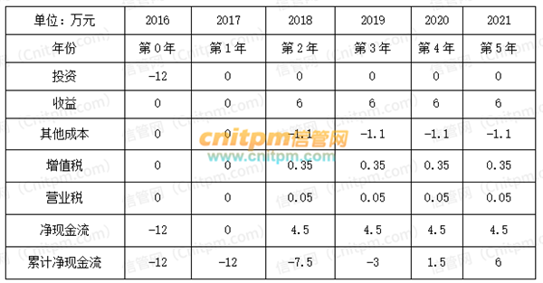

# 选择题知识点

# 投资回收期与投资收益率
首先要了解投资回收期和投资收益率的计算公式。（详见信息系统项目管理师教程第3版P193-196）  
投资回收期 =累计净现金流量开始出现正值的年份数-1+上一年累计净现金流量的绝对值/出现正值年份的净现金流量。静态投资回收期，不考虑折现率、折现因子。  
投资收益率=总收益/本金，投资收益率法是一种平均收益率的方法，它是将一个项目整个寿命期的预期现金流平均为年度现金流，再除以期初的投资支出，亦称会计收益率法、资产收益率法。  
根据题干我们得到下表：  

静态投资回收期=4-1+3/4.5=3.666≈3.67  
投资收益率=[（6×4）/6]÷12=4÷12=0.333≈0.33

> 更新: 2025-06-27 10:01:24  
> 原文: <https://www.yuque.com/lixinsi/ygk31p/df6g52>