# Caddy和nginx

### Caddy 反向代理实列

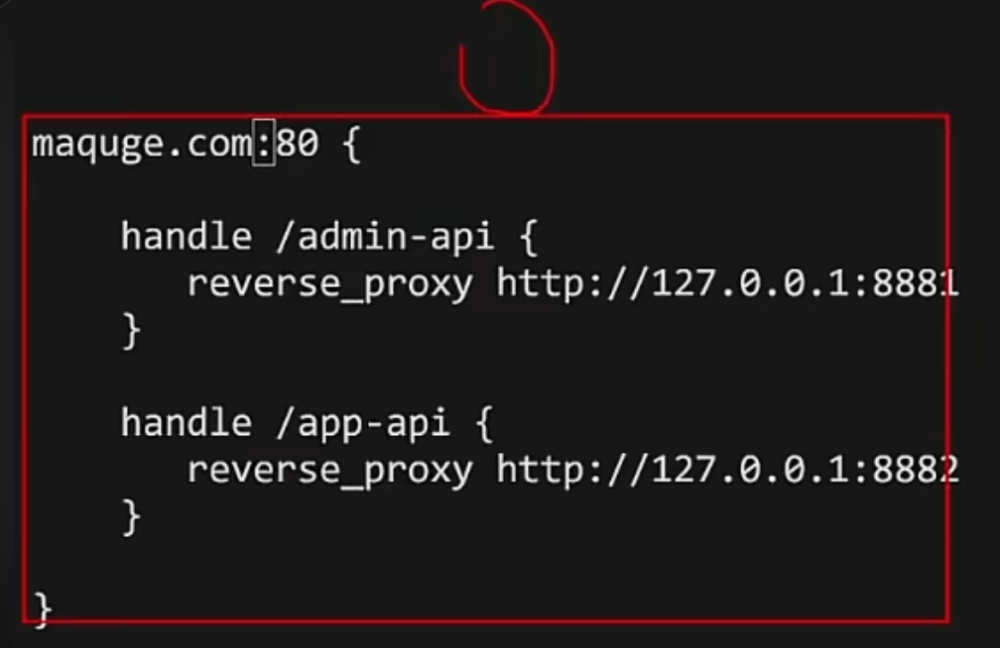

```bash
maquge.com:80 {

    handle /admin-api {
        reverse_proxy http://127.0.0.1:8881
    }

    handle /app-api {
        reverse_proxy http://127.0.0.1:8882
    }

}
```

### nginx 反向代理

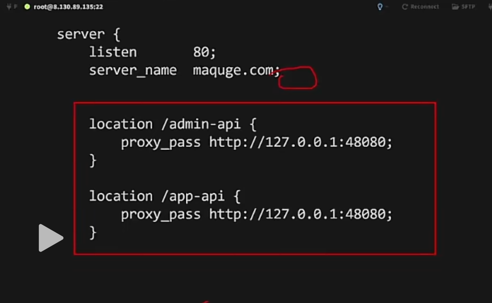

```bash
server {
    listen       80;
    server_name  maquge.com;

    location /admin-api {
        proxy_pass http://127.0.0.1:48080;
    }

    location /app-api {
        proxy_pass http://127.0.0.1:48080;
    }
}
```

### 安装 caddy

```bash
dnf install dnf-plugins-core-y
dnf copr enable @caddy/caddy -y
dnf install caddy -y
```

### 启动 caddy

```bash
caddy start --config /etc/caddy/Caddyfile
```

### nginx 防盗链的配置示列

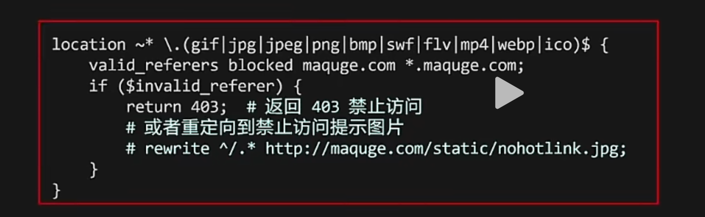

```bash
location ~* \.(gif|jpg|jpeg|png|bmp|swf|flv|mp4|webp|ico)$ {

    # 允许来源
    valid_referers none blocked maquge.com *.maquge.com;

    # 非法来源处理
    if ($invalid_referer) {
        return 403;#返回403禁止反问
        #或者重定向到禁止访问提示图片
        #rewrite ^/.* http://maquge.com/static/nohotlink.jpg;
    }
}
```

### nginx 限制拒绝 ip 的访问配置

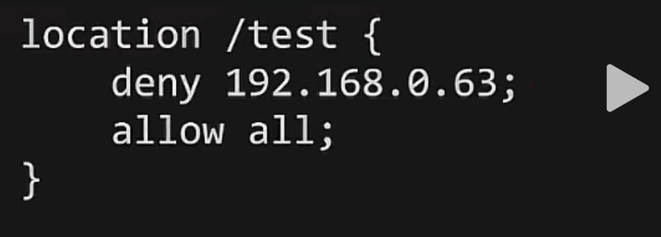

```bash
location /test {
    deny 192.168.0.63;
    allow all;
}
```

### 拒绝所有 ip 访问只允许一个 ip 地址访问

```bash
location /test {
    deny all;
    allow 192.168.0.63;
}
```

### 静态资源传输优化

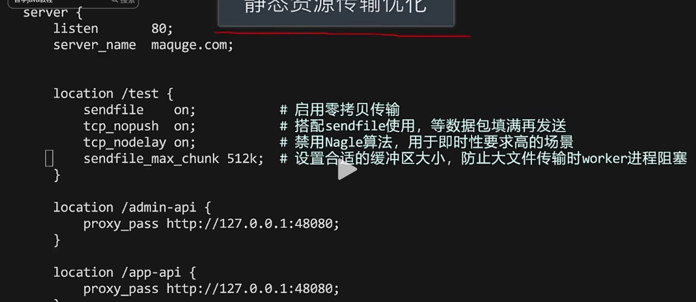

```bash
server {
    listen 80;
    server_name maquge.com;

    # =====================
    # 全局传输优化
    # =====================
    sendfile on;              # 启用零拷贝
    tcp_nopush on;            # 配合 sendfile，优化大文件
    tcp_nodelay on;           # 低延迟（小数据包）
    sendfile_max_chunk 512k;  # 防止单个请求占满 worker

    # =====================
    # 静态资源
    # =====================
    location /test {
        root /www/static;
        index index.html;
    }

    # =====================
    # 管理端 API
    # =====================
    location /admin-api/ {
        proxy_pass http://127.0.0.1:48080/;

        proxy_set_header Host $host;
        proxy_set_header X-Real-IP $remote_addr;
        proxy_set_header X-Forwarded-For $proxy_add_x_forwarded_for;
    }

    # =====================
    # 用户端 API
    # =====================
    location /app-api/ {
        proxy_pass http://127.0.0.1:48080/;

        proxy_set_header Host $host;
        proxy_set_header X-Real-IP $remote_addr;
        proxy_set_header X-Forwarded-For $proxy_add_x_forwarded_for;
    }
}
```

### nginx 做限流

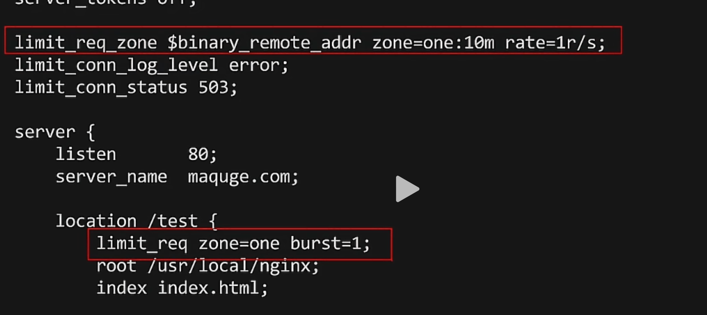

```bash
http {
    # 定义限流
    limit_req_zone $binary_remote_addr zone=api_limit:10m rate=5r/s;

    server {
        listen 80;
        server_name maquge.com;

        location /api/ {
            limit_req zone=api_limit burst=10 nodelay;

            proxy_pass http://127.0.0.1:8080;
        }
    }
}
```

### nginx 伪装 server

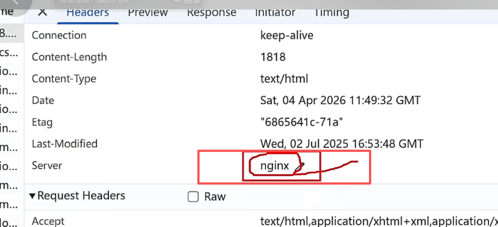

#### 需要更改的文件三处

##### 第一处

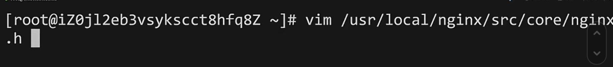

```bash
/usr/local/nginx/src/core/nginx.h
```

```bash
set nu
```

第十四行改成 iis


第 22 行改成 iis

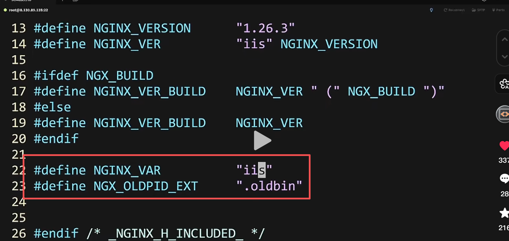

##### 第二处


```bash
/usr/local/nginx/src/http/ngx_http_header_filter_module.c
```

```bash
set num
```

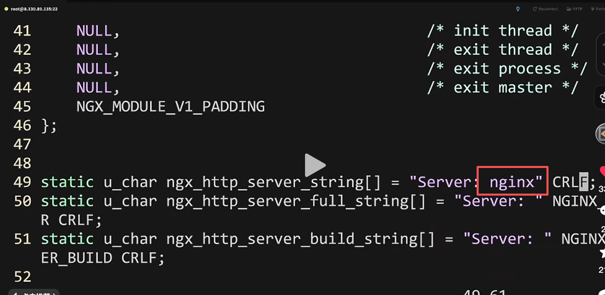

##### 第三处

```bash
/usr/local/nginx/src/ngx_http_special_response.c
```

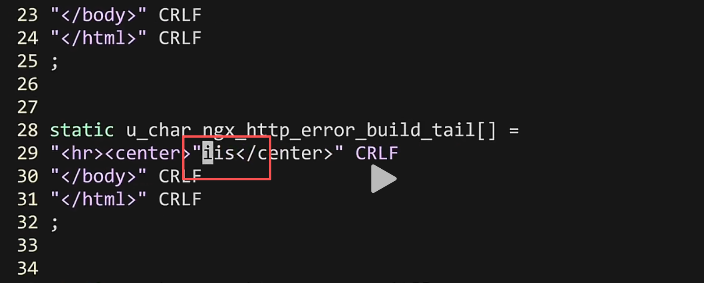

```bash
set num
```

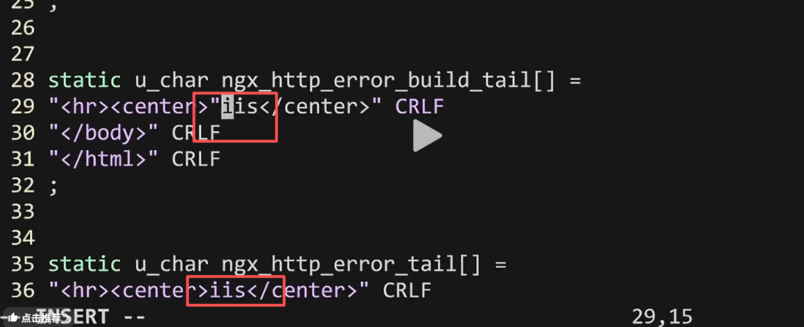

##### 注意如果 nginx 是在运行的状态，先停掉

```bash
./sbin/nginx -s stop
```


##### 重新编译

```bash
make &&make install
```

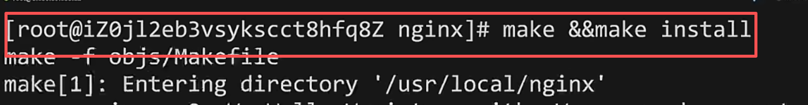


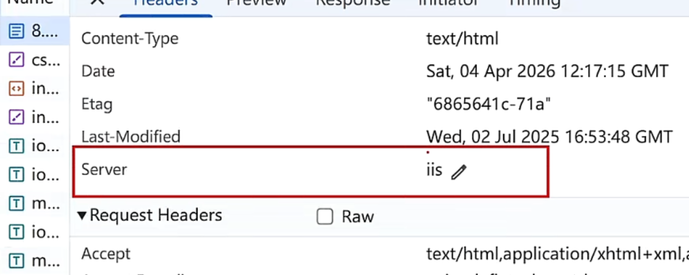

### 隐藏 nginx 的版本号安装加固

更改 nginx 配置

```bash
server_tokens off;
```

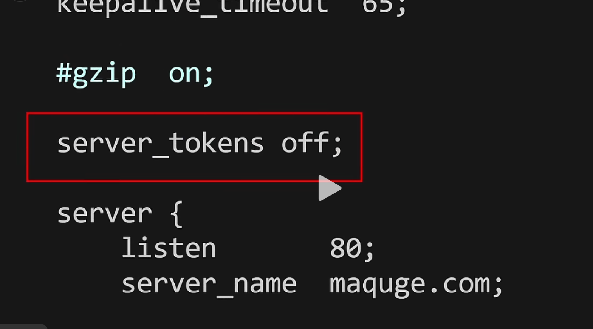

#### nginx 重启

```bash
/usr/local/nginx/sbin/nginx -s reload
```

### nginx 的 gzip 功能

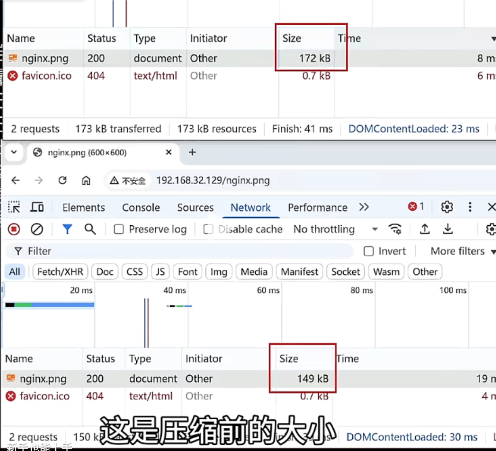

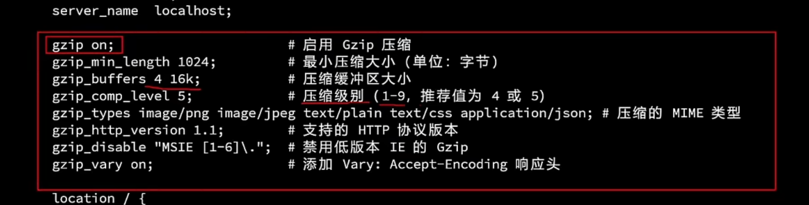

```bash
# 启用 Gzip 压缩
gzip on;

# 最小压缩大小（单位：字节）
gzip_min_length 1024;

# 压缩缓冲区大小
gzip_buffers 4 16k;

# 压缩级别（1-9，推荐 4~5）
gzip_comp_level 5;

# 压缩的 MIME 类型
gzip_types
    image/png
    image/jpeg
    text/plain
    text/css
    application/json;

# 支持的 HTTP 协议版本
gzip_http_version 1.1;

# 禁用低版本 IE 的 Gzip
gzip_disable "MSIE [1-6]\.";

# 添加 Vary: Accept-Encoding 响应头
gzip_vary on;

# ======================
# 路径配置
# ======================
location / {
    root /usr/local/web1;
    index index.html index.htm;
}
```

### nginx 常用的负载均衡算法

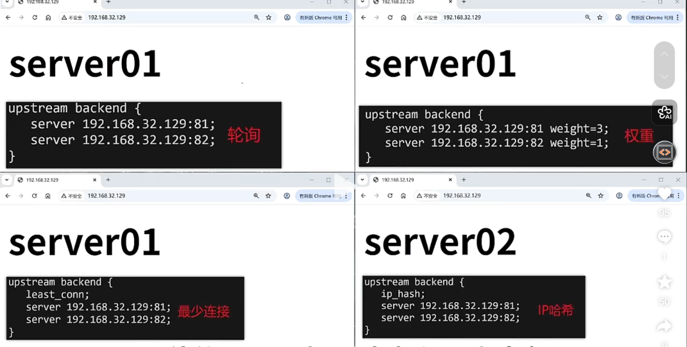

#### 两台服务器性能产不多就用轮询

#### 一台服务器性能好，另外一台性能差一点就用权重

#### 如果一台服务器有一台比较小可以使用最少连接数

#### 如果需要特定的 ip 转发到特定的服务器商就可以用 ip 哈希

# ✅ 1. 轮询（默认，性能差不多）

👉 适用于：两台服务器性能一致

```plain
http {
    upstream backend {
        server 192.168.1.10:8080;
        server 192.168.1.11:8080;
    }

    server {
        listen 80;

        location / {
            proxy_pass http://backend;
        }
    }
}
```

📌 特点：

* 默认策略（不写就是轮询）
* 请求平均分配

***

# ✅ 2. 权重（性能不一致）

👉 适用于：一台强，一台弱

```plain
http {
    upstream backend {
        server 192.168.1.10:8080 weight=3;
        server 192.168.1.11:8080 weight=1;
    }

    server {
        listen 80;

        location / {
            proxy_pass http://backend;
        }
    }
}
```

📌 含义：

* 192.168.1.10 处理 75%
* 192.168.1.11 处理 25%

***

# ✅ 3. 最少连接（高并发推荐）

👉 适用于：请求耗时不均（比如接口耗时不同）

```plain
http {
    upstream backend {
        least_conn;

        server 192.168.1.10:8080;
        server 192.168.1.11:8080;
    }

    server {
        listen 80;

        location / {
            proxy_pass http://backend;
        }
    }
}
```

📌 特点：

* 谁连接少，优先分给谁
* 比轮询更智能（适合接口系统）

***

# ✅ 4. IP 哈希（会话保持）

👉 适用于：登录态 / Session 绑定

```plain
http {
    upstream backend {
        ip_hash;

        server 192.168.1.10:8080;
        server 192.168.1.11:8080;
    }

    server {
        listen 80;

        location / {
            proxy_pass http://backend;
        }
    }
}
```

📌 特点：

* 同一 IP 永远访问同一台服务器
* 避免 session 丢失

# . hash（通用哈希，比 ip\_hash 更强）

👉 这是 **ip\_hash 的升级版**

```plain
http {
    upstream backend {
        hash $request_uri;

        server 192.168.1.10:8080;
        server 192.168.1.11:8080;
    }

    server {
        listen 80;

        location / {
            proxy_pass http://backend;
        }
    }
}
```

📌 特点：

* 可以自定义规则（不限于 IP）
* 常见用法：
  * `$request_uri`（同一接口走同一台）
  * `$cookie_userid`（按用户分流）

👉 比 ip\_hash 更灵活 👍

# ✅ 6. fair（第三方模块）

👉 按“响应时间”分配（谁快用谁）

```plain
upstream backend {
    fair;

    server 192.168.1.10:8080;
    server 192.168.1.11:8080;
}
```

📌 特点：

* 动态负载（更智能）
* 自动避开慢服务器

⚠️ 注意：

* 需要安装第三方模块（默认 nginx 没有）

***

# ✅ 7. url\_hash（缓存场景）

👉 按 URL 分配（常见于缓存/CDN）

```plain
upstream backend {
    hash $request_uri consistent;

    server 192.168.1.10:8080;
    server 192.168.1.11:8080;
}
```

📌 特点：

* 相同 URL 一定命中同一台
* 提高缓存命中率

***

# ✅ 8. sticky（会话保持，企业版）

👉 比 ip\_hash 更高级（基于 Cookie）

```plain
upstream backend {
    sticky cookie srv_id expires=1h domain=.example.com path=/;

    server 192.168.1.10:8080;
    server 192.168.1.11:8080;
}
```

📌 特点：

* 不依赖 IP（解决 NAT 问题）
* 更适合登录系统

⚠️ 注意：

* 需要 Nginx Plus 或第三方模块

***

# ✅ 9. backup（备用服务器）

👉 主挂了才用

```plain
upstream backend {
    server 192.168.1.10:8080;
    server 192.168.1.11:8080 backup;
}
```

📌 特点：

* 平时不用
* 故障自动切换

***

# ✅ 10. down（临时下线）

```plain
upstream backend {
    server 192.168.1.10:8080;
    server 192.168.1.11:8080 down;
}
```

📌 用途：

* 临时维护某台服务器


> 更新: 2026-04-21 09:58:29  
> 原文: <https://www.yuque.com/lixinsi/hntyk2/ybmxgvq4zz3xt9lr>