# Chatglm4本地以及环境安装

# 1.下载 windows anaconda 虚拟环境安装
### <font style="color:rgb(79, 79, 79);">扫盲：先装Python还是先装anaconda?</font>
<font style="color:rgb(77, 77, 77);">安装anaconda即可，不需要单独装python</font>

<font style="color:rgb(77, 77, 77);">anaconda 是一个python的发行版，包括了python和很多常见的软件库, 和一个包管理器conda。</font>

### <font style="color:rgb(79, 79, 79);">一、下载Anaconda 安装包（官网和国内镜像资源）</font>
<font style="color:rgb(77, 77, 77);">1.1、Anaconda官网下载地址  
</font><font style="color:rgb(77, 77, 77);">注：不推荐官网下载，下载非常慢，还易出错。</font>

<font style="color:rgb(77, 77, 77);">这里可以选择国内镜像资源下载：</font>[<font style="color:rgb(77, 77, 77);">点击这里下载</font>](http://itcxy.xyz/241.html)

<font style="color:rgb(77, 77, 77);">Anaconda官网 https://www.anaconda.com/  
</font><font style="color:rgb(77, 77, 77);">进入官网后如下图所示，点击Download即可开始下载</font>

  
 

<font style="color:rgb(77, 77, 77);">1.2、国内镜像资源</font>

<font style="color:rgb(77, 77, 77);">资源获取地址：</font>[<font style="color:rgb(77, 77, 77);">点击这里下载</font>](http://itcxy.xyz/241.html)

### <font style="color:rgb(79, 79, 79);">二、开始安装Anaconda</font>
<font style="color:rgb(77, 77, 77);">双击exe文件开始安装</font>

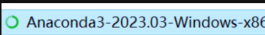

<font style="color:rgb(77, 77, 77);">然后点击Next</font>

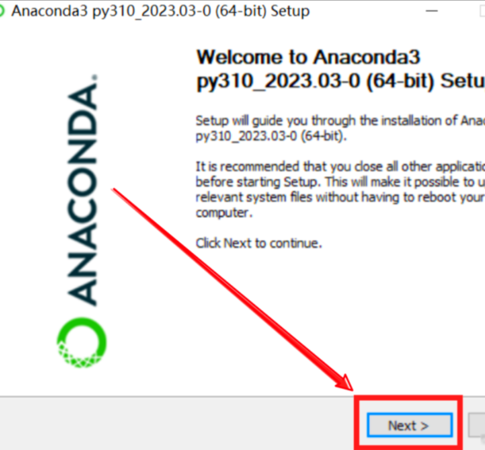

<font style="color:rgb(77, 77, 77);">同意协议，点击I Agree  
</font><font style="color:rgb(77, 77, 77);"> </font>

<font style="color:rgb(77, 77, 77);">这一步，两个选项均可，第一个是只为当前用户安装，第二个是为所有用户安装。</font>

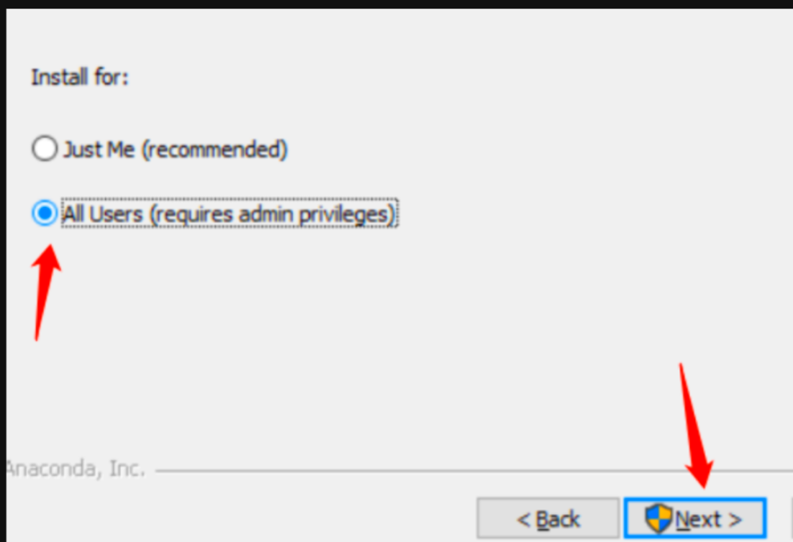

<font style="color:rgb(77, 77, 77);">这一步修改安装路径，不安装到C盘即可。</font>

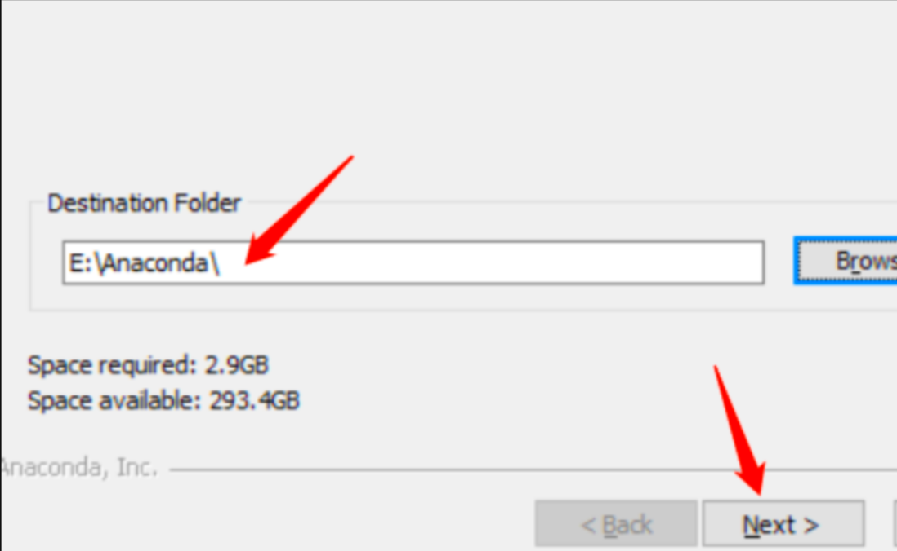

<font style="color:rgb(77, 77, 77);">这一步需要把加入环境变量勾上，后续就不用单独配置环境变量，更便捷一些。</font>

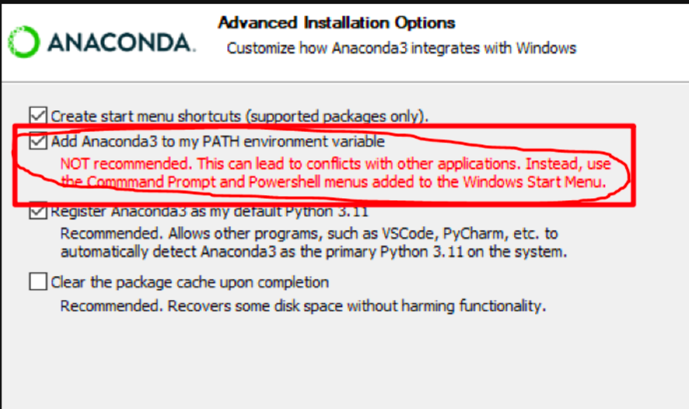

<font style="color:rgb(77, 77, 77);">等待安装。</font>

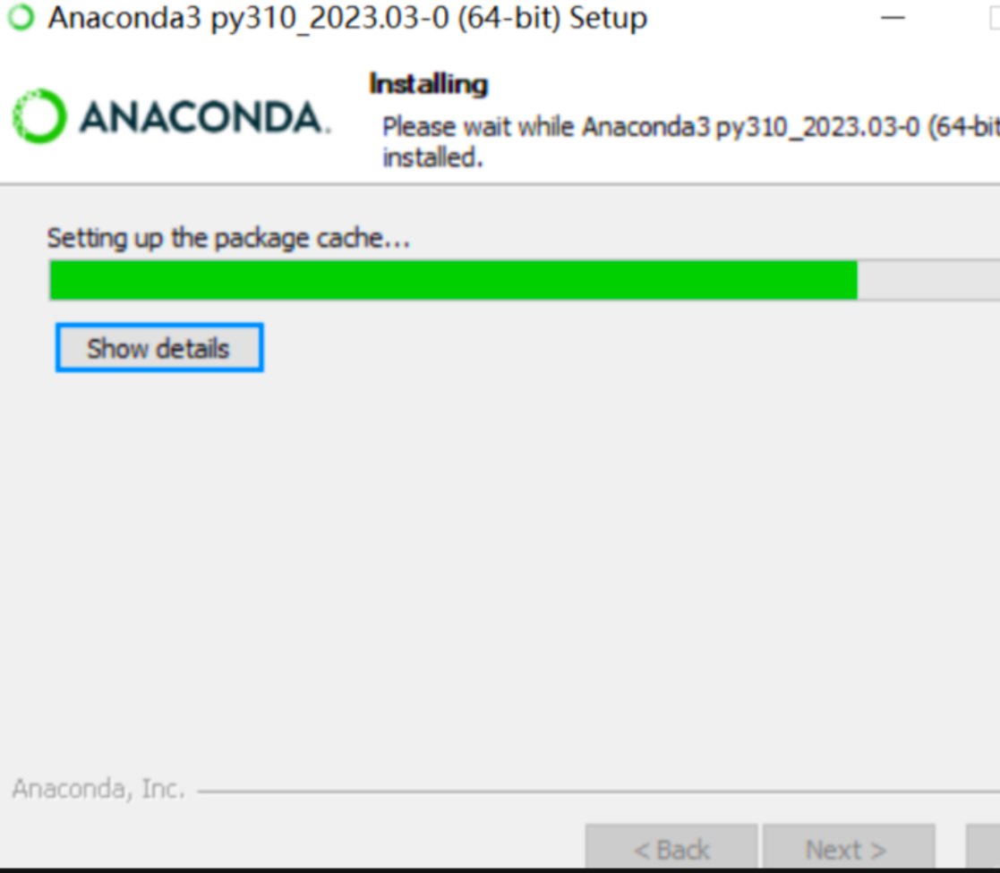

<font style="color:rgb(77, 77, 77);">最后一步点击Finish。</font>

### <font style="color:rgb(79, 79, 79);">三、检查Anaconda是否安装成功</font>
<font style="color:rgb(77, 77, 77);">WIN+R键调出运行窗口，输入cmd回车</font>

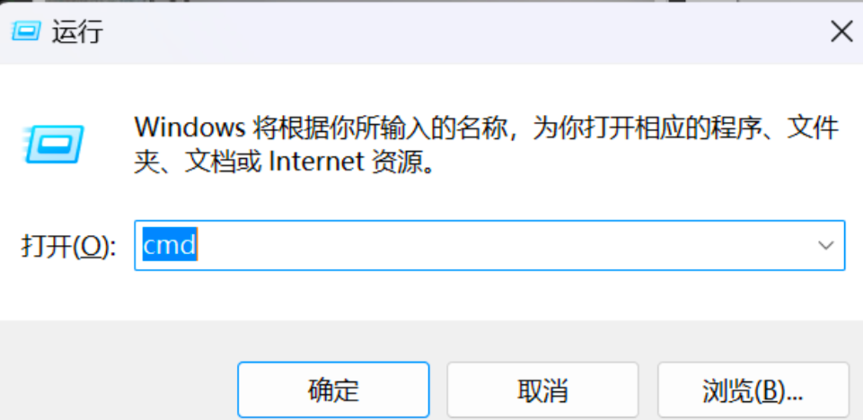

<font style="color:rgb(77, 77, 77);">输入conda -V命令，可以看到版本信息，代表安装成功。</font>

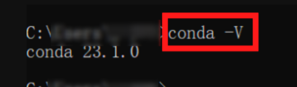

<font style="color:rgb(77, 77, 77);">接着，输入python命令查看python是否安装成功</font>

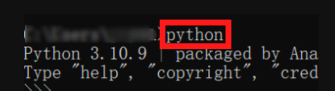

Anaconda介绍

Anaconda是一个免费的增值开源发行版，专门用于Python语言，适用于大规模数据处理、预测分析和科学计算。


旨在简化包的管理和部署，支持Linux、Mac和Windows系统。Anaconda包括Conda、Python以及180多个科学包及其依赖项。


Conda是一个开源的包和环境管理器，允许用户在同一台机器上安装不同版本的软件包及其依赖，并且能够在不同的环境之间切换。


Anaconda的特点包括高性能、跨平台支持、免费的社区支持，以及1000多个开源库。


通过conda包管理器来管理包和环境，同时也支持虚拟环境创建和管理，以保证各个项目中的Python包版本隔离。


Anaconda的安装过程简单，且在安装时会默认同时安装pip和conda。

# 2.chatglm4 安装
### 一.基于以上 Anaconda 安装好以后，下一步进行 chatglm4 安装
### <font style="color:rgb(79, 79, 79);">二. 创建chatglm虚拟环境</font>
<font style="color:rgb(77, 77, 77);">1.运行Windows PowerShell，创建虚拟环境chatglm：</font>

```plsql
conda create -n chatglm。
```

<font style="color:rgb(77, 77, 77);">2.激活虚拟环境：conda activate chatglm。</font>

### <font style="color:rgb(79, 79, 79);">三、安装git命令运行环境</font>
<font style="color:rgb(77, 77, 77);">打开网址https://git-scm.com/download/win，点击“</font>[<font style="color:rgb(77, 77, 77);">64-bit Git for Windows Setup</font>](https://github.com/git-for-windows/git/releases/download/v2.45.2.windows.1/Git-2.45.2-64-bit.exe)<font style="color:rgb(77, 77, 77);">”，下载文件Git-2.45.2-64-bit.exe，双击安装。</font>

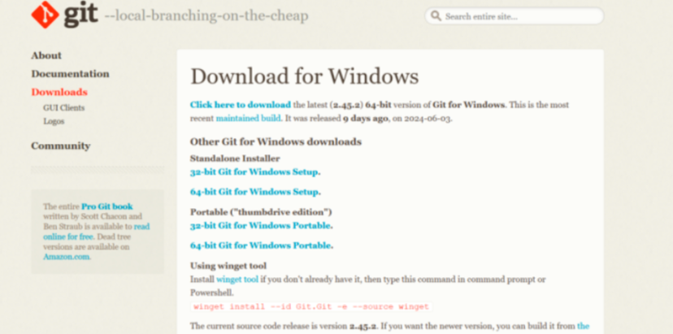


### <font style="color:rgb(79, 79, 79);">四、安装显卡驱动</font>
<font style="color:rgb(77, 77, 77);">1.查看显卡信息。pytorch安装和显卡驱动版本有关，所以需要先检查显卡驱动版本：</font>[<font style="color:rgb(77, 77, 77);">nvidia-smi</font>](https://so.csdn.net/so/search?q=nvidia-smi&spm=1001.2101.3001.7020)<font style="color:rgb(77, 77, 77);">。</font>

<font style="color:rgb(77, 77, 77);">2.cuda下载及安装。</font>

<font style="color:rgb(77, 77, 77);">在笔记本电脑桌面点击鼠标右键->点击“显示更多选项”->点击“NIVIDIA控制面板”->点击左下角的“系统信息”->点击“组件”，可以看到第三行，笔记本电脑支持的CUDA版本是12.4.89</font>

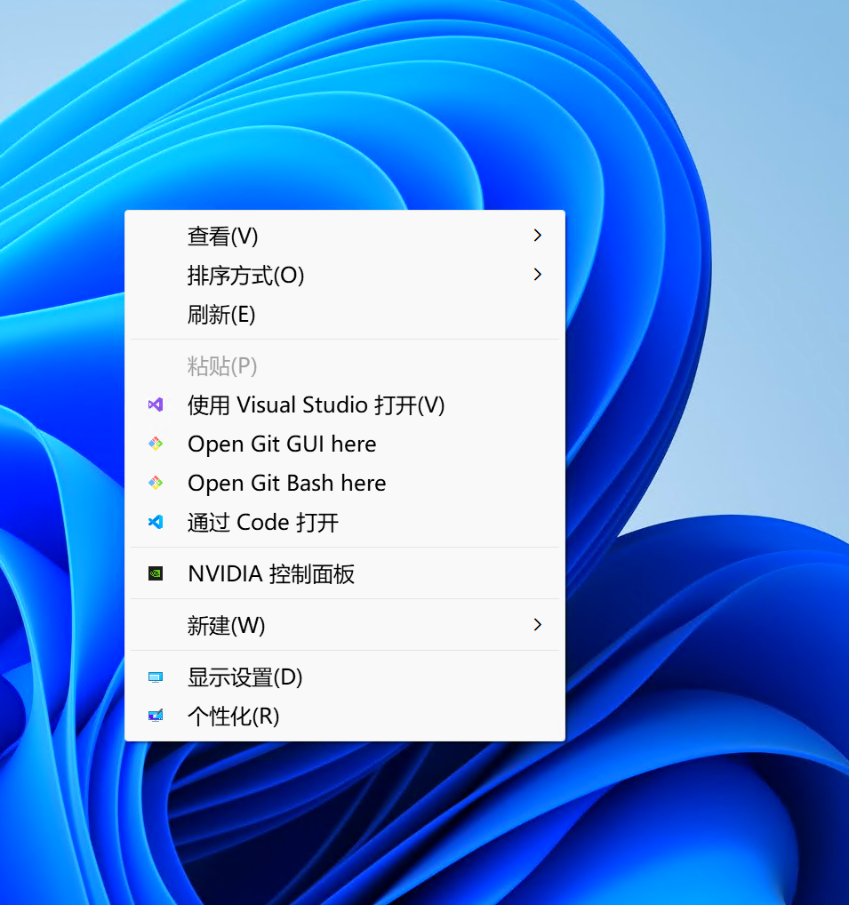

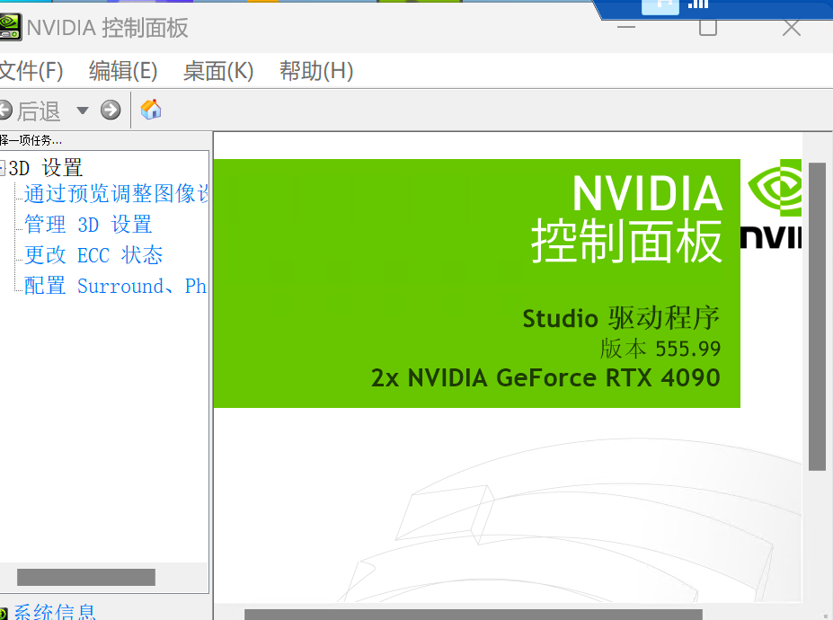

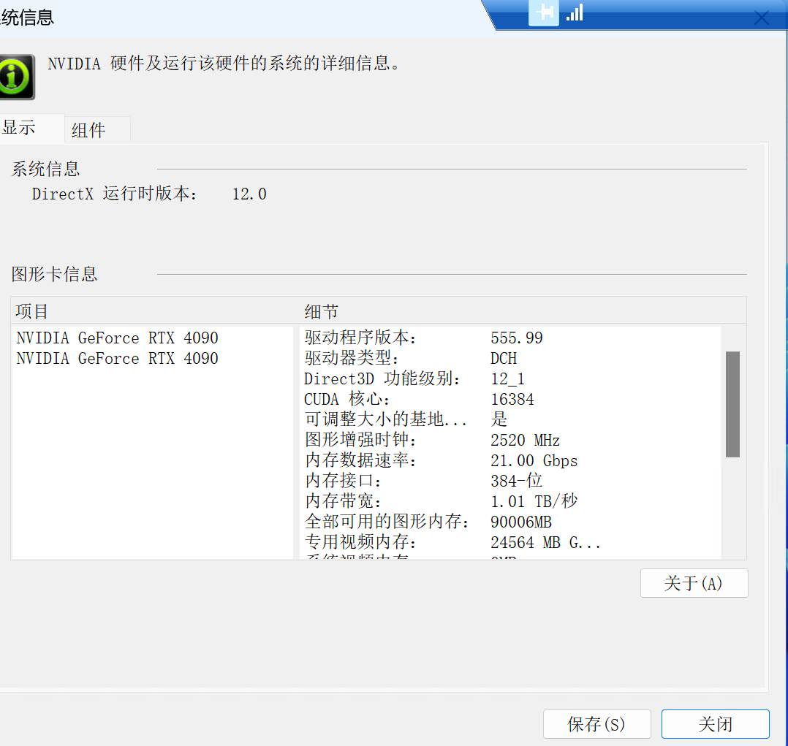

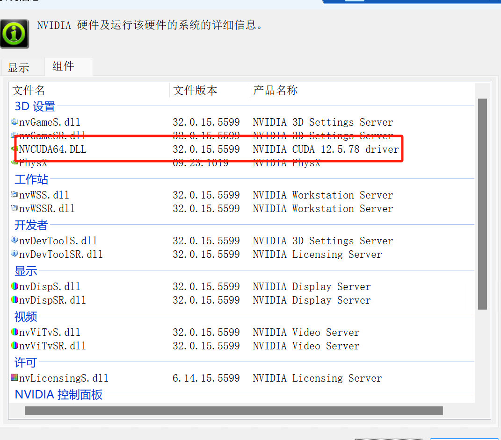

<font style="color:rgb(77, 77, 77);">在</font>[https://developer.nvidia.com/cuda-toolkit-archive下载相应的cuda软件，比如选择CUDA Toolkit 12.5.78。](https://docs.nvidia.com/cuda/cuda-toolkit-release-notes/index.html%E6%9F%A5%E7%9C%8B%E6%94%AF%E6%8C%81%E7%9A%84CUDA%E7%89%88%E6%9C%AC%EF%BC%8C%E4%B8%8B%E8%BD%BD%E3%80%82)

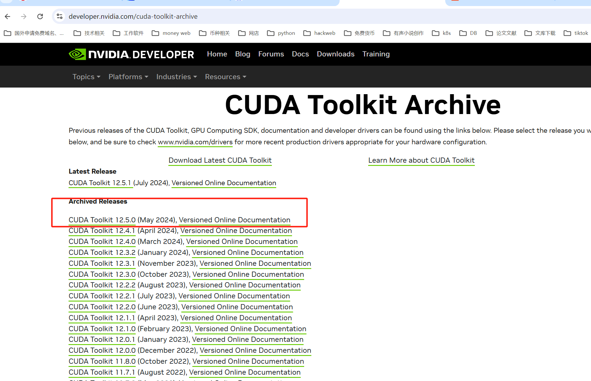

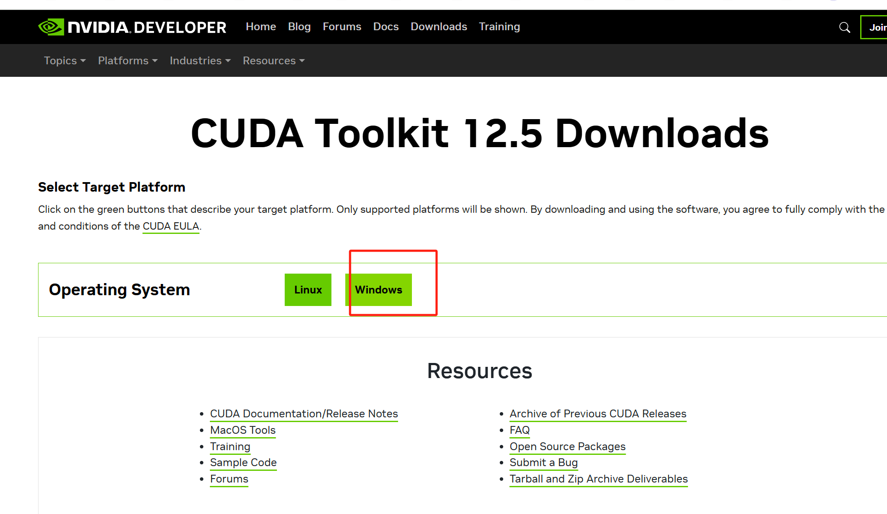


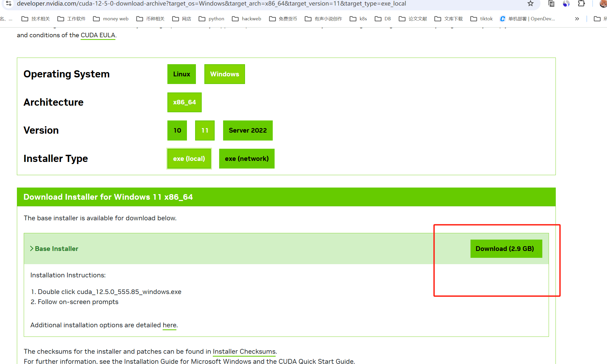

<font style="color:rgb(77, 77, 77);">下载后点击文件cuda_12.4.1_551.78_windows.exe，安装时选择默认配置。验证是否安装成功：运行cmd，输入nvcc --version 即可查看版本号；set cuda，可以查看 CUDA 设置的环境变量。</font>

<font style="color:rgb(77, 77, 77);">安装之后增加两个系统环境变量：</font>

<font style="color:rgb(77, 77, 77);">变量名CUDA_PATH，变量值C:\Program Files\NVIDIA GPU Computing Toolkit\CUDA\v12.4</font>

<font style="color:rgb(77, 77, 77);">变量名CUDA_PATH_V12_4，变量值C:\Program Files\NVIDIA GPU Computing Toolkit\CUDA\v12.4</font>

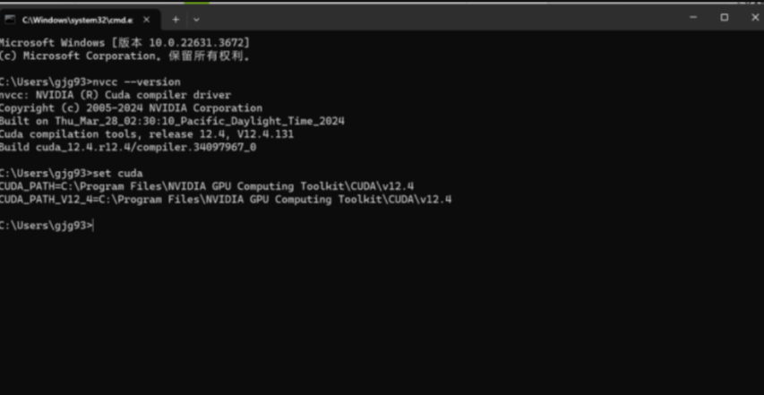

<font style="color:rgb(77, 77, 77);">3.cudnn下载及安装。</font>

<font style="color:rgb(77, 77, 77);">在https://developer.nvidia.com/rdp/cudnn-download，使用邮箱注册一个账号。</font>

<font style="color:rgb(77, 77, 77);">在https://developer.nvidia.com/rdp/cudnn-archive下载，比如v8.97 for CUDA 12.x。</font>

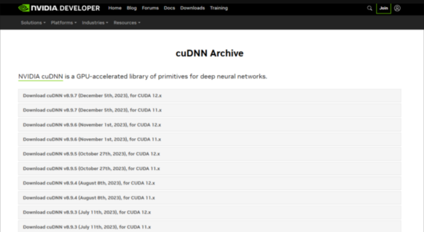

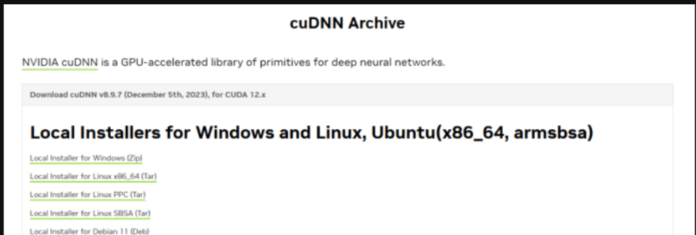

<font style="color:rgb(77, 77, 77);">打开文件cudnn-windows-x86_64-8.9.7.29_cuda12-archive.zip，将把三个文件夹拷贝到cuda的安装目录下（覆盖原有文件）</font>

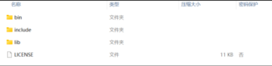

<font style="color:rgb(77, 77, 77);">验证是否安装成功。</font>

<font style="color:rgb(77, 77, 77);">C:\Program Files\NVIDIA GPU Computing Toolkit\CUDA\v12.4\extras\demo_suite。执行bandwidthTest.exe和deviceQuery.exe（.\bandwidthTest.exe和.\deviceQuery.exe），“Result = PASS”表示成功。</font>

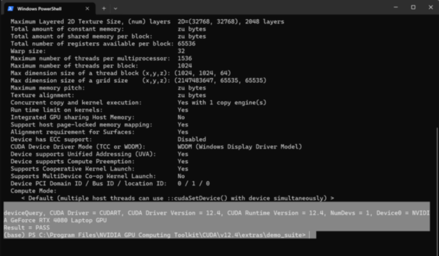

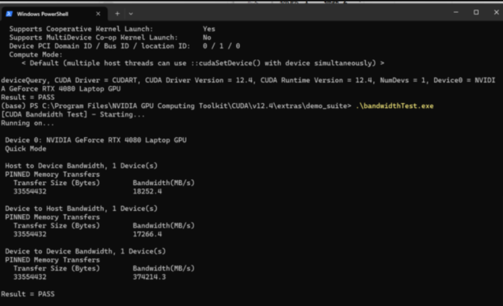

### <font style="color:rgb(79, 79, 79);">五、安装深度学习框架pytorch</font>
<font style="color:rgb(77, 77, 77);">1.安装pytorch，直接到官网https://pytorch.org/选择conda，并复制代码安装即可。比如cuda的版本是12.4，以管理员身份运行Windows PowerShell，激活虚拟环境chatglm，并输入命令：conda install pytorch torchvision torchaudio pytorch-cuda=12.4 -c pytorch-nightly -c nvidia</font>

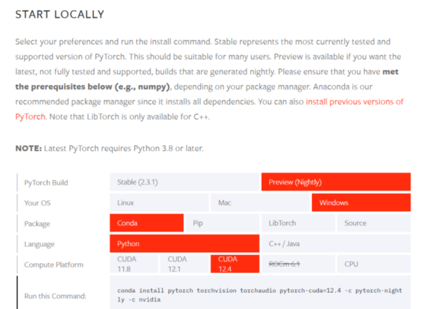

<font style="color:rgb(77, 77, 77);">2.检查pytorch是否安装成功。</font>

<font style="color:rgb(77, 77, 77);">激活虚拟环境：conda activate chatglm </font>

<font style="color:rgb(77, 77, 77);">打开python</font>

<font style="color:rgb(77, 77, 77);">导入库：import torch  </font>

<font style="color:rgb(77, 77, 77);">查看cuda是否可用，如果为TRUE为驱动正常:</font>

<font style="color:rgb(77, 77, 77);">torch.cuda.is_available()  </font>

<font style="color:rgb(77, 77, 77);">退出python：exit()</font>

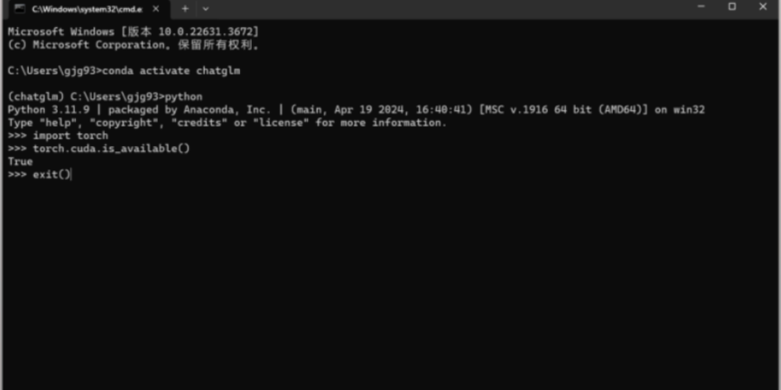

### <font style="color:rgb(79, 79, 79);">六、下载开源大模型GLM4</font>
<font style="color:rgb(77, 77, 77);">GLM4 是智谱AI和清华大学 KEG 实验室联合发布的新一代对话预训练模型。</font>

<font style="color:rgb(77, 77, 77);">1.在D盘新建目录chatglm4,在该目录下点击鼠标右键，选择“在终端中打开”，输入：</font>

<font style="color:rgb(77, 77, 77);">git clone https://github.com/THUDM/GLM4 </font>

<font style="color:rgb(77, 77, 77);">2.在chatglm4目录下新建glm-4-9b-chat-1m目录，在该目录下点击鼠标右键，选择“在终端中打开”，输入：</font>

<font style="color:rgb(77, 77, 77);">git clone https://www.modelscope.cn/ZhipuAI/glm-4-9b-chat-1m.git</font>

### <font style="color:rgb(79, 79, 79);">七、模型部署</font>
<font style="color:rgb(77, 77, 77);">1.安装依赖。</font>

<font style="color:rgb(77, 77, 77);">在D:\chatglm4\basic_demo目录下打开并修改requirements.txt。在第三行torch>=2.3.0和第四行torchvision>=0.18.0前面添加“#”。</font>

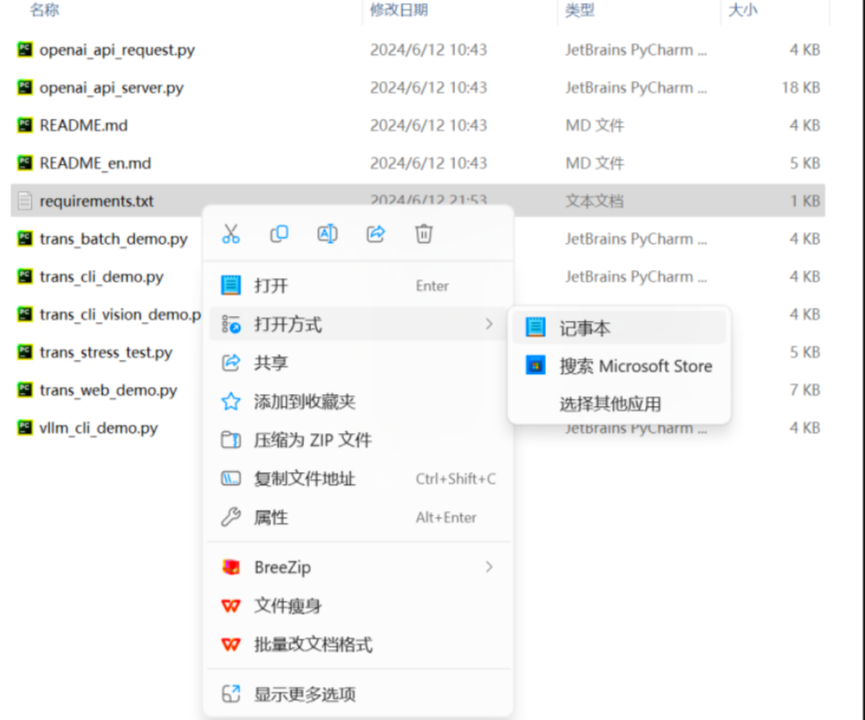

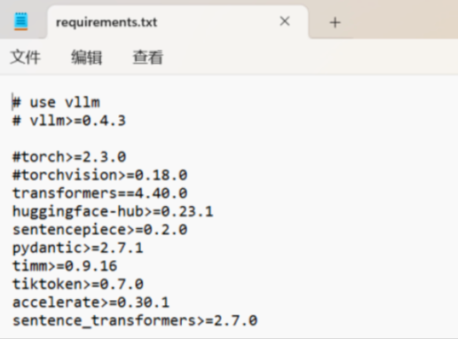

<font style="color:rgb(77, 77, 77);">在D:\chatglm4\basic_demo目录下点击鼠标右键，选择“在终端中打开”，激活环境chatglm，安装环境文件。</font>

<font style="color:rgb(77, 77, 77);">(base) PS D:\chatglm4\basic_demo></font>**<font style="color:rgb(77, 77, 77);">conda activate chatglm</font>**

<font style="color:rgb(77, 77, 77);">(chatglm) PS D:\chatglm4\basic_demo></font>**<font style="color:rgb(77, 77, 77);">pip install -r requirements.txt</font>**

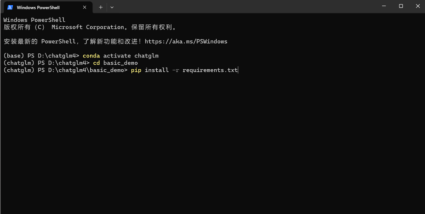

<font style="color:rgb(77, 77, 77);">2.修改相关文件，加载本地模型。</font>

<font style="color:rgb(77, 77, 77);">比如使用pyCharm编辑trans_web_demo.py文件，在D:\chatglm4\basic_demo目录下，点击鼠标右键，选择打开方式，找到编辑软件。</font>

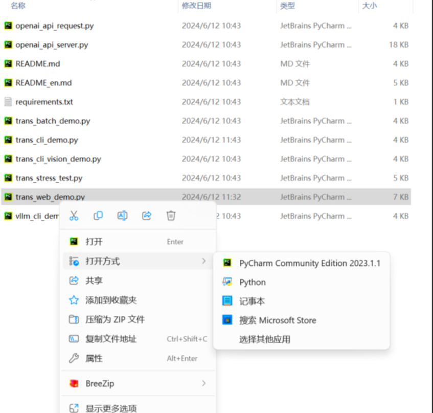  
 <font style="color:rgb(77, 77, 77);">将模型目录\THUDM\glm-4-9b修改成D:\\chatglm4\\THUDM\\glm-4-9b-chat-1m：</font>

<font style="color:rgb(77, 77, 77);">MODEL_PATH = os.environ.get('MODEL_PATH', 'D:\\chatglm4\\THUDM\\glm-4-9b-chat-1m')</font>

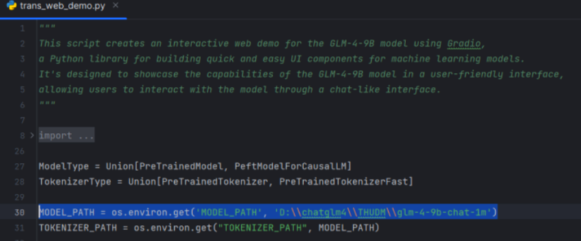

### <font style="color:rgb(79, 79, 79);">八、运行模型</font>
<font style="color:rgb(77, 77, 77);">1.运行Windows PowerShell，激活环境ChatGLM，运行trans_web_demo.py</font>

<font style="color:rgb(77, 77, 77);">conda activate chatglm</font>

<font style="color:rgb(77, 77, 77);">cd d:\ChatGLM4\basic_demo</font>

<font style="color:rgb(77, 77, 77);">python trans_web_demo.py</font>

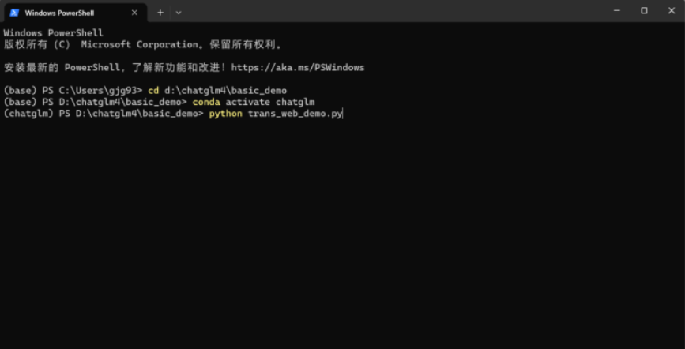

<font style="color:rgb(77, 77, 77);">自动打开网页http://127.0.0.1:8000/（使用时不要关闭终端，当退出大模型时关闭终端）。</font>

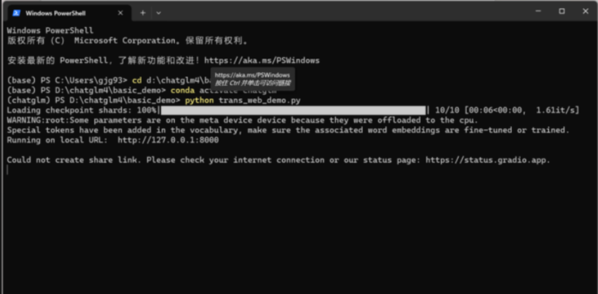

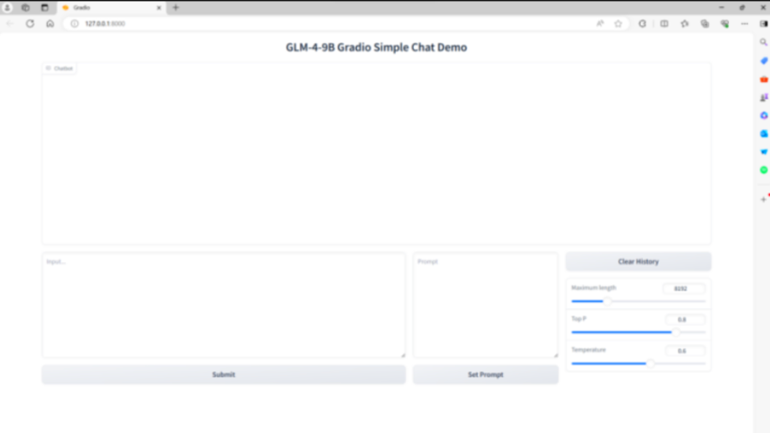

**<font style="color:rgb(77, 77, 77);">备注：以上各项软件应根据个人电脑的实际配置下载对应版本（尤其是cudn、cudnn和pytorch）。</font>**

```plsql
run main.py
```

基于上面所有的安装过程后已经把整个安装过程打包好了以及模型下载好了

```bash
@echo off
chcp 65001 >nul
echo 'glm4 run'

set PYTHON=%CD%\.glut\python.exe
set IPYTHON=%CD%\.glut\Scripts\ipython.exe
set STREAMLIT=%CD%\.glut\Scripts\streamlit.exe
set CU_PATH=%CD%\.glut\Lib\site-packages\torch\lib
set SC_PATH=%CD%\.glut\Scripts
set PATH=%CU_PATH%;%SC_PATH%;%PATH%
set HF_ENDPOINT=https://hf-mirror.com
set HF_HOME=%CD%\.huggingface
set XFORMERS_FORCE_DISABLE_TRITON=1
set CHAT_MODEL_PATH=%CD%\..\models\glm-4-9b-chat
set VLM_MODEL_PATH=%CD%\..\models\glm-4v-9b
set INT4=1

CD composite_demo\src
%PYTHON% %IPYTHON% kernel install --name glm-4-demo --user >nul
%PYTHON% %STREAMLIT% run main.py

pause
```

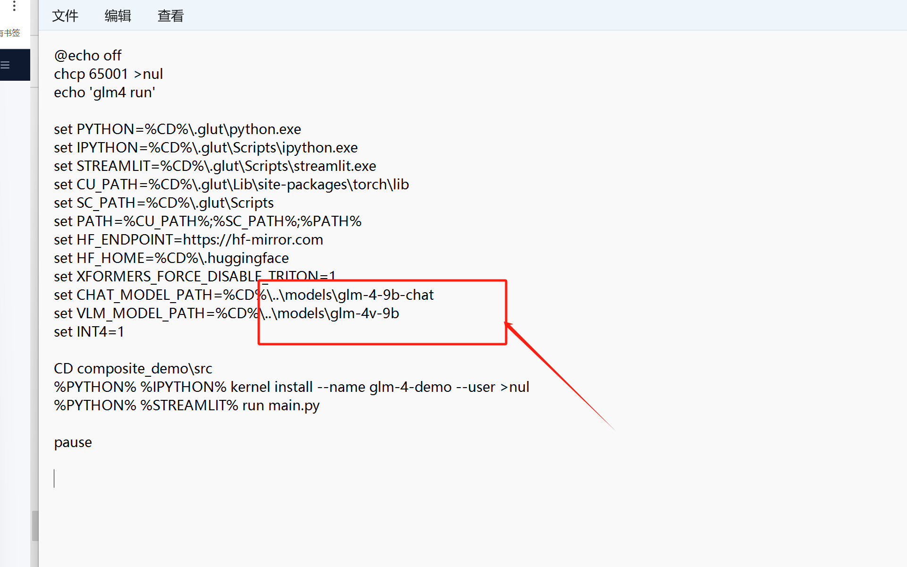

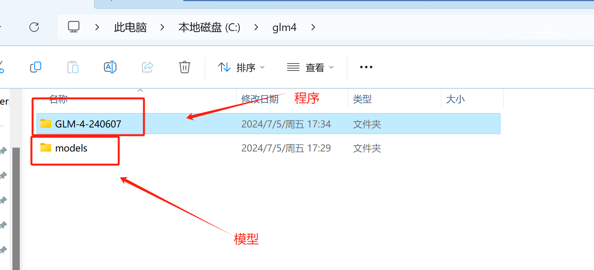

windows 脚本只需要双击运行正常会弹出一个页面可以对话了

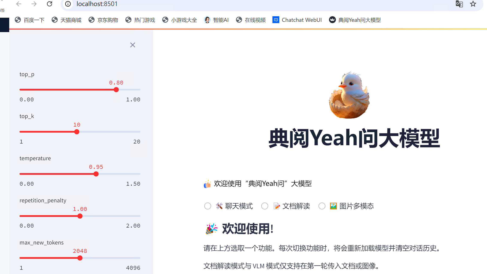

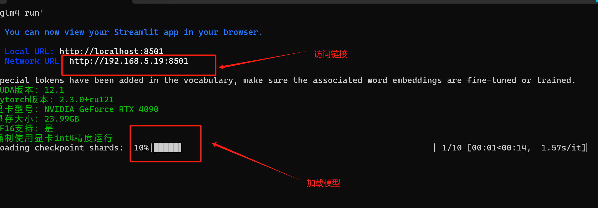


> 更新: 2024-08-01 15:06:15  
> 原文: <https://www.yuque.com/lixinsi/hntyk2/zvi9o2cybso1o033>