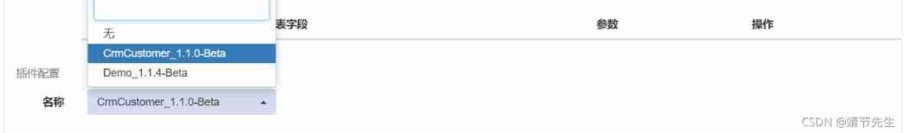
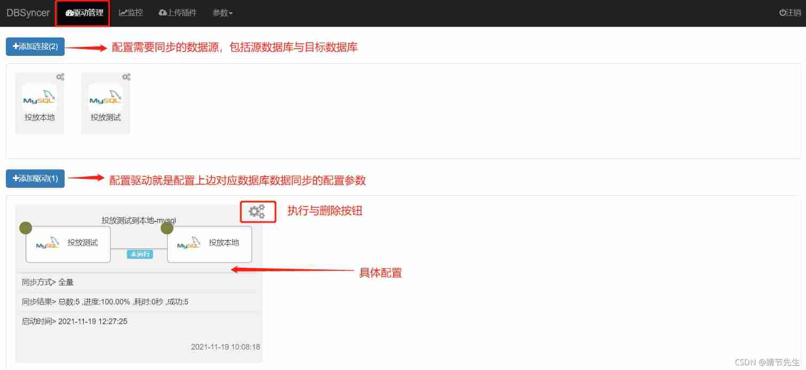
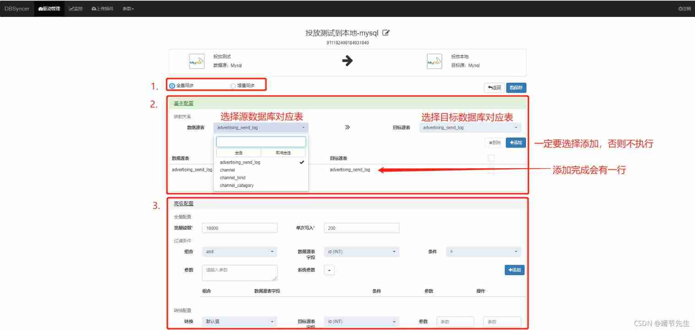
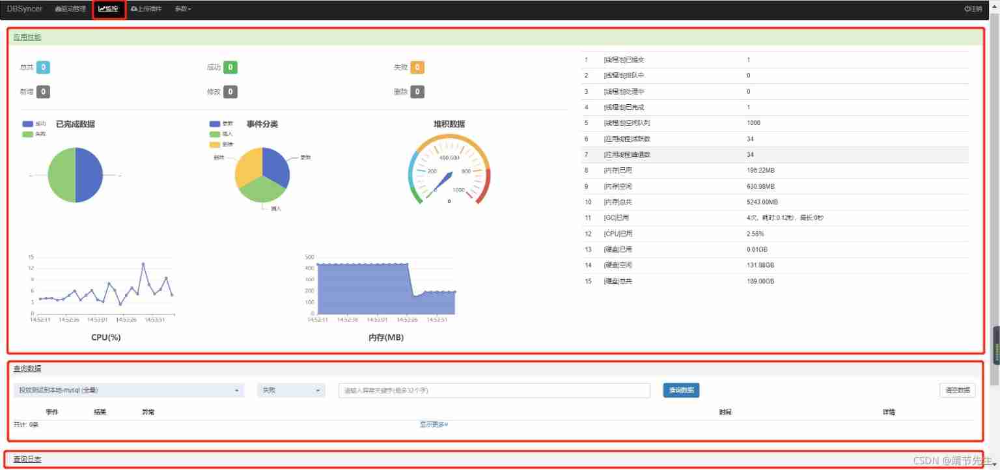
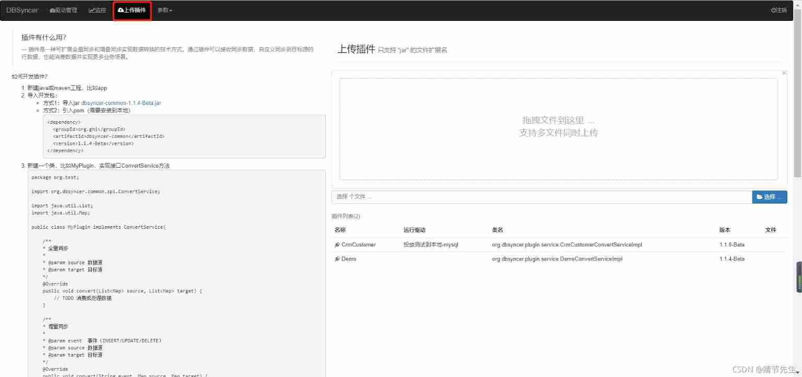
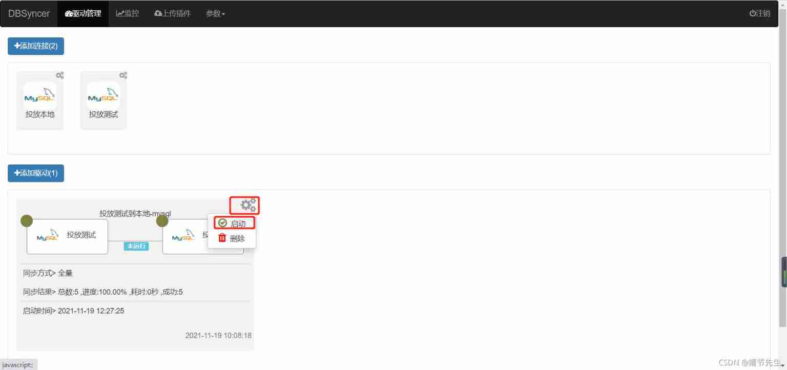
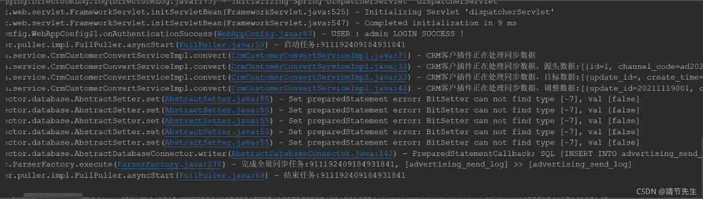

# DBSYCER

数据同步中间件 dbsyncer  


数据同步中间件 DBSyncer  
一、数据同步概述  
二、DBSyncer介绍  
3. DBSyncer 特性  
四、DBSyncer应用场景  
5. DBSyncer 安装配置  
5.1 创建项目  
5.2 自定义插件  
5.3 配置页面  
6. DBSyncer 实现验证  
6. DBSyncer 存在的问题  
一、数据同步概述  
常见的业务开发场景中，数据迁移，增量或全量数据同步，在迁移或同步过程中也会涉及到字段映射，默认值为，不同数据库之间也可能存在数据迁移，mysql,Oracle,SQLServer,ES ，Kafka等，场景很多，虽然使用频率有限，但是场景很多，所以推荐几个开源的数据同步组件DBSyncer，DataX，本文主要介绍DBSyncer的使用和问题。


DataX 链接  
datax-web 链接  
DBSyncer 链接


二、DBSyncer介绍  
DBSyncer是一个开源的数据同步中间件，提供Mysql、Oracle、SqlServer、Elasticsearch(ES)、SQL(Mysql/Oracle/SqlServer)等。支持上传插件和自定义同步转换服务，提供总量和增量监控数据统计图表、应用性能预警等。


3. DBSyncer 特性  
1.组合驱动，自定义库同步到库组合，关系型数据库和非关系型数据库的组合，任意搭配表同步映射关系。


2.实时监控，驱动全量或增量实时同步运行状态、结果、同步日志和系统日志。


3.开发插件，自定义转换同步逻辑


四、DBSyncer应用场景  
连接器	数据源	目标来源	支持的版本（包含以下）  
mysql	️	️	5.7.19 以上  
甲骨文	️	️	10g以上  
SqlServer	️	️	2008年以上  
ES	️	️	6.X 以上  
SQL	️		  
近期计划kafka（设计中）、Redis			  
5. DBSyncer 安装配置  
5.1 创建项目  
配置步骤  
1.安装JDK 1.8（省略细节）  
2.下载安装包DBSyncer-1.0.0-Beta.zip（也可以手动编译）  
3.解压安装包，window执行bin/startup.bat，Linux执行bin/startup.sh  
4.打开浏览器访问：[http://127.0.0.1:18686](http://127.0.0.1:18686)  
5.账号密码：admin/admin


其实也没那么麻烦，直接通过idea从gitee拉起代码，在Application启动中找到dbsyncer-web，根据上面的访问地址，用户名密码访问。


启动完成状态  
在此处插入图片说明


5.2 自定义插件  
创建插件  
对应项目：dbsyncer-plugin  
创建路径：CrmCustomerConvertServiceImpl  
org.dbsyncer.plugin.service.CrmCustomerConvertServiceImpl


package org.dbsyncer.plugin.service;


import org.dbsyncer.common.spi.ConvertService;  
import org.slf4j.Logger;  
import org.slf4j.LoggerFactory;  
import org.springframework.beans.factory.annotation.Value;  
import org.springframework.stereotype.Component;


import java.util.List;  
import java.util.Map;


/** _ Demo class _ _ _[_@author _](/author )_ zrj _ [@date ](/date ) 2021/10/31 */   
[@Component ](/Component )   
public class CrmCustomerConvertServiceImpl implements ConvertService {


```plain
private final Logger logger = LoggerFactory.getLogger(getClass());

/** *  Version number  */
@Value(value = "${info.app.version}")
private String version;

@Override
public void convert(List<Map> source, List<Map> target) {

    logger.info("CRM The customer plug-in is processing synchronization data ");
    logger.info("CRM The customer plug-in is processing synchronization data , Source data :{}", source);
    logger.info("CRM The customer plug-in is processing synchronization data , Target data :{}", target);

    target.forEach(map -> {

        map.put("update_id", "20211119001");
        map.put("create_id", "20211119002");
        map.put("create_name", "dbsyncer01");
        map.put("update_name", "dbsyncer02");
        //map.put("deleted", false);
    });
    logger.info("CRM The customer plug-in is processing synchronization data , Adjust the data :{}", target);
}

@Override
public void convert(String event, Map source, Map target) {

    logger.info("CRM The customer plug-in is processing synchronization data , event :{}, data :{}", event, source);
}

@Override
public String getVersion() {

    return "1.1.0-Beta";
}

@Override
public String getName() {

    return "CrmCustomer";
}
```


}


配置插件  
驱动管理-配置驱动-高级配置-插件配置：选择插件  



5.3 配置页面


1. 驱动管理  
驱动管理分为两部分  
添加连接： 配置数据源，包括源数据库和目标数据库。  
添加驱动：配置数据迁移时的数据库信息，过滤映射信息，以及插件中自定义的迁移逻辑处理。







监控页面分为三部分  
应用性能：CPU、内存和其他机器应用参数。  
查询数据：执行sql记录成功和失败。  
查询日志：数据源配置操作日志。  
在此处插入图片说明3.定义插件插件有  
什么用？  
插件是一种可以通过可扩展的全同步和增量同步实现数据转换的技术。插件可以接收同步数据，自定义同步到目标源的行数据，也可以消费数据，实现更多业务场景。





在此处插入图片说明4. 参数配置  
参数配置包括两部分  
系统参数：刷新频率。  
修改密码：登录密码修改。  


6.  DBSyncer 实现验证  
开始执行

  
在此处插入图片说明完成状态

  
在此处插入图片说明 

7.  DBSyncer 存在的问题  
MySQL 字段类型 tinyint 转换为 null，这个需要手动处理。 


> 更新: 2022-04-17 18:41:26  
> 原文: <https://www.yuque.com/lixinsi/hntyk2/lgakpk>