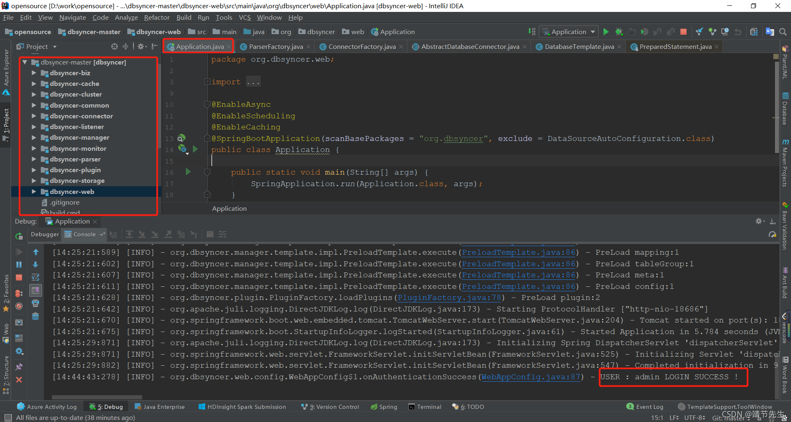
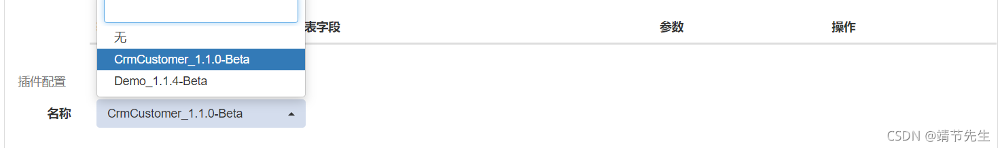
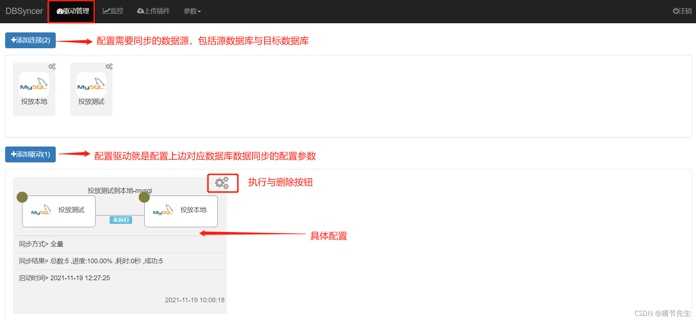
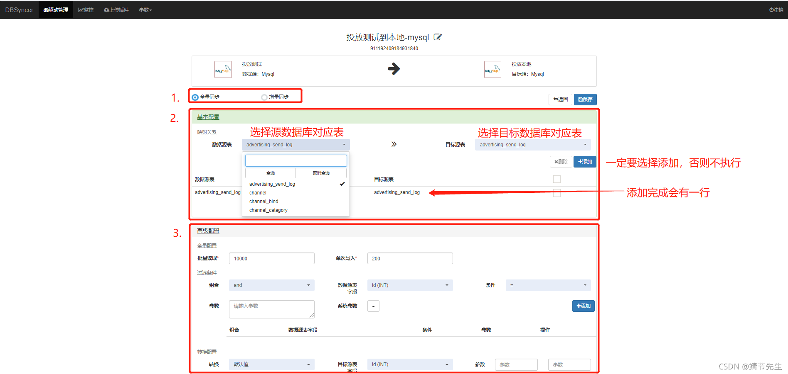
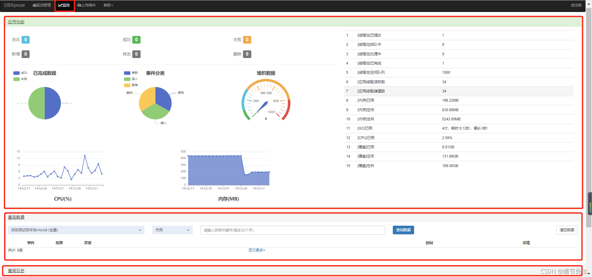
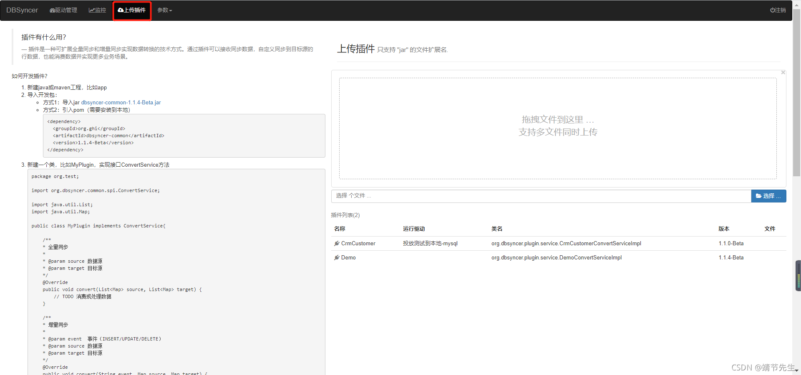
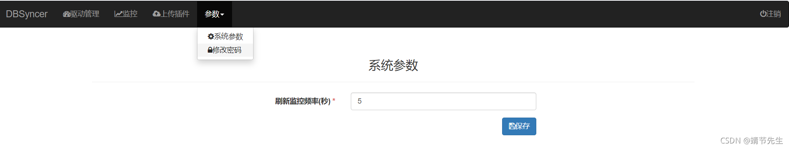
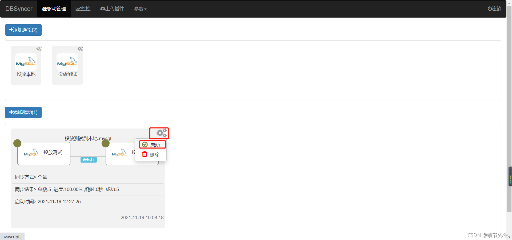
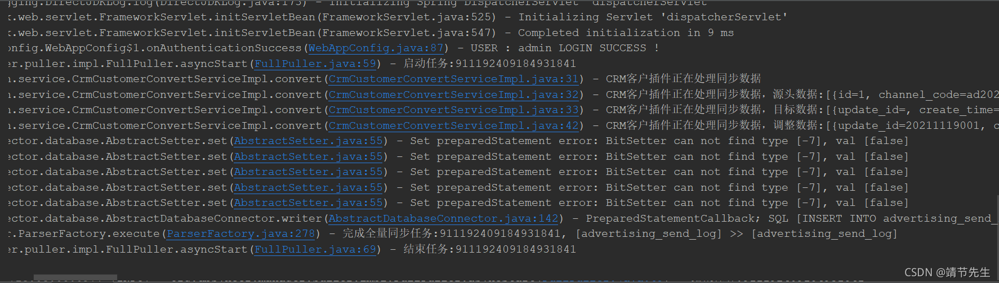

# DBsyner数据同步

##### <font style="color:rgb(33, 37, 41);">数据同步中间件 DBSyncer</font>
### <font style="color:rgb(33, 37, 41);">数据同步中间件 dbsyncer</font>
+ 一、数据同步概述
+ 2.DBSyncer介绍
+ 3. DBSyncer 特性
+ 4、DBSyncer应用场景
+ 5.DBSyncer安装配置
    - 5.1 创建项目
    - 5.2 自定义插件
    - 5.3 配置页面
+ 6. DBSyncer 实现验证
+ 6. DBSyncer存在的问题

# <font style="color:rgb(33, 37, 41);">一、数据同步概述</font>
<font style="color:rgb(33, 37, 41);">在常见的业务开发场景中，数据迁移，增量或全量数据同步，字段映射，默认值，也涉及到迁移或同步过程。</font><font style="color:rgb(33, 37, 41);">，也可能存在不同数据库之间的数据迁移。</font><font style="color:rgb(33, 37, 41);">mysql，Oracle，SQLServer，ES，Kafka等，虽然使用频率有限。</font><font style="color:rgb(33, 37, 41);">，但是场景很多，所以推荐几个开源的数据同步组件。</font><font style="color:rgb(33, 37, 41);">DBSyncer，DataX，本文主要介绍dbsyncer的使用和问题。</font><font style="color:rgb(33, 37, 41);">。</font>

DataX 链接<font style="color:rgb(33, 37, 41);">  
</font>datax-web 链接<font style="color:rgb(33, 37, 41);">  
</font>DBSyncer 链接

# <font style="color:rgb(33, 37, 41);">2.DBSyncer介绍</font>
<font style="color:rgb(33, 37, 41);">DBSyncer是一个开源的数据同步中间件，提供Mysql、Oracle、SqlServer、Elasticsearch(ES)、SQL(Mysql/Oracle/SqlServer)等同步场景。</font><font style="color:rgb(33, 37, 41);">支持上传插件自定义同步转换业务，提供监控总量和增量数据统计图表、应用性能预警等。</font>

# <font style="color:rgb(33, 37, 41);">3. DBSyncer 特性</font>
<font style="color:rgb(33, 37, 41);">1.组合驱动，自定义库同步到库组合，关系型数据库和非关系型数据库的组合，任意搭配表同步映射关系。</font>

<font style="color:rgb(33, 37, 41);">2.实时监控，驱动全量或增量实时同步运行状态、结果、同步日志和系统日志。</font>

<font style="color:rgb(33, 37, 41);">3.开发插件自定义变换同步的逻辑</font>

# <font style="color:rgb(33, 37, 41);">4、DBSyncer应用场景</font>
| <font style="color:rgb(33, 37, 41);">连接器</font> | <font style="color:rgb(33, 37, 41);">数据源</font> | <font style="color:rgb(33, 37, 41);">目标源</font> | <font style="color:rgb(33, 37, 41);">支持的版本（包含以下）</font> |
| :--- | :--- | :--- | :--- |
| <font style="color:rgb(33, 37, 41);">mysql</font> | <font style="color:rgb(33, 37, 41);">✔️</font> | <font style="color:rgb(33, 37, 41);">✔️</font> | <font style="color:rgb(33, 37, 41);">5.7.19 以上</font> |
| <font style="color:rgb(33, 37, 41);">甲骨文</font> | <font style="color:rgb(33, 37, 41);">✔️</font> | <font style="color:rgb(33, 37, 41);">✔️</font> | <font style="color:rgb(33, 37, 41);">10g以上</font> |
| <font style="color:rgb(33, 37, 41);">SqlServer</font> | <font style="color:rgb(33, 37, 41);">✔️</font> | <font style="color:rgb(33, 37, 41);">✔️</font> | <font style="color:rgb(33, 37, 41);">2008年以上</font> |
| <font style="color:rgb(33, 37, 41);">ES</font> | <font style="color:rgb(33, 37, 41);">✔️</font> | <font style="color:rgb(33, 37, 41);">✔️</font> | <font style="color:rgb(33, 37, 41);">6.X 以上</font> |
| <font style="color:rgb(33, 37, 41);">SQL</font> | <font style="color:rgb(33, 37, 41);">✔️</font> | | |
| <font style="color:rgb(33, 37, 41);">最近计划kafka（设计中）、Redis</font> | | | |


# <font style="color:rgb(33, 37, 41);">5.DBSyncer安装配置</font>
## <font style="color:rgb(33, 37, 41);">5.1 创建项目</font>
**<font style="color:rgb(33, 37, 41);">配置步骤</font>**<font style="color:rgb(33, 37, 41);">  
</font><font style="color:rgb(33, 37, 41);">1.安装jdk 1.8（省略细节）</font><font style="color:rgb(33, 37, 41);">  
</font><font style="color:rgb(33, 37, 41);">2.下载安装包dbsyncer -1.0.0-Beta.zip（也可以手动编译）</font><font style="color:rgb(33, 37, 41);">  
</font><font style="color:rgb(33, 37, 41);">3.解压安装包，Window执行bin /startup.bat，Linux执行bin /startup.sh</font><font style="color:rgb(33, 37, 41);">  
</font><font style="color:rgb(33, 37, 41);">4.打开浏览器访问：http://127.0.0.1:18686</font><font style="color:rgb(33, 37, 41);">  
</font><font style="color:rgb(33, 37, 41);">5.账号密码：admin/admin</font>

<font style="color:rgb(33, 37, 41);">实际上，这并没有那么麻烦。</font><font style="color:rgb(33, 37, 41);">直接过去。</font><font style="color:rgb(33, 37, 41);">想法从gitee拉代码，找到dbsyncer。</font><font style="color:rgb(33, 37, 41);">-web应用启动完成，根据上面的访问地址、用户名和密码进行访问。</font>

**<font style="color:rgb(33, 37, 41);">启动完成状态</font>**<font style="color:rgb(33, 37, 41);">  
</font>

## <font style="color:rgb(33, 37, 41);">5.2 自定义插件</font>
**<font style="color:rgb(33, 37, 41);">创建插件</font>**<font style="color:rgb(33, 37, 41);">  
</font><font style="color:rgb(33, 37, 41);">对应项目：dbsyncer-plugin</font><font style="color:rgb(33, 37, 41);">  
</font><font style="color:rgb(33, 37, 41);">创建路径：CrmCustomerConvertServiceImpl</font><font style="color:rgb(33, 37, 41);">  
</font><font style="color:rgb(33, 37, 41);">org.dbsyncer.plugin.service.CrmCustomerConvertServiceImpl</font>

```java
package org.dbsyncer.plugin.service;

import org.dbsyncer.common.spi.ConvertService;
import org.slf4j.Logger;
import org.slf4j.LoggerFactory;
import org.springframework.beans.factory.annotation.Value;
import org.springframework.stereotype.Component;

import java.util.List;
import java.util.Map;

/**
 * Demo class
 *
 * @author zrj
 * @date 2021/10/31
 */
@Component
public class CrmCustomerConvertServiceImpl implements ConvertService {

    private final Logger logger = LoggerFactory.getLogger(getClass());

    /**
     *  version number 
     */
    @Value(value = "${info.app.version}")
    private String version;

    @Override
    public void convert(List<Map> source, List<Map> target) {
        logger.info("CRM the customer plug-in is processing synchronize data ");
        logger.info("CRM the customer plug-in is processing synchronize data, source data :{}", source);
        logger.info("CRM the customer plug-in is processing synchronize data, target data :{}", target);

        target.forEach(map -> {
            map.put("update_id", "20211119001");
            map.put("create_id", "20211119002");
            map.put("create_name", "dbsyncer01");
            map.put("update_name", "dbsyncer02");
            //map.put("deleted", false);
        });
        logger.info("CRM the customer plug-in is processing synchronize data and adjusting the data. :{}", target);
    }

    @Override
    public void convert(String event, Map source, Map target) {
        logger.info("CRM the customer plug-in is processing synchronize data, events :{}， number :{}", event, source);
    }

    @Override
    public String getVersion() {
        return "1.1.0-Beta";
    }

    @Override
    public String getName() {
        return "CrmCustomer";
    }
}

```

<font style="color:rgb(33, 37, 41);">  
</font><font style="color:rgb(33, 37, 41);">---</font><font style="color:rgb(33, 37, 41);">  
</font>

## <font style="color:rgb(33, 37, 41);">5.3</font>
<font style="color:rgb(33, 37, 41);">1.</font>

<font style="color:rgb(33, 37, 41);">2.</font>

<font style="color:rgb(33, 37, 41);">  
</font><font style="color:rgb(33, 37, 41);">CPU</font><font style="color:rgb(33, 37, 41);">  
</font><font style="color:rgb(33, 37, 41);">sql</font><font style="color:rgb(33, 37, 41);">  
  
</font><font style="color:rgb(33, 37, 41);">3.</font><font style="color:rgb(33, 37, 41);">  
  
</font>

<font style="color:rgb(33, 37, 41);">4.</font><font style="color:rgb(33, 37, 41);">  
  
  
  
</font>

# <font style="color:rgb(33, 37, 41);">6. 数据库同步器</font>
<font style="color:rgb(33, 37, 41);">  
</font><font style="color:rgb(33, 37, 41);">  
</font>

# <font style="color:rgb(33, 37, 41);">6. 数据库同步器</font>
<font style="color:rgb(33, 37, 41);">MySQLtinyintnull</font>


> 更新: 2025-07-18 11:01:36  
> 原文: <https://www.yuque.com/lixinsi/hntyk2/qgatys>