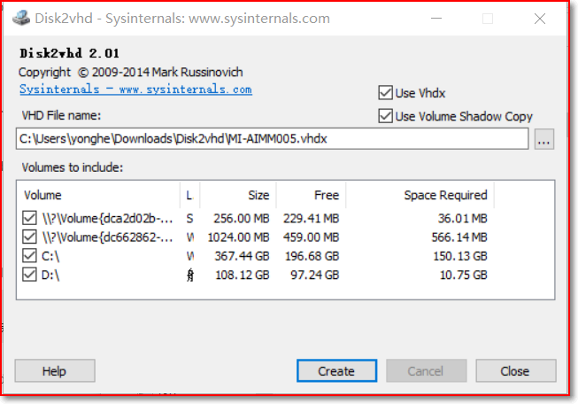
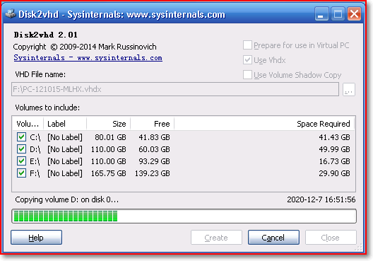
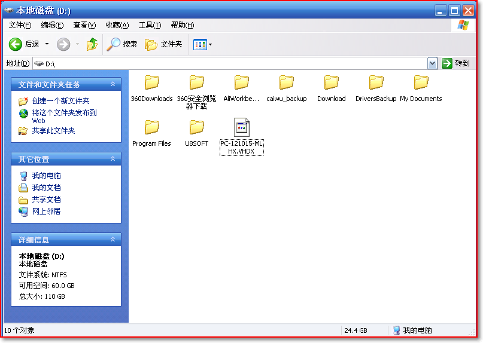

# Disk2vhd使用与介绍

Official documents：[https://docs.microsoft.com/zh-cn/sysinternals/downloads/disk2vhd](https://docs.microsoft.com/zh-cn/sysinternals/downloads/disk2vhd)

## 1.Introduction
Disk2vhd是一个实用程序，它创建物理磁盘的VHD（虚拟硬盘-Microsoft的虚拟机磁盘格式）版本，用于Microsoft虚拟PC或Microsoft Hyper-V虚拟机（VM）。Disk2vhd与其他物理到虚拟工具的区别在于，您可以在联机的系统上运行Disk2vhd。Disk2vhd使用Windows XP中引入的Windows卷快照功能，为要包含在转换中的卷创建一致的时间点快照。您甚至可以让Disk2vhd在本地卷上创建VHD，甚至可以在正在转换的卷上创建VHD（不过，当VHD位于与正在转换的卷不同的磁盘上时，性能会更好）。

## 2.Install
download：https://download.sysinternals.com/files/Disk2vhd.zip

下载完成后直接解压打开即可，如下图：

它将为所选卷所在的每个磁盘创建一个VHD。它保留磁盘的分区信息，但只复制所选磁盘上卷的数据内容。

虚拟PC支持127GB的最大虚拟磁盘大小。如果从更大的磁盘创建VHD，则无法从虚拟PC VM访问该VHD。

因为硬盘较大，花费时间较长，制作过程如下图：

要使用Disk2vhd生成的vhd，请创建具有所需特性的VM，并将vhd作为IDE磁盘添加到VM的配置中。在第一次引导时，启动捕获的Windows副本的VM将检测VM的硬件并自动安装驱动程序（如果映像中存在）。如果所需的驱动程序不存在，请通过虚拟PC或Hyper-V集成组件进行安装。也可以使用Windows 7或Windows Server 2008 R2磁盘管理或Diskpart实用程序连接到VHD。

制作完成生产的VHDX文件如下:

如果计划从VHD启动，请不要附加到创建VHD的同一系统上。如果这样做，Windows将为VHD分配一个新的磁盘签名，以避免与VHD源磁盘的签名发生冲突。Windows通过磁盘签名引用引导配置数据库（BCD）中的磁盘，因此，在VM中引导的Windows将无法定位引导磁盘。

Disk2vhd不支持启用Bitlocker的卷的转换。如果要为此类卷创建VHD，请关闭Bitlocker并等待该卷首先完全解密。

Disk2vhd运行在Windows Vista、Windows Server 2008及更高版本（包括x64系统）上。

## 3.Command Line Usage
Disk2vhd包含命令行选项，使您能够编写VHD的创建脚本。按驱动器号（例如c:）指定要包含在快照中的卷，或使用“*”包括所有卷。

用法：

| 1 | disk2vhd <[drive: [drive:]...]|[*]> <vhdfile> |
| :--- | :--- |

例：

| 1 | disk2vhd * c:\vhd\snapshot.vhd |
| :--- | :--- |

> 更新: 2023-06-24 18:43:15  
> 原文: <https://www.yuque.com/lixinsi/hntyk2/by9ek0ceisu4hory>