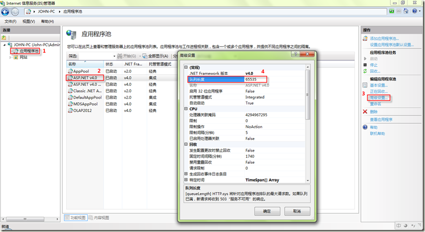
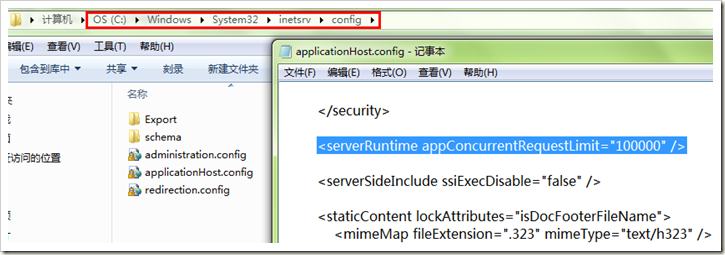
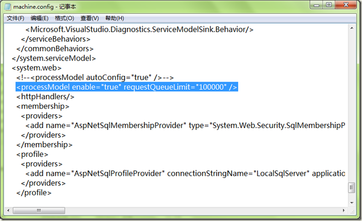

# IIS优化，支持10万并发

### <font style="color:rgb(77, 77, 77);">步骤一：调整IIS的应用程序池队列长度。</font>
<font style="color:rgb(77, 77, 77);">在【应用程序池】列表中，选择你相应网站所使用的应用程序池，将原来的队列长度由1000改为65535。当然这里的队列长度你可以根据自己的访问用户*1.5来设置，例如：你有2000用户，你此处就可以设置为3000(3000=2000用户数*1.5)，</font>[官方参考](http://technet.microsoft.com/zh-cn/library/dd441171%28v=office.13%29.aspx)

<font style="color:rgb(77, 77, 77);">设置如下图：</font>



```json
#Requires -RunAsAdministrator

# 步骤1：配置所有相关应用程序池参数
$appPoolsToUpdate = @(
    "由命令选择-admin",
    "2025-python量化投资-API",
    "2025-python量化投资-管理端",
    "电商全流程-admin",
    "电商商数-api",
    "电商商数-admin",
    "电商商数-dataApi",
    "电商商数-student"
    # 添加其他需要修改的池名称
)

# 备份IIS配置文件
$configPath = "$env:windir\System32\inetsrv\config\applicationHost.config"
Copy-Item $configPath "$configPath.bak_$(Get-Date -Format yyyyMMddHHmmss)" -Force

foreach ($pool in $appPoolsToUpdate) {
    try {
        # 设置队列长度
        & "$env:windir\system32\inetsrv\appcmd.exe" set apppool "/apppool.name:$pool" /queueLength:65535
        
        # 禁止重叠回收
        & "$env:windir\system32\inetsrv\appcmd.exe" set apppool "/apppool.name:$pool" /disallowOverlappingRotation:True
        
        # 设置最大故障数（修正参数名）
        & "$env:windir\system32\inetsrv\appcmd.exe" set apppool "/apppool.name:$pool" /rapidFailProtection.maxCrashes:65530
        
        # 验证设置
        Write-Host "`n验证配置 $pool :"
        & "$env:windir\system32\inetsrv\appcmd.exe" list apppool "/apppool.name:$pool" /text:queueLength
        & "$env:windir\system32\inetsrv\appcmd.exe" list apppool "/apppool.name:$pool" /text:disallowOverlappingRotation
        & "$env:windir\system32\inetsrv\appcmd.exe" list apppool "/apppool.name:$pool" /text:rapidFailProtection.maxCrashes
        
    } catch {
        Write-Warning "配置 $pool 失败: $_"
    }
}

# 步骤2-5保持原有配置（IIS并发限制、machine.config、注册表修改等）

Write-Host "`n所有应用程序池配置完成，请继续执行后续步骤并重启服务器！"
```

### <font style="color:rgb(77, 77, 77);">步骤二：调整IIS的appConcurrentRequestLimit值</font>
<font style="color:rgb(77, 77, 77);">打开</font>[cmd命令](https://so.csdn.net/so/search?q=cmd%E5%91%BD%E4%BB%A4&spm=1001.2101.3001.7020)<font style="color:rgb(77, 77, 77);">，运行命令：</font>

```bash
c:\Windows\System32\inetsrv\appcmd.exe set config /section:serverRuntime /appConcurrentRequestLimit:100000
```



### <font style="color:rgb(77, 77, 77);">步骤三：修改ASP.NET请求队列限制即调整machine.config中的processModel>RequestQueueLimit</font>
<font style="color:rgb(77, 77, 77);">1、单击“开始”，然后单击“运行”。</font>

<font style="color:rgb(77, 77, 77);">2、在“运行”对话框中，键入 </font>

```bash
notepad %systemroot%\Microsoft.Net\Framework64\v4.0.30319\CONFIG\machine.config
```

<font style="color:rgb(77, 77, 77);">，然后单击“确定”。(不同的.NET版本路径不一样，你可以选择你自己当前想设置的.NET版本的config)</font>

<font style="color:rgb(77, 77, 77);">3、找到如下所示的 processModel 元素：<processModel autoConfig="true" /></font>

<font style="color:rgb(77, 77, 77);">4、将 processModel 元素替换为以下值：<processModel enable="true" requestQueueLimit="100000" /></font>



<font style="color:rgb(77, 77, 77);">5、保存并关闭 Machine.config 文件。</font>

### <font style="color:rgb(77, 77, 77);">步骤四：修改注册表，调整IIS支持的并发TCPIP连接数</font>
<font style="color:rgb(77, 77, 77);">在cmd命令中运行命令，当然也可以手动去注册表修改</font>

```bash
reg add HKLM\System\CurrentControlSet\Services\HTTP\Parameters /v MaxConnections /t REG_DWORD /d 100000
```


```abap
#appConcurrentRequestLimit
c:\windows\system32\inetsrv\appcmd.exe set config /section:serverRuntime /appConcurrentRequestLimit:100000
 
reg add HKLM\System\CurrentControlSet\Services\HTTP\Parameters /v MaxConnections /t REG_DWORD /d 100000
 
# too long
reg add HKEY_LOCAL_MACHINE\SYSTEM\CurrentControlSet\services\HTTP\Parameters /v MaxFieldLength /t REG_DWORD /d 32768
reg add HKEY_LOCAL_MACHINE\SYSTEM\CurrentControlSet\services\HTTP\Parameters /v MaxRequestBytes /t REG_DWORD /d 32768
 
#更多的可以可以查看这篇文章,手工操作的可以查看这篇文章
start "C:\Program Files\Internet Explorer\iexplore.exe" https://www.jb51.net/article/36073.htm
```

```json
reg add HKLM\System\CurrentControlSet\Services\HTTP\Parameters /v MaxConnections /t REG_DWORD /d 100000
reg add HKLM\System\CurrentControlSet\Services\HTTP\Parameters /v MaxConnections /t REG_DWORD /d 100000
reg add HKEY_LOCAL_MACHINE\SYSTEM\CurrentControlSet\services\HTTP\Parameters /v MaxFieldLength /t REG_DWORD /d 32768
reg add HKEY_LOCAL_MACHINE\SYSTEM\CurrentControlSet\services\HTTP\Parameters /v MaxRequestBytes /t REG_DWORD /d 32768
c:\windows\system32\inetsrv\appcmd.exe set config /section:serverRuntime /appConcurrentRequestLimit:100000
c:\Windows\System32\inetsrv\appcmd.exe set config /section:serverRuntime /appConcurrentRequestLimit:100000
```

```json
<?xml version="1.0" encoding="UTF-8" ?>
<!--
    Please refer to machine.config.comments for a description and
    the default values of each configuration section.

    For a full documentation of the schema please refer to
    http://go.microsoft.com/fwlink/?LinkId=42127

    To improve performance, machine.config should contain only those
    settings that differ from their defaults.
-->
<configuration>
    <configSections>
        <section name="appSettings" type="System.Configuration.AppSettingsSection, System.Configuration, Version=4.0.0.0, Culture=neutral, PublicKeyToken=b03f5f7f11d50a3a" restartOnExternalChanges="false" requirePermission="false" />
        <section name="connectionStrings" type="System.Configuration.ConnectionStringsSection, System.Configuration, Version=4.0.0.0, Culture=neutral, PublicKeyToken=b03f5f7f11d50a3a" requirePermission="false" />
        <section name="mscorlib" type="System.Configuration.IgnoreSection, System.Configuration, Version=4.0.0.0, Culture=neutral, PublicKeyToken=b03f5f7f11d50a3a" allowLocation="false" />
        <section name="runtime"  type="System.Configuration.IgnoreSection, System.Configuration, Version=4.0.0.0, Culture=neutral, PublicKeyToken=b03f5f7f11d50a3a" allowLocation="false" />
        <section name="assemblyBinding"  type="System.Configuration.IgnoreSection, System.Configuration, Version=4.0.0.0, Culture=neutral, PublicKeyToken=b03f5f7f11d50a3a" allowLocation="false" />
        <section name="satelliteassemblies" type="System.Configuration.IgnoreSection, System.Configuration, Version=4.0.0.0, Culture=neutral, PublicKeyToken=b03f5f7f11d50a3a" allowLocation="false" />
        <section name="startup"  type="System.Configuration.IgnoreSection, System.Configuration, Version=4.0.0.0, Culture=neutral, PublicKeyToken=b03f5f7f11d50a3a" allowLocation="false" />
        <section name="system.codedom" type="System.CodeDom.Compiler.CodeDomConfigurationHandler, System, Version=4.0.0.0, Culture=neutral, PublicKeyToken=b77a5c561934e089" />
        <section name="system.data" type="System.Data.Common.DbProviderFactoriesConfigurationHandler, System.Data, Version=4.0.0.0, Culture=neutral, PublicKeyToken=b77a5c561934e089" />
        <section name="system.data.dataset" type="System.Configuration.NameValueFileSectionHandler, System, Version=4.0.0.0, Culture=neutral, PublicKeyToken=b77a5c561934e089" restartOnExternalChanges="false" />
        <section name="system.data.odbc" type="System.Data.Common.DbProviderConfigurationHandler, System.Data, Version=4.0.0.0, Culture=neutral, PublicKeyToken=b77a5c561934e089" />
        <section name="system.data.oledb" type="System.Data.Common.DbProviderConfigurationHandler, System.Data, Version=4.0.0.0, Culture=neutral, PublicKeyToken=b77a5c561934e089" />
        <section name="system.data.oracleclient" type="System.Data.Common.DbProviderConfigurationHandler, System.Data, Version=4.0.0.0, Culture=neutral, PublicKeyToken=b77a5c561934e089" />
        <section name="system.data.sqlclient" type="System.Data.Common.DbProviderConfigurationHandler, System.Data, Version=4.0.0.0, Culture=neutral, PublicKeyToken=b77a5c561934e089" />
        <section name="system.diagnostics" type="System.Diagnostics.SystemDiagnosticsSection, System, Version=4.0.0.0, Culture=neutral, PublicKeyToken=b77a5c561934e089" />
        <section name="system.runtime.remoting" type="System.Configuration.IgnoreSection, System.Configuration, Version=4.0.0.0, Culture=neutral, PublicKeyToken=b03f5f7f11d50a3a" allowLocation="false" />
        <section name="system.windows.forms" type="System.Windows.Forms.WindowsFormsSection, System.Windows.Forms, Version=4.0.0.0, Culture=neutral, PublicKeyToken=b77a5c561934e089" />
        <section name="windows" type="System.Configuration.IgnoreSection, System.Configuration, Version=4.0.0.0, Culture=neutral, PublicKeyToken=b03f5f7f11d50a3a" allowLocation="false" />
        <section name="uri" type="System.Configuration.UriSection, System, Version=4.0.0.0, Culture=neutral, PublicKeyToken=b77a5c561934e089" />
        <sectionGroup name="system.runtime.caching" type="System.Runtime.Caching.Configuration.CachingSectionGroup, System.Runtime.Caching, Version=4.0.0.0, Culture=neutral, PublicKeyToken=b03f5f7f11d50a3a">
            <section name="memoryCache" type="System.Runtime.Caching.Configuration.MemoryCacheSection, System.Runtime.Caching, Version=4.0.0.0, Culture=neutral, PublicKeyToken=b03f5f7f11d50a3a" allowDefinition="MachineToApplication" />
        </sectionGroup>
        <sectionGroup name="system.xml.serialization" type="System.Xml.Serialization.Configuration.SerializationSectionGroup, System.Xml, Version=4.0.0.0, Culture=neutral, PublicKeyToken=b77a5c561934e089">
            <section name="schemaImporterExtensions" type="System.Xml.Serialization.Configuration.SchemaImporterExtensionsSection, System.Xml, Version=4.0.0.0, Culture=neutral, PublicKeyToken=b77a5c561934e089" />
            <section name="dateTimeSerialization" type="System.Xml.Serialization.Configuration.DateTimeSerializationSection, System.Xml, Version=4.0.0.0, Culture=neutral, PublicKeyToken=b77a5c561934e089" />
            <section name="xmlSerializer" type="System.Xml.Serialization.Configuration.XmlSerializerSection, System.Xml, Version=4.0.0.0, Culture=neutral, PublicKeyToken=b77a5c561934e089" requirePermission="false" />
        </sectionGroup>
        <sectionGroup name="system.net" type="System.Net.Configuration.NetSectionGroup, System, Version=4.0.0.0, Culture=neutral, PublicKeyToken=b77a5c561934e089">
            <section name="authenticationModules" type="System.Net.Configuration.AuthenticationModulesSection, System, Version=4.0.0.0, Culture=neutral, PublicKeyToken=b77a5c561934e089" />
            <section name="connectionManagement" type="System.Net.Configuration.ConnectionManagementSection, System, Version=4.0.0.0, Culture=neutral, PublicKeyToken=b77a5c561934e089" />
            <section name="defaultProxy" type="System.Net.Configuration.DefaultProxySection, System, Version=4.0.0.0, Culture=neutral, PublicKeyToken=b77a5c561934e089" />
            <sectionGroup name="mailSettings" type="System.Net.Configuration.MailSettingsSectionGroup, System, Version=4.0.0.0, Culture=neutral, PublicKeyToken=b77a5c561934e089">
                <section name="smtp" type="System.Net.Configuration.SmtpSection, System, Version=4.0.0.0, Culture=neutral, PublicKeyToken=b77a5c561934e089" />
            </sectionGroup>
            <section name="requestCaching" type="System.Net.Configuration.RequestCachingSection, System, Version=4.0.0.0, Culture=neutral, PublicKeyToken=b77a5c561934e089" />
            <section name="settings" type="System.Net.Configuration.SettingsSection, System, Version=4.0.0.0, Culture=neutral, PublicKeyToken=b77a5c561934e089" />
            <section name="webRequestModules" type="System.Net.Configuration.WebRequestModulesSection, System, Version=4.0.0.0, Culture=neutral, PublicKeyToken=b77a5c561934e089" />
        </sectionGroup>
        <sectionGroup name="system.runtime.serialization" type="System.Runtime.Serialization.Configuration.SerializationSectionGroup, System.Runtime.Serialization, Version=4.0.0.0, Culture=neutral, PublicKeyToken=b77a5c561934e089">
            <section name="dataContractSerializer" type="System.Runtime.Serialization.Configuration.DataContractSerializerSection, System.Runtime.Serialization, Version=4.0.0.0, Culture=neutral, PublicKeyToken=b77a5c561934e089"/>
        </sectionGroup>
        <sectionGroup name="system.serviceModel" type="System.ServiceModel.Configuration.ServiceModelSectionGroup, System.ServiceModel, Version=4.0.0.0, Culture=neutral, PublicKeyToken=b77a5c561934e089">
            <section name="behaviors" type="System.ServiceModel.Configuration.BehaviorsSection, System.ServiceModel, Version=4.0.0.0, Culture=neutral, PublicKeyToken=b77a5c561934e089"/>
            <section name="bindings" type="System.ServiceModel.Configuration.BindingsSection, System.ServiceModel, Version=4.0.0.0, Culture=neutral, PublicKeyToken=b77a5c561934e089"/>
            <section name="client" type="System.ServiceModel.Configuration.ClientSection, System.ServiceModel, Version=4.0.0.0, Culture=neutral, PublicKeyToken=b77a5c561934e089"/>
            <section name="comContracts" type="System.ServiceModel.Configuration.ComContractsSection, System.ServiceModel, Version=4.0.0.0, Culture=neutral, PublicKeyToken=b77a5c561934e089"/>
            <section name="commonBehaviors" type="System.ServiceModel.Configuration.CommonBehaviorsSection, System.ServiceModel, Version=4.0.0.0, Culture=neutral, PublicKeyToken=b77a5c561934e089" allowDefinition="MachineOnly" allowExeDefinition="MachineOnly"/>
            <section name="diagnostics" type="System.ServiceModel.Configuration.DiagnosticSection, System.ServiceModel, Version=4.0.0.0, Culture=neutral, PublicKeyToken=b77a5c561934e089"/>
            <section name="extensions" type="System.ServiceModel.Configuration.ExtensionsSection, System.ServiceModel, Version=4.0.0.0, Culture=neutral, PublicKeyToken=b77a5c561934e089"/>
            <section name="machineSettings" type="System.ServiceModel.Configuration.MachineSettingsSection, SMDiagnostics, Version=4.0.0.0, Culture=neutral, PublicKeyToken=b77a5c561934e089" allowDefinition="MachineOnly" allowExeDefinition="MachineOnly"/>
            <section name="protocolMapping" type="System.ServiceModel.Configuration.ProtocolMappingSection, System.ServiceModel, Version=4.0.0.0, Culture=neutral, PublicKeyToken=b77a5c561934e089"/>
            <section name="serviceHostingEnvironment" type="System.ServiceModel.Configuration.ServiceHostingEnvironmentSection, System.ServiceModel, Version=4.0.0.0, Culture=neutral, PublicKeyToken=b77a5c561934e089" allowDefinition="MachineToApplication"/>
            <section name="services" type="System.ServiceModel.Configuration.ServicesSection, System.ServiceModel, Version=4.0.0.0, Culture=neutral, PublicKeyToken=b77a5c561934e089"/>
            <section name="standardEndpoints" type="System.ServiceModel.Configuration.StandardEndpointsSection, System.ServiceModel, Version=4.0.0.0, Culture=neutral, PublicKeyToken=b77a5c561934e089"/>
            <section name="routing" type="System.ServiceModel.Routing.Configuration.RoutingSection, System.ServiceModel.Routing, Version=4.0.0.0, Culture=neutral, PublicKeyToken=31bf3856ad364e35" />
            <section name="tracking" type="System.ServiceModel.Activities.Tracking.Configuration.TrackingSection, System.ServiceModel.Activities, Version=4.0.0.0, Culture=neutral, PublicKeyToken=31bf3856ad364e35" />
        </sectionGroup>
        <sectionGroup name="system.serviceModel.activation" type="System.ServiceModel.Activation.Configuration.ServiceModelActivationSectionGroup, System.ServiceModel, Version=4.0.0.0, Culture=neutral, PublicKeyToken=b77a5c561934e089">
            <section name="diagnostics" type="System.ServiceModel.Activation.Configuration.DiagnosticSection, System.ServiceModel, Version=4.0.0.0, Culture=neutral, PublicKeyToken=b77a5c561934e089"/>
            <section name="net.pipe" type="System.ServiceModel.Activation.Configuration.NetPipeSection, System.ServiceModel, Version=4.0.0.0, Culture=neutral, PublicKeyToken=b77a5c561934e089"/>
            <section name="net.tcp" type="System.ServiceModel.Activation.Configuration.NetTcpSection, System.ServiceModel, Version=4.0.0.0, Culture=neutral, PublicKeyToken=b77a5c561934e089"/>
        </sectionGroup>
        <sectionGroup name="system.transactions" type="System.Transactions.Configuration.TransactionsSectionGroup, System.Transactions, Version=4.0.0.0, Culture=neutral, PublicKeyToken=b77a5c561934e089, Custom=null">
           <section name="defaultSettings" type="System.Transactions.Configuration.DefaultSettingsSection, System.Transactions, Version=4.0.0.0, Culture=neutral, PublicKeyToken=b77a5c561934e089, Custom=null" />
           <section name="machineSettings" type="System.Transactions.Configuration.MachineSettingsSection, System.Transactions, Version=4.0.0.0, Culture=neutral, PublicKeyToken=b77a5c561934e089, Custom=null" allowDefinition="MachineOnly" allowExeDefinition="MachineOnly"/>
        </sectionGroup>
        <sectionGroup name="system.web" type="System.Web.Configuration.SystemWebSectionGroup, System.Web, Version=4.0.0.0, Culture=neutral, PublicKeyToken=b03f5f7f11d50a3a">
            <section name="anonymousIdentification" type="System.Web.Configuration.AnonymousIdentificationSection, System.Web, Version=4.0.0.0, Culture=neutral, PublicKeyToken=b03f5f7f11d50a3a" allowDefinition="MachineToApplication" />
            <section name="authentication" type="System.Web.Configuration.AuthenticationSection, System.Web, Version=4.0.0.0, Culture=neutral, PublicKeyToken=b03f5f7f11d50a3a" allowDefinition="MachineToApplication" />
            <section name="authorization" type="System.Web.Configuration.AuthorizationSection, System.Web, Version=4.0.0.0, Culture=neutral, PublicKeyToken=b03f5f7f11d50a3a" />
            <section name="browserCaps" type="System.Web.Configuration.HttpCapabilitiesSectionHandler, System.Web, Version=4.0.0.0, Culture=neutral, PublicKeyToken=b03f5f7f11d50a3a" />
            <section name="clientTarget" type="System.Web.Configuration.ClientTargetSection, System.Web, Version=4.0.0.0, Culture=neutral, PublicKeyToken=b03f5f7f11d50a3a" />
            <section name="compilation" type="System.Web.Configuration.CompilationSection, System.Web, Version=4.0.0.0, Culture=neutral, PublicKeyToken=b03f5f7f11d50a3a" requirePermission="false" />
            <section name="customErrors" type="System.Web.Configuration.CustomErrorsSection, System.Web, Version=4.0.0.0, Culture=neutral, PublicKeyToken=b03f5f7f11d50a3a" />
            <section name="deployment" type="System.Web.Configuration.DeploymentSection, System.Web, Version=4.0.0.0, Culture=neutral, PublicKeyToken=b03f5f7f11d50a3a" allowDefinition="MachineOnly" />
            <section name="deviceFilters" type="System.Web.Mobile.DeviceFiltersSection, System.Web.Mobile, Version=4.0.0.0, Culture=neutral, PublicKeyToken=b03f5f7f11d50a3a" />
            <section name="fullTrustAssemblies" type="System.Web.Configuration.FullTrustAssembliesSection, System.Web, Version=4.0.0.0, Culture=neutral, PublicKeyToken=b03f5f7f11d50a3a" allowDefinition="MachineToApplication" />
            <section name="globalization" type="System.Web.Configuration.GlobalizationSection, System.Web, Version=4.0.0.0, Culture=neutral, PublicKeyToken=b03f5f7f11d50a3a" />
            <section name="healthMonitoring" type="System.Web.Configuration.HealthMonitoringSection, System.Web, Version=4.0.0.0, Culture=neutral, PublicKeyToken=b03f5f7f11d50a3a" allowDefinition="MachineToApplication" />
            <section name="hostingEnvironment" type="System.Web.Configuration.HostingEnvironmentSection, System.Web, Version=4.0.0.0, Culture=neutral, PublicKeyToken=b03f5f7f11d50a3a" allowDefinition="MachineToApplication" />
            <section name="httpCookies" type="System.Web.Configuration.HttpCookiesSection, System.Web, Version=4.0.0.0, Culture=neutral, PublicKeyToken=b03f5f7f11d50a3a" />
            <section name="httpHandlers" type="System.Web.Configuration.HttpHandlersSection, System.Web, Version=4.0.0.0, Culture=neutral, PublicKeyToken=b03f5f7f11d50a3a" />
            <section name="httpModules" type="System.Web.Configuration.HttpModulesSection, System.Web, Version=4.0.0.0, Culture=neutral, PublicKeyToken=b03f5f7f11d50a3a" />
            <section name="httpRuntime" type="System.Web.Configuration.HttpRuntimeSection, System.Web, Version=4.0.0.0, Culture=neutral, PublicKeyToken=b03f5f7f11d50a3a" />
            <section name="identity" type="System.Web.Configuration.IdentitySection, System.Web, Version=4.0.0.0, Culture=neutral, PublicKeyToken=b03f5f7f11d50a3a" />
            <section name="machineKey" type="System.Web.Configuration.MachineKeySection, System.Web, Version=4.0.0.0, Culture=neutral, PublicKeyToken=b03f5f7f11d50a3a" allowDefinition="MachineToApplication" />
            <section name="membership" type="System.Web.Configuration.MembershipSection, System.Web, Version=4.0.0.0, Culture=neutral, PublicKeyToken=b03f5f7f11d50a3a" allowDefinition="MachineToApplication" />
            <section name="mobileControls" type="System.Web.UI.MobileControls.MobileControlsSection, System.Web.Mobile, Version=4.0.0.0, Culture=neutral, PublicKeyToken=b03f5f7f11d50a3a" />
            <section name="pages" type="System.Web.Configuration.PagesSection, System.Web, Version=4.0.0.0, Culture=neutral, PublicKeyToken=b03f5f7f11d50a3a" requirePermission="false" />
            <section name="partialTrustVisibleAssemblies" type="System.Web.Configuration.PartialTrustVisibleAssembliesSection, System.Web, Version=4.0.0.0, Culture=neutral, PublicKeyToken=b03f5f7f11d50a3a" allowDefinition="MachineToApplication" />
            <section name="processModel" type="System.Web.Configuration.ProcessModelSection, System.Web, Version=4.0.0.0, Culture=neutral, PublicKeyToken=b03f5f7f11d50a3a" allowDefinition="MachineOnly" allowLocation="false" />
            <section name="profile" type="System.Web.Configuration.ProfileSection, System.Web, Version=4.0.0.0, Culture=neutral, PublicKeyToken=b03f5f7f11d50a3a" allowDefinition="MachineToApplication" />
            <section name="protocols" type="System.Web.Configuration.ProtocolsSection, System.Web, Version=4.0.0.0, Culture=neutral, PublicKeyToken=b03f5f7f11d50a3a" allowDefinition="MachineToWebRoot" />
            <section name="roleManager" type="System.Web.Configuration.RoleManagerSection, System.Web, Version=4.0.0.0, Culture=neutral, PublicKeyToken=b03f5f7f11d50a3a" allowDefinition="MachineToApplication" />
            <section name="securityPolicy" type="System.Web.Configuration.SecurityPolicySection, System.Web, Version=4.0.0.0, Culture=neutral, PublicKeyToken=b03f5f7f11d50a3a" allowDefinition="MachineToApplication" />
            <section name="sessionPageState" type="System.Web.Configuration.SessionPageStateSection, System.Web, Version=4.0.0.0, Culture=neutral, PublicKeyToken=b03f5f7f11d50a3a" />
            <section name="sessionState" type="System.Web.Configuration.SessionStateSection, System.Web, Version=4.0.0.0, Culture=neutral, PublicKeyToken=b03f5f7f11d50a3a" allowDefinition="MachineToApplication" />
            <section name="siteMap" type="System.Web.Configuration.SiteMapSection, System.Web, Version=4.0.0.0, Culture=neutral, PublicKeyToken=b03f5f7f11d50a3a" allowDefinition="MachineToApplication" />
            <section name="trace" type="System.Web.Configuration.TraceSection, System.Web, Version=4.0.0.0, Culture=neutral, PublicKeyToken=b03f5f7f11d50a3a" />
            <section name="trust" type="System.Web.Configuration.TrustSection, System.Web, Version=4.0.0.0, Culture=neutral, PublicKeyToken=b03f5f7f11d50a3a" allowDefinition="MachineToApplication" />
            <section name="urlMappings" type="System.Web.Configuration.UrlMappingsSection, System.Web, Version=4.0.0.0, Culture=neutral, PublicKeyToken=b03f5f7f11d50a3a" allowDefinition="MachineToApplication" />
            <section name="webControls" type="System.Web.Configuration.WebControlsSection, System.Web, Version=4.0.0.0, Culture=neutral, PublicKeyToken=b03f5f7f11d50a3a" />
            <section name="webParts" type="System.Web.Configuration.WebPartsSection, System.Web, Version=4.0.0.0, Culture=neutral, PublicKeyToken=b03f5f7f11d50a3a" />
            <section name="webServices" type="System.Web.Services.Configuration.WebServicesSection, System.Web.Services, Version=4.0.0.0, Culture=neutral, PublicKeyToken=b03f5f7f11d50a3a" />
            <section name="xhtmlConformance" type="System.Web.Configuration.XhtmlConformanceSection, System.Web, Version=4.0.0.0, Culture=neutral, PublicKeyToken=b03f5f7f11d50a3a" />
            <sectionGroup name="caching" type="System.Web.Configuration.SystemWebCachingSectionGroup, System.Web, Version=4.0.0.0, Culture=neutral, PublicKeyToken=b03f5f7f11d50a3a">
                <section name="cache" type="System.Web.Configuration.CacheSection, System.Web, Version=4.0.0.0, Culture=neutral, PublicKeyToken=b03f5f7f11d50a3a" allowDefinition="MachineToApplication" />
                <section name="outputCache" type="System.Web.Configuration.OutputCacheSection, System.Web, Version=4.0.0.0, Culture=neutral, PublicKeyToken=b03f5f7f11d50a3a" allowDefinition="MachineToApplication" />
                <section name="outputCacheSettings" type="System.Web.Configuration.OutputCacheSettingsSection, System.Web, Version=4.0.0.0, Culture=neutral, PublicKeyToken=b03f5f7f11d50a3a" allowDefinition="MachineToApplication" />
                <section name="sqlCacheDependency" type="System.Web.Configuration.SqlCacheDependencySection, System.Web, Version=4.0.0.0, Culture=neutral, PublicKeyToken=b03f5f7f11d50a3a" allowDefinition="MachineToApplication" />
            </sectionGroup>
        </sectionGroup>
        <sectionGroup name="system.web.extensions" type="System.Web.Configuration.SystemWebExtensionsSectionGroup, System.Web.Extensions, Version=4.0.0.0, Culture=neutral, PublicKeyToken=31bf3856ad364e35">
            <sectionGroup name="scripting" type="System.Web.Configuration.ScriptingSectionGroup, System.Web.Extensions, Version=4.0.0.0, Culture=neutral, PublicKeyToken=31bf3856ad364e35">
                <section name="scriptResourceHandler" type="System.Web.Configuration.ScriptingScriptResourceHandlerSection, System.Web.Extensions, Version=4.0.0.0, Culture=neutral, PublicKeyToken=31bf3856ad364e35" requirePermission="false" allowDefinition="MachineToApplication"/>
                <sectionGroup name="webServices" type="System.Web.Configuration.ScriptingWebServicesSectionGroup, System.Web.Extensions, Version=4.0.0.0, Culture=neutral, PublicKeyToken=31bf3856ad364e35">
                    <section name="jsonSerialization" type="System.Web.Configuration.ScriptingJsonSerializationSection, System.Web.Extensions, Version=4.0.0.0, Culture=neutral, PublicKeyToken=31bf3856ad364e35" requirePermission="false" allowDefinition="Everywhere" />
                    <section name="profileService" type="System.Web.Configuration.ScriptingProfileServiceSection, System.Web.Extensions, Version=4.0.0.0, Culture=neutral, PublicKeyToken=31bf3856ad364e35" requirePermission="false" allowDefinition="MachineToApplication" />
                    <section name="authenticationService" type="System.Web.Configuration.ScriptingAuthenticationServiceSection, System.Web.Extensions, Version=4.0.0.0, Culture=neutral, PublicKeyToken=31bf3856ad364e35" requirePermission="false" allowDefinition="MachineToApplication" />
                    <section name="roleService" type="System.Web.Configuration.ScriptingRoleServiceSection, System.Web.Extensions, Version=4.0.0.0, Culture=neutral, PublicKeyToken=31bf3856ad364e35" requirePermission="false" allowDefinition="MachineToApplication" />
                </sectionGroup>
            </sectionGroup>
        </sectionGroup>
        <sectionGroup name="system.xaml.hosting" type="System.Xaml.Hosting.Configuration.XamlHostingSectionGroup, System.Xaml.Hosting, Version=4.0.0.0, Culture=neutral, PublicKeyToken=31bf3856ad364e35">
            <section name="httpHandlers" type="System.Xaml.Hosting.Configuration.XamlHostingSection, System.Xaml.Hosting, Version=4.0.0.0, Culture=neutral, PublicKeyToken=31bf3856ad364e35"/>
        </sectionGroup>
        <section name="system.webServer" type="System.Configuration.IgnoreSection, System.Configuration, Version=4.0.0.0, Culture=neutral, PublicKeyToken=b03f5f7f11d50a3a" />
    </configSections>

    <configProtectedData defaultProvider="RsaProtectedConfigurationProvider">
        <providers>
            <add name="RsaProtectedConfigurationProvider"
				type="System.Configuration.RsaProtectedConfigurationProvider,System.Configuration, Version=4.0.0.0, Culture=neutral, PublicKeyToken=b03f5f7f11d50a3a"
				description="Uses RsaCryptoServiceProvider to encrypt and decrypt"
				keyContainerName="NetFrameworkConfigurationKey"
				cspProviderName=""
				useMachineContainer="true"
				useOAEP="true" />

            <add name="DataProtectionConfigurationProvider"
				type="System.Configuration.DpapiProtectedConfigurationProvider,System.Configuration, Version=4.0.0.0, Culture=neutral, PublicKeyToken=b03f5f7f11d50a3a"
				description="Uses CryptProtectData and CryptUnProtectData Windows APIs to encrypt and decrypt"
				useMachineProtection="true"
				keyEntropy=""  />
        </providers>
    </configProtectedData>

    <runtime />

    <connectionStrings>
        <add name="LocalSqlServer" connectionString="data source=.\SQLEXPRESS;Integrated Security=SSPI;AttachDBFilename=|DataDirectory|aspnetdb.mdf;User Instance=true" providerName="System.Data.SqlClient"/>
    </connectionStrings>

    <system.data>
        <DbProviderFactories />
    </system.data>

    <system.serviceModel>
        <extensions>
            <behaviorExtensions>
                <add name="persistenceProvider" type="System.ServiceModel.Configuration.PersistenceProviderElement, System.WorkflowServices, Version=4.0.0.0, Culture=neutral, PublicKeyToken=31bf3856ad364e35"/>
                <add name="workflowRuntime" type="System.ServiceModel.Configuration.WorkflowRuntimeElement, System.WorkflowServices, Version=4.0.0.0, Culture=neutral, PublicKeyToken=31bf3856ad364e35"/>
                <add name="enableWebScript" type="System.ServiceModel.Configuration.WebScriptEnablingElement, System.ServiceModel.Web, Version=4.0.0.0, Culture=neutral, PublicKeyToken=31bf3856ad364e35"/>
                <add name="webHttp" type="System.ServiceModel.Configuration.WebHttpElement, System.ServiceModel.Web, Version=4.0.0.0, Culture=neutral, PublicKeyToken=31bf3856ad364e35"/>
                <add name="serviceDiscovery" type="System.ServiceModel.Discovery.Configuration.ServiceDiscoveryElement, System.ServiceModel.Discovery, Version=4.0.0.0, Culture=neutral, PublicKeyToken=31bf3856ad364e35" />
                <add name="endpointDiscovery" type="System.ServiceModel.Discovery.Configuration.EndpointDiscoveryElement, System.ServiceModel.Discovery, Version=4.0.0.0, Culture=neutral, PublicKeyToken=31bf3856ad364e35" />
                <add name="etwTracking" type="System.ServiceModel.Activities.Configuration.EtwTrackingBehaviorElement, System.ServiceModel.Activities, Version=4.0.0.0, Culture=neutral, PublicKeyToken=31bf3856ad364e35" />
                <add name="routing" type="System.ServiceModel.Routing.Configuration.RoutingExtensionElement, System.ServiceModel.Routing, Version=4.0.0.0, Culture=neutral, PublicKeyToken=31bf3856ad364e35" />
                <add name="soapProcessing" type="System.ServiceModel.Routing.Configuration.SoapProcessingExtensionElement, System.ServiceModel.Routing, Version=4.0.0.0, Culture=neutral, PublicKeyToken=31bf3856ad364e35" />
                <add name="workflowIdle" type="System.ServiceModel.Activities.Configuration.WorkflowIdleElement, System.ServiceModel.Activities, Version=4.0.0.0, Culture=neutral, PublicKeyToken=31bf3856ad364e35" />
                <add name="workflowUnhandledException" type="System.ServiceModel.Activities.Configuration.WorkflowUnhandledExceptionElement, System.ServiceModel.Activities, Version=4.0.0.0, Culture=neutral, PublicKeyToken=31bf3856ad364e35" />
                <add name="bufferedReceive" type="System.ServiceModel.Activities.Configuration.BufferedReceiveElement, System.ServiceModel.Activities, Version=4.0.0.0, Culture=neutral, PublicKeyToken=31bf3856ad364e35" />
                <add name="sendMessageChannelCache" type="System.ServiceModel.Activities.Configuration.SendMessageChannelCacheElement, System.ServiceModel.Activities, Version=4.0.0.0, Culture=neutral, PublicKeyToken=31bf3856ad364e35" />
                <add name="sqlWorkflowInstanceStore" type="System.ServiceModel.Activities.Configuration.SqlWorkflowInstanceStoreElement, System.ServiceModel.Activities, Version=4.0.0.0, Culture=neutral, PublicKeyToken=31bf3856ad364e35" />
                <add name="workflowInstanceManagement" type="System.ServiceModel.Activities.Configuration.WorkflowInstanceManagementElement, System.ServiceModel.Activities, Version=4.0.0.0, Culture=neutral, PublicKeyToken=31bf3856ad364e35" />
            </behaviorExtensions>
            <bindingElementExtensions>
                <add name="webMessageEncoding" type="System.ServiceModel.Configuration.WebMessageEncodingElement, System.ServiceModel.Web, Version=4.0.0.0, Culture=neutral, PublicKeyToken=31bf3856ad364e35"/>
                <add name="context" type="System.ServiceModel.Configuration.ContextBindingElementExtensionElement, System.ServiceModel, Version=4.0.0.0, Culture=neutral, PublicKeyToken=b77a5c561934e089"/>
                <add name="byteStreamMessageEncoding" type="System.ServiceModel.Configuration.ByteStreamMessageEncodingElement, System.ServiceModel.Channels, Version=4.0.0.0, Culture=neutral, PublicKeyToken=31bf3856ad364e35"/>
                <add name="discoveryClient" type="System.ServiceModel.Discovery.Configuration.DiscoveryClientElement, System.ServiceModel.Discovery, Version=4.0.0.0, Culture=neutral, PublicKeyToken=31bf3856ad364e35"/>
            </bindingElementExtensions>
            <bindingExtensions>
                <add name="wsHttpContextBinding" type="System.ServiceModel.Configuration.WSHttpContextBindingCollectionElement, System.ServiceModel, Version=4.0.0.0, Culture=neutral, PublicKeyToken=b77a5c561934e089"/>
                <add name="netTcpContextBinding" type="System.ServiceModel.Configuration.NetTcpContextBindingCollectionElement, System.ServiceModel, Version=4.0.0.0, Culture=neutral, PublicKeyToken=b77a5c561934e089"/>
                <add name="webHttpBinding" type="System.ServiceModel.Configuration.WebHttpBindingCollectionElement, System.ServiceModel.Web, Version=4.0.0.0, Culture=neutral, PublicKeyToken=31bf3856ad364e35"/>
                <add name="basicHttpContextBinding" type="System.ServiceModel.Configuration.BasicHttpContextBindingCollectionElement, System.ServiceModel, Version=4.0.0.0, Culture=neutral, PublicKeyToken=b77a5c561934e089"/>
            </bindingExtensions>
            <endpointExtensions>
                <add name="dynamicEndpoint" type="System.ServiceModel.Discovery.Configuration.DynamicEndpointCollectionElement, System.ServiceModel.Discovery, Version=4.0.0.0, Culture=neutral, PublicKeyToken=31bf3856ad364e35" />
                <add name="discoveryEndpoint" type="System.ServiceModel.Discovery.Configuration.DiscoveryEndpointCollectionElement, System.ServiceModel.Discovery, Version=4.0.0.0, Culture=neutral, PublicKeyToken=31bf3856ad364e35" />
                <add name="udpDiscoveryEndpoint" type="System.ServiceModel.Discovery.Configuration.UdpDiscoveryEndpointCollectionElement, System.ServiceModel.Discovery, Version=4.0.0.0, Culture=neutral, PublicKeyToken=31bf3856ad364e35" />
                <add name="announcementEndpoint" type="System.ServiceModel.Discovery.Configuration.AnnouncementEndpointCollectionElement, System.ServiceModel.Discovery, Version=4.0.0.0, Culture=neutral, PublicKeyToken=31bf3856ad364e35" />
                <add name="udpAnnouncementEndpoint" type="System.ServiceModel.Discovery.Configuration.UdpAnnouncementEndpointCollectionElement, System.ServiceModel.Discovery, Version=4.0.0.0, Culture=neutral, PublicKeyToken=31bf3856ad364e35" />
                <add name="workflowControlEndpoint" type="System.ServiceModel.Activities.Configuration.WorkflowControlEndpointCollectionElement, System.ServiceModel.Activities, Version=4.0.0.0, Culture=neutral, PublicKeyToken=31bf3856ad364e35" />
                <add name="webHttpEndpoint" type="System.ServiceModel.Configuration.WebHttpEndpointCollectionElement, System.ServiceModel.Web, Version=4.0.0.0, Culture=neutral, PublicKeyToken=31bf3856ad364e35" />
                <add name="webScriptEndpoint" type="System.ServiceModel.Configuration.WebScriptEndpointCollectionElement, System.ServiceModel.Web, Version=4.0.0.0, Culture=neutral, PublicKeyToken=31bf3856ad364e35" />
            </endpointExtensions> 
        </extensions>
        <client>
            <metadata>
                <policyImporters>
                    <extension type="System.ServiceModel.Channels.ContextBindingElementImporter, System.ServiceModel, Version=4.0.0.0, Culture=neutral, PublicKeyToken=b77a5c561934e089, processorArchitecture=MSIL"/>
                </policyImporters>
                <wsdlImporters>
                    <extension type="System.ServiceModel.Channels.ContextBindingElementImporter, System.ServiceModel, Version=4.0.0.0, Culture=neutral, PublicKeyToken=b77a5c561934e089, processorArchitecture=MSIL"/>
                </wsdlImporters>
            </metadata>
        </client>
        <tracking>
          <profiles>
            <trackingProfile name="">
              <workflow activityDefinitionId="*">
                <workflowInstanceQueries>
                  <workflowInstanceQuery>
                    <states>
                      <state name="*"/>
                    </states>
                  </workflowInstanceQuery>
                </workflowInstanceQueries>
                <activityStateQueries>
                  <activityStateQuery activityName="*">
                    <states>
                      <state name="Faulted"/>
                    </states>
                  </activityStateQuery>
                </activityStateQueries>
                <faultPropagationQueries>
                  <faultPropagationQuery faultSourceActivityName="*" faultHandlerActivityName="*"/>
                </faultPropagationQueries>
              </workflow>
            </trackingProfile>
          </profiles>
        </tracking>
      </system.serviceModel>
    <system.web>
        <processModel autoConfig="true" requestQueueLimit="100000"/>

        <httpHandlers />

        <membership>
            <providers>
                <add name="AspNetSqlMembershipProvider"
                    type="System.Web.Security.SqlMembershipProvider, System.Web, Version=4.0.0.0, Culture=neutral, PublicKeyToken=b03f5f7f11d50a3a"
                    connectionStringName="LocalSqlServer"
                    enablePasswordRetrieval="false"
                    enablePasswordReset="true"
                    requiresQuestionAndAnswer="true"
                    applicationName="/"
                    requiresUniqueEmail="false"
                    passwordFormat="Hashed"
                    maxInvalidPasswordAttempts="5"
                    minRequiredPasswordLength="7"
                    minRequiredNonalphanumericCharacters="1"
                    passwordAttemptWindow="10"
                    passwordStrengthRegularExpression="" />
            </providers>
        </membership>

        <profile>
            <providers>
                <add name="AspNetSqlProfileProvider" connectionStringName="LocalSqlServer" applicationName="/"
                    type="System.Web.Profile.SqlProfileProvider, System.Web, Version=4.0.0.0, Culture=neutral, PublicKeyToken=b03f5f7f11d50a3a" />
            </providers>
        </profile>

        <roleManager>
            <providers>
                <add name="AspNetSqlRoleProvider" connectionStringName="LocalSqlServer" applicationName="/"
                    type="System.Web.Security.SqlRoleProvider, System.Web, Version=4.0.0.0, Culture=neutral, PublicKeyToken=b03f5f7f11d50a3a" />
                <add name="AspNetWindowsTokenRoleProvider" applicationName="/"
                    type="System.Web.Security.WindowsTokenRoleProvider, System.Web, Version=4.0.0.0, Culture=neutral, PublicKeyToken=b03f5f7f11d50a3a" />
            </providers>
        </roleManager>
    </system.web>

</configuration>


```


> 更新: 2025-05-16 16:12:07  
> 原文: <https://www.yuque.com/lixinsi/hntyk2/dgwu7cs3p2bql1sb>