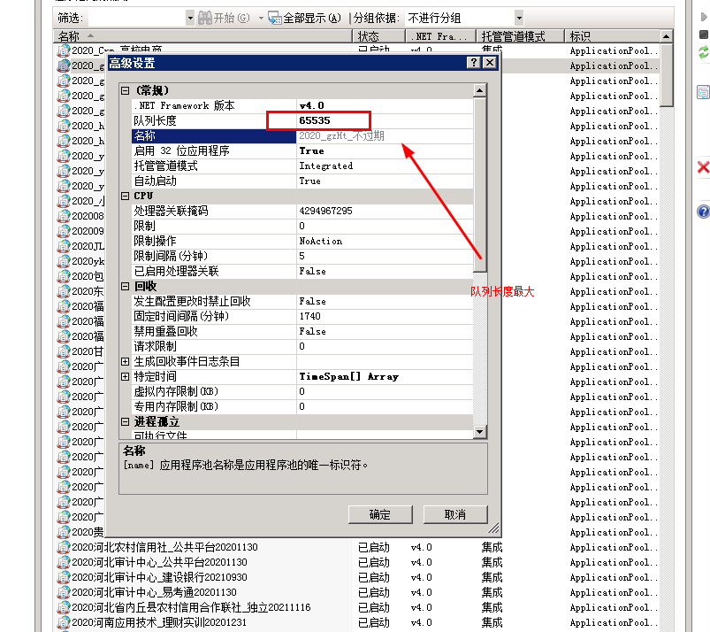
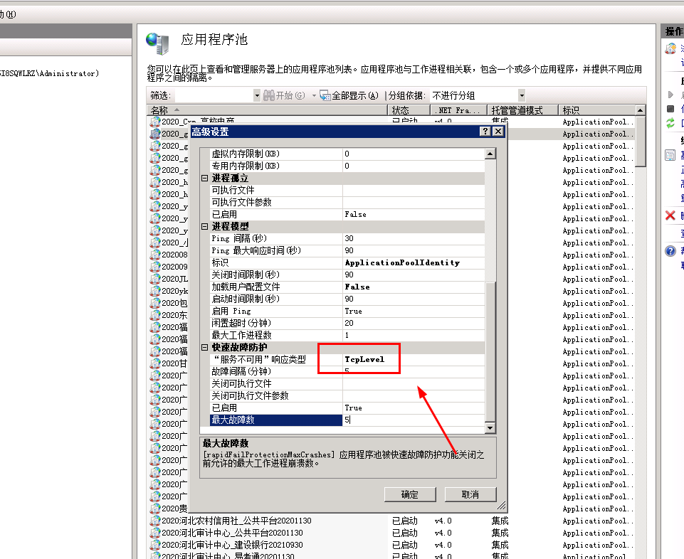
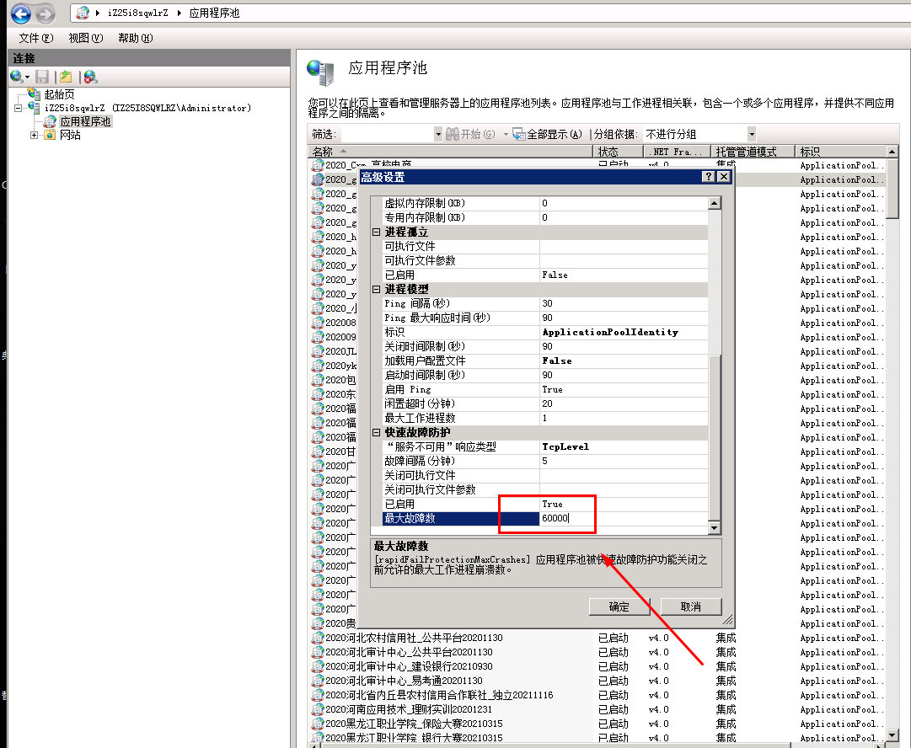
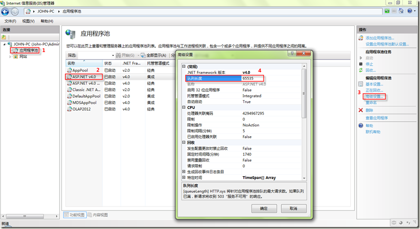
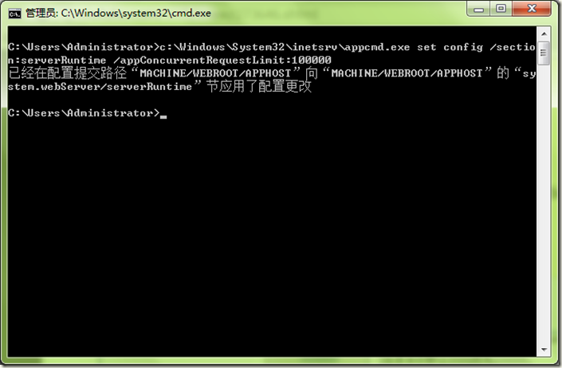
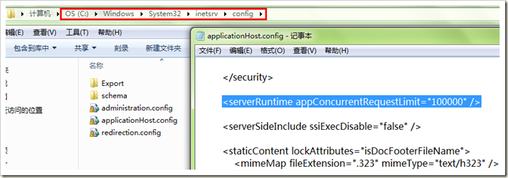
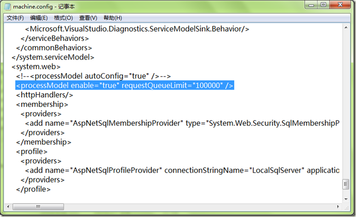
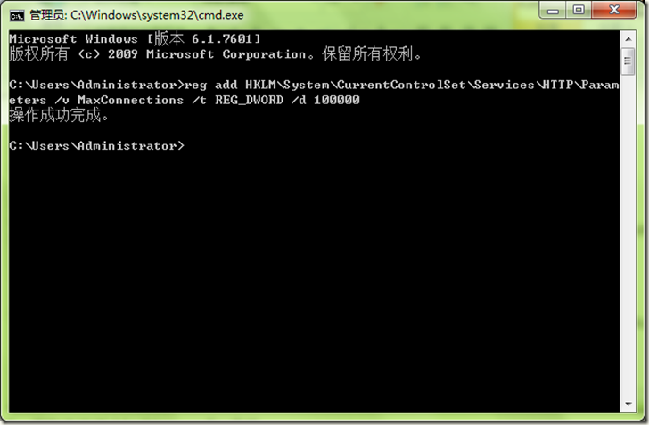
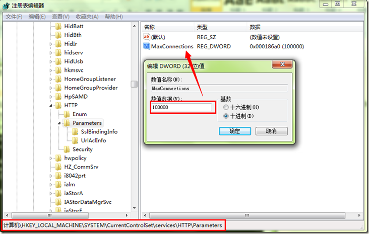

# IIS容错或者应用池自动停止

## **背景：**
IIS7.5是微软推出的最新平台[IIS](https://so.csdn.net/so/search?q=IIS&spm=1001.2101.3001.7020)，性能也较以前有很大的提升，但是默认的设置配不适合很大的请求。但是我们可以根据实际的需要进行IIS调整，使其性能更佳，支持同时10万个请求。

以下方案，通过对IIS7的配置进行优化，调整IIS7应用池的队列长度，请求数限制，TCPIP连接数等方面，从而使WEB服务器的性能得以提升，保证WEB访问的访问流畅。

## **解决方案：**
**步骤一：调整IIS的应用程序池队列长度。**

在【应用程序池】列表中，选择你相应网站所使用的应用程序池，将原来的队列长度由1000改为65535。当然这里的队列长度你可以根据自己的访问用户*1.5来设置，例如：你有2000用户，你此处就可以设置为3000(3000=2000用户数*1.5)，[官方参考](http://technet.microsoft.com/zh-cn/library/dd441171%28v=office.13%29.aspx)

设置如下图：

**步骤二：调整IIS的appConcurrentRequestLimit值**

打开cmd命令，运行命令：c:\Windows\System32\inetsrv\appcmd.exe set config /section:serverRuntime /appConcurrentRequestLimit:100000

**步骤三：修改ASP.NET请求队列限制即调整machine.config中的processModel>RequestQueueLimit**

1、单击“开始”，然后单击“运行”。

2、在“运行”对话框中，键入 notepad %systemroot%\Microsoft.Net\Framework64\v4.0.30319\CONFIG\machine.config，然后单击“确定”。(不同的.NET版本路径不一样，你可以选择你自己当前想设置的.NET版本的config)

3、找到如下所示的 processModel 元素：<processModel autoConfig="true" />

4、将 processModel 元素替换为以下值：<processModel enable="true" requestQueueLimit="15000" />

5、保存并关闭 Machine.config 文件。

**步骤四：修改注册表，调整IIS支持的并发TCPIP连接数**

在cmd命令中运行命令：reg add HKLM\System\CurrentControlSet\Services\HTTP\Parameters /v MaxConnections /t REG_DWORD /d 100000，当然也可以手动去注册表修改

可在注册表中查看

至此，IIS的调整优化就完成了，可以同时支持10W个请求。

> 更新: 2024-06-14 15:37:19  
> 原文: <https://www.yuque.com/lixinsi/hntyk2/gn34tc>