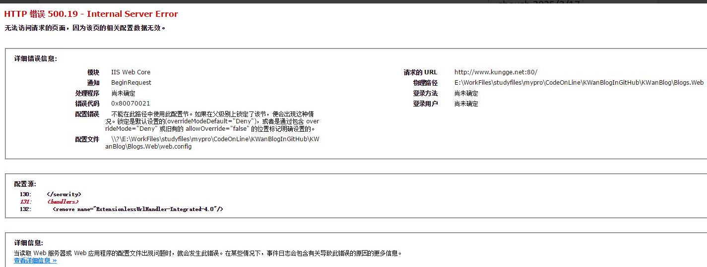
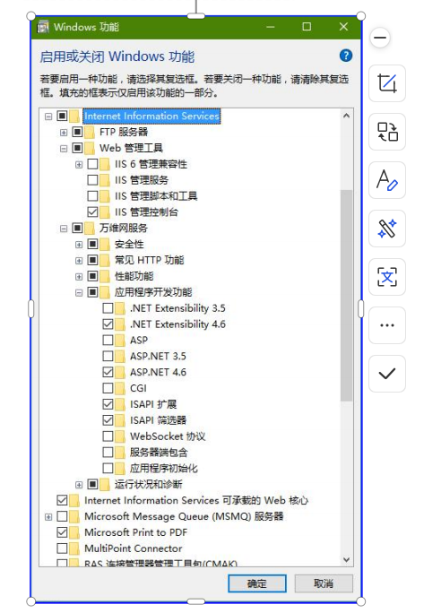
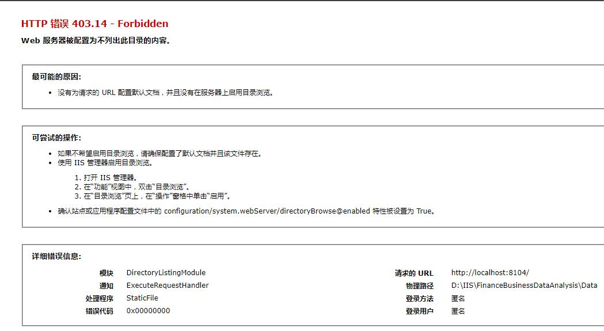
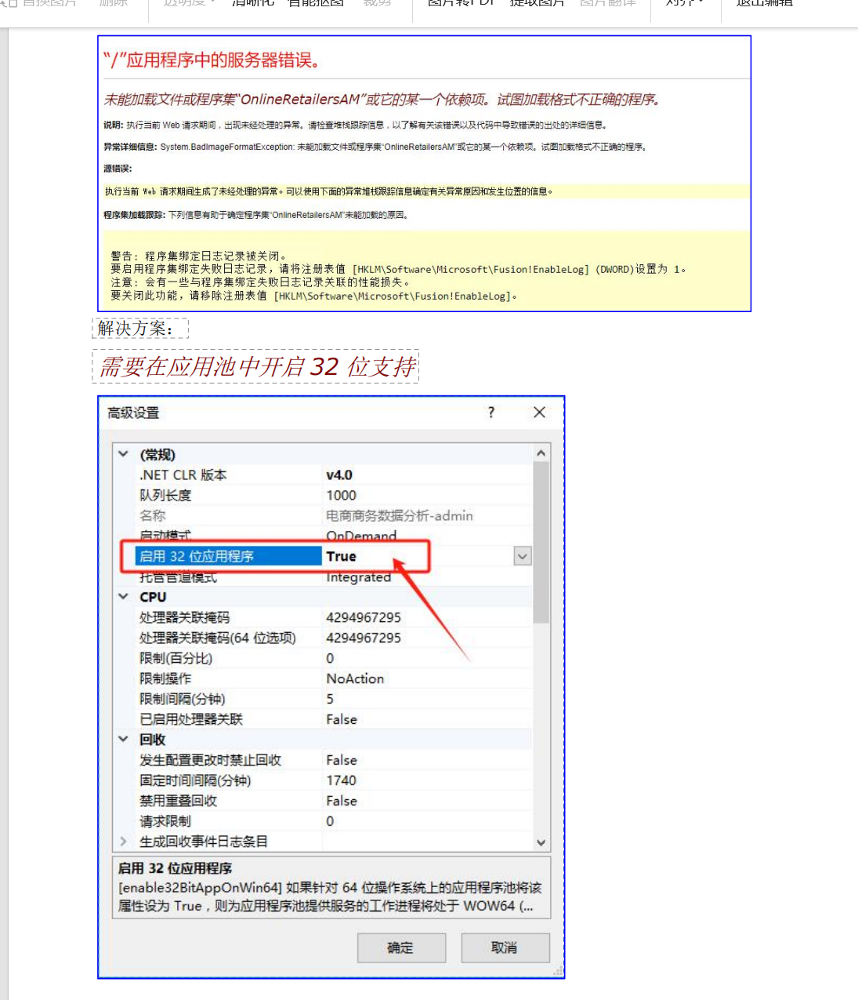
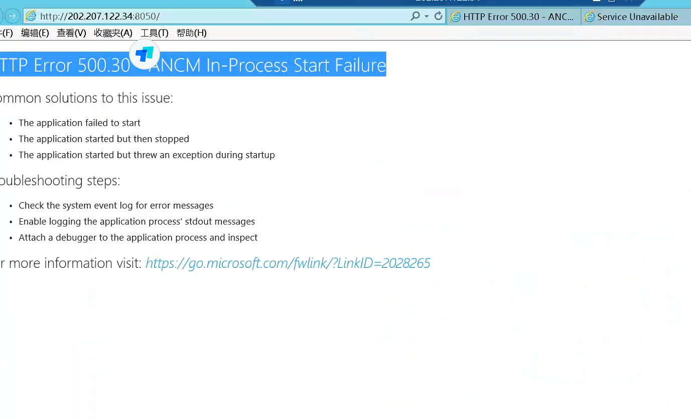
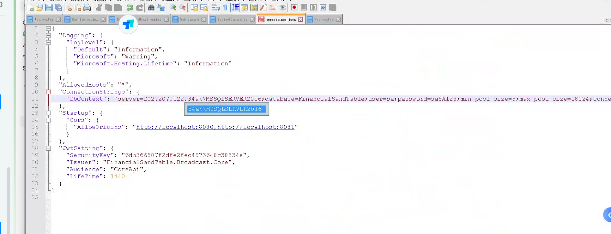
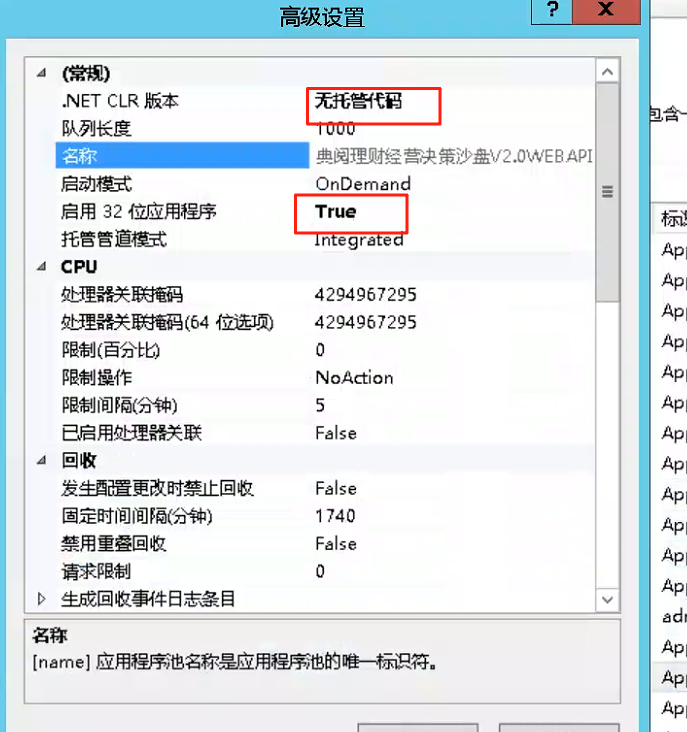
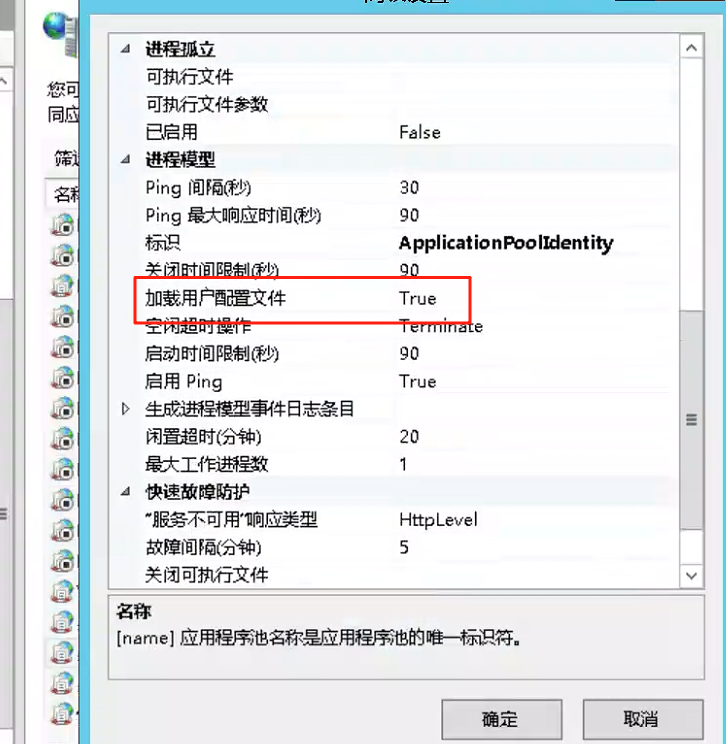

# IIS 部署常见问题及解决方案500.30

# 


# **一、500.19**
## **1.**** ****错误代码：****0x80070021**


** **

情况1：没有安装asp.net




## **2.**** ****错误代码：****0x8007000d**
****

<font style="color:rgb(77,77,77);">如果是</font><font style="color:rgb(77,77,77);">.net framework </font><font style="color:rgb(77,77,77);">项目出现这个问题，大概率是未安装</font><font style="color:rgb(77,77,77);">rewrite </font><font style="color:rgb(77,77,77);">组件</font><font style="color:rgb(77,77,77);">如果是</font><font style="color:rgb(77,77,77);">.net</font><font style="color:rgb(77,77,77);"> </font><font style="color:rgb(77,77,77);">core</font><font style="color:rgb(77,77,77);"> </font><font style="color:rgb(77,77,77);">项目出现这个问题，大概率是未安装响应的</font><font style="color:rgb(77,77,77);">hosting</font><font style="color:rgb(77,77,77);"> </font><font style="color:rgb(77,77,77);">bundle</font>

## **3. 错误代码：0x80070003**
IIS 配置的文件路径是否正确，

IIS 是否有访问文件的权限


# **二、400.13**
## **1.**** ****错误代码：****0x00000000**


缺少默认页面，部分webapi 服务是没有默认页的，添加一个index.html 文件即可比如：商数的dataApi


# **三、****未能加载文件或程序****集**
未能加载文件或程序集“OnlineRetailersAM”或它的某一个依赖项。试图加载格式不正确的程序。

解决方案：

_<font style="color:rgb(128,0,0);">需要在应用池中开启32 位支持</font>_






### 报 500.30 错误




```sql
202.207.122.34\\MSSQLSERVER2016;database=FinancialSandTable;user=sa;password=saSA123;mi
```






> 更新: 2025-06-18 17:16:16  
> 原文: <https://www.yuque.com/lixinsi/hntyk2/ih1k4vc6wace62dt>