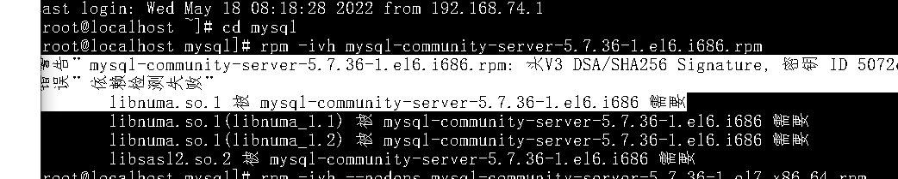
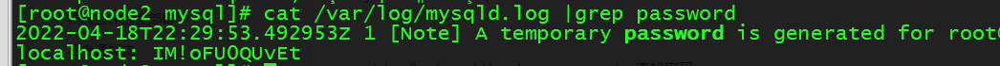
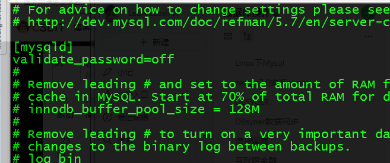
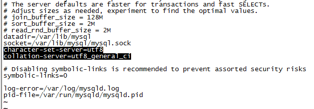
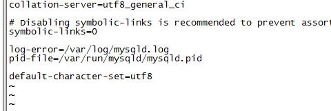
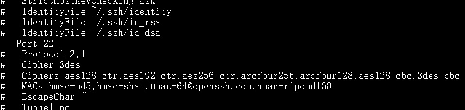
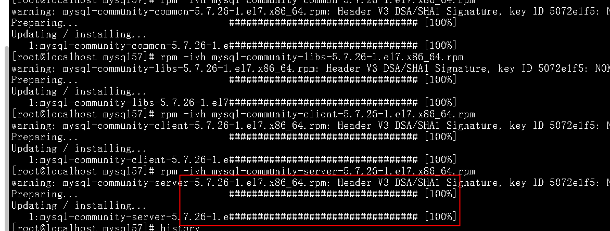

# Linux下Mysql

清华镜像下载MySQL安装包：[https://mirror.tuna.tsinghua.edu.cn/mysql/downloads/MySQL-5.7/](https://mirror.tuna.tsinghua.edu.cn/mysql/downloads/MySQL-5.7/)

rpm -qa | grep mysql --检查是否安装过mysql

rpm -q | grep mariadb

rpm -e --nodes           --+包名 --卸载

yum -y install lrzsz    ---上传文件安装

rz上传

sz下载

mkdir mysql   ---创建mysql解压目录

tar xvf mysql-5.7.35-1.el7.x86_64.rpm-bundle.tar -C ./mysql --将文件解压到指定目录

rpm -ivh --nodeps mysql-community-server-5.7.36-1.el6.i686.rpm 

强制卸载依赖

rpm -e --nodeps mariadb-libs-1:5.5.68-1.el7.x86_64

安装顺序

rpm -ivh mysql-community-common-5.7.35-1.el7.x86_64.rpm

rpm -ivh mysql-community-libs-5.7.35-1.el7.x86_64.rpm

rpm -ivh mysql-community-client-5.7.35-1.el7.x86_64.rpm

安装mysql出现少依赖问题

yum install -y perl-Module-Install.noarch；

rpm -ivh mysql-community-server-5.7.35-1.el7.x86_64.rpm

启动mysql

systemctl start mysqld

pi&YjZig.5sO

cat /var/log/mysqld.log  | grep password --查找密码，并且需要记录密码。

mysql -uroot -p --登入

修改密码

vim /etc/my.cnf

validate_password=off

systemctl restart mysqld     ---重启mysql

alter user 'root'@'localhost' identified by 'sa123'; --修改密码

配置远程连接

vi /etc/my.cnf ---修改配置文件

character-set-server=utf8

collation-server=utf8_general_ci

default-character-set=utf8

mysql -u root -p --登入mysql

set password=password('sa123');

MySQL 8.0已经不支持下面这种命令写法

 grant all privileges on *.* to root@"%" identified by ".";

 正确的写法是 

grant all privileges on *.* to ‘root‘@‘%‘  

一、开放3306端口

1.开启端口3306

firewall-cmd --zone=public --add-port=3306/tcp --permanent

2.重启防火墙

firewall-cmd --reload

3.查看已经开放的端口

firewall-cmd --list-ports

service network restart 

安装nginx

rz+上传nignx

tar -xvf  nginx-1.16.1.tar.gz  解压

cd nginx-1.16.1

./configure \

--prefix=/usr/local/nginx \

--pid-path=/usr/local/nginx/run \

--user=nginx \

--group=nginx \

--with-http_ssl_module \

--with-http_flv_module \

--with-http_stub_status_module \

--with-http_gzip_static_module \

--with-pcre \

--with-http_image_filter_module \

--with-debug \

./configure

make 

安装tomat

rz 上传二进制包

rpm -ivh jdk-8u333-linux-i586.rpm

tar -xvf  apache-tomcat-10.0.21.tar.gz

cd apache-tomcat-10.0.21

cd bin

sh startup.sh

 查看进程  ps aux|grep mysql

杀掉进程     kill -9 10009

时间同步

[root@monitor ~]# timedatectl set-timezone America/New_York 

[root@monitor ~]# 

查看时间

who -b

查看error级别日志

tail -n 6000 xxx.log|grep "ERROR"

**安装MySQL**

开启sshd服务

nano /etc/ssh/ssh_config 

把port 22前面的#删除，然后Ctrl+x保存

service sshd start 开启sshd服务

//检查并且卸载

rpm -qa | grep subscription-manager

rpm -e subscription-manager-1.17.15-1.el7.x86_64

清除缓存： yum clean all

上传安装文件

mkdir app

app 目录下面分别有mysql文件夹，nignx文件夹，tomat文件夹

进入mysql文件夹解压mysql

rpm -qa |grep mariadb

rpm -e --nodeps mariadb-libs-5.5.52-1.el7.x86_64

rpm -ivh mysql-community-common-5.7.26-1.el7.x86_64.rpm 

rpm -ivh mysql-community-libs-5.7.26-1.el7.x86_64.rpm 

rpm -ivh mysql-community-client-5.7.26-1.el7.x86_64.rpm 

rpm -ivh mysql-community-server-5.7.26-1.el7.x86_64.rpm 

此时mysql已经安装完成

启动mysql

systemctl start mysqld

cat /var/log/mysqld.log | grep password --查找密码，并且需要记录密码。

mysql -uroot -p --登入

修改密码

vim /etc/my.cnf

validate_password=off

systemctl restart mysqld ---重启mysql

alter user 'root'@'localhost' identified by 'sa123'; --修改密码

配置远程连接

vi /etc/my.cnf ---修改配置文件

character-set-server=utf8

collation-server=utf8_general_ci

default-character-set=utf8

mysql -u root -p --登入mysql

set password=password('sa123');

MySQL 8.0已经不支持下面这种命令写法

grant all privileges on *.* to root@"%" identified by ".";

正确的写法是

grant all privileges on *.* to ‘root‘@‘%‘ 

登入mysql后

创建数据库

create database +数据库名字；

使用mysql -uroot -p+数据库密码 -e "source +sql文件当前路径"

一、开放3306端口

1.开启端口3306

firewall-cmd --zone=public --add-port=3306/tcp --permanent

2.重启防火墙

firewall-cmd --reload

3.查看已经开放的端口

firewall-cmd --list-ports

service network restart

**安装nginx**

cd nginx/

tar -zxvf nginx-1.16.1.tar.gz 

cd nginx-1.16.1/

./configure 

1.开启端口80

firewall-cmd --zone=public --add-port=80/tcp --permanent

2.重启防火墙

firewall-cmd --reload

3.查看已经开放的端口

firewall-cmd --list-ports

service network restart

查看[nginx](https://so.csdn.net/so/search?q=nginx&amp;spm=1001.2101.3001.7020)运行状态

| $ ps -ef | [grep](https://so.csdn.net/so/search?q=grep&amp;spm=1001.2101.3001.7020) nginx |
| :--- |

1、安装pcre

解压：tar -zxvf pcre2-10.35.tar.gz  
进入解压目录  
配置： ./configure  
编译： make  
安装：make install

2、安装OpenSSL

解压：tar -zxvf openssl-1.1.1g.tar.gz  
进入解压目录：cd openssl-1.1.1g  
配置： ./config  
编译： make  
安装：make install

如果输入openssl version

在root用户下执行：

ln -s /usr/local/lib64/libssl.so.1.1 /usr/lib64/libssl.so.1.1

ln -s /usr/local/lib64/libcrypto.so.1.1 /usr/lib64/libcrypto.so.1.1

3、安装zlib

解压：tar -zxvf zlib-1.2.11.tar.gz  
进入解压目录：cd zlib-1.2.11  
配置： ./configure  
编译： make  
安装：make install

4、安装nginx-1.16.1.tar.gz

解压：tar -zxvf nginx-1.16.1.tar.gz  
进入解压目录：cd nginx-1.16.1  
配置： ./configure（如果不行可以忽略依赖 ./configure --without-http_rewrite_module）  
编译： make  
安装：make install

**安装tomcat**

rpm -ivh jdk-8u333-linux-i586.rpm 

tar -zxvf apache-tomcat-10.0.21.tar.gz 

cd apache-tomcat-10.0.21

cd bin

sh startup.sh

> 更新: 2022-06-20 17:50:08  
> 原文: <https://www.yuque.com/lixinsi/hntyk2/au11uo>