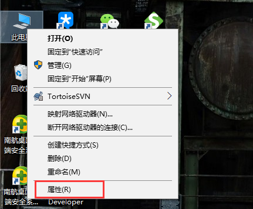
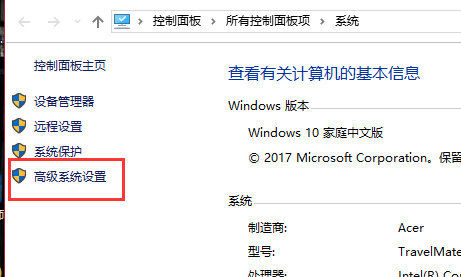
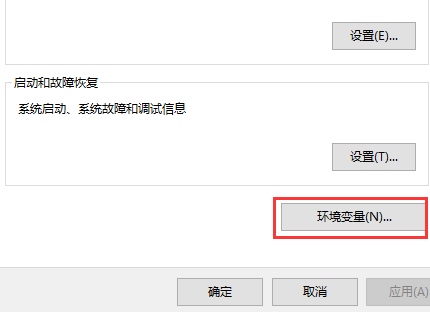
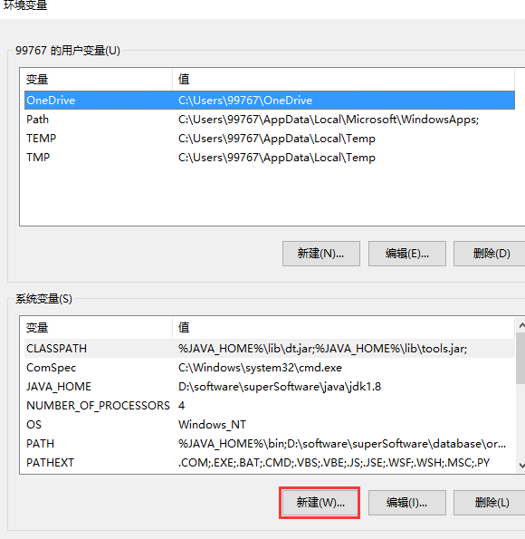
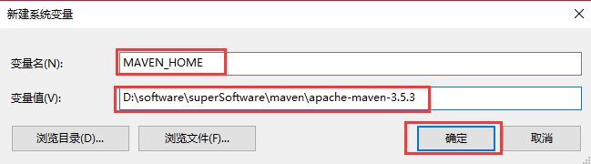
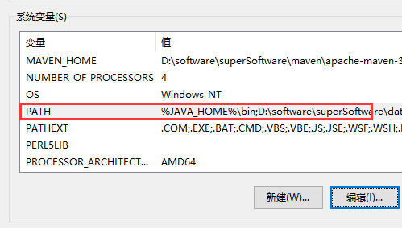
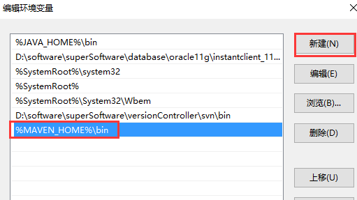
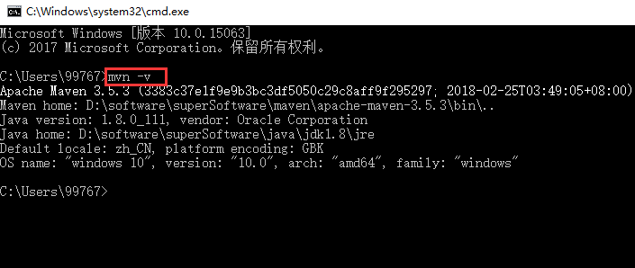
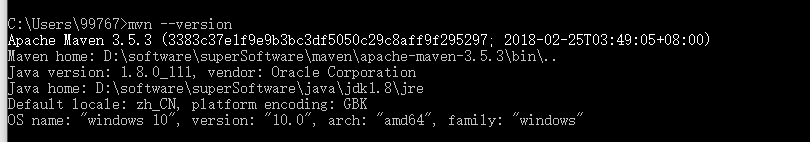

# Maven环境变量配置

**环境配置**

1、右击此电脑，然后点击属性

  

2、点击高级设置

  

3、点击环境变量

  

4、点击新建

  

5、变量名为MAVEN_HOME,变量值为maven的存放路径D:\software\superSoftware\maven\apache-maven-3.5.3，点击确定。  

  

6、选中PATH，点击编辑；

7、点击新建，添加%MAVEN_HOME%\bin；

**校验环境变量配置是否成功**

1、在控制台中输入mvn -v

2、或者输入mvn --version

> 更新: 2023-12-27 16:36:02  
> 原文: <https://www.yuque.com/lixinsi/hntyk2/tmba3g5pfy7ekvhf>