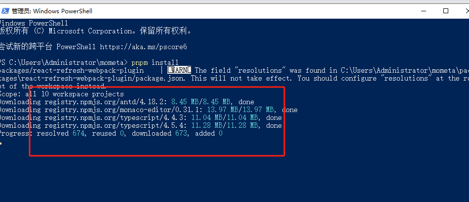

# Mometa本地部署

[附件: node-v20.11.0-x64.7z](./attachments/9C6br8EkZgANiR8C/node-v20.11.0-x64.7z)[附件: mometa.7z](./attachments/9C6br8EkZgANiR8C/mometa.7z)、

### 1.安装nodejs版本16.14以上
<font style="color:rgb(31, 35, 40);">由于 mometa 依赖本地开发环境，只使用在本地开发环境，所以没有搭建在线 demo；在本地开发的时候可以进行使用</font>

### 2.powershell执行命令
```bash
git clone https://github.com/imcuttle/mometa.git
cd mometa
pnpm install
pnpm run start:app:cr # 开启本地开发预览模式
```

如图所示



### 3.如何使用
#### <font style="color:rgb(31, 35, 40);">安装依赖</font>
```bash
npm i @mometa/editor -D
```

1. <font style="color:rgb(31, 35, 40);">在项目根目录中创建 </font><font style="color:rgb(31, 35, 40);">mometa-material.config.js</font>

```bash
module.exports = [require('@mometa-mat/antd').default]
```

<font style="color:rgb(31, 35, 40);">你也可以创建自己的物料库，数据结构规则见 </font>[Material 定义](https://github.com/imcuttle/mometa/blob/master/packages/materials-generator/src/types.ts)

#### <font style="color:rgb(31, 35, 40);">接入编辑器</font>
<font style="color:rgb(31, 35, 40);">webpack.config.js</font><font style="color:rgb(31, 35, 40);"> 修改如下：</font>

```bash
const MometaEditorPlugin = require('@mometa/editor/webpack')

module.exports = {
  module: {
    rules: [
      {
        test: /\.(js|mjs|jsx|ts|tsx)$/,
        // 注意，只需要处理你需要编辑的文件目录
        include: paths.appSrc,
        loader: require.resolve('babel-loader'),
        options: {
          plugins: [isEnvDevelopment && require.resolve('@mometa/editor/babel/plugin-react')]
        }
      }
    ]
  },
  plugins: [
    isEnvDevelopment &&
      new MometaEditorPlugin({
        react: true,
        // 开启物料预览
        experimentalMaterialsClientRender: true
      })
  ]
}
```

+ [@mometa/editor](https://github.com/imcuttle/mometa/blob/master/packages/editor)<font style="color:rgb(31, 35, 40);"> </font><font style="color:rgb(31, 35, 40);">- 编辑器</font>
+ [@mometa/fs-handler](https://github.com/imcuttle/mometa/blob/master/packages/fs-handler)<font style="color:rgb(31, 35, 40);"> </font><font style="color:rgb(31, 35, 40);">- 代码操作转换核心逻辑，如删除、移动、替换、插入等</font>
+ [@mometa/materials-generator](https://github.com/imcuttle/mometa/blob/master/packages/materials-generator)<font style="color:rgb(31, 35, 40);"> </font><font style="color:rgb(31, 35, 40);">- 物料生成 & 解析</font>
+ [@mometa/materials-resolver](https://github.com/imcuttle/mometa/blob/master/packages/materials-resolver)<font style="color:rgb(31, 35, 40);"> </font><font style="color:rgb(31, 35, 40);">- Resolve materials config</font>
+ [@mometa/react-refresh-webpack-plugin](https://github.com/imcuttle/mometa/blob/master/packages/react-refresh-webpack-plugin)<font style="color:rgb(31, 35, 40);"> - An </font>**<font style="color:rgb(31, 35, 40);">EXPERIMENTAL</font>**<font style="color:rgb(31, 35, 40);"> Webpack plugin to enable "Fast Refresh" (also previously known as </font>_<font style="color:rgb(31, 35, 40);">Hot Reloading</font>_<font style="color:rgb(31, 35, 40);">) for React components.</font>


> 更新: 2024-01-16 10:05:45  
> 原文: <https://www.yuque.com/lixinsi/hntyk2/ciu02kng3eubhagv>