# SQL数据库

清除p2p脚本

select * from P2P_010101

delete P2P_010101 where AddTime < '2020-12-02 10:54:56.000'

select * from P2P_AttendInfo

delete P2P_AttendInfo where AddTime < '2020-12-02 10:54:56.000'

select * from P2P_AttendSetting

select * from P2P_ClassAssign

select * from P2P_ClassInfo

select* from  P2P_LCLearningMaterials  where Operator!=2

delete  P2P_LCLearningMaterials  where Operator!=2 and  AddTime < '2020-12-02 10:54:56.000'

select * from P2P_LCOrder

delete P2P_LCOrder where O_AddTime < '2020-12-02 10:54:56.000'

select * from P2P_LCOrder_QiXian

select * from P2P_LCPaper where P_Operator!=2

select * from P2P_LCPaperResult

select * from  

delete P2P_LCPaperTopic   where PT_Operator!=2 and PT_AddTime< '2020-12-02 10:54:56.000'

select * from P2P_LCSingleResult

delete P2P_LCSingleResult where AddTime < '2020-12-02 10:54:56.000'

select * from P2P_LCTaskCase

delete from  P2P_LCTaskCaseDetails  where Operator!=2 and AddTime < '2020-12-02 10:54:56.000'

select * from P2P_LCTaskOpen

delete from   P2P_LCTopic  where Operator!=2 and AddTime < '2020-12-02 10:54:56.000'

select * from P2P_LCTopicResult

delete    from  P2P_LearningMaterials where Operator!=2 and AddTime < '2020-12-02 10:54:56.000'

select * from P2P_SH010101

delete from   P2P_SHDebitCredit  where Operator!=2 and AddTime < '2020-12-02 10:54:56.000'

select * from P2P_SHSingleResult

delete from  P2P_SHTaskCaseDetails where Operator!=2 and AddTime < '2020-12-02 10:54:56.000'

delete from P2P_SingleResult where  AddTime < '2020-12-02 10:54:56.000'

select * from P2P_SystemInfo

delete P2P_SystemInfo where  AddTime < '2020-12-02 10:54:56.000'

delete from  P2P_TaskCase where Operator!=2 and AddTime < '2020-12-02 10:54:56.000'

delete from P2P_TaskCaseDetails where Operator!=2  and AddTime < '2020-12-02 10:54:56.000'

select * from P2P_TaskOpen

delete P2P_TaskOpen  where  AddTime < '2020-12-02 10:54:56.000'

delete from  P2P_TaskTopicRelevance where Operator!=2  and AddTime < '2020-12-02 10:54:56.000'

delete from   P2P_Topic where Operator!=2 and AddTime < '2020-12-02 10:54:56.000'

select * from P2P_TopicResult

delete P2P_TopicResult  where  AddTime < '2020-12-02 10:54:56.000'

delete  P2P_UserInfo  where UIID not in (1,2) and   UI_UserAddTime < '2020-12-02 10:54:56.000'

delete  P2P_Users   where UID not in (1,2)  and   U_UserAddTime < '2020-12-02 10:54:56.000'

用SQL的企业管理器（SQL Server Management Studio）还原数据库后，数据库显示受限制用户，解决办法如下：

依次点击“数据库”——“属性”——“选项”，右侧列表中找到状态——限制访问：将状态改为Multiple即可

select * from userinfo;

select * from dal_Character;

select * from dal_Counting;

select * from dal_MachineBill;

select * from dal_SummonCount;

select * from dal_ComplexTimer;

update dal_SummonCount  set BeginTime='2022-03-29';

update dal_Character  set BeginTime='2022-03-29';

update dal_Counting  set BeginTime='2022-03-29';

update dal_MachineBill  set StartTime='2022-03-29';

select * from dal_ComplexTimer;

update dal_ComplexTimer  set BeginTime='2022-03-29';

update dal_ComplexTimer  set StructureNames='抚宁联社';

update tb_User set Password='xcxz123.com' where U_ID='1';

  delete FROM [3DYH_dl_202203301].[dbo].[tb_Student] where type=‘3’

 delete FROM [3DYH_dl_20210311].[dbo].[tb_Teacher] where AddUserId='1'

delete FROM [3DYH_dl_20210311].[dbo].[tb_School] where AddUserId='1'

 delete  FROM [3DYH_dl_20210311].[dbo].[tb_Class] where AddUserId='1'

  delete FROM [3DYH_dl_20210311].[dbo].[tb_Major]

3D银行

清除学生信息

truncate table tb_amazon_score;

数据库跟踪

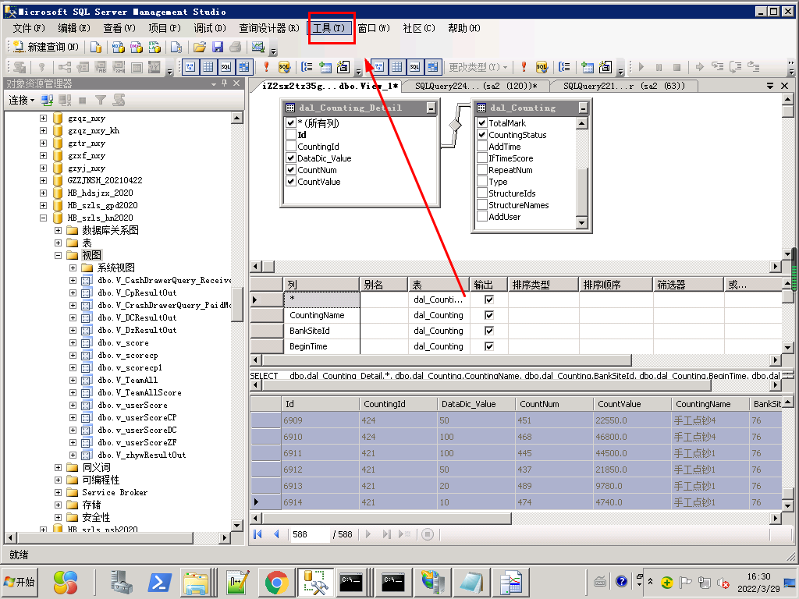

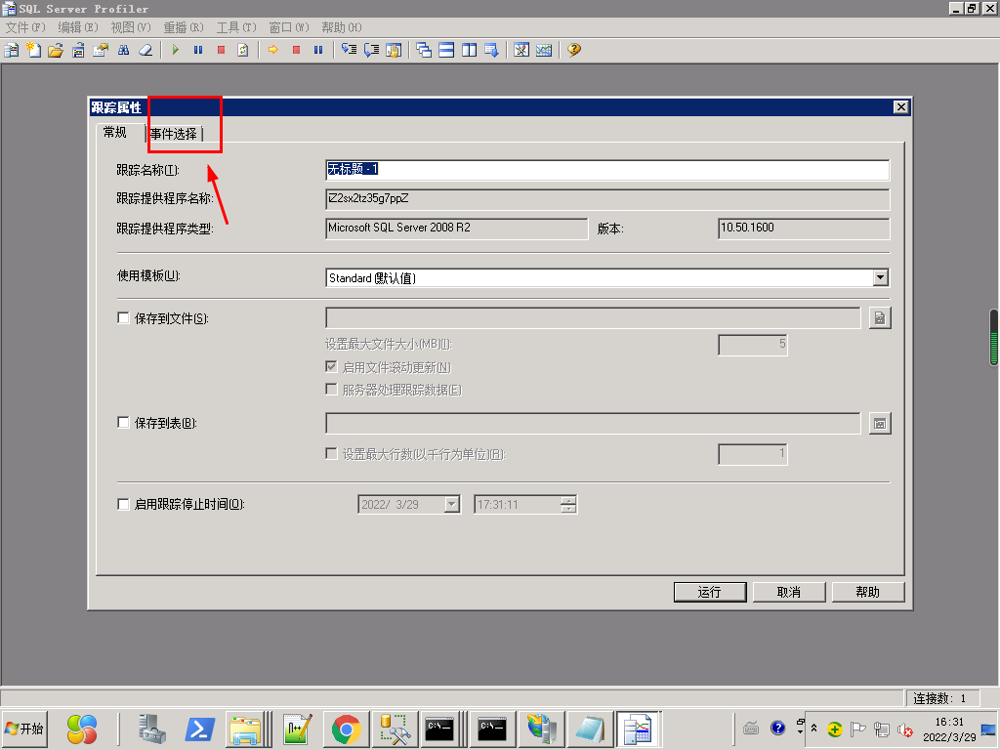

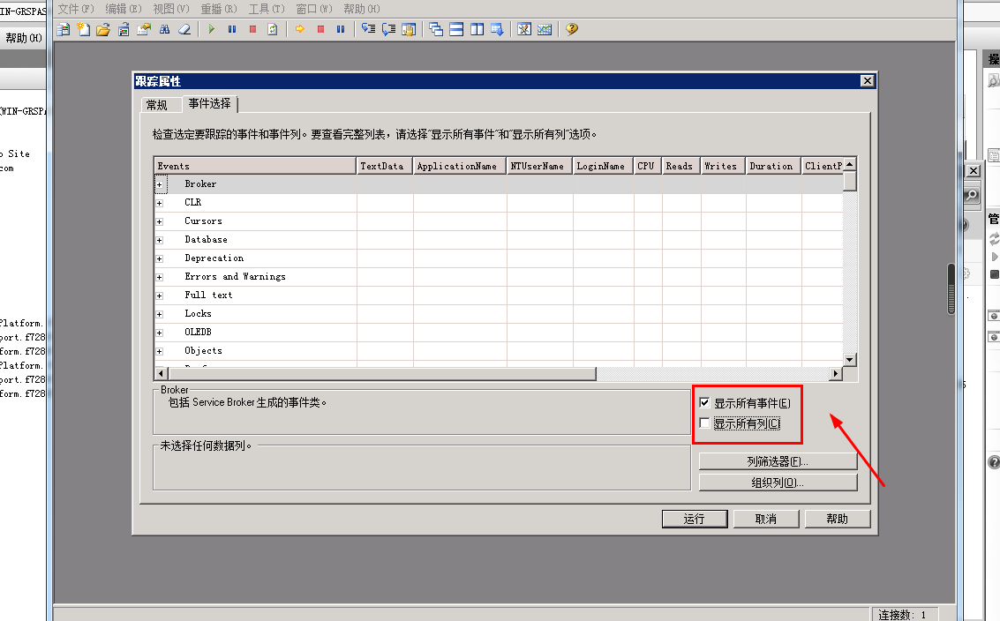

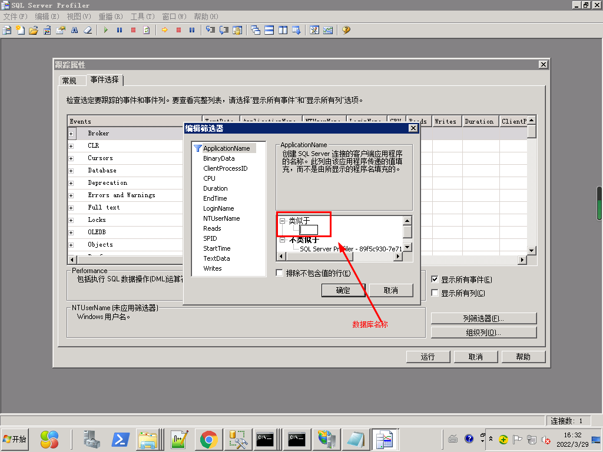

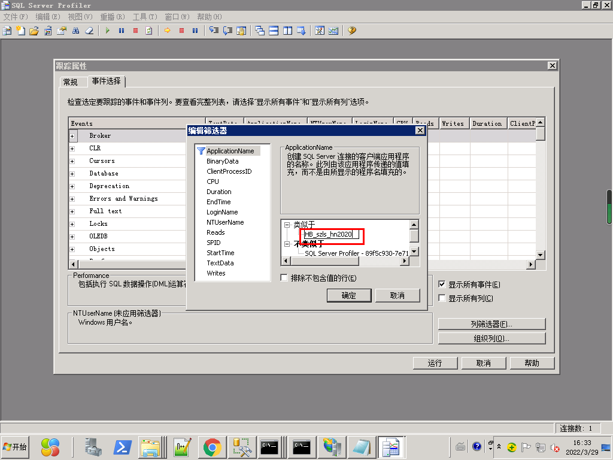

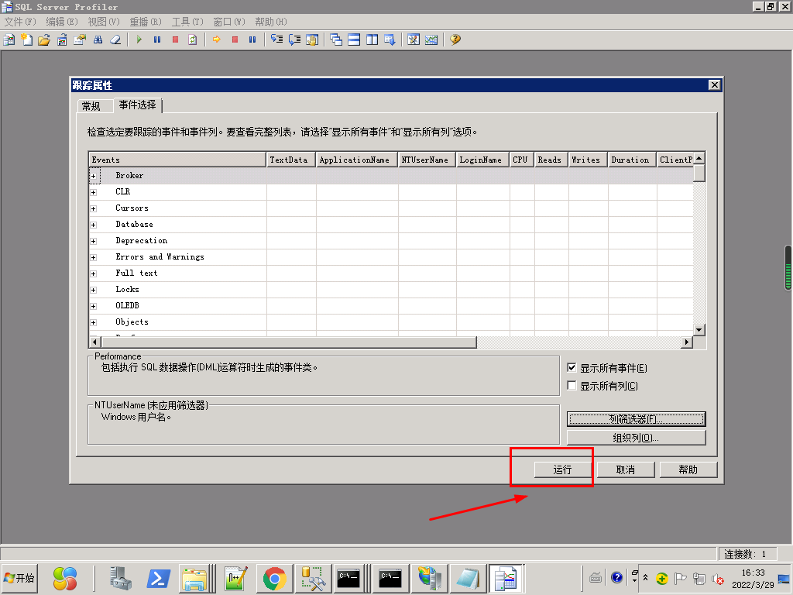

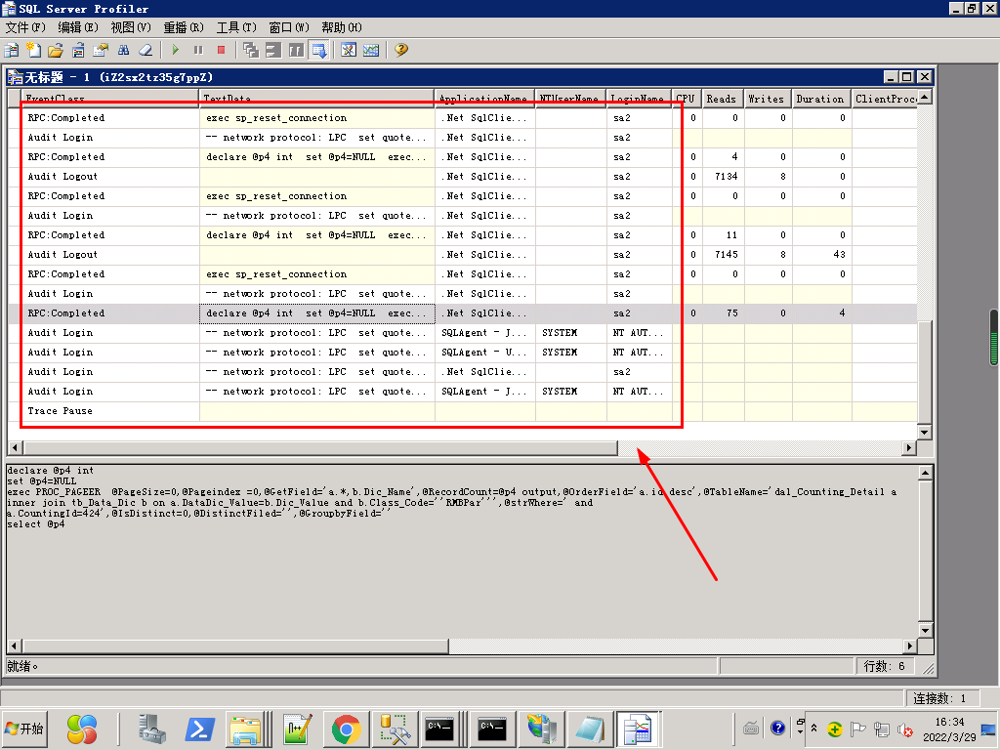

数据库视图查询

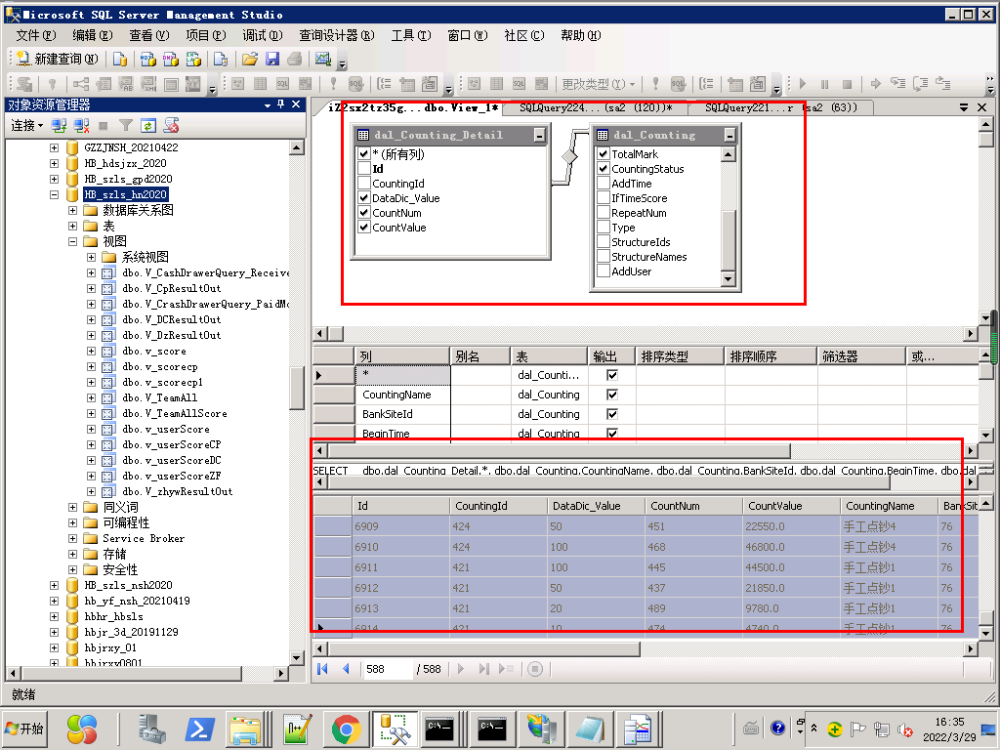

更换首页界面

D:\2020-农信银独立平台\河北抚宁联社\soft-0821-锦州分行程序\Content\images

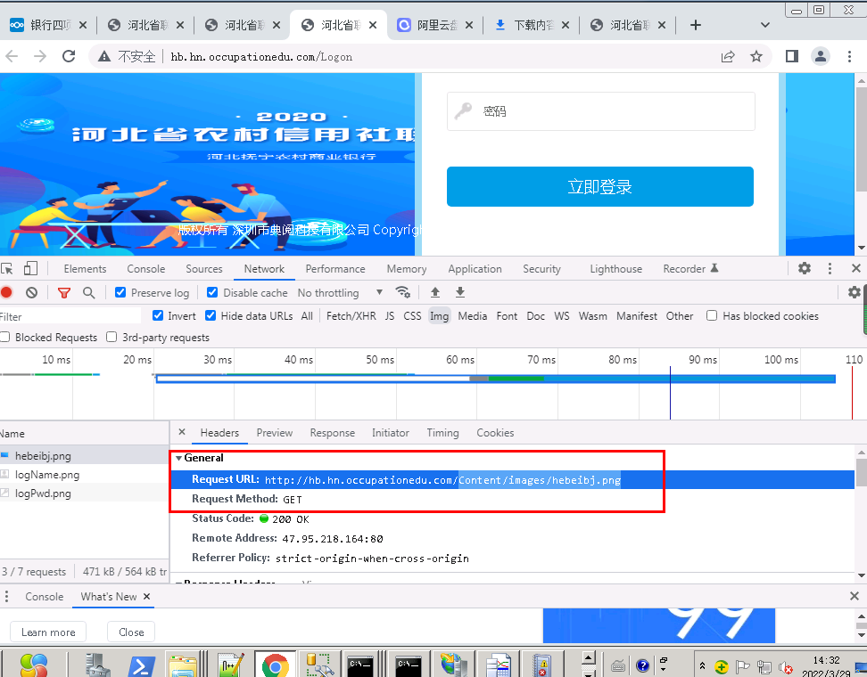

导出网站配置

  对于喜欢做站群的朋友来讲，批量处理是一个不可或缺的技巧，它能大大提升我们的工作效率，让我们把更多的时间转换到有技术含量的地方去，从而产生更高的价值，Window 2008 iis7.5服务器与2003系统不一样，Window2003 VPS服务器批量导出网站列表比较简单，而2008系统相对要复杂一点（当然，也可能是我没找到简单的方法）。那么Window 2008 iis7.5服务器要如何导出网站列表呢？

Window 2008 iis7.5服务器批量导出网站列表

1.运行cmd > 输入：%windir%\system32\inetsrv\appcmd list site /config /xml > c:\sites.xml

2.然后回车

其中：xml是指文件格式，而 c:\sites.xml是指将列表文件直接导出到C盘，并将文件命名为sites.xml，这个是可以自定义的。

[  
  
  
  
  
  
  
](https://blog.csdn.net/enweitech/article/details/77677156)

# [win7 远程连接服务器出现身份验证错误，又找不到加密Oracle修正](https://www.cnblogs.com/leeyongbard/p/9408277.html)
今天想用远程桌面连接登录服务器，结果，弹出一个错误的提示框：发生身份验证错误，要求的函数不受支持。

然后在网上找了相关的教程，基本上所有的方法都是如下所示：

策略路径："计算机配置"->"管理模板"->"系统"->"凭据分配"  设置名称"加密Oracle修正"为已启用和易受攻击，并确定就可以了。

按照教程，苦逼的事情来了，我的电脑上直接找不到"加密Oracle修正"这一项，真是欲哭无泪了，幸好互联网是强大的，找到了

这样一篇文章，亲测可用：

0：打开注册表，快捷输入"regedit"

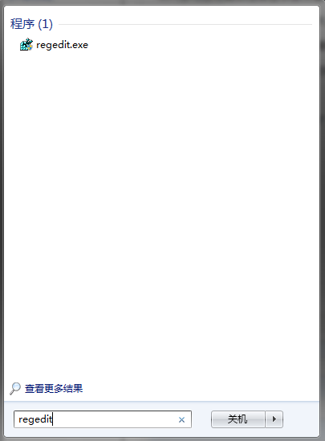

1：找到文件夹路径

[HKEY_LOCAL_MACHINE]\Software\Microsoft\Windows\CurrentVersion\Policies\System\CredSSP\Parameters

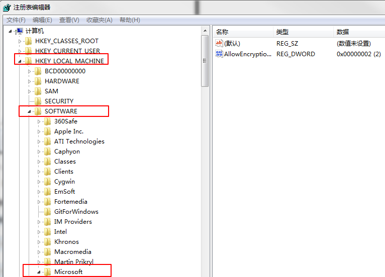

一般情况下，到了System之后就没了，缺少的可以自己创建文件夹。

2：然后在最底部文件夹里面新建 DWORD（32）位的。文件名 "AllowEncryptionOracle"，值：2

3：最后点击保存就可以远程登陆桌面（如果有必要的话，需要重启一下）

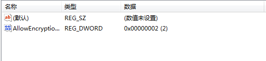

如果你关注过nginx，必定知道nginx这个软件有什么用的，如果你的网站访问量越来越高，一台服务器已经没有办法承受流量压力，那就增多几台服务器来做负载吧。做网站负载可以买硬件设备来实现，比如F5,不过价格就几十万到上百万，够贵，本文介绍做网站负载的软件是免费的，nginx目前好多门户网站与大访问量的网站都在使用做为HTTP服务器，所以nginx是非常优秀的，下面介绍做负载测试吧。  
环境：  
(2台服务器)  
第一台：  
CPU:Inter(R) Pentium(R) 4 CPU 2.8G  
内存：1G  
系统：windows 7  
IIS: IIS 7  
nginx：nginx/Windows-0.8.22  
IP：172.10.1.97  
环境：本地  
第二台：  
CPU:Inter(R) Pentium(R) 4 CPU 3.0G  
内存：2G  
系统：windows Server 2003  
IIS: IIS 6  
IP：172.10.1.236  
环境：远程

说明：  
本次测试,软件nginx放在本地(172.10.1.97)，也就是说放在域名绑定的那台服务器，这台服务器的IIS不能使用 80端口，因为等下nginx软件要使用80这个端口。  
下载nginx的地址如下：  
nginx下载：[http://nginx.net/](http://nginx.net/)  
本次测试使用的版本下载：[nginx/Windows-0.8.22](http://sysoev.ru/nginx/nginx-0.8.22.zip)

下载解压到C:，把目录名改成nginx

好，下面进入实践：

第一：

在本地(172.10.1.97)这台服务器IIS创建一个网站，使用端口为808，如下图：

IIS 网站绑定设置图

第二：

在远程172.10.1.236的IIS创建一个网站，使用端口为80，如下图：

远程IIS绑定设置图

第三：

好了，以上已经设置好两台服务器的IIS了，下面配置nginx软件来实现网站负载均衡,打开如下文件：

C:\nginx\conf\nginx.conf

1、找到内容server {

在这上面加入如下内容：

upstream  xueit.com {   
server   172.10.1.97:808;  
server   172.10.1.236:80;  
}

(这是负载切换使用的服务器网站IP)

2、找到location / {  
root   html;  
index  index.html index.htm;  
}

把内容更改如下：

location / {  
proxy_pass [http://xueit.com](http://xueit.com/);  
proxy_redirect default;  
}

3、找到server {  
listen       80;  
server_name  localhost;

把内容改成如下：

server {  
listen       80;  
server_name  172.10.1.97;

(这是监听访问域名绑定那台服务器80端口的请求)

好，在这里就这么简单配置好了，下面看下以上3步配置的图：

负载配置图

第四：

都配置好了，下面启动nginx这软件

进入命令提示符CMD，进入c:\nginx>，输入nginx命令，如下图：

启动nginx

这时候，系统进程有两个nginx.exe进程，如下图:

系统nginx进程

停止nginx运行输入nginx -s stop 即可

第五：

经过以上的配置，现在我们看下负载效果：

在本地(172.10.1.97)这服务器打开IE，输入：[http://172.10.1.97](http://172.10.1.97/)

第一次打开网站的结果图：

第一次运行网站图

再刷新一下网页，出现的结果图：

再次访问网站图

很好，网站已经负载成功。

经过这次测试，实现网站负载再也不是难事了。也不用购买非常贵的硬件设备了。网上介绍说nginx软件可以处理并发上万，所以绝对是个非常不错的选择。

如果网站访问量非常大，可以专门用一台服务器跑nginx，其它服务器跑网站程序(几台服务器的程序都是一样的)，这样负载就没有太大问题，如果再不行，把网站一些栏目做一个2级域名，2级域名同样做负载，这样更厉害了吧。

> 更新: 2022-11-15 11:46:58  
> 原文: <https://www.yuque.com/lixinsi/hntyk2/ygrtfd>