# Ubantu系统操作汇总

# 安装谷歌浏览器
## <font style="color:rgb(102, 102, 102);">Ubuntu怎么安装Chrome浏览器？</font>
<font style="color:rgba(58, 58, 58, 0.88);">1、首先，进入谷歌浏览器下载页面：</font>[https://www.google.cn/intl/zh-CN/chrome/](https://www.google.cn/intl/zh-CN/chrome/)<font style="color:rgba(58, 58, 58, 0.88);">，点开此链接后往下拉，拉到最底部，点击进入【其他平台】；</font>


<font style="color:rgba(58, 58, 58, 0.88);">2、接着点击【Linux】选项；</font>


<font style="color:rgba(58, 58, 58, 0.88);">3、接下来选择【64位.deb文件】，deb文件适合debian/ubuntu发行版。</font>


<font style="color:rgba(58, 58, 58, 0.88);">4、通过以下方式进行安装Chrome；</font>

```shell
#apt安装
sudo apt install ./google-chrome-stable_current_amd64.deb

#dpkg安装
sudo dpkg -i ./google-chrome-stable_current_amd64.deb
```


# <font style="color:rgb(28, 28, 40);">Ubuntu中文设置与安装中文输入法（超详细）</font>
## <font style="color:rgb(79, 79, 79);">一、中文设置</font>
**点击界面右上角的倒三角符号，选择“Settings”**  
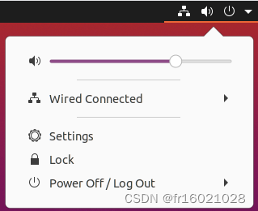  
**搜索“lagnguage”**  
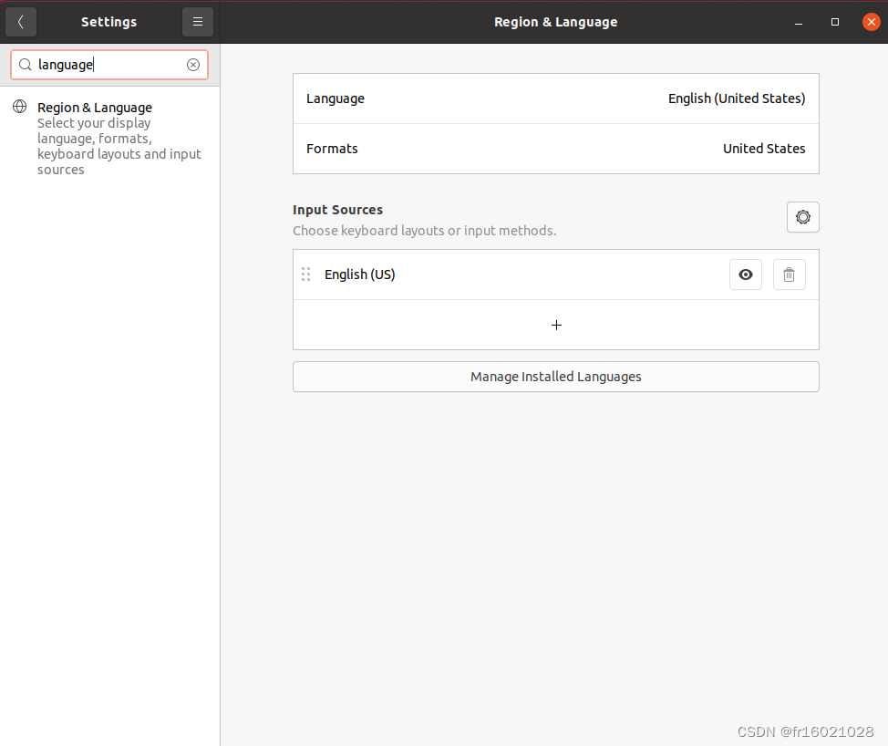  
**点击“Manage Installed Languages”，选择“install”**  
  
**耐心等待**  
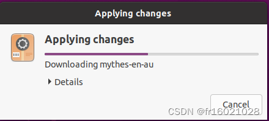  
**下载完成后，选择“Install/Remove Languages”**  
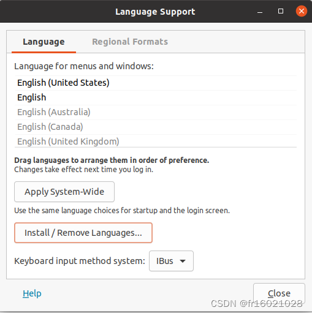  
**勾选“Chinese（simplified）”并应用**  
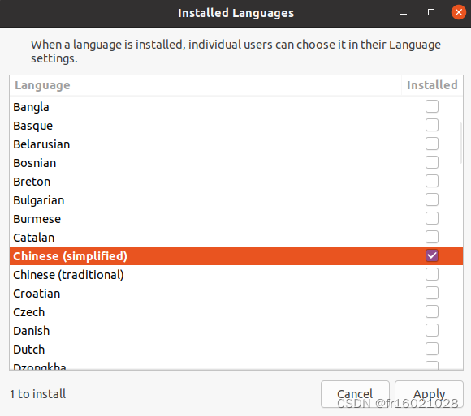  
**耐心等待**  
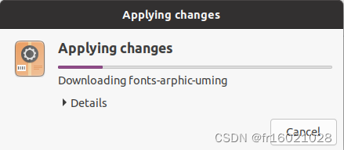  
**下载完毕后，重新进入设置界面，修改相应设置，点击“Restart”重启**  
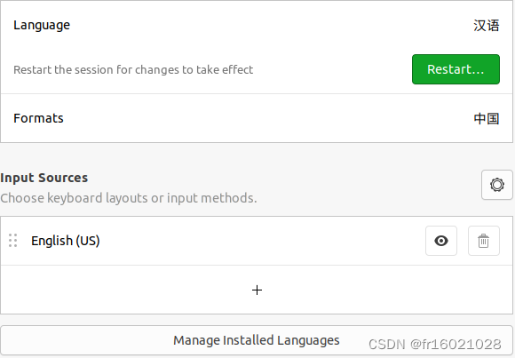  
**重启后显示如下界面，强烈建议选择“保留旧的名称”，完成中文设置**  
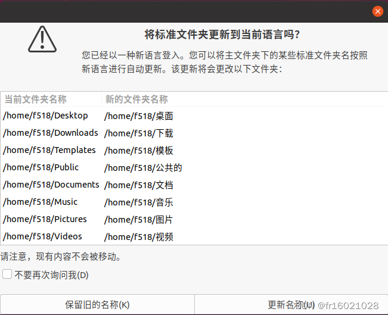

<font style="color:rgb(85, 87, 112);background-color:rgb(250, 250, 252);">推荐内容</font>


## <font style="color:rgb(79, 79, 79);">二、安装中文输入法</font>
在上一步的中文设置中，已经安装了中文语言包，系统支持中文语言。Linux中安装输入法首先需要安装输入法框架，常用的输入法框架有 ibus 和 fcitx，本文就ibus框架进行介绍。  
**ibus（Intelligent Input Bus）**  
1.打开终端，输入<font style="color:rgb(171, 178, 191);background-color:rgb(40, 44, 52);">sudo apt </font><font style="color:rgb(198, 120, 221);background-color:rgb(40, 44, 52);">install</font><font style="color:rgb(171, 178, 191);background-color:rgb(40, 44, 52);"> ibus</font>安装框架  
2.安装完毕后，输入<font style="color:rgb(171, 178, 191);background-color:rgb(40, 44, 52);">im-config -s ibus</font>命令切换框架  
3.由于Ubuntu Desktop 20.04使用的是GNOME桌面，所以需要安装相应的平台支持包，输入<font style="color:rgb(171, 178, 191);background-color:rgb(40, 44, 52);">sudo apt </font><font style="color:rgb(198, 120, 221);background-color:rgb(40, 44, 52);">install</font><font style="color:rgb(171, 178, 191);background-color:rgb(40, 44, 52);"> ibus-gtk ibus-gtk3</font>进行安装  
4.选择简体拼音输入法，输入<font style="color:rgb(171, 178, 191);background-color:rgb(40, 44, 52);">sudo apt </font><font style="color:rgb(198, 120, 221);background-color:rgb(40, 44, 52);">install</font><font style="color:rgb(171, 178, 191);background-color:rgb(40, 44, 52);"> ibus-pinyin</font>完成安装  
5.完成安装后，将中文输入法添加到输入源选项中  
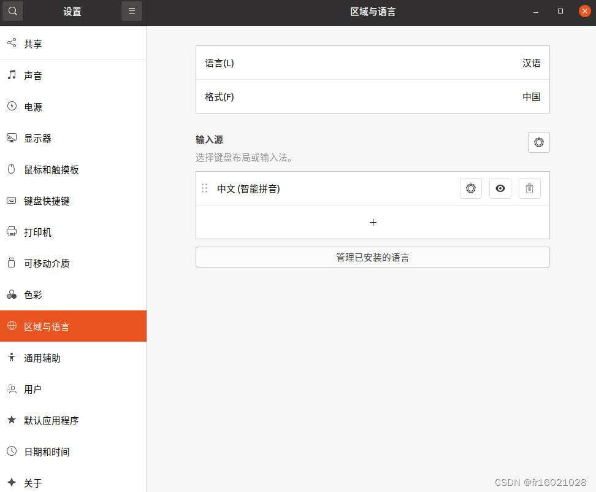  
6.在任务栏中可以发现新安装的输入法，切换后即可正常使用  
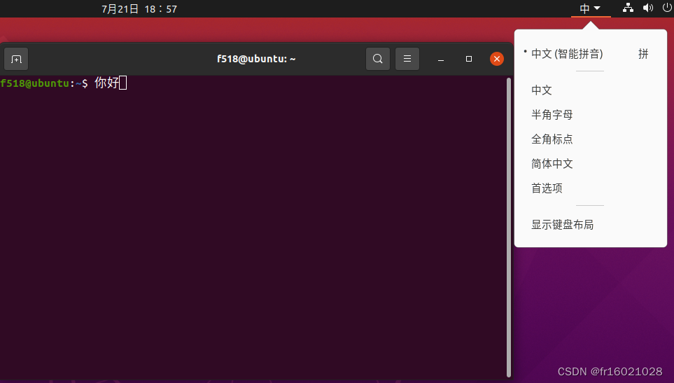


# <font style="color:rgba(0, 0, 0, 0.85);">如何在Ubuntu上安装Python</font>
<font style="color:rgba(0, 0, 0, 0.85);">更新：</font><font style="color:rgba(0, 0, 0, 0.85);">2023-06-04 11:26</font>

<font style="color:rgba(0, 0, 0, 0.85);">Python是一种流行的编程语言，常用于机器学习、数据分析、Web开发等领域。在Ubuntu上安装Python比较简单，可以通过命令行或GUI工具实现。本文将从多个方面详细介绍乌班图如何安装Python。</font>

## <font style="color:rgb(68, 68, 68);">一、命令行安装</font>
<font style="color:rgba(0, 0, 0, 0.85);">使用命令行安装Python，可以通过几个简单的步骤快速搭建Python环境。</font>

### <font style="color:rgb(51, 51, 51);">1. 确认系统更新</font>
```plain
sudo apt update
sudo apt upgrade
```

<font style="color:rgba(0, 0, 0, 0.85);">以上两行命令可以更新系统，确保系统中的软件包是最新的。</font>

### <font style="color:rgb(51, 51, 51);">2. 安装Python和pip</font>
```plain
sudo apt install python3 python3-pip
```

<font style="color:rgba(0, 0, 0, 0.85);">以上命令可以安装Python和pip。pip是Python的软件包管理器，可以方便地安装和升级Python扩展包。</font>

### <font style="color:rgb(51, 51, 51);">3. 验证Python安装</font>
```plain
python3 -V
```

<font style="color:rgba(0, 0, 0, 0.85);">使用以上命令可以验证Python是否安装成功，输出Python的版本号。</font>

<font style="color:rgba(0, 0, 0, 0.85);"></font>

# <font style="color:rgb(61, 61, 61);">ubuntu 安装pandas</font>
```sql
sudo apt-get update
sudo apt-get install build-essential
sudo apt-get install libncurses5-dev libgdbm-dev libnss3-dev libssl-dev libreadline-dev libffi-dev
sudo apt-get install python3-pandas
```

# <font style="color:rgb(25, 27, 31);">最详细的ubuntu 安装 docker教程</font>
<font style="color:rgb(25, 27, 31);">Docker是一种流行的容器化平台，它能够简化应用程序的部署和管理。本文将介绍在Ubuntu操作系统上安装Docker的步骤，以便我们可以开始使用Docker来构建和运行容器化应用程序。</font>

[获取更多技术资料，请点击！](https://link.zhihu.com/?target=https%3A//ceshiren.com/t/topic/26026)

<font style="color:rgb(25, 27, 31);">系统版本</font>

<font style="color:rgb(25, 27, 31);">本文以Ubuntu20.05系统为例安装docker，</font>[Ubuntu官方下载地址](https://link.zhihu.com/?target=https%3A//ubuntu.com/download)<font style="color:rgb(25, 27, 31);">。</font>

<font style="color:rgb(25, 27, 31);">检查卸载老版本docker</font>

<font style="color:rgb(25, 27, 31);">ubuntu下自带了docker的库，不需要添加新的源。  
</font><font style="color:rgb(25, 27, 31);">但是ubuntu自带的docker版本太低，需要先卸载旧的再安装新的。</font>

<font style="color:rgb(25, 27, 31);">注：docker的旧版本不一定被称为docker，</font>[http://docker.io](https://link.zhihu.com/?target=http%3A//docker.io)<font style="color:rgb(25, 27, 31);"> </font><font style="color:rgb(25, 27, 31);">或 docker-engine也有可能，所以我们卸载的命令为：</font>


```bash
$ apt-get remove docker docker-engine docker.io containerd runc
```

<font style="color:rgb(25, 27, 31);">如果不能正常卸载，出现如下情况，显示无权限时，需要添加管理员权限才可进行卸载：</font>

<font style="color:rgb(25, 27, 31);">  
</font>

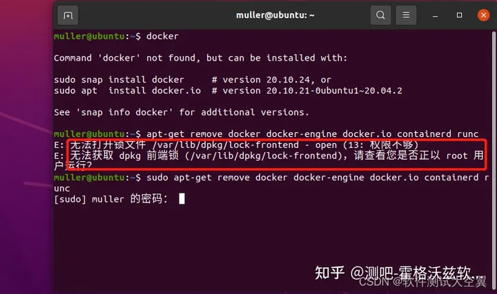

<font style="color:rgb(25, 27, 31);">  
</font><font style="color:rgb(25, 27, 31);">我们就需要使用</font><font style="color:rgb(25, 27, 31);background-color:rgb(248, 248, 250);">sudo apt-get remove docker docker-engine docker.io containerd runc</font><font style="color:rgb(25, 27, 31);">命令使用root权限来进行卸载。</font>

<font style="color:rgb(25, 27, 31);">安装步骤</font>

<font style="color:rgb(25, 27, 31);">  
</font>

1. <font style="color:rgb(25, 27, 31);">更新软件包</font>

<font style="color:rgb(25, 27, 31);">  
</font>

<font style="color:rgb(25, 27, 31);">在终端中执行以下命令来更新Ubuntu软件包列表和已安装软件的版本:</font>


```plain
sudo apt update sudo apt upgrade
```

<font style="color:rgb(25, 27, 31);">  
</font>

1. <font style="color:rgb(25, 27, 31);">安装docker依赖</font>

<font style="color:rgb(25, 27, 31);">  
</font>

<font style="color:rgb(25, 27, 31);">Docker在Ubuntu上依赖一些软件包。执行以下命令来安装这些依赖:</font>


```plain
apt-get install ca-certificates curl gnupg lsb-release
```

<font style="color:rgb(25, 27, 31);">  
</font>

1. <font style="color:rgb(25, 27, 31);">添加Docker官方GPG密钥</font>

<font style="color:rgb(25, 27, 31);">  
</font>

<font style="color:rgb(25, 27, 31);">执行以下命令来添加Docker官方的GPG密钥:</font>


```plain
curl -fsSL http://mirrors.aliyun.com/docker-ce/linux/ubuntu/gpg | sudo apt-key add -
```

<font style="color:rgb(25, 27, 31);">结果如下：</font>

<font style="color:rgb(25, 27, 31);">  
</font>

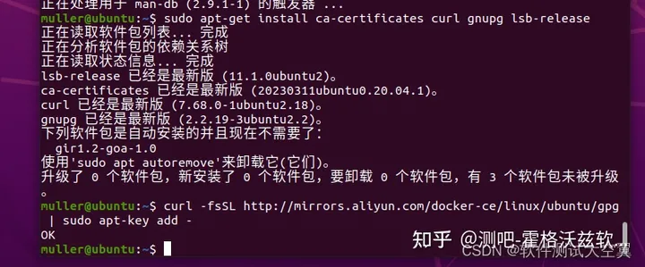

<font style="color:rgb(25, 27, 31);">  
</font>

<font style="color:rgb(25, 27, 31);">  
</font>

1. <font style="color:rgb(25, 27, 31);">添加Docker软件源</font>

<font style="color:rgb(25, 27, 31);">  
</font>

<font style="color:rgb(25, 27, 31);">执行以下命令来添加Docker的软件源:</font>


```plain
sudo add-apt-repository "deb [arch=amd64] http://mirrors.aliyun.com/docker-ce/linux/ubuntu $(lsb_release -cs) stable"
```

**<font style="color:rgb(25, 27, 31);">注：该命令需要使用root权限</font>**

<font style="color:rgb(25, 27, 31);">  
</font>

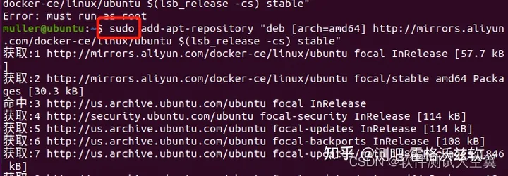

<font style="color:rgb(25, 27, 31);">  
</font>

<font style="color:rgb(25, 27, 31);">  
</font>

1. <font style="color:rgb(25, 27, 31);">安装docker</font>

<font style="color:rgb(25, 27, 31);">  
</font>

<font style="color:rgb(25, 27, 31);">执行以下命令来安装Docker:</font>


```plain
apt-get install docker-ce docker-ce-cli containerd.io
```

<font style="color:rgb(25, 27, 31);">  
</font>

1. <font style="color:rgb(25, 27, 31);">配置用户组（可选）</font>

<font style="color:rgb(25, 27, 31);">  
</font>

<font style="color:rgb(25, 27, 31);">默认情况下，只有root用户和docker组的用户才能运行Docker命令。我们可以将当前用户添加到docker组，以避免每次使用Docker时都需要使用sudo。命令如下：</font>


```plain
sudo usermod -aG docker $USER
```

**<font style="color:rgb(25, 27, 31);">注：重新登录才能使更改生效。</font>**

<font style="color:rgb(25, 27, 31);">运行docker</font>

<font style="color:rgb(25, 27, 31);">我们可以通过启动</font><font style="color:rgb(25, 27, 31);background-color:rgb(248, 248, 250);">docker</font><font style="color:rgb(25, 27, 31);">来验证我们是否成功安装。命令如下：</font>


```plain
systemctl start docker
```

**<font style="color:rgb(25, 27, 31);">安装工具</font>**


```plain
apt-get -y install apt-transport-https ca-certificates curl software-properties-common
```

**<font style="color:rgb(25, 27, 31);">重启docker</font>**


```plain
service docker restart
```

**<font style="color:rgb(25, 27, 31);">验证是否成功</font>**


```plain
sudo docker run hello-world
```

<font style="color:rgb(25, 27, 31);">运行命令后，结果如下：</font>

<font style="color:rgb(25, 27, 31);">  
</font>

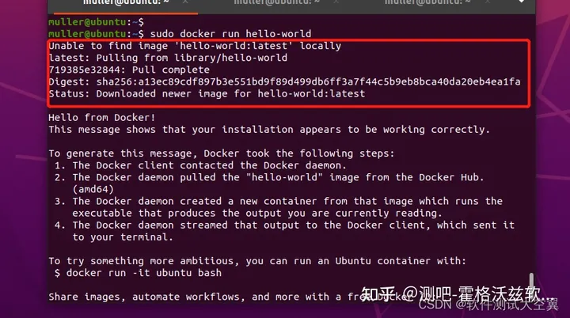

<font style="color:rgb(25, 27, 31);">  
</font>

<font style="color:rgb(25, 27, 31);">因为我们之前没有拉取过</font><font style="color:rgb(25, 27, 31);background-color:rgb(248, 248, 250);">hello-world</font><font style="color:rgb(25, 27, 31);">，所以运行命令后会出现本地没有该镜像，并且会自动拉取的操作。</font>

**<font style="color:rgb(25, 27, 31);">查看版本</font>**

<font style="color:rgb(25, 27, 31);">我们可以通过下面的命令来查看</font><font style="color:rgb(25, 27, 31);background-color:rgb(248, 248, 250);">docker</font><font style="color:rgb(25, 27, 31);">的版本</font>


```plain
sudo docker version
```

<font style="color:rgb(25, 27, 31);">结果如下：</font>

<font style="color:rgb(25, 27, 31);">  
</font>

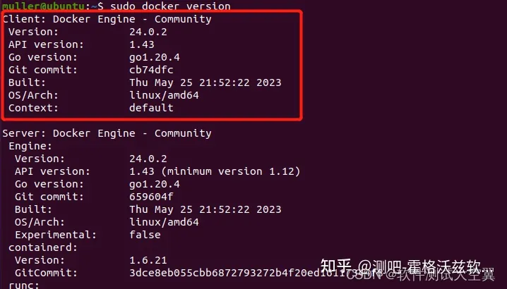

<font style="color:rgb(25, 27, 31);">  
</font>

**<font style="color:rgb(25, 27, 31);">查看镜像</font>**

<font style="color:rgb(25, 27, 31);">上面我们拉取了hello-world的镜像，现在我们可以通过命令来查看镜像，命令如下：</font>


```plain
sudo docker images
```

<font style="color:rgb(25, 27, 31);">结果如下图：</font>

<font style="color:rgb(25, 27, 31);">  
</font>


<font style="color:rgb(25, 27, 31);">  
</font>

<font style="color:rgb(25, 27, 31);">出现上述情况，即表示我们成功在Ubuntu系统上安装了docker。</font>

[最详细的ubuntu 安装 docker教程](https://zhuanlan.zhihu.com/p/651148141?utm_id=0)


# <font style="color:rgb(79, 79, 79);background-color:rgb(10, 10, 10);">一.开启防火墙以及端口</font>
<font style="color:rgb(77, 77, 77);background-color:rgb(10, 10, 10);">【1】切换用户为root</font>

```plain
sudo su root
```

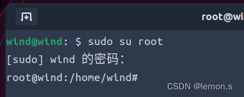

<font style="color:rgb(77, 77, 77);background-color:rgb(10, 10, 10);">【2】查看防火墙状态：</font>

```plain
ufw status
```


<font style="color:rgb(77, 77, 77);background-color:rgb(10, 10, 10);">【3】如果未激活打开防火墙</font>

```plain
ufw enable
```


<font style="color:rgb(77, 77, 77);background-color:rgb(10, 10, 10);">此时重启系统然后查看防火墙状态</font>

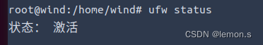

# <font style="color:rgb(79, 79, 79);background-color:rgb(10, 10, 10);">二.查看已经打开的端口</font>
#### <font style="color:rgb(79, 79, 79);background-color:rgb(10, 10, 10);">1.通过netstat 命令查询</font>
<font style="color:rgb(77, 77, 77);background-color:rgb(10, 10, 10);">【1】查看系统中使用tcp协议的端口号信息</font>

```plain
netstat -ntpl
```

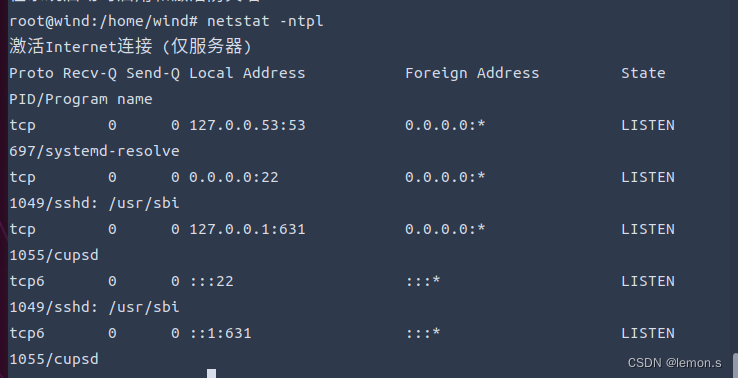

<font style="color:rgb(77, 77, 77);background-color:rgb(10, 10, 10);">【2】查看系统中所有使用udp协议的端口号</font>

```plain
netstat -aupl
```

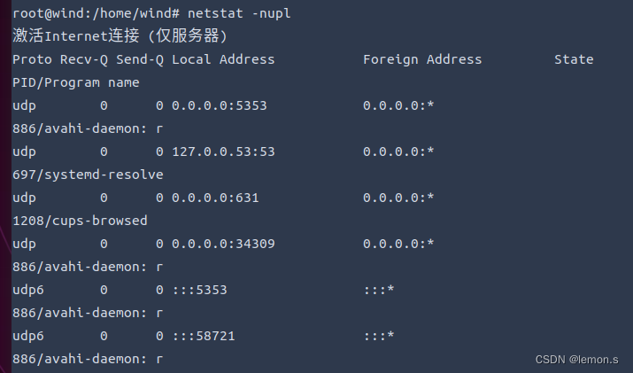

### <font style="color:rgb(79, 79, 79);background-color:rgb(10, 10, 10);">2.使用lsof -i命令查询</font>
<font style="color:rgb(77, 77, 77);background-color:rgb(10, 10, 10);">1.lsof -i可以查询指定端口号,以端口号80举例，这样即我的系统中80端口并没有打开</font>

```plain
lsof -i:80
```

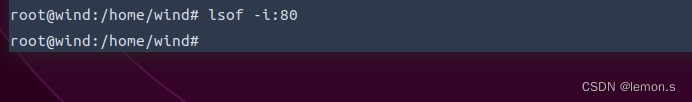

<font style="color:rgb(77, 77, 77);background-color:rgb(10, 10, 10);">这里用一个已经打开的端口号22举例:这样说明该端口号已经打开</font>

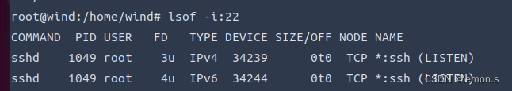

# <font style="color:rgb(0, 0, 0);background-color:rgb(238, 238, 238);">１.查看已经开启的端口</font>
<font style="color:rgb(0, 0, 0);background-color:rgb(238, 238, 238);">sudo ufw</font><font style="color:rgb(0, 0, 0);background-color:rgb(238, 238, 238);"> </font><font style="color:rgb(0, 0, 255);background-color:rgb(238, 238, 238);">status</font>

## <font style="color:rgb(0, 0, 0);background-color:rgb(238, 238, 238);">2.打开端口</font>
```sql
 apt install iptables
iptables -I INPUT 6 -p tcp --dport 18000 -j ACCEPT
```

<font style="color:rgb(0, 0, 0);background-color:rgb(238, 238, 238);">sudo ufw allow</font><font style="color:rgb(0, 0, 0);background-color:rgb(238, 238, 238);"> </font><font style="color:rgb(136, 0, 0);background-color:rgb(238, 238, 238);">9123</font>

## <font style="color:rgb(0, 0, 0);background-color:rgb(238, 238, 238);">3.开启防火墙</font>
<font style="color:rgb(0, 0, 0);background-color:rgb(238, 238, 238);">sudo ufw enable</font>

## <font style="color:rgb(0, 0, 0);background-color:rgb(238, 238, 238);">４.重启防火墙</font>
<font style="color:rgb(0, 0, 0);background-color:rgb(238, 238, 238);">sudo ufw reload</font>

## <font style="color:rgb(0, 0, 0);background-color:rgb(238, 238, 238);">5.再次查看一下端口是否已开放</font>
<font style="color:rgb(0, 0, 0);background-color:rgb(238, 238, 238);"></font>

<font style="color:rgb(0, 0, 0);background-color:rgb(238, 238, 238);">sudo ufw </font><font style="color:rgb(0, 0, 255);background-color:rgb(238, 238, 238);">status</font>


> 更新: 2024-01-10 17:39:14  
> 原文: <https://www.yuque.com/lixinsi/hntyk2/aftxg3oq61y74ogp>