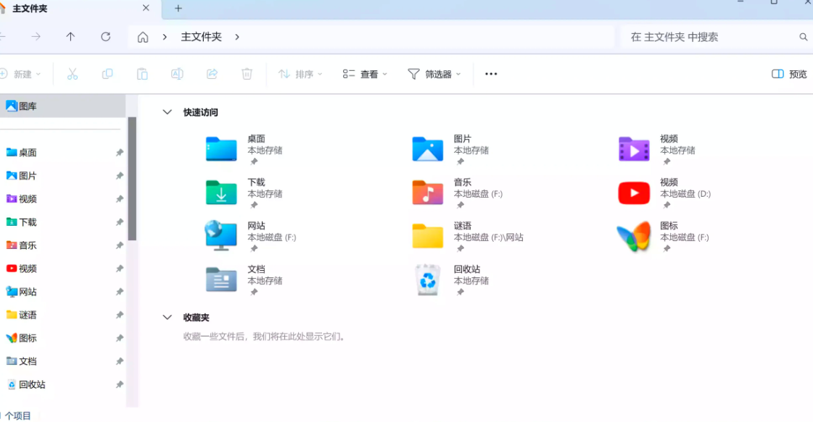

# Windows 11 中使用 Win10的文件资源管理器！速度立马起飞

<font style="color:rgb(68, 68, 68);">Windows 11的文件资源管理器功能丰富,但性能略逊于Windows 10版本。新版本增加了选项卡、现代UI和预览窗格等功能,但也导致运行速度变慢。因此,一些用户更偏好旧版本的简洁和快速,甚至怀念经典的Ribbon界面。</font>

<font style="color:rgb(68, 68, 68);">好消息是,有一种方法可以永久恢复Windows 10的文件资源管理器。只需在注册表编辑器中进行一次简单调整即可实现。如果你也想回到熟悉的旧版界面,这个解决方案值得一试。</font>



<font style="color:rgb(68, 68, 68);">这个方法适用于当前所有版本的 Windows 11，包括最新的 24H2版</font>

### <font style="color:rgb(51, 51, 51);">1.在 Windows 11 中恢复旧文件资源管理器</font>
<font style="color:rgb(68, 68, 68);">首先打开记事本并粘贴以下文本代码：</font>

```python
Windows Registry Editor Version 5.00

[HKEY_CURRENT_USER\Software\Classes\CLSID\{2aa9162e-c906-4dd9-ad0b-3d24a8eef5a0}]
@="CLSID_ItemsViewAdapter"

[HKEY_CURRENT_USER\Software\Classes\CLSID\{2aa9162e-c906-4dd9-ad0b-3d24a8eef5a0}\InProcServer32]
@="C:\\Windows\\System32\\Windows.UI.FileExplorer.dll_"
"ThreadingModel"="Apartment"

[HKEY_CURRENT_USER\Software\Classes\CLSID\{6480100b-5a83-4d1e-9f69-8ae5a88e9a33}]
@="File Explorer Xaml Island View Adapter"

[HKEY_CURRENT_USER\Software\Classes\CLSID\{6480100b-5a83-4d1e-9f69-8ae5a88e9a33}\InProcServer32]
@="C:\\Windows\\System32\\Windows.UI.FileExplorer.dll_"
"ThreadingModel"="Apartment"

[HKEY_CURRENT_USER\Software\Microsoft\Internet Explorer\Toolbar\ShellBrowser]
"ITBar7Layout"=hex:13,00,00,00,00,00,00,00,00,00,00,00,20,00,00,00,10,00,01,00,\
  00,00,00,00,01,00,00,00,01,07,00,00,5e,01,00,00,00,00,00,00,00,00,00,00,00,\
  00,00,00,00,00,00,00,00,00,00,00,00,00,00,00,00,00,00,00,00,00,00,00,00,00,\
  00,00,00,00,00,00,00,00,00,00,00,00,00,00,00,00,00,00,00,00,00,00,00,00,00,\
  00,00,00,00,00,00,00,00,00,00,00,00,00,00,00,00,00,00,00,00,00,00,00,00,00,\
  00,00,00,00,00,00,00,00,00,00,00,00,00,00,00,00,00,00,00,00,00,00,00,00,00,\
  00,00,00,00,00,00,00,00,00,00,00,00,00,00,00,00,00,00,00,00,00,00,00,00,00,\
  00,00,00,00,00,00,00,00,00,00,00,00,00,00,00,00,00,00,00,00,00,00,00,00,00,\
  00,00,00,00,00,00,00,00,00,00,00,00,00,00,00,00,00,00,00,00,00,00,00,00,00,\
  00,00,00,00,00,00,00,00,00,00,00,00,00,00,00,00,00,00,00,00,00,00,00,00,00,\
  00,00,00,00,00,00,00,00,00,00,00,00,00,00,00,00,00,00,00,00,00,00,00,00,00,\
  00,00,00,00,00,00,00,00,00,00,00,00,00,00,00,00,00,00,00,00,00,00,00,00,00,\
  00,00,00,00,00,00,00,00,00,00,00,00,00,00,00,00,00,00,00,00,00,00,00,00,00,\
  00,00,00,00,00,00,00,00,00,00,00,00,00,00,00,00,00,00,00,00,00,00,00,00,00,\
  00,00,00,00,00,00,00,00,00,00,00,00,00,00,00,00,00,00,00,00,00,00,00,00,00,\
  00,00,00,00,00,00,00,00,00,00,00,00,00,00,00,00,00,00,00,00,00,00,00,00,00,\
  00,00,00,00,00,00,00,00,00,00,00,00,00,00,00,00,00,00,00,00,00,00,00,00,00,\
  00,00,00,00,00,00,00,00,00,00,00,00,00,00,00,00,00,00,00,00,00,00,00,00,00,\
  00,00,00,00,00,00,00,00,00,00,00,00,00,00,00,00,00,00,00,00,00,00,00,00,00,\
  00,00,00,00,00,00,00,00,00,00,00,00,00,00,00,00,00,00,00,00,00,00,00,00,00,\
  00,00,00,00,00,00,00,00,00,00,00,00,00,00,00,00,00,00,00,00,00,00,00,00,00,\
  00,00,00,00,00,00,00,00,00,00,00,00,00,00,00,00,00,00,00,00,00,00,00,00,00,\
  00,00,00,00,00,00,00,00,00,00,00,00,00,00,00,00,00,00,00,00,00,00,00
```

<font style="color:rgb(68, 68, 68);">现在，单击</font>**<font style="color:rgb(68, 68, 68);">文件 > 保存</font>**<font style="color:rgb(68, 68, 68);">，然后从“保存类型”下拉菜单中选择</font>**<font style="color:rgb(68, 68, 68);">所有项目</font>**<font style="color:rgb(68, 68, 68);">。为文件指定任何你喜欢的名称，但不要忘记在末尾添加 .reg。例如，“file.reg”</font>

<font style="color:rgb(68, 68, 68);">打开新创建的文件并确认注册表中的更改，然后重新启动计算机，就可以回到 Windows 10 的资源管理器了！</font>

**<font style="color:rgb(68, 68, 68);">说实话，错误更少，性能更好。</font>**

### <font style="color:rgb(51, 51, 51);">如果你需要 在 Windows 11 中关闭windows 10的文件资源管理器</font>
<font style="color:rgb(68, 68, 68);">那么方法是一样的，打开记事本并将以下文本粘贴到其中：</font>

```python
Windows Registry Editor Version 5.00 

[-HKEY_CURRENT_USER\Software\Classes\CLSID\{2aa9162e-c906-4dd9-ad0b-3d24a8eef5a0}] 

[-HKEY_CURRENT_USER\Software\Classes\CLSID\{6480100b-5a83-4d1e-9f69-8ae5a88e9a33}]
```

<font style="color:rgb(68, 68, 68);">单击</font>**<font style="color:rgb(68, 68, 68);">文件 > 保存</font>**<font style="color:rgb(68, 68, 68);">，选择</font>**<font style="color:rgb(68, 68, 68);">所有项目</font>**<font style="color:rgb(68, 68, 68);">并以 .reg 扩展名保存文件。打开文件，确认注册表中的更改并重新启动计算机。Windows 11 中的标准文件资源管理器就会恢复回来。</font>


> 更新: 2024-06-26 11:43:58  
> 原文: <https://www.yuque.com/lixinsi/hntyk2/xddsmlwgdkkl6eg2>