# Windows Server 2008 R2 环境 安装 CA证书服务器

Windows Server 2008 R2 环境 安装 CA证书服务器

一、Windows版本

服务器的软件版本为Windows server 2008 R2 Datacenter

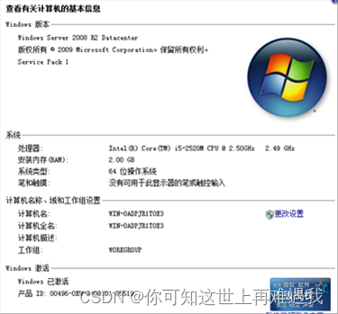

二、安装IIS和证书服务

1、点击“开始”——>“管理工具”——>“服务管理器”

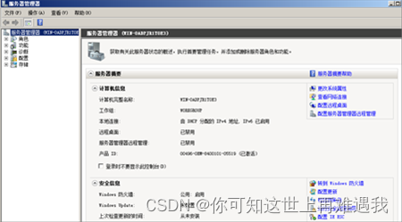

2、点击“角色”——“添加角色”

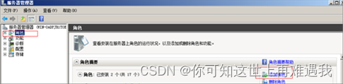

3、进入角色向导界面，点击“下一步”

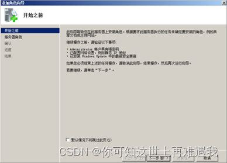

4、勾选“Active Directory证书服务”和“Web服务器（IIS）”，点击“下一步”

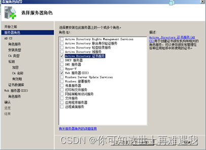

5、点击“下一步”

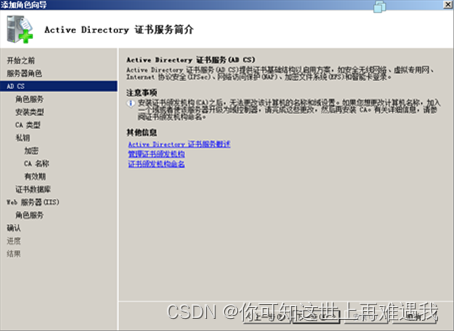

6、勾选“证书颁发机构”和“证书颁发机构web注册”，在弹出的界面中选择“添加所需的角色服务”，点击“下一步”

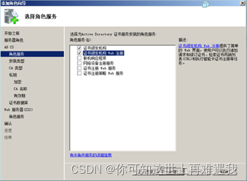

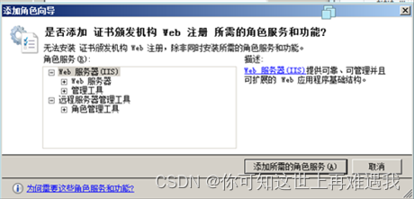

7、安装独立CA，点击“下一步”

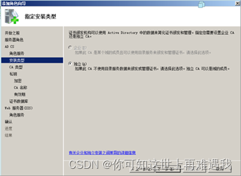

8、选择“根CA”，点击“下一步”

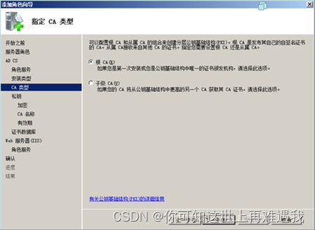

9、选择“新建私钥”，点击“下一步”

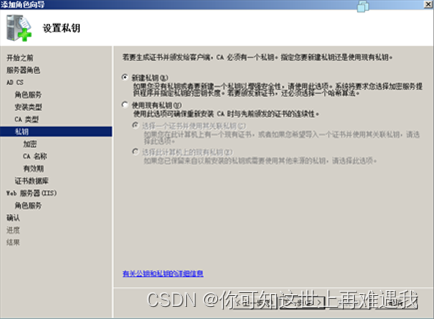

10、使用默认加密服务提供程序和密钥长度，点击“下一步”

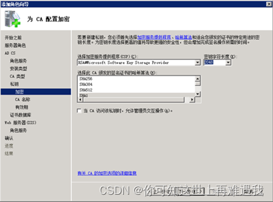

11、填写CA相关信息，点击“下一步”

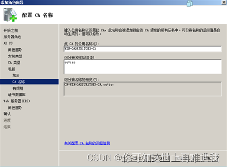

12、根证书有效期默认5年，可以按需修改，并点击“下一步”

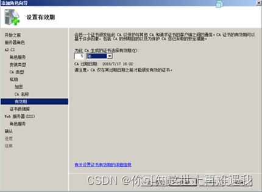

13、选择证书数据库和日志位置，点击“下一步”

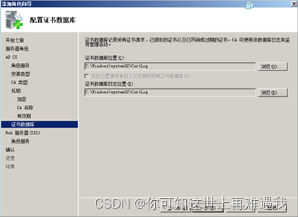

14、Web服务器（IIS）安装，点击“下一步”

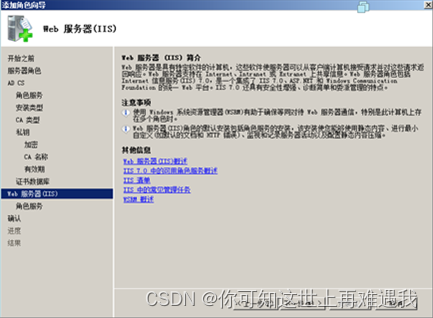

15、点击“下一步”

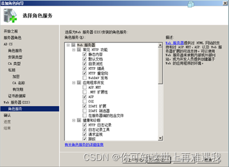

16、确认信息，并点击“安装”

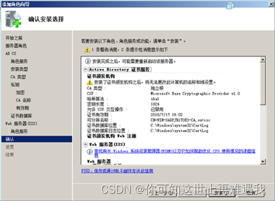

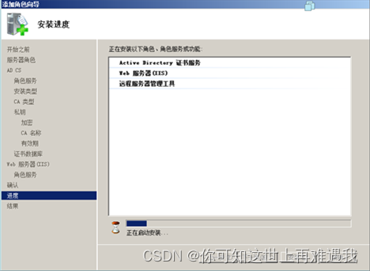

17、安装完毕

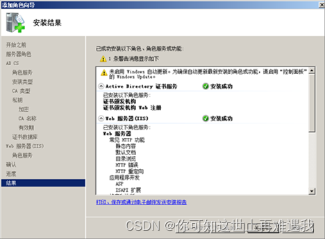

18、在“开始”——>“管理工具”——>“服务器管理器”——>点击“配置IE ESC”

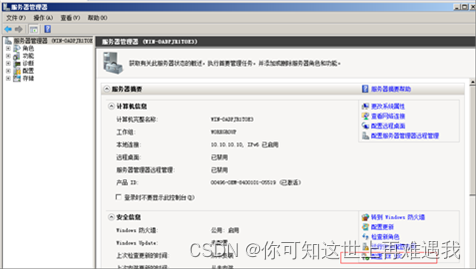

19、禁用所有“internet exploter增强的安全配置”

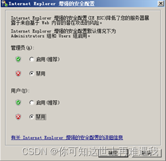

20、在“IE”——>“internet选项”——>“安全”——“可信站点”中增加本机IP地址，并取消https的验证

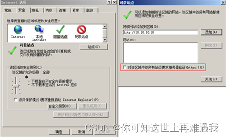

21、点击“自定义级别”，对“ActiveX控件和插件里”的部分选项进行更改，修改完后点击“确定”

a)对未标记为可安全执行脚本的ActiveX初始化并执行脚本（启用）

b)下载未签名的ActiveX控件（启用）

c)下载已签名的ActiveX控件（启用）

d)允许运行以前未使用的ActiveX控件而不提示（启用）

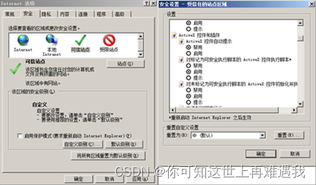

22、在IE中输入[http://10.10.10.10/certsrv](http://10.10.10.10/certsrv)可以打开证书申请界面

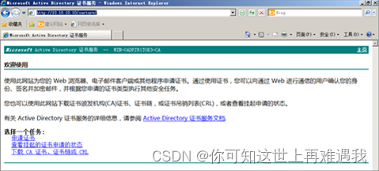

原文链接：[https://blog.csdn.net/weixin_57099902/article/details/132876004](https://blog.csdn.net/weixin_57099902/article/details/132876004)

[在windows server 2008上安装证书服务_2008系统安装证书-CSDN博客](https://blog.csdn.net/ma_jiang/article/details/11949201/?utm_medium=distribute.pc_relevant.none-task-blog-2~default~baidujs_baidulandingword~default-1--blog-99294653.235^v38^pc_relevant_anti_t3&spm=1001.2101.3001.4242.2&utm_relevant_index=4)

> 更新: 2023-11-19 19:33:01  
> 原文: <https://www.yuque.com/lixinsi/hntyk2/nbdl4x367gth3fxp>