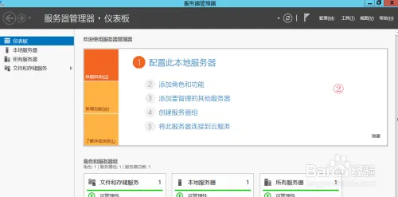
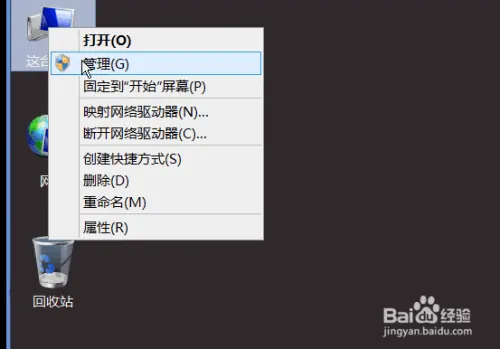
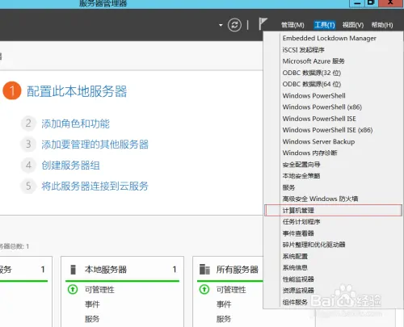
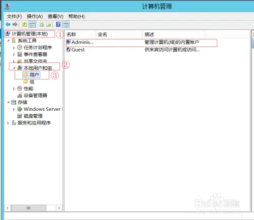
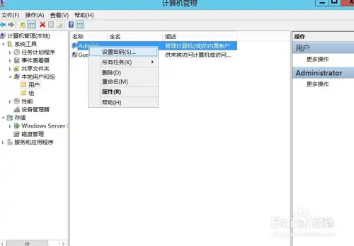
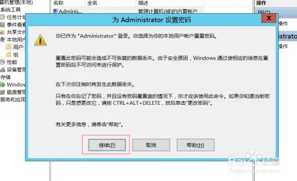
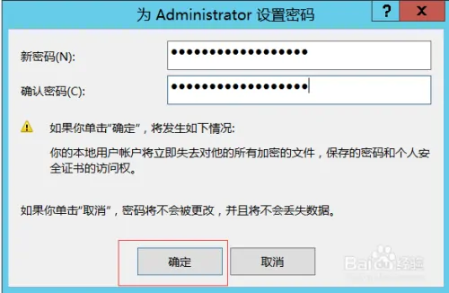

# Windows Server 2012 R2如何设置密码长度最

# 
1. 我的电脑→管理打开服务器管理器 ，如图②所示
2. 点击服务器管理器工具栏→计算机管理，打开计算机管理工具
3. 计算机管理工具中依次展开 计算机管理→本地用户和组→用户 如图所示
4. 选中要修改密码的账户，右键→设置密码
5. 弹出提示界面 ，直接点继续
6. 6输入新的密码，请注意新的密码一定要符合密码策略，最后点确定就可以了

> 更新: 2022-05-27 09:46:27  
> 原文: <https://www.yuque.com/lixinsi/hntyk2/uehwpf>