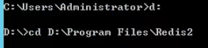
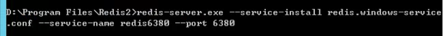
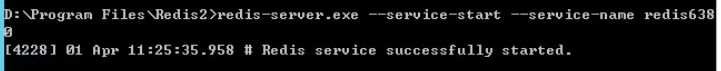
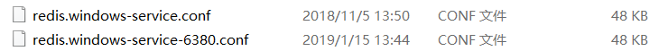
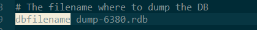
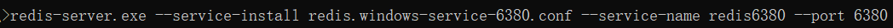

# Windows下配置Redis多个实例

# 方法一：新建目录创建Redis实例
1.将你的redis安装目录复制一份，命名为Redis6380

2.用命令行CMD工具进入到该目录下

3.执行创建redis6380服务的命令：

redis-server.exe --service-install redis.windows-service.conf --service-name redis6380 --port 6380 

4.启动redis6380服务，可以打开服务管理器手动启动，也可以运行命令：

redis-server.exe --service-start --service-name redis6380

5.那么用RDM工具连接新6380端口的redis即可，账号密码与原redis一样。执行flushall清空新实例。

# 方法二：在同一目录下新建多实例
1、复制 redis.windows-service.conf 命名为

redis.windows-service-6380.conf

2、修改此配置文件中的配置属性

# 本地数据库名称

dbfilename dump-6380.rdb 

# 日志文件

logfile "logs/server_log_6380.txt"

# 日志输出

syslog-enabled yes

# 登录认证密码，也可以不设置

requirepass 123456

3、启动cmd命令行，执行

redis-server.exe --service-install redis.windows-service-6380.conf --service-name redis6380 --port 6380 

4、创建后执行命令，启动服务

redis-server.exe --service-start --service-name redis6380

5、cmd执行命令测试登录

redis-cli.exe -h 127.0.0.1 -p 6380

若设置了requirepass 在登录后执行 auth <密码>进行认证

6、若需要删除实例服务则执行

redis-server.exe --service-uninstall --service-name redis6380

> 更新: 2025-04-15 10:13:45  
> 原文: <https://www.yuque.com/lixinsi/hntyk2/kvwvxdb5lny32lw5>