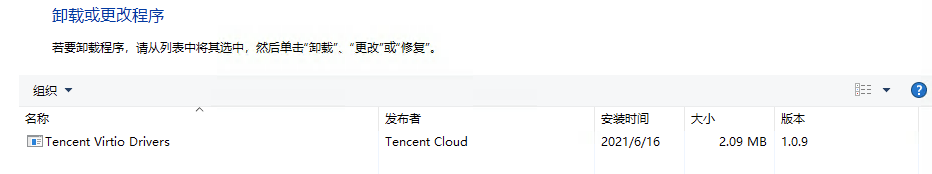
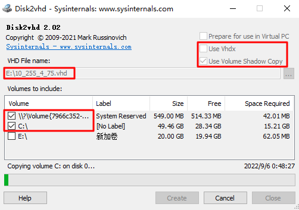
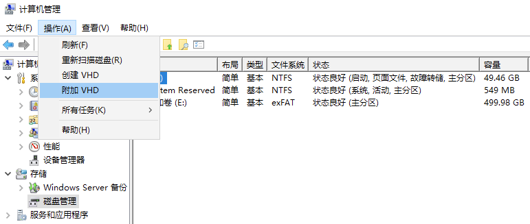
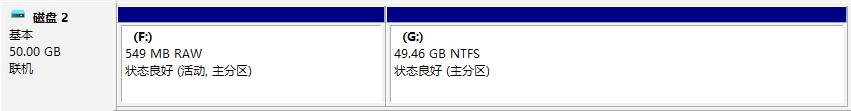

# Windows镜像制作

## 文章引用
[云服务器 制作 Windows 镜像-操作指南-文档中心-腾讯云](https://cloud.tencent.com/document/product/213/17815)

## 操作场景
本文以 Windows Server 2012 操作系统为例，指引您如何制作 Windows 镜像。若使用其他版本 Windows Server 操作系统，也可参考本文进行镜像制作。

## 操作步骤
### 准备工作
制作系统盘镜像导出时，需要进行以下检查：

**说明**

如果您是通过数据盘镜像导出，则可以跳过此操作。

#### 检查 OS 分区和启动方式
1. 在操作系统界面，单击 


，打开 Windows PowerShell 窗口。

2. 在 Windows PowerShell 窗口中，输入 **diskmgmt.msc**，按 **Enter**，打开 “磁盘管理”。

3. 右键单击需要检查的磁盘 > **属性**，选择**卷**页签，查看磁盘分区形式。

4. 判断磁盘分区形式是否为 GPT 分区。

是，请通过 [在线支持](https://cloud.tencent.com/online-service?from=doc_213) 反馈。

否，请执行下一步。

5. 使用管理员身份打开 CMD，并执行以下命令，检验操作系统是否以 EFI 方式启动。


```bash
bcdedit /enum {current}
```


以以下返回结果为例：


```plain
Windows 启动加载器
标识符                  {current}
device                  partition=C:
path                    \WINDOWS\system32\winload.exe
description             Windows 10
locale                  zh-CN
inherit                 {bootloadersettings}
recoverysequence        {f9dbeba1-1935-11e8-88dd-ff37cca2625c}
displaymessageoverride  Recovery
recoveryenabled         Yes
flightsigning           Yes
allowedinmemorysettings 0x15000075
osdevice                partition=C:
systemroot              \WINDOWS
resumeobject            {1bcd0c6f-1935-11e8-8d3e-3464a915af28}
nx                      OptIn
bootmenupolicy          Standard
```


若 path 参数中含有 efi，则表示当前操作系统以 EFI 方式启动，请通过 [在线支持](https://cloud.tencent.com/online-service?from=doc_213) 反馈。

若 path 参数中没有 efi，请执行下一步。

#### 卸载软件
卸载会产生冲突的驱动和软件（包括 VMware tools，Xen tools， Virtualbox GuestAdditions 以及一些自带底层驱动的软件）。

#### 安装 cloud-base
安装详情请参见 [cloud-base 安装文档](https://cloud.tencent.com/document/product/213/30000)。

#### 检查或安装 Virtio 驱动
打开**控制面板** > **程序和功能**，并在搜索栏中搜索 Virtio。

若返回结果如下图示，则表示已安装了 Virtio 驱动。 



若没有安装 Virtio 驱动，则需要手动安装。请结合您的实际情况，选择下载版本。

**说明**

腾讯云不支持导入 Windows Server 2003。

若您使用 Windows Server 2008R2/2012R2/2016/2019/2022，请安装腾讯云定制版 VirtIO 驱动。

若您使用其他版本 Windows 操作系统，请先尝试安装使用腾讯云定制版 VirtIO 驱动，如出现不稳定的情况，可尝试社区版 VirtIO 驱动。

（推荐）安装腾讯云定制版

安装社区版

腾讯云定制版 Virtio 下载地址如下，请对应实际网络环境下载：

公网下载地址：http://mirrors.tencent.com/install/windows/virtio_64_1.0.9.exe

内网下载地址：http://mirrors.tencentyun.com/install/windows/virtio_64_1.0.9.exe

请先尝试安装使用腾讯云定制版 VirtIO 驱动，如出现不稳定的情况，可尝试社区版 VirtIO 驱动。 [点此下载社区版本 virtio](https://www.linux-kvm.org/page/WindowsGuestDrivers/Download_Drivers)

#### 检查其它硬件相关的配置
上云之后的硬件变化包括但可能不限于：

显卡更换为 Cirrus VGA。

磁盘更换为 Virtio Disk。

网卡更换为 Virtio Nic，默认为本地连接。

### 导出镜像
根据实际需求，选择不同的工具导出镜像：

使用平台工具导出镜像

使用 disk2vhd 导出镜像

 或 Citrix XenConvert 等虚拟化平台的导出镜像工具。详情请参见各平台的导出工具文档。

使用 VMWare vCenter Convert

**说明**

目前腾讯云服务器迁移支持的镜像格式有：qcow2，vhd，raw，vmdk。

机上的系统或者不想使用平台工具导出时，可以使用 disk2vhd 工具进行导出。

当您的需要导出物理

1. [点此下载](https://download.sysinternals.com/files/Disk2vhd.zip) disk2vhd 工具。

2. 安装并运行 disk2vhd 工具。

**<font style="color:#04c8dc;">注意</font>**

请在非系统盘上安装并运行 disk2vhd 工具。

disk2vhd 需要 Windows 预装 VSS（卷影拷贝服务）功能后才能运行。关于 VSS 功能的更多信息请参见 [Volume Shadow Copy Service](https://docs.microsoft.com/zh-cn/windows/win32/vss/volume-shadow-copy-service-portal?redirectedfrom=MSDN)。

3. 在打开的 disk2vhd 工具中，请根据以下信息进行配置后，单击 **Create** 导出镜像。

**Use Vhdx**：请勿勾选，目前系统不支持 vhdx 格式的镜像。

**Use volume Shadow Copy**：建议勾选 ，使用卷影复制功能，将能更好地保证数据完整性。

**VHD File name**：生成 .vhd 文件的保存位置，请选择非系统盘。

**Volume to include**：导出镜像要求导出整块系统盘，**请勾选您的系统盘所有分区**，否则在导入镜像时会产生无法进入系统的错误。 系统盘分区通常为 C:\ 分区及其之前的启动引导分区、recovery 分区，数量通常为2 - 3个，需全部勾选。 **配置示例** 如下图所示，在 E 盘中运行 disk2vhd 工具后，勾选系统盘的所有分区（启动引导分区及 C:\ 分区），勾选 “Use volume Shadow Copy”，取消勾选 “Use Vhdx”。导出镜像后，生成的 .vhd 文件将保存至 E 盘。 



### 转换镜像格式（可选）
参见 [转换镜像格式](https://cloud.tencent.com/document/product/213/62569#windows)，使用 qemu-img 将镜像文件转换为支持的格式。

### 检查镜像
**说明**

当您未停止服务直接制作镜像或者其它原因，可能导致制作出的镜像文件系统有误，因此建议您在制作镜像后检查是否无误。

当镜像格式和当前平台支持的格式一致时，您可以直接打开镜像检查文件系统。 例如，Windows 平台可以直接附加 vhd 格式镜像，Linux 平台可以使用 qemu-nbd 打开 qcow2 格式镜像，Xen 平台可以直接启用 vhd 文件。

本文以 Windows 平台为例，通过**磁盘管理**中的**附加 VHD**，查看 vhd 格式镜像。步骤如下：

1. 在操作系统界面，右键单击 


，并在弹出菜单中选择**计算机管理**。

2. 选择**存储** > **磁盘管理**，进入磁盘管理界面。

3. 在窗口上方选择**操作** > **附加 VHD**。如下图所示： 



 出现如下图所示结果，表示已成功制作镜像。 




> 更新: 2023-06-24 18:32:45  
> 原文: <https://www.yuque.com/lixinsi/hntyk2/xa0gv9k3p98wyqd0>