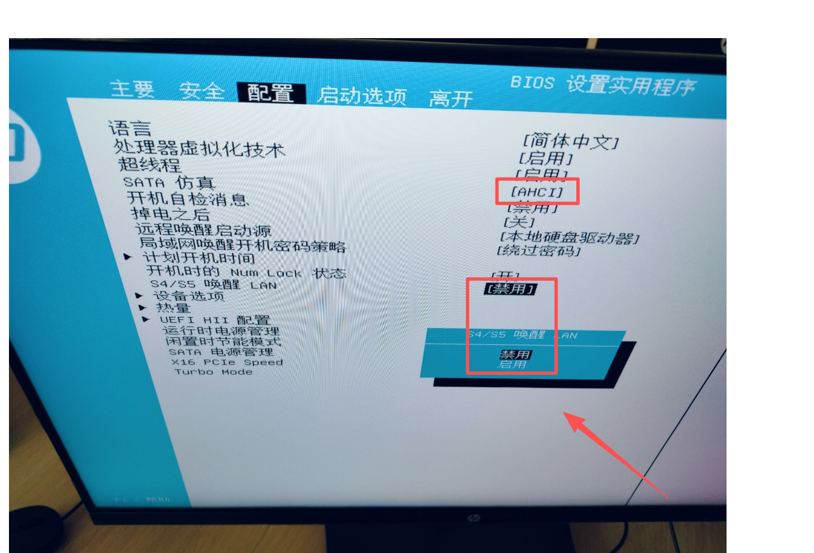
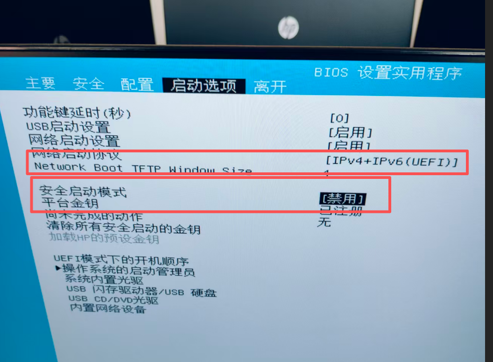
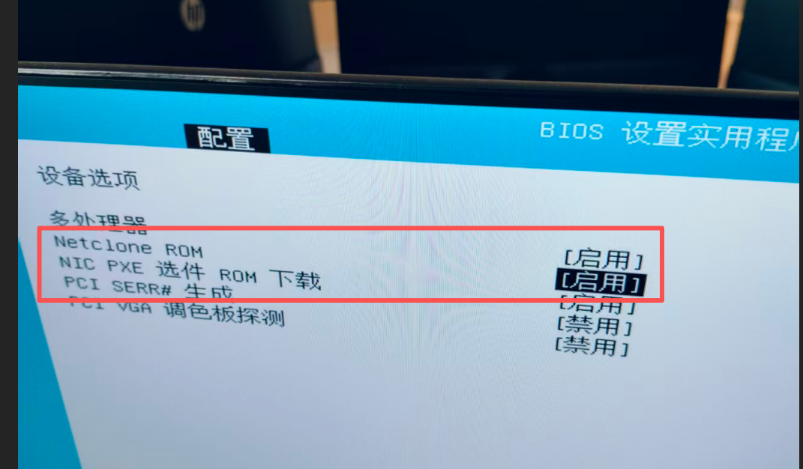
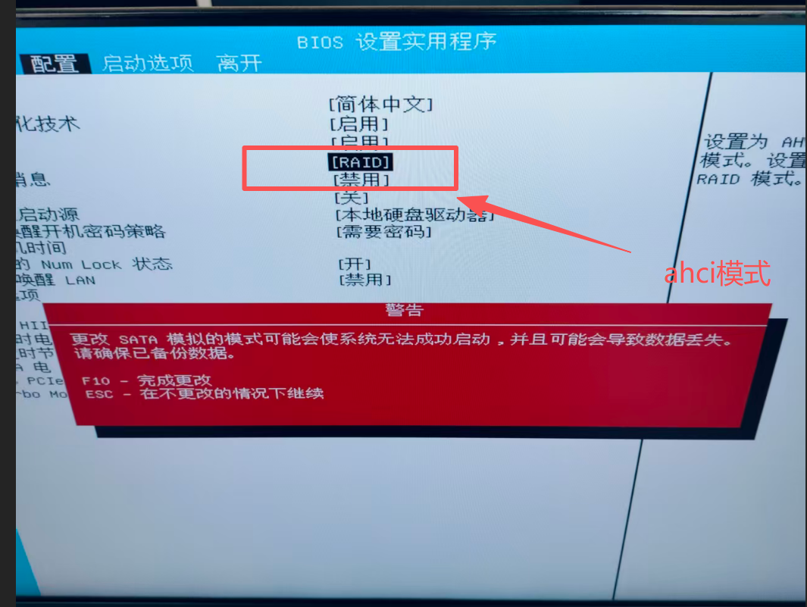

# bois设置HP增霸卡V9.0 同传系统完整操作手册

好的，根据您提供的文字描述和视频内容，为您整理了一份完整的 **HP增霸卡V9.0同传系统操作手册**。这份手册旨在指导您在完成初始部署后，如何在母机上安装软件并进行新一轮的同传。

***

# HP增霸卡V9.0 同传系统完整操作手册 (软件安装后同传版)

**核心目标：** 在已部署好增霸卡驱动和网络环境的母机上，安装所需软件，然后将包含新软件的完整系统镜像，通过网络同传给所有客户端电脑。

***

## 第一部分：准备工作 (首次部署或重新部署时执行)

### 步骤1: 制作驱动镜像 & 安装底层驱动

* 在一台准备作为“母机”的电脑上，安装操作系统（如Windows 10/11）。
* 根据您的硬件配置，安装所有必要的底层驱动程序（特别是网卡驱动），确保系统能正常运行。

### 步骤2: 配置客户端电脑BIOS

* 对每一台需要接收同传的“客户端”电脑，开机进入BIOS设置界面（通常是按 `F10` 或 `Del` 键）。
* **启用网络启动 (Network Boot):** 在“Boot”或“启动”选项中，找到“Network Boot”或“PXE Boot”，将其设置为“Enabled”。
* **禁用安全启动 (Secure Boot):** 在“Security”或“安全”选项中，找到“Secure Boot”，将其设置为“Disabled”。
* **更改存储模式 (RAID to AHCI):** 在“Storage”或“存储”选项中，找到“SATA Operation”或类似选项，将其从“RAID”更改为“AHCI”。
* **启用NetClone ROM:** 在“Advanced”或“高级”选项中，找到“NetClone ROM”或“增霸卡相关选项”，将其设置为“Enabled”。
* **保存并重启:** 按 `F10` 保存设置并退出BIOS，电脑会自动重启。

### 步骤3: 客户端等待网络安装

* 客户端电脑重启后，会自动尝试从网络启动，屏幕显示“Wait for Network Install...”或类似提示，等待母机的连接。

### 步骤4: 母机配置与客户端驱动安装

* 在母机上，启动增霸卡管理控制台（通常是一个蓝色背景的程序）。
* 等待客户端电脑的MAC地址出现在列表中。
* 选中所有在线的客户端，点击“安装客户端驱动”或类似按钮。
* 等待所有客户端显示“驱动安装完成”。

> **注意：** 如果母机长时间停留在“等待连接”状态，可以尝试取消登录，重新登录，或重启母机后重试。

***

## 第二部分：在母机上安装软件

### 步骤5: 退出系统保护

* 在母机上，按下快捷键 `Ctrl + I` 进入增霸卡的控制菜单。
* 在弹出的菜单中，选择“退出系统保护”或“解除保护”。
* 确认操作，母机系统将暂时脱离增霸卡的保护状态，允许您进行任何修改（安装软件、更新驱动等）。

### 步骤6: 安装所需软件

* 在母机上，像在普通电脑上一样，安装您需要的所有应用程序、工具和更新。
* **重要提示：**
  * 安装完成后，务必进行测试，确保所有软件都能正常运行。
  * 建议在安装完所有软件后，对系统进行一次全面的清理和优化（如清理临时文件、磁盘碎片整理等），以保证镜像的纯净和高效。

***

## 第三部分：制作新镜像并进行同传

### 步骤7: 重新进入保护模式 (可选，但推荐)

* 软件安装和测试完毕后，为了确保系统稳定，建议重新进入保护模式。
* 再次按下 `Ctrl + I`。
* 选择“进入系统保护”或“启用保护”，让系统恢复到受保护状态。

### 步骤8: 制作新的系统镜像

* 在母机上打开增霸卡管理控制台。
* 找到“制作镜像”、“生成镜像”或“创建镜像”功能。
* **关键步骤：**
  * 选择要制作镜像的分区（通常是C盘）。
  * 给镜像文件命名（例如：“Win10\_Software\_v2”），以便于区分。
  * 选择镜像的存放位置（通常是本地硬盘的一个大容量分区，或者网络共享路径）。
  * 开始制作镜像。此过程可能需要较长时间，请耐心等待，直到进度条完成。

### 步骤9: 执行同传任务

* 镜像制作完成后，在管理控制台中找到“同传”、“网络克隆”或“发送镜像”功能。
* 选择刚刚制作好的新镜像文件。
* 选择所有需要接收镜像的客户端电脑（它们应该已经处于等待网络安装的状态）。
* 开始同传任务。系统会将母机上的新镜像通过网络传输到所有客户端电脑的硬盘上。

### 步骤10: 完成与验证

* 同传完成后，所有客户端电脑会自动重启。
* 重启后，客户端电脑将运行包含新软件的全新系统。
* 逐一检查客户端电脑，确认新安装的软件是否正常运行，系统是否稳定。

***

## 常见问题与解决方案

* **Q: 客户端无法被识别？**\
  A: 检查客户端BIOS设置是否正确，特别是网络启动和NetClone ROM是否已启用。确保客户端与母机在同一局域网内，且网线连接正常。
* **Q: 同传过程中断或失败？**\
  A: 检查网络连接稳定性，避免网络拥堵。确保母机和客户端的电源供应稳定。可以尝试重启客户端或重新开始同传任务。
* **Q: 新安装的软件在客户端上无法运行？**\
  A: 检查软件的兼容性，确保其能在目标操作系统上运行。有些软件需要特定的序列号或激活，可能需要在客户端上单独处理。
* **Q: 如何回滚到之前的系统？**\
  A: 在母机上，您可以选择之前制作的旧版本镜像，然后再次执行同传任务，即可将所有客户端恢复到旧版本。

***

> 更新: 2025-12-01 18:29:35  
> 原文: <https://www.yuque.com/lixinsi/hntyk2/mx4mex0kn3h1folq>