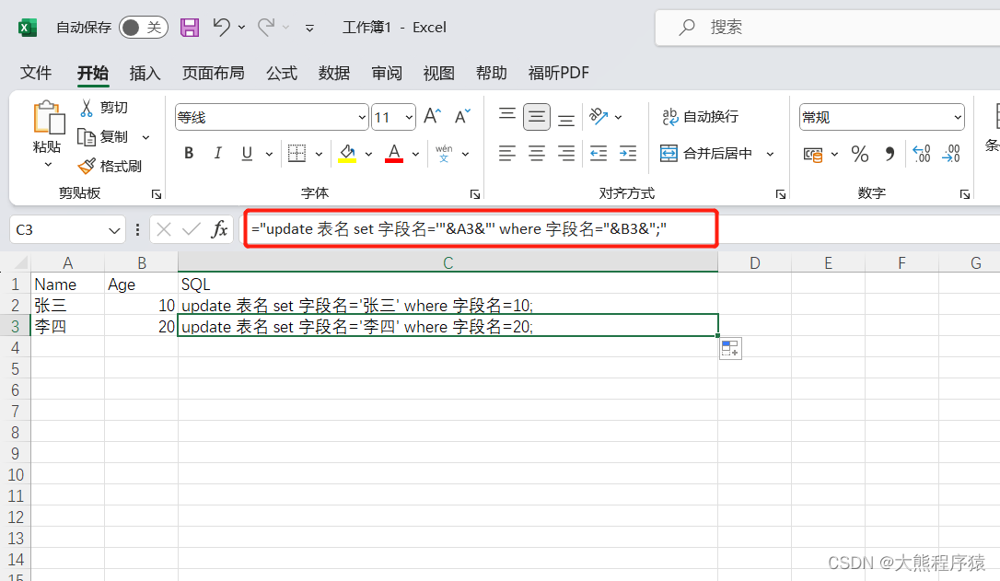

# execl批量生成sql语句

[附件: 账号sql.xlsx](./attachments/Zdnso8Aj-nP19_7a/账号sql.xlsx)[附件: 团队信息_BX - 账号导入版本.xls](./attachments/Zdnso8Aj-nP19_7a/团队信息_BX - 账号导入版本.xls)

```sql
="update 表名 set 字段名='"&C2&"' where 字段名='"&E2&"'"
```




> 更新: 2023-10-18 09:56:54  
> 原文: <https://www.yuque.com/lixinsi/hntyk2/gwqrgn68b7oz2hl8>