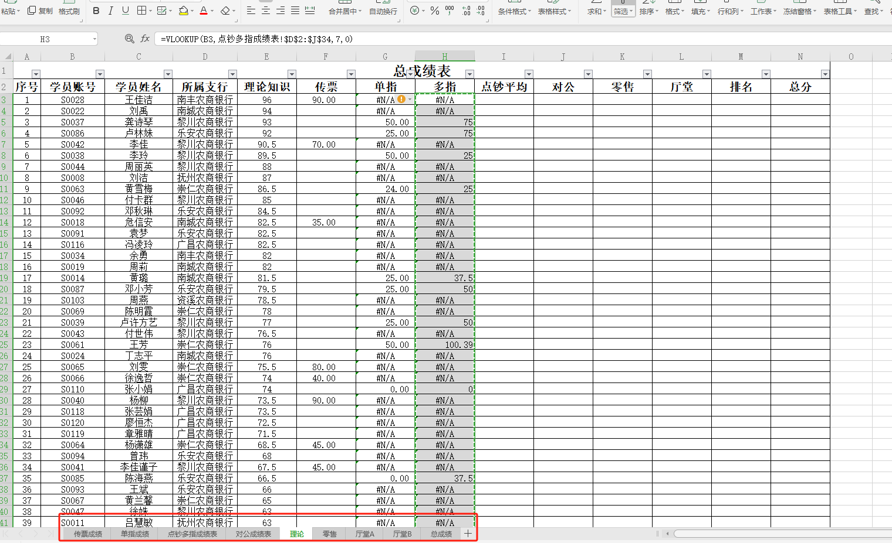
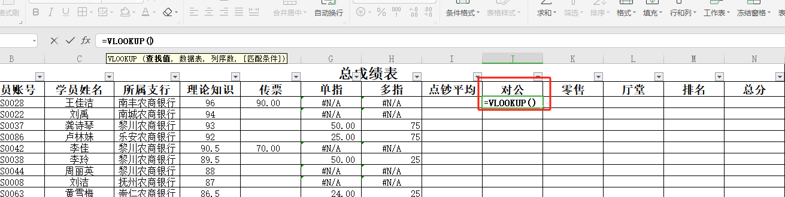
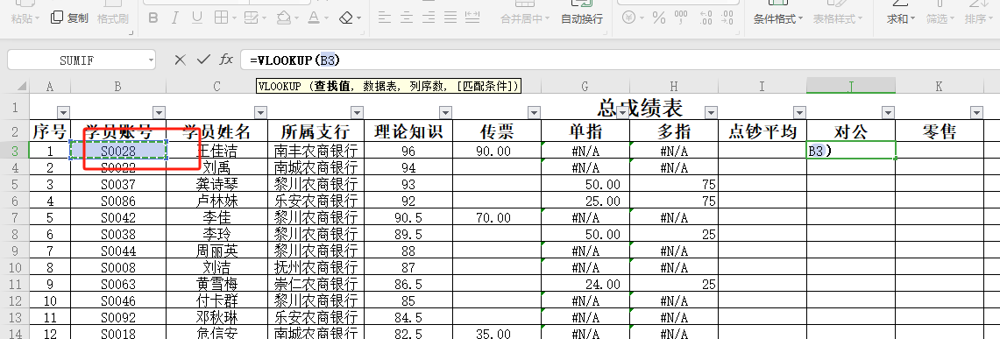
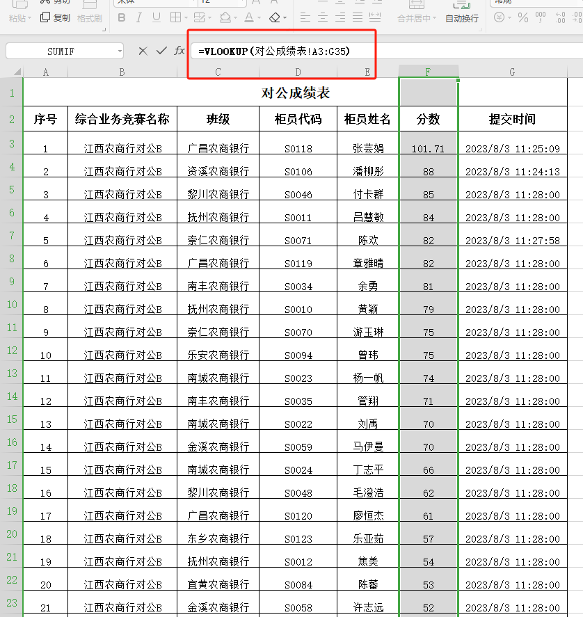
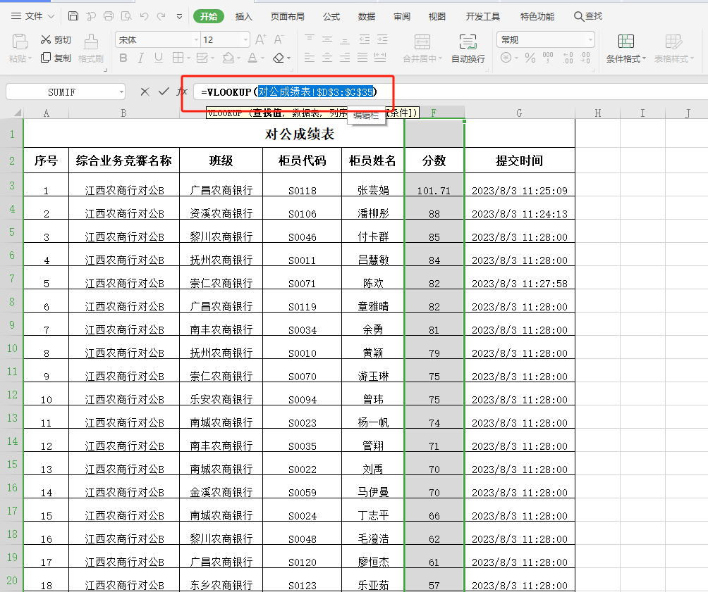
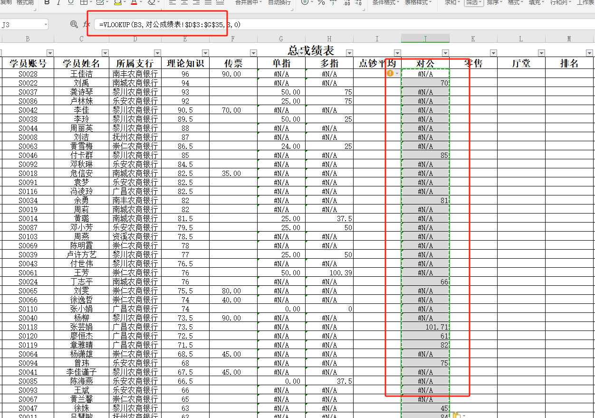
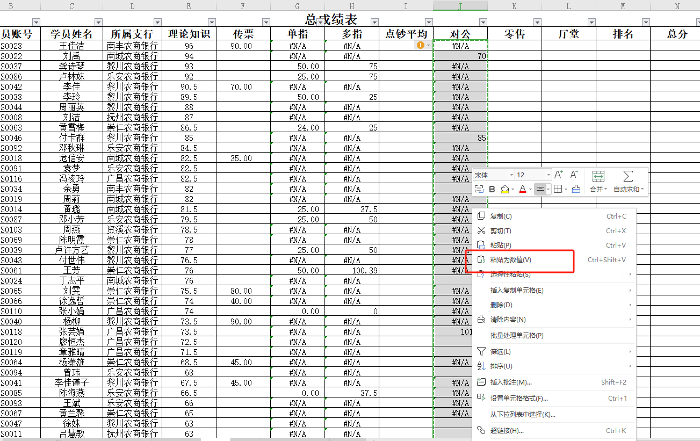

# execl表格

### 1. vlookup  
使用方法

新建一张总表，把各项成绩张贴进去如图

ctrl选中目标查找标识，加学生账号

找到对应的数据表格，全选匹配的所有数据未包含合并单元格。找到需要筛选的列和账号所在列。

把A3所在列改为账号所在列并且按f4取绝对值。

然后ctrl+c在ctrl+v张贴成数值

ctrl+h替换

> 更新: 2024-01-30 14:07:47  
> 原文: <https://www.yuque.com/lixinsi/hntyk2/fraw3r8tz2lchivx>