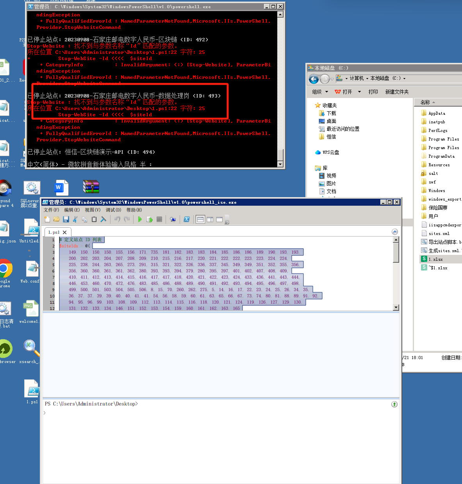

# iis指定停止脚本和powershell脚本，以及指定siteid打包删除

```powershell
# 定义站点 ID 列表
$siteIds = @(
    149, 150, 150, 150, 155, 156, 171, 735, 181, 182, 183, 183, 184, 185, 186, 186, 189, 190, 193, 193,
    200, 202, 203, 204, 207, 208, 209, 210, 215, 216, 217, 220, 221, 222, 222, 223, 223, 224, 224,
    225, 238, 244, 263, 265, 273, 291, 315, 321, 322, 326, 336, 337, 345, 349, 349, 351, 352, 355, 356,
    356, 360, 360, 361, 361, 362, 380, 393, 393, 394, 379, 280, 395, 397, 401, 402, 407, 408, 409,
    410, 411, 412, 413, 414, 415, 416, 417, 417, 418, 420, 421, 422, 423, 424, 433, 436, 441, 443, 444,
    446, 453, 460, 470, 472, 476, 483, 485, 486, 488, 489, 490, 491, 492, 493, 494, 495, 496, 497, 498,
    499, 500, 501, 503, 504, 505, 506, 8, 15, 70, 260, 262, 275, 5, 14, 16, 17, 22, 23, 24, 25, 26, 34, 35,
    36, 37, 37, 39, 39, 40, 40, 41, 41, 54, 56, 58, 59, 60, 61, 63, 65, 66, 67, 73, 74, 80, 81, 88, 89, 91, 92,
    94, 95, 96, 99, 103, 108, 109, 112, 113, 114, 115, 116, 118, 120, 121, 124, 119, 126, 127, 129, 130,
    131, 132, 133, 134, 146, 151, 152, 153, 154, 159, 160, 161, 162, 163, 165
)

# 导入 IIS 模块
Import-Module WebAdministration

# 遍历站点 ID 并停止它们
foreach ($siteId in $siteIds) {
    # 获取站点信息
    $site = Get-WebSite | Where-Object { $_.Id -eq $siteId }
    
    if ($site) {
        # 停止站点
        Stop-WebSite -Name $site.Name
        Write-Host "已停止站点: $($site.Name) (ID: $siteId)"
    } else {
        Write-Host "站点不存在 (ID: $siteId)"
    }
}

Write-Host "所有站点已处理完毕。"
```




### 指定 siteid 打包删除
### 先打包数据库用管理员权限运行 powershell
```powershell
# 检查是否可以加载 IIS 模块 WebAdministration
if (-not (Get-Module -ListAvailable -Name WebAdministration)) {
    Write-Host "未找到 WebAdministration 模块，尝试加载..."
    Import-Module WebAdministration
}

# 定义站点 ID 列表
$siteIds = @(
    12
    13
)

# 定义目标文件夹路径（备份目录）
$destinationFolder = "C:\bak"  # 目标备份文件夹路径

# 导入 IIS 模块
Import-Module WebAdministration

# 遍历站点 ID 并打包站点
foreach ($siteId in $siteIds) {
    # 获取站点信息
    $site = Get-WebSite | Where-Object { $_.Id -eq $siteId }

    if ($site) {
        # 获取站点的物理路径
        $siteRoot = $site.physicalPath

        # 获取站点的绑定信息
        $bindings = $site.bindings.binding | Where-Object { $_.protocol -eq "http" }
        $bindingsInfo = $bindings.bindingInformation -join "_"

        if (Test-Path $siteRoot) {
            # 创建存储备份的文件夹（如果不存在）
            $backupFolder = Join-Path -Path $destinationFolder -ChildPath $site.Name
            if (-not (Test-Path $backupFolder)) {
                New-Item -Path $backupFolder -ItemType Directory
            }

            # 创建压缩包的文件名（SiteName_Bindings.zip）
            $zipFileName = "$($site.Name)_$($bindingsInfo).zip"
            $zipFilePath = Join-Path -Path $backupFolder -ChildPath $zipFileName

            # 打包站点文件
            Compress-Archive -Path $siteRoot -DestinationPath $zipFilePath

            Write-Host "站点 $($site.Name) (ID: $siteId) 已打包并保存到: $zipFilePath"

            # 删除站点目录下的所有文件
            try {
                Remove-Item -Path $siteRoot\* -Recurse -Force
                Write-Host "已删除站点目录下的所有文件: $siteRoot"
            } catch {
                Write-Host "删除站点目录文件时发生错误: $($_.Exception.Message)"
            }
        } else {
            Write-Host "站点目录不存在: $($site.Name) (ID: $siteId)"
        }
    } else {
        Write-Host "未找到站点 (ID: $siteId)"
    }
}

Write-Host "所有站点已处理完毕。"

```

### 只打包不删除目录下面的所有文件
```powershell
# 确保加载 IIS WebAdministration 模块
if (-not (Get-Module -ListAvailable -Name WebAdministration)) {
    Write-Host "未找到 WebAdministration 模块，尝试加载..."
    Import-Module WebAdministration
}

# 确保 IIS 服务正在运行
if (-not (Get-Service -Name W3SVC).Status -eq 'Running') {
    Write-Host "IIS 服务未运行，请启动 IIS 服务。"
    exit
}

# 定义站点 ID 列表
$siteIds = @(
    23
    24
    25
    29
    31
    32
    33
    34
    36
    39
    
)

# 定义目标文件夹路径（备份目录）
$destinationFolder = "D:\bak"  # 目标备份文件夹路径

# 遍历站点 ID 并打包站点
foreach ($siteId in $siteIds) {
    # 获取站点信息
    $site = Get-Website | Where-Object { $_.Id -eq $siteId }

    if ($site) {
        # 获取站点的物理路径
        $siteRoot = $site.physicalPath

        # 获取站点的绑定信息
        $bindings = $site.bindings.binding | Where-Object { $_.protocol -eq "http" }
        $bindingsInfo = $bindings.bindingInformation -join "_"

        if (Test-Path $siteRoot) {
            # 创建存储备份的文件夹（如果不存在）
            $backupFolder = Join-Path -Path $destinationFolder -ChildPath $site.Name
            if (-not (Test-Path $backupFolder)) {
                New-Item -Path $backupFolder -ItemType Directory
            }

            # 创建压缩包的文件名（SiteName_Bindings.zip）
            $zipFileName = "$($site.Name)_$($bindingsInfo).zip"
            $zipFilePath = Join-Path -Path $backupFolder -ChildPath $zipFileName

            # 打包站点文件
            Compress-Archive -Path $siteRoot -DestinationPath $zipFilePath

            Write-Host "站点 $($site.Name) (ID: $siteId) 已打包并保存到: $zipFilePath"
        } else {
            Write-Host "站点目录不存在: $($site.Name) (ID: $siteId)"
        }
    } else {
        Write-Host "未找到站点 (ID: $siteId)"
    }
}

Write-Host "所有站点已处理完毕。"

```


### powershell 提取 webconfig 的数据库
```plain
# ==========================================
# 脚本名称：Get-IIS-DBNames-Advanced-Fixed.ps1
# 功能：全面提取 IIS 站点数据库名 (修复版)
# ==========================================

# 1. 定义域名列表
$domains = @(
    "sxkfdxht.dianyuesoft.com", "sxkfdxapi.dianyuesoft.com", "zbapk.dianyuesoft.com",
    "sxkfdxjxqd.dianyuesoft.com", "sxkfdxgjqd.dianyuesoft.com", "sxkfdxglqd.dianyuesoft.com",
    "sxkfdxsy.dianyuesoft.com", "kjdskhjmht.dianyuesoft.com", "kjdskhjmapi.dianyuesoft.com",
    "kjdskhjmqd.dianyuesoft.com", "sjzbsjapi.dianyuesoft.com", "zjjr.gsstu.dianyuesoft.com",
    "zjgsjf.dianyuesoft.com", "jrszjm.zjgs.dianyuesoft.com", "zntg.zjgs.dianyuesoft.com",
    "jrhysjfx.zjgs.dianyuesoft.com", "jrssxsdll.occupationedu.com", "jrsshtll.occupationedu.com",
    "jrssapill.occupationedu.com", "jrssdatall.occupationedu.com", "jscjzy.yljrsjk.dianyueyun.com"
)

# 2. 设置输出
$outputDir = "C:\IIS_DB_Export"
if (-not (Test-Path $outputDir)) { 
    New-Item -ItemType Directory -Path $outputDir | Out-Null 
}
$outputFile = Join-Path $outputDir "DatabaseNames_Full_$(Get-Date -Format 'yyyyMMdd_HHmmss').txt"

# 导入模块
try { 
    Import-Module WebAdministration -ErrorAction Stop 
} catch { 
    Write-Host "错误：无法加载 WebAdministration 模块" -ForegroundColor Red
    exit 
}

# 初始化报告
$header = @"
========================================
IIS 数据库名称提取报告 (增强版 - 已修复)
生成时间：$(Get-Date -Format 'yyyy-MM-dd HH:mm:ss')
支持格式：web.config, appsettings*.json, *.config
========================================

"@
Set-Content -Path $outputFile -Value $header -Encoding UTF8
Write-Host "开始扫描 $($domains.Count) 个域名..." -ForegroundColor Green

# --- 辅助函数：从 JSON 内容递归查找连接字符串 ---
function Find-DbInJson {
    param($JsonObject, [System.Collections.ArrayList]$foundDbs)

    if ($null -eq $JsonObject) { return }

    # 如果是字典对象
    if ($JsonObject -is [System.Management.Automation.PSCustomObject]) {
        $props = $JsonObject.PSObject.Properties
        foreach ($prop in $props) {
            $name = $prop.Name
            $value = $prop.Value

            # 情况 A: 键名包含 "ConnectionStrings" 或 "Database" 且值是字符串
            if (($name -match "connectionstrings|database") -and ($value -is [string])) {
                Add-ConnString $value $foundDbs
            }
            
            # 情况 B: 键名完全匹配 "ConnectionStrings" 且值是对象
            if (($name -eq "ConnectionStrings") -and ($value -is [System.Management.Automation.PSCustomObject])) {
                Find-DbInJson $value $foundDbs
            }

            # 递归搜索子对象
            if (($value -is [System.Management.Automation.PSCustomObject]) -or ($value -is [System.Collections.IList])) {
                Find-DbInJson $value $foundDbs
            }
        }
    }
    # 如果是列表/数组
    elseif ($JsonObject -is [System.Collections.IList]) {
        foreach ($item in $JsonObject) {
            Find-DbInJson $item $foundDbs
        }
    }
}

# --- 辅助函数：从连接字符串文本中提取数据库名 ---
function Add-ConnString {
    param([string]$connStr, [System.Collections.ArrayList]$foundDbs)
    
    if ([string]::IsNullOrWhiteSpace($connStr)) { return }

    # 定义正则模式 (使用 Here-String 避免引号冲突)
    $pattern1 = @'
Initial\s+Catalog\s*=\s*["']?([^;'"'\s]+)["']?
'@
    $pattern2 = @'
Database\s*=\s*["']?([^;'"'\s]+)["']?
'@

    $patterns = @($pattern1, $pattern2)

    foreach ($pattern in $patterns) {
        # 移除模式中的换行符
        $cleanPattern = $pattern -replace "`n", "" -replace "`r", ""
        
        $match = [regex]::Match($connStr, $cleanPattern, [System.Text.RegularExpressions.RegexOptions]::IgnoreCase)
        if ($match.Success) {
            $dbName = $match.Groups[1].Value
            if ($dbName -and -not $foundDbs.Contains($dbName)) {
                $foundDbs.Add($dbName) | Out-Null
            }
            return 
        }
    }
}

# --- 主循环 ---
foreach ($domain in $domains) {
    Write-Host "`n----------------------------------------" -ForegroundColor Cyan
    Write-Host "检查域名：$domain" -ForegroundColor Yellow
    
    $sites = Get-ChildItem IIS:\Sites | Where-Object {
        $_.Bindings.Collection | Where-Object { $_.bindingInformation -like "*$domain*" }
    }

    if (-not $sites) {
        Add-Content $outputFile "[$domain] -> 未找到站点"
        continue
    }

    foreach ($site in $sites) {
        $path = $site.PhysicalPath
        if ($path -like "%*%") { 
            $path = [Environment]::ExpandEnvironmentVariables($path) 
        }
        
        if (-not (Test-Path $path)) { 
            continue 
        }

        Write-Host "  站点：$($site.Name) | 路径：$path" -ForegroundColor Gray
        
        $allFoundDbs = New-Object System.Collections.ArrayList
        $scannedFiles = New-Object System.Collections.ArrayList

        # 1. 扫描 web.config 和其他 .config 文件
        # 注意：这里限制了深度，防止扫描太多无关文件
        $configFiles = Get-ChildItem -Path $path -Filter "*.config" -File -ErrorAction SilentlyContinue
        
        # 简单过滤：只取根目录或名为 web.config 或包含 connection 的文件
        $configFiles = $configFiles | Where-Object { 
            $_.DirectoryName -eq $path -or 
            $_.Name -eq "web.config" -or 
            $_.Name -like "*connection*.config"
        }

        foreach ($cfg in $configFiles) {
            try {
                $content = Get-Content $cfg.FullName -Raw -Encoding UTF8 -ErrorAction Stop
                $scannedFiles.Add($cfg.Name) | Out-Null
                
                # 【修复点】使用 Here-String 定义正则，避免引号冲突
                $xmlPattern = @'
connectionString\s*=\s*["']([^"']+)
'@
                $cleanXmlPattern = $xmlPattern -replace "`n", "" -replace "`r", ""

                $matches = [regex]::Matches($content, $cleanXmlPattern, [System.Text.RegularExpressions.RegexOptions]::IgnoreCase)
                foreach ($m in $matches) {
                    if ($m.Groups.Count -gt 1) {
                        Add-ConnString $m.Groups[1].Value $allFoundDbs
                    }
                }
            } catch {
                # 忽略读取错误的文件
            }
        }

        # 2. 扫描 appsettings*.json
        $jsonFiles = Get-ChildItem -Path $path -Filter "appsettings*.json" -File -ErrorAction SilentlyContinue
        foreach ($json in $jsonFiles) {
            try {
                $jsonContent = Get-Content $json.FullName -Raw -Encoding UTF8 -ErrorAction Stop
                $scannedFiles.Add($json.Name) | Out-Null
                
                $jsonObj = ConvertFrom-Json $jsonContent -ErrorAction Stop
                Find-DbInJson $jsonObj $allFoundDbs
            } catch {
                # JSON 解析失败跳过
            }
        }

        # 输出结果
        if ($allFoundDbs.Count -gt 0) {
            # 【修复点】确保 Join 操作安全
            $dbList = $allFoundDbs -join ", "
            $msg = "[$domain] ($($site.Name)) -> 发现数据库：$dbList"
            Write-Host "  $msg" -ForegroundColor Green
            
            $detail = "扫描文件：$($scannedFiles -join ', ')"
            Write-Host "  $detail" -ForegroundColor DarkGray
            
            Add-Content $outputFile $msg
            Add-Content $outputFile "  来源文件：$($scannedFiles -join ', ')"
        } else {
            $fileList = $scannedFiles -join ', '
            if ([string]::IsNullOrWhiteSpace($fileList)) { $fileList = "无配置文件" }
            
            $msg = "[$domain] ($($site.Name)) -> 未找到数据库配置 (已扫描：$fileList)"
            Write-Host "  $msg" -ForegroundColor DarkYellow
            Add-Content $outputFile $msg
        }
    }
}

Write-Host "`n========================================" -ForegroundColor Green
# 【修复点】确保字符串闭合
Write-Host "完成！报告保存至：$outputFile" -ForegroundColor Cyan
Write-Host "========================================" -ForegroundColor Green
```


### 功能：全磁盘扫描备份数据库 + 安全删除 (支持 D/E/F 盘)
```plain
# ==========================================
# 脚本名称：Backup-And-Remove-Final.ps1
# 功能：全磁盘扫描备份数据库 + 安全删除 (支持 D/E/F 盘)
# ==========================================

# 1. 权限检查
if (-not ([Security.Principal.WindowsPrincipal] [Security.Principal.WindowsIdentity]::GetCurrent()).IsInRole([Security.Principal.WindowsBuiltInRole] "Administrator")) {
    Write-Host "❌ 错误：请以管理员身份运行此脚本！" -ForegroundColor Red
    exit 1
}

try { Import-Module WebAdministration -ErrorAction Stop } 
catch { Write-Host "❌ 无法加载 WebAdministration 模块" -ForegroundColor Red; exit }

# 2. 定义 Site ID 列表 (已去重排序)
$siteIdsRaw = @(8,9,12,13,13,17,18,19,21,21,23,24,25,29,31,32,33,34,34,36,39,54,55,56,57,58,59,60,61,62,88,93,94,95,96,99,101,102,102,103,10,11,14,15,51)
$siteIdsToProcess = $siteIdsRaw | Sort-Object -Unique

# 3. 设置输出路径
$backupDir = "C:\IIS_Cleanup_Backup"
if (-not (Test-Path $backupDir)) { New-Item -ItemType Directory -Path $backupDir | Out-Null }
$timeStamp = Get-Date -Format "yyyyMMdd_HHmmss"
$dbReportFile = Join-Path $backupDir "DB_Connections_$timeStamp.txt"
$logFile = Join-Path $backupDir "Cleanup_Log_$timeStamp.txt"

Write-Host "========================================" -ForegroundColor Cyan
Write-Host "阶段 1: 正在扫描并备份数据库配置..." -ForegroundColor Yellow
Write-Host "支持盘符：C:, D:, E:, F: 等所有分区" -ForegroundColor Gray
Write-Host "========================================" -ForegroundColor Cyan

# --- 辅助函数：提取数据库名 ---
function Extract-DbName {
    param([string]$content)
    $patterns = @(
        'Initial\s+Catalog\s*=\s*["'']?([^;''"\s]+)["'']?',
        'Database\s*=\s*["'']?([^;''"\s]+)["'']?'
    )
    foreach ($p in $patterns) {
        # 清理正则中的换行符以防万一
        $cleanP = $p -replace "`n","" -replace "`r",""
        $m = [regex]::Match($content, $cleanP, [System.Text.RegularExpressions.RegexOptions]::IgnoreCase)
        if ($m.Success) { return $m.Groups[1].Value }
    }
    return $null
}

# --- 辅助函数：递归查找 JSON 中的 DB ---
function Find-DbInJson {
    param($obj, [System.Collections.ArrayList]$dbs)
    if ($null -eq $obj) { return }
    if ($obj -is [PSCustomObject]) {
        foreach ($prop in $obj.PSObject.Properties) {
            if (($prop.Name -match "connectionstrings|database") -and ($prop.Value -is [string])) {
                $db = Extract-DbName $prop.Value
                if ($db -and -not $dbs.Contains($db)) { $dbs.Add($db) | Out-Null }
            }
            if ($prop.Value -is [PSCustomObject] -or $prop.Value -is [System.Collections.IList]) {
                Find-DbInJson $prop.Value $dbs
            }
        }
    } elseif ($obj -is [System.Collections.IList]) {
        foreach ($item in $obj) { Find-DbInJson $item $dbs }
    }
}

# 初始化报告
$header = @"
========================================
IIS 站点数据库配置备份报告 (全磁盘版)
生成时间：$(Get-Date -Format 'yyyy-MM-dd HH:mm:ss')
涉及 Site IDs: $($siteIdsToProcess -join ', ')
========================================

"@
Set-Content -Path $dbReportFile -Value $header -Encoding UTF8

$allSites = Get-ChildItem IIS:\Sites
$sitesToDelete = New-Object System.Collections.ArrayList

foreach ($id in $siteIdsToProcess) {
    $site = $allSites | Where-Object { $_.Id -eq $id }
    if (-not $site) { 
        Write-Host "  ⚠️ Site ID $id 未找到，跳过" -ForegroundColor DarkGray
        continue 
    }

    $path = $site.PhysicalPath
    if ($path -like "%*%") { $path = [Environment]::ExpandEnvironmentVariables($path) }
    
    # 标准化路径格式 (去除末尾斜杠)
    $path = $path.TrimEnd('\')

    if (-not (Test-Path $path)) { 
        Write-Host "  ⚠️ 路径不存在：$path" -ForegroundColor DarkYellow
        continue 
    }

    $foundDbs = New-Object System.Collections.ArrayList
    $filesScanned = New-Object System.Collections.ArrayList

    # 扫描 .config 文件 (限制深度以避免扫描 node_modules 等大文件夹)
    $configs = Get-ChildItem -Path $path -Filter "*.config" -File -ErrorAction SilentlyContinue -Depth 2 | 
               Where-Object { 
                   $_.DirectoryName -eq $path -or 
                   $_.Name -eq "web.config" -or 
                   $_.Name -like "*connection*" 
               }
    
    foreach ($cfg in $configs) {
        try {
            $content = Get-Content $cfg.FullName -Raw -Encoding UTF8 -ErrorAction Stop
            $filesScanned.Add($cfg.Name) | Out-Null
            # 修复正则引号问题
            $matches = [regex]::Matches($content, 'connectionString\s*=\s*["'']([^"'']+)', [System.Text.RegularExpressions.RegexOptions]::IgnoreCase)
            foreach ($m in $matches) {
                if ($m.Groups.Count -gt 1) {
                    $db = Extract-DbName $m.Groups[1].Value
                    if ($db -and -not $foundDbs.Contains($db)) { $foundDbs.Add($db) | Out-Null }
                }
            }
        } catch {}
    }

    # 扫描 appsettings*.json
    $jsons = Get-ChildItem -Path $path -Filter "appsettings*.json" -File -ErrorAction SilentlyContinue
    foreach ($js in $jsons) {
        try {
            $content = Get-Content $js.FullName -Raw -Encoding UTF8 -ErrorAction Stop
            $filesScanned.Add($js.Name) | Out-Null
            $jsonObj = ConvertFrom-Json $content -ErrorAction Stop
            Find-DbInJson $jsonObj $foundDbs
        } catch {}
    }

    # 记录结果
    $dbList = $foundDbs -join ", "
    if ([string]::IsNullOrWhiteSpace($dbList)) { $dbList = "未检测到明显数据库名" }
    
    $reportLine = "Site ID: $id | 名称：$($site.Name)`n  路径：$path`n  扫描文件：$($filesScanned -join ', ')`n  发现数据库：$dbList`n----------------------------------------"
    Add-Content -Path $dbReportFile -Value $reportLine
    
    Write-Host "  [ID:$id] $($site.Name) -> 发现数据库：$dbList" -ForegroundColor Green
    
    # 添加到待删除列表
    $sitesToDelete.Add($site) | Out-Null
}

Write-Host "`n✅ 数据库配置备份完成！" -ForegroundColor Green
Write-Host "📄 报告已保存至：$dbReportFile" -ForegroundColor Cyan
Write-Host "`n⚠️ 请打开上述文件确认数据库信息已备份。" -ForegroundColor Yellow
Write-Host "确认无误后，输入 YES 继续删除操作..." -ForegroundColor Red
Write-Host "========================================" -ForegroundColor Cyan

# 4. 最终确认
$confirmation = Read-Host "⚠️ 警告：即将永久删除 $($sitesToDelete.Count) 个站点及其文件 (包括 D:/E:/F: 盘)。输入 'YES' 确认执行"

if ($confirmation -ne "YES") {
    Write-Host "❌ 操作已取消。未删除任何内容。" -ForegroundColor Red
    exit
}

Write-Host "`n========================================" -ForegroundColor Cyan
Write-Host "阶段 2: 开始执行删除操作..." -ForegroundColor Yellow
Write-Host "========================================" -ForegroundColor Cyan

Set-Content -Path $logFile -Value "=== 删除日志 (全磁盘版) ===" -Encoding UTF8
Add-Content -Path $logFile -Value "开始时间：$(Get-Date)" -Encoding UTF8

foreach ($site in $sitesToDelete) {
    $id = $site.Id
    $name = $site.Name
    $pool = $site.ApplicationPool
    $phyPath = $site.PhysicalPath
    if ($phyPath -like "%*%") { $phyPath = [Environment]::ExpandEnvironmentVariables($phyPath) }
    $phyPath = $phyPath.TrimEnd('\')

    Write-Host "`n[处理 Site ID: $id] $name" -ForegroundColor Cyan
    Write-Host "  目标路径：$phyPath" -ForegroundColor Gray

    # A. 删除站点
    try {
        Remove-Item "IIS:\Sites\$name" -Force -ErrorAction Stop
        Write-Host "  ✅ 站点已删除" -ForegroundColor Green
        Add-Content $logFile "[$id] $name - 站点已删除"
    } catch {
        Write-Host "  ❌ 站点删除失败：$($_.Exception.Message)" -ForegroundColor Red
        Add-Content $logFile "[$id] $name - 站点删除失败：$($_.Exception.Message)"
        continue
    }

    # B. 删除应用池
    if ($pool) {
        # 重新获取最新站点列表检查占用
        $currentSites = Get-ChildItem IIS:\Sites
        $used = $currentSites | Where-Object { $_.ApplicationPool -eq $pool }
        
        if (-not $used) {
            try {
                Remove-WebAppPool -Name $pool -ErrorAction Stop
                Write-Host "  ✅ 应用池 '$pool' 已删除" -ForegroundColor Green
                Add-Content $logFile "[$id] $name - 应用池 $pool 已删除"
            } catch {
                Write-Host "  ⚠️ 应用池删除失败：$($_.Exception.Message)" -ForegroundColor DarkYellow
            }
        } else {
            Write-Host "  ℹ️ 应用池 '$pool' 仍被其他站点使用，保留" -ForegroundColor DarkCyan
        }
    }

    # C. 删除文件 (增强版安全检查)
    if ($phyPath) {
        $drive = Split-Path $phyPath -Qualifier # 获取盘符，如 "D:"
        $rootCheck = $phyPath.TrimEnd('\')
        
        # 【新安全逻辑】
        # 1. 禁止删除根目录 (如 "D:\", "C:\")
        # 2. 禁止删除 C 盘特定系统目录
        $isRoot = ($rootCheck -eq "$drive\") -or ($rootCheck -eq $drive)
        $isSystemCore = ($phyPath -like "C:\Windows*") -or ($phyPath -like "C:\Program Files*") -or ($phyPath -eq "C:\")
        
        if ($isRoot) {
            Write-Host "  🛑 拒绝删除：不能删除磁盘根目录 ($phyPath)" -ForegroundColor Red
            Add-Content $logFile "[$id] $name - 跳过：尝试删除根目录 $phyPath"
        } elseif ($isSystemCore) {
            Write-Host "  🛑 拒绝删除：不能删除系统核心目录 ($phyPath)" -ForegroundColor Red
            Add-Content $logFile "[$id] $name - 跳过：尝试删除系统目录 $phyPath"
        } else {
            # 安全，执行删除
            if (Test-Path $phyPath) {
                try {
                    Remove-Item -Path $phyPath -Recurse -Force -ErrorAction Stop
                    Write-Host "  ✅ 目录已清空：$phyPath" -ForegroundColor Green
                    Add-Content $logFile "[$id] $name - 目录 $phyPath 已清空"
                } catch {
                    Write-Host "  ❌ 目录删除失败：$($_.Exception.Message)" -ForegroundColor Red
                    Add-Content $logFile "[$id] $name - 目录删除失败：$($_.Exception.Message)"
                }
            } else {
                Write-Host "  ℹ️ 目录不存在 (可能已被手动删除)" -ForegroundColor DarkGray
            }
        }
    }
}

Write-Host "`n========================================" -ForegroundColor Green
Write-Host "🎉 所有任务完成！" -ForegroundColor Green
Write-Host "日志：$logFile" -ForegroundColor Gray
Write-Host "========================================" -ForegroundColor Green
```


### 功能：根据 Site ID 停止站点和应用池
```plain
# ==========================================
# 脚本名称：Stop-Sites-Fixed-NoCmdlet.ps1
# 功能：根据 Site ID 停止站点和应用池 (兼容版：不使用 Get-WebAppPool)
# ==========================================

# 1. 权限检查
if (-not ([Security.Principal.WindowsPrincipal] [Security.Principal.WindowsIdentity]::GetCurrent()).IsInRole([Security.Principal.WindowsBuiltInRole] "Administrator")) {
    Write-Host "❌ 错误：请以管理员身份运行此脚本！" -ForegroundColor Red
    exit 1
}

try { Import-Module WebAdministration -ErrorAction Stop } 
catch { 
    Write-Host "⚠️ 警告：WebAdministration 模块加载异常，尝试继续..." -ForegroundColor Yellow
}

# 2. 定义 Site ID 列表
$siteIdsRaw = @(1, 37, 37, 52, 78, 78, 79, 79, 79, 2, 3, 4, 7)
$siteIdsToProcess = $siteIdsRaw | Sort-Object -Unique

Write-Host "========================================" -ForegroundColor Cyan
Write-Host "任务：停止指定 Site ID 的站点和应用池" -ForegroundColor Yellow
Write-Host "目标 IDs: $($siteIdsToProcess -join ', ')" -ForegroundColor White
Write-Host "模式：🟢 兼容模式 (直接操作 IIS 驱动器)" -ForegroundColor Green
Write-Host "========================================" -ForegroundColor Cyan

# 日志设置
$logDir = "C:\IIS_Operations"
if (-not (Test-Path $logDir)) { New-Item -ItemType Directory -Path $logDir | Out-Null }
$logFile = Join-Path $logDir "Stop_Sites_Fixed_$(Get-Date -Format 'yyyyMMdd_HHmmss').txt"

Set-Content -Path $logFile -Value "=== IIS 停止操作日志 (兼容修复版) ===" -Encoding UTF8
Add-Content -Path $logFile -Value "开始时间：$(Get-Date)" -Encoding UTF8
Add-Content -Path $logFile -Value "----------------------------------------" -Encoding UTF8

$processedPools = New-Object System.Collections.ArrayList

foreach ($id in $siteIdsToProcess) {
    Write-Host "`n[处理 Site ID: $id]" -ForegroundColor Cyan
    
    # 获取站点
    $allSites = Get-ChildItem IIS:\Sites -ErrorAction SilentlyContinue
    $site = $allSites | Where-Object { $_.Id -eq $id }

    if (-not $site) {
        Write-Host "  ⚠️ 未找到 ID 为 $id 的站点" -ForegroundColor DarkGray
        Add-Content $logFile "[ID:$id] 未找到站点"
        continue
    }

    $siteName = $site.Name
    $poolName = $site.ApplicationPool
    $currentStatus = $site.State

    Write-Host "  找到站点：$siteName (状态：$currentStatus)" -ForegroundColor White

    # --- 步骤 A: 停止站点 ---
    if ($currentStatus -eq "Started") {
        try {
            Stop-WebSite -Name $siteName -ErrorAction SilentlyContinue
            # 双重保险：直接修改状态属性 (2 = Stopped)
            Set-ItemProperty "IIS:\Sites\$siteName" -name State -Value 2 -ErrorAction SilentlyContinue
            Write-Host "  ✅ 站点 '$siteName' 已停止" -ForegroundColor Green
            Add-Content $logFile "[ID:$id] 站点 '$siteName' 已停止"
        } catch {
            Write-Host "  ❌ 停止站点失败：$($_.Exception.Message)" -ForegroundColor Red
            Add-Content $logFile "[ID:$id] 站点 '$siteName' 停止失败：$($_.Exception.Message)"
        }
    } else {
        Write-Host "  ℹ️ 站点已是停止状态" -ForegroundColor DarkYellow
        Add-Content $logFile "[ID:$id] 站点 '$siteName' 已是停止状态"
    }

    # --- 步骤 B: 停止应用池 (修复版：不使用 Get-WebAppPool) ---
    if ($poolName) {
        if (-not $processedPools.Contains($poolName)) {
            $poolPath = "IIS:\AppPools\$poolName"
            
            # 检查应用池路径是否存在
            if (Test-Path $poolPath) {
                try {
                    # 获取当前状态 (1=Started, 2=Stopped)
                    $currentState = (Get-ItemProperty $poolPath -ErrorAction Stop).State
                    
                    if ($currentState -eq 1) {
                        # 直接设置状态为 2 (Stopped)
                        Set-ItemProperty $poolPath -name State -Value 2 -ErrorAction Stop
                        Write-Host "  ✅ 应用池 '$poolName' 已停止" -ForegroundColor Green
                        Add-Content $logFile "[ID:$id] 应用池 '$poolName' 已停止"
                    } else {
                        Write-Host "  ℹ️ 应用池 '$poolName' 已经是停止状态" -ForegroundColor DarkGray
                        Add-Content $logFile "[ID:$id] 应用池 '$poolName' 已是停止状态"
                    }
                } catch {
                    Write-Host "  ⚠️ 操作应用池 '$poolName' 时出错：$($_.Exception.Message)" -ForegroundColor DarkYellow
                    Add-Content $logFile "[ID:$id] 应用池 '$poolName' 操作失败：$($_.Exception.Message)"
                }
            } else {
                Write-Host "  ⚠️ 未找到应用池路径：$poolPath" -ForegroundColor DarkYellow
                Add-Content $logFile "[ID:$id] 未找到应用池路径：$poolPath"
            }
            
            $processedPools.Add($poolName) | Out-Null
        } else {
            Write-Host "  ℹ️ 应用池 '$poolName' 已在本轮操作中处理过，跳过" -ForegroundColor DarkGray
        }
    }
}

Write-Host "`n========================================" -ForegroundColor Green
Write-Host "🎉 所有任务完成！" -ForegroundColor Green
Write-Host "📄 日志文件：$logFile" -ForegroundColor Gray
Write-Host "========================================" -ForegroundColor Green
```


> 更新: 2026-03-11 09:22:39  
> 原文: <https://www.yuque.com/lixinsi/hntyk2/vgx1ugm0ro09vs6s>