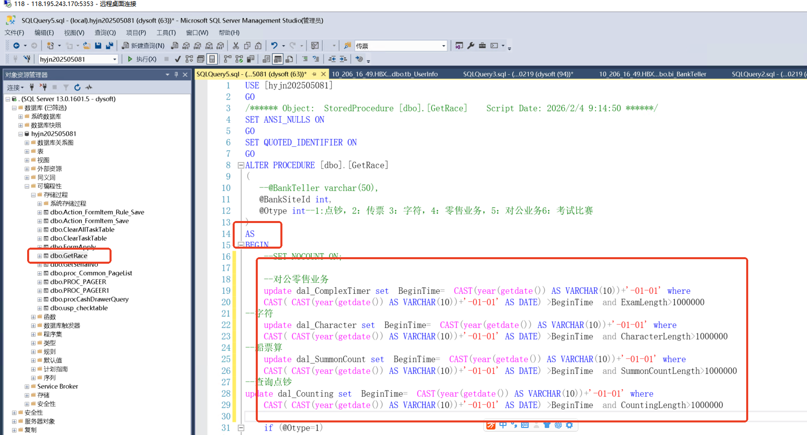

# iis查找web.config db

### 1.数据清洗提示词，
```powershell
帮我输出txt格式
```

```powershell
然后帮我去掉技能网址：，https://，/Logon，http://，/Logon ，/
```

### 2.python 批量 ping 脚本
```powershell
帮我ping一下这些域名整理一个服务器对应域名的表格
```

```powershell
import pandas as pd
import socket
from ping3 import ping
from datetime import datetime
import warnings
warnings.filterwarnings('ignore')

# 域名列表（已去重整理）
domains = [
    "adfdv.occupationedu.com",
    "tsnewjn.occupationedu.com",
    "hengppxjn.occupationedu.com",
    "kmljn.occupationedu.com",
    "kskt2023.occupationedu.com",
    "hdnxy2023jn.occupationedu.com",
    "kjhba.occupationedu.com",
    "2023hbnh2.occupationedu.com",
    "uytdf.occupationedu.com",
    "jrjyzxnxy.dianyueyun.com",
    "hdsffkqnxy.dianyuesoft.com",
    "2024alkeqjn.dianyueyun.com",
    "dqnshjn.dianyueyun.com",
    "hh.jn.dianyueyun.com",
    "wd240619jn.dianyueyun.com",
    "hbjn.dianyueyun.com",
    "wd24080101jn.dianyueyun.com",
    "wd240809jn.dianyueyun.com",
    "wd240812jn.dianyueyun.com",
    "wd24100902jn.dianyueyun.com",
    "wd241018jn.dianyueyun.com",
    "192.168.5.251",  # 内网IP（移除端口）
    "wd24110401jn.dianyueyun.com",
    "wd241119jn.dianyueyun.com",
    "wd24111904jn.dianyueyun.com",
    "wd241120jn.dianyueyun.com",
    "wd24112001jn.dianyueyun.com",
    "wd241206jn.dianyueyun.com",
    "wd24120603jn.dianyueyun.com",
    "wd241209jn.dianyueyun.com",
    "wd241218jn.dianyueyun.com",
    "wd250113jn.dianyueyun.com",
    "wd250114jn.dianyueyun.com",
    "wd250115jn.dianyueyun.com",
    "wd250305jn.dianyueyun.com",
    "wd250218jn.dianyueyun.com",
    "wd250227jn.dianyueyun.com",
    "wd250228jn.dianyueyun.com",
    "wd250306jn.dianyueyun.com",
    "wd250312jn.dianyueyun.com",
    "wd25031201jn.dianyueyun.com",
    "wd250313jn.dianyueyun.com",
    "wd250327jn.dianyueyun.com",
    "wd25042201jn.dianyueyun.com",
    "wd25042202jn.dianyueyun.com",
    "wd25042302jn.dianyueyun.com",
    "wd250424jn.dianyueyun.com",
    "wd250516jn.dianyueyun.com",
    "wd25052101jn.dianyueyun.com",
    "wd25052102jn.dianyueyun.com",
    "wd241008jn.dianyueyun.com",
    "wd250528jn.dianyueyun.com",
    "wd250529jn.dianyueyun.com",
    "wd25052902jn.dianyueyun.com",
    "wd25052903jn.dianyueyun.com",
    "wd25060503jn.dianyueyun.com",
    "wd25060501jn.dianyueyun.com",
    "wd25060502jn.dianyueyun.com",
    "wd25060504jn.dianyueyun.com",
    "wd250618jn.dianyueyun.com",
    "wd250620jn.dianyueyun.com",
    "wd250710jn.dianyueyun.com",
    "wd250806jn.dianyueyun.com",
    "hbjz2025jn.dianyueyun.com",
    "192.168.20.222",  # 内网IP（移除端口）
    "wd251216jn.dianyueyun.com"
]

def get_ip(domain):
    """获取域名IP，内网IP直接返回"""
    try:
        if domain.replace('.', '').isdigit() or domain.startswith('192.168.'):
            return domain
        return socket.gethostbyname(domain)
    except:
        return "无法解析"

def test_ping(domain):
    """执行ping测试"""
    try:
        # 内网IP特殊处理
        target = domain.split(':')[0] if ':' in domain else domain
        delay = ping(target, timeout=2, unit='ms')
        if delay is None:
            return "超时", "❌ 超时"
        return f"{delay:.2f} ms", "✅ 正常"
    except:
        return "错误", "❌ 错误"

# 执行测试
results = []
print(f"开始测试 {len(domains)} 个域名... ({datetime.now().strftime('%Y-%m-%d %H:%M:%S')})\n")

for idx, domain in enumerate(domains, 1):
    ip = get_ip(domain)
    delay, status = test_ping(domain)
    results.append({
        "序号": idx,
        "域名": domain,
        "IP地址": ip,
        "延迟": delay,
        "状态": status,
        "备注": "内网" if domain.startswith(('192.168.', '10.', '172.16.')) else ""
    })
    print(f"[{idx}/{len(domains)}] {domain:40s} → {status:8s} {delay}")

# 生成DataFrame
df = pd.DataFrame(results)

# 统计信息
success = df[df["状态"].str.contains("正常")].shape[0]
total = len(df)
avg_delay = df[df["延迟"].str.contains("ms")]["延迟"].str.extract(r'([\d.]+)').astype(float).mean().values[0] if not df[df["延迟"].str.contains("ms")].empty else 0

print(f"\n✅ 测试完成！成功率: {success}/{total} ({success/total*100:.1f}%) | 平均延迟: {avg_delay:.2f} ms")

# 保存Excel
filename = f"域名Ping测试结果_{datetime.now().strftime('%Y%m%d_%H%M%S')}.xlsx"
with pd.ExcelWriter(filename, engine='openpyxl') as writer:
    df.to_excel(writer, sheet_name='Ping结果', index=False)
    
    # 写入统计摘要
    summary = pd.DataFrame([{
        "测试时间": datetime.now().strftime('%Y-%m-%d %H:%M:%S'),
        "总域名数": total,
        "成功数": success,
        "失败数": total - success,
        "成功率": f"{success/total*100:.1f}%",
        "平均延迟": f"{avg_delay:.2f} ms"
    }])
    summary.to_excel(writer, sheet_name='统计摘要', index=False)

print(f"\n📁 结果已保存至: {filename}")
print("💡 提示: Excel中绿色=正常，红色=异常（可用条件格式进一步美化）")
```

### 3.执行脚本
```powershell
# PowerShell脚本：获取IIS网站web.config中的数据库名称（修正版）
# 保存为：Get-DatabaseNames.ps1

# 定义要查询的域名列表
$domains = @(
    "jrjyzxnxy.dianyueyun.com",
    "wd24112001jn.dianyueyun.com", 
    "wd241008jn.dianyueyun.com"
)

# 输出文件路径
$outputFile = "C:\DatabaseNames_$(Get-Date -Format 'yyyyMMdd_HHmmss').txt"

# 导入IIS模块
Import-Module WebAdministration -ErrorAction SilentlyContinue

# 创建输出文件
Set-Content -Path $outputFile -Value "========================================"
Set-Content -Path $outputFile -Value "IIS网站数据库名称提取报告"
Set-Content -Path $outputFile -Value "生成时间: $(Get-Date -Format 'yyyy-MM-dd HH:mm:ss')"
Set-Content -Path $outputFile -Value "========================================"
Add-Content -Path $outputFile -Value ""

# 遍历每个域名
foreach ($domain in $domains) {
    Write-Host "`n处理域名: $domain" -ForegroundColor Cyan
    
    try {
        # 在IIS中查找包含该域名的网站
        $sites = Get-ChildItem IIS:\Sites | Where-Object {
            $_.Bindings.Collection | Where-Object {
                $_.bindingInformation -like "*$domain*"
            }
        }
        
        if ($sites.Count -eq 0) {
            Write-Host "  未找到包含域名 $domain 的网站" -ForegroundColor Yellow
            Add-Content -Path $outputFile -Value "域名: $domain"
            Add-Content -Path $outputFile -Value "状态: 未找到对应网站"
            Add-Content -Path $outputFile -Value "----------------------------------------"
            continue
        }
        
        foreach ($site in $sites) {
            Write-Host "  网站名称: $($site.Name)" -ForegroundColor Green
            
            # 获取网站物理路径
            $physicalPath = $site.PhysicalPath
            
            if (-not (Test-Path $physicalPath)) {
                Write-Host "  网站路径不存在: $physicalPath" -ForegroundColor Red
                Add-Content -Path $outputFile -Value "域名: $domain"
                Add-Content -Path $outputFile -Value "网站: $($site.Name)"
                Add-Content -Path $outputFile -Value "物理路径: $physicalPath - 不存在"
                Add-Content -Path $outputFile -Value "----------------------------------------"
                continue
            }
            
            # 查找web.config文件
            $webConfigPath = Join-Path $physicalPath "web.config"
            
            if (-not (Test-Path $webConfigPath)) {
                Write-Host "  web.config文件不存在: $webConfigPath" -ForegroundColor Yellow
                Add-Content -Path $outputFile -Value "域名: $domain"
                Add-Content -Path $outputFile -Value "网站: $($site.Name)"
                Add-Content -Path $outputFile -Value "物理路径: $physicalPath"
                Add-Content -Path $outputFile -Value "web.config: 不存在"
                Add-Content -Path $outputFile -Value "----------------------------------------"
                continue
            }
            
            Write-Host "  读取web.config: $webConfigPath" -ForegroundColor Blue
            
            # 读取web.config内容（使用默认编码）
            $webConfigContent = Get-Content $webConfigPath -Raw -Encoding UTF8
            
            # 核心匹配逻辑：提取Initial Catalog后的数据库名称
            $dbName = $null
            $found = $false
            
            # 方法1：匹配 Initial Catalog= 后跟分号或引号的情况
            if (-not $found) {
                $match = [regex]::Match($webConfigContent, 'Initial\s+Catalog\s*=\s*["'']?([^;''"\s]+)["'']?', [System.Text.RegularExpressions.RegexOptions]::IgnoreCase)
                if ($match.Success) {
                    $dbName = $match.Groups[1].Value
                    $found = $true
                    Write-Host "  ✓ 提取到数据库名称: $dbName" -ForegroundColor Green
                }
            }
            
            # 方法2：如果方法1失败，尝试匹配 Database= 
            if (-not $found) {
                $match = [regex]::Match($webConfigContent, 'Database\s*=\s*["'']?([^;''"\s]+)["'']?', [System.Text.RegularExpressions.RegexOptions]::IgnoreCase)
                if ($match.Success) {
                    $dbName = $match.Groups[1].Value
                    $found = $true
                    Write-Host "  ✓ 提取到数据库名称 (Database=): $dbName" -ForegroundColor Green
                }
            }
            
            # 保存结果
            Add-Content -Path $outputFile -Value "域名: $domain"
            Add-Content -Path $outputFile -Value "网站: $($site.Name)"
            Add-Content -Path $outputFile -Value "物理路径: $physicalPath"
            
            if ($found) {
                Add-Content -Path $outputFile -Value "数据库名称: $dbName"
            } else {
                Write-Host "  ✗ 未找到数据库名称" -ForegroundColor Yellow
                Add-Content -Path $outputFile -Value "数据库名称: 未找到"
                # 调试：输出连接字符串片段（前200字符）
                $connStringMatch = [regex]::Match($webConfigContent, 'connectionString\s*=\s*["''][^"'']{0,200}', [System.Text.RegularExpressions.RegexOptions]::IgnoreCase)
                if ($connStringMatch.Success) {
                    Add-Content -Path $outputFile -Value "连接字符串片段: $($connStringMatch.Value.Substring(0, [Math]::Min(150, $connStringMatch.Value.Length)))..."
                }
            }
            
            Add-Content -Path $outputFile -Value "----------------------------------------"
        }
    } catch {
        Write-Host "  ✗ 错误: $($_.Exception.Message)" -ForegroundColor Red
        Add-Content -Path $outputFile -Value "域名: $domain"
        Add-Content -Path $outputFile -Value "错误: $($_.Exception.Message)"
        Add-Content -Path $outputFile -Value "----------------------------------------"
    }
}

Write-Host "`n========================================" -ForegroundColor Green
Write-Host "结果已保存到: $outputFile" -ForegroundColor Green
Write-Host "脚本执行完成！" -ForegroundColor Green
Write-Host "========================================" -ForegroundColor Green
```

### 4.改存储过程


```powershell
--对公零售业务
	update dal_ComplexTimer set  BeginTime=  CAST(year(getdate()) AS VARCHAR(10))+'-01-01' where 
	CAST( CAST(year(getdate()) AS VARCHAR(10))+'-01-01' AS DATE) >BeginTime  and ExamLength>1000000 
--字符
	update dal_Character set  BeginTime=  CAST(year(getdate()) AS VARCHAR(10))+'-01-01' where 
	CAST( CAST(year(getdate()) AS VARCHAR(10))+'-01-01' AS DATE) >BeginTime  and CharacterLength>1000000 
--船票算
	update dal_SummonCount set  BeginTime=  CAST(year(getdate()) AS VARCHAR(10))+'-01-01' where 
	CAST( CAST(year(getdate()) AS VARCHAR(10))+'-01-01' AS DATE) >BeginTime  and SummonCountLength>1000000 
--查询点钞
update dal_Counting set  BeginTime=  CAST(year(getdate()) AS VARCHAR(10))+'-01-01' where 
	CAST( CAST(year(getdate()) AS VARCHAR(10))+'-01-01' AS DATE) >BeginTime  and CountingLength>1000000 
```

### 5. 更新题目脚本
```bash
# 定义SQL文件夹路径
$sqlFolder = "C:\lxs\123\2025零售对公15套(1)"

# SQL Server连接参数
$serverName = "localhost"  # 你的SQL Server实例
$databaseName = "2023GuangXibyncsyyh"  # 目标数据库
$username = "dysoft"  # SQL Server用户名
$password = "Dy123!@#"  # SQL Server密码

# 获取所有的SQL脚本文件
$sqlFiles = Get-ChildItem $sqlFolder -Filter "*.sql"

# 记录执行的文件数量
$executedCount = 0

foreach ($file in $sqlFiles) {
    Write-Host "正在执行: $($file.Name)" -ForegroundColor Cyan

    # 构建sqlcmd命令
    $sqlcmd = "sqlcmd -S $serverName -d $databaseName -U $username -P $password -i `"$($file.FullName)`""
    
    # 执行SQL文件
    Invoke-Expression $sqlcmd

    # 增加执行计数
    $executedCount++
}

# 输出执行的总脚本数
Write-Host "`n共执行了 $executedCount 个脚本。" -ForegroundColor Green
```

### 6.bat 脚本
```bash
@echo off
setlocal enabledelayedexpansion

:: 设置SQL Server连接参数
set SERVER=localhost
set DATABASE=sxly_jn
set USER=sa
set PASSWORD=0FCOwD9u74fc1VjH$d
set SQLFOLDER=C:\lxs\123\2025零售对公15套(1)

:: 记录执行的SQL文件数量
set COUNT=0

:: 遍历文件夹中的所有SQL文件
for %%f in ("%SQLFOLDER%\*.sql") do (
    echo 正在执行: %%f

    :: 执行SQL脚本
    sqlcmd -S %SERVER% -d %DATABASE% -U %USER% -P %PASSWORD% -i "%%f"

    :: 检查执行是否成功
    if !errorlevel! equ 0 (
        set /a COUNT+=1
    ) else (
        echo 执行 %%f 时出错.
    )
)

:: 输出执行结果
echo.
echo 共执行了 %COUNT% 个脚本.
pause
```


> 更新: 2026-04-22 16:29:20  
> 原文: <https://www.yuque.com/lixinsi/hntyk2/aac4h2u6xfv1y42t>