# mkcert 生成本地SSL证书 IIS 安装

+ <font style="color:rgb(0, 0, 0);">下载mkcert</font>

```bash
https://github.com/FiloSottile/mkcert/releases/latest
```

+ <font style="color:rgb(0, 0, 0);">管理员身份 cmd 命令目录下</font>

```bash
mkcert-v1.4.4-windows-amd64.exe 192.168.1.212 localhost 127.0.0.1 ::1 // 192.168.1.212 localhost 127.0.0.1 为IPV4 ::1为IPV6
```

+ <font style="color:rgb(0, 0, 0);">生成 </font>

```bash
3.pem
3key.pem
```

+ <font style="color:rgb(0, 0, 0);">下载openssl链接：</font>[https://slproweb.com/products/Win32OpenSSL.html](https://slproweb.com/products/Win32OpenSSL.html)

```bash
pkcs12 -export -inkey D:/ssl/3k.pem -in D:/ssl/3.pem -out D:/ssl/3.pfx
```

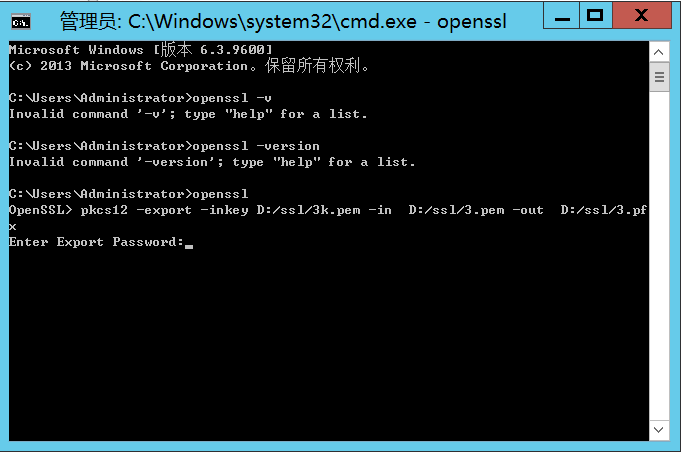

输入密码1 (其他密码会报错不知道咋回事)

```bash
拷贝 C:\Users\Admin\AppData\Local\mkcert 文件夹下的rootCA.pem文件重命名成rootCA.crt
```

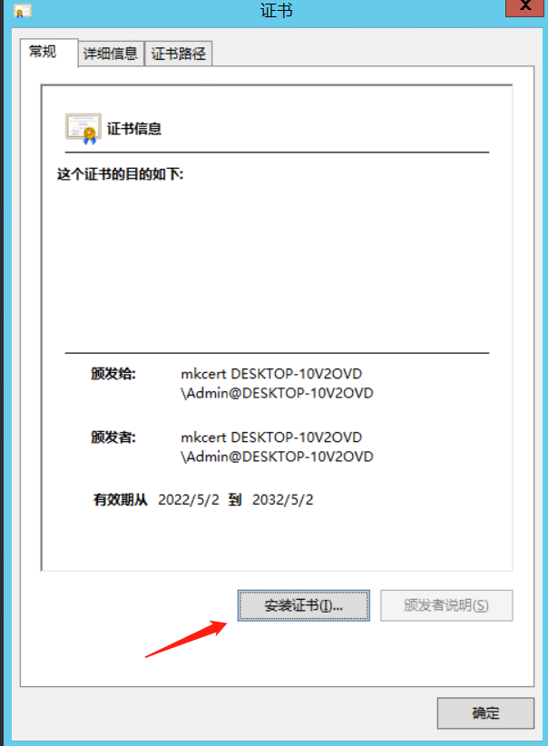

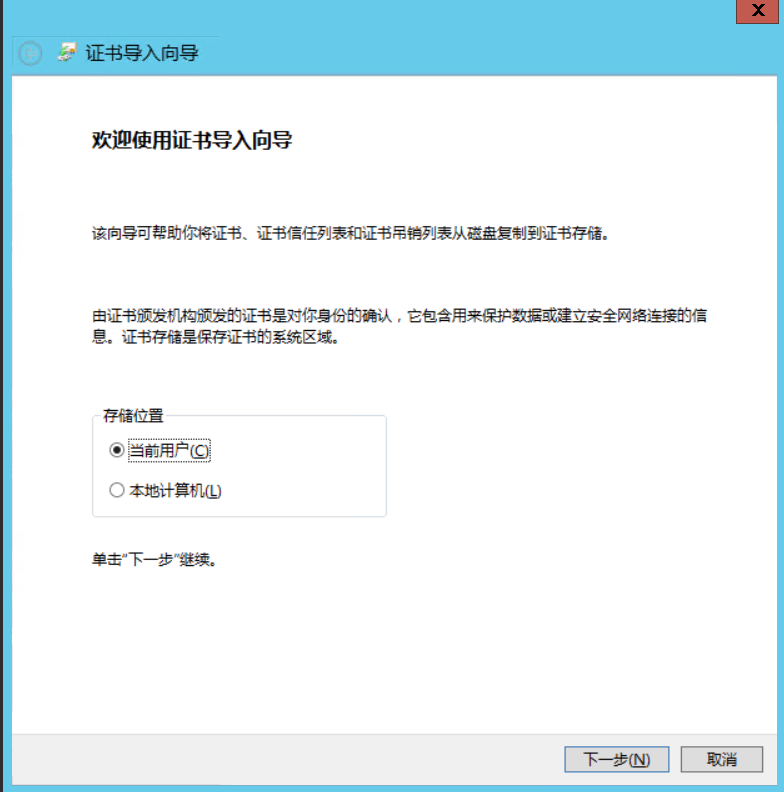

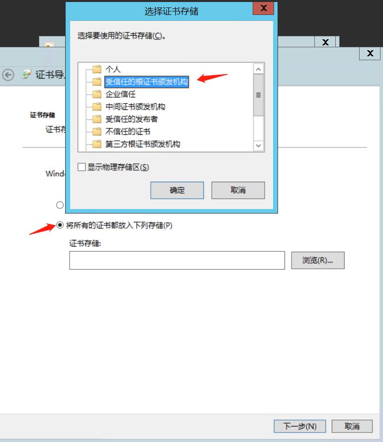

+ <font style="color:rgb(0, 0, 0);"> IIS管理器</font>
+ 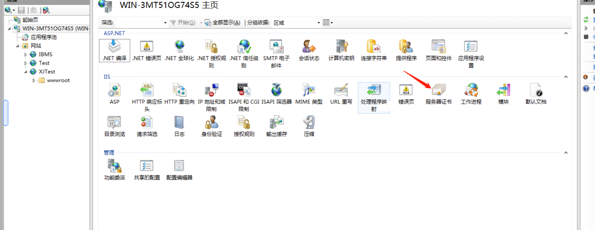
+ 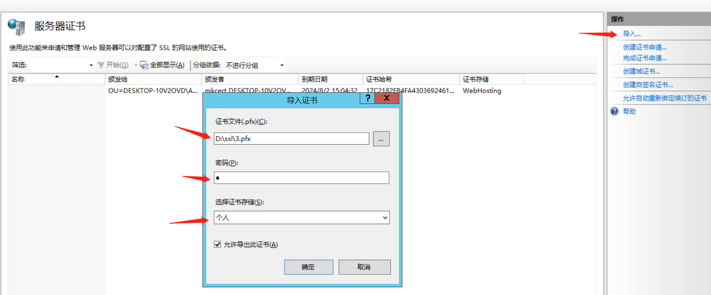
+ 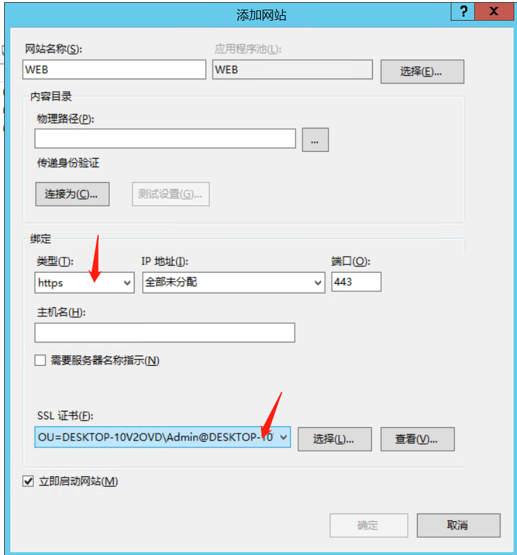
+ 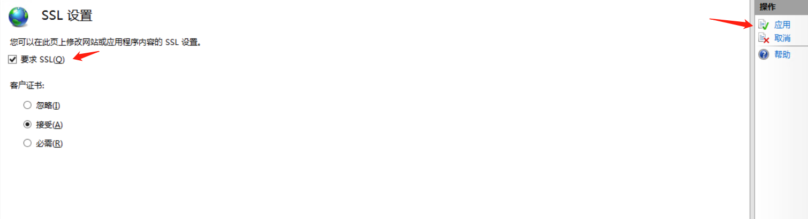
+ 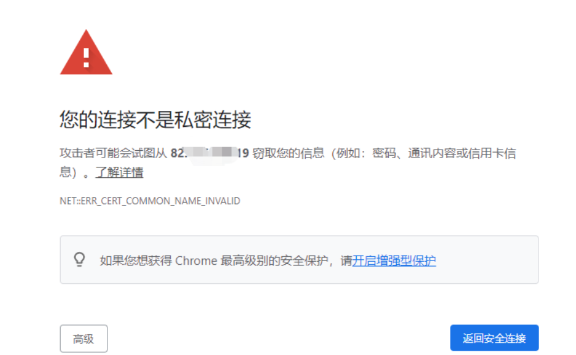

```bash
把3.pem 拷贝到访问主机重命名3.crt
之前的rootCA.crt和3.crt安装到受信任的根证书颁发机构
```

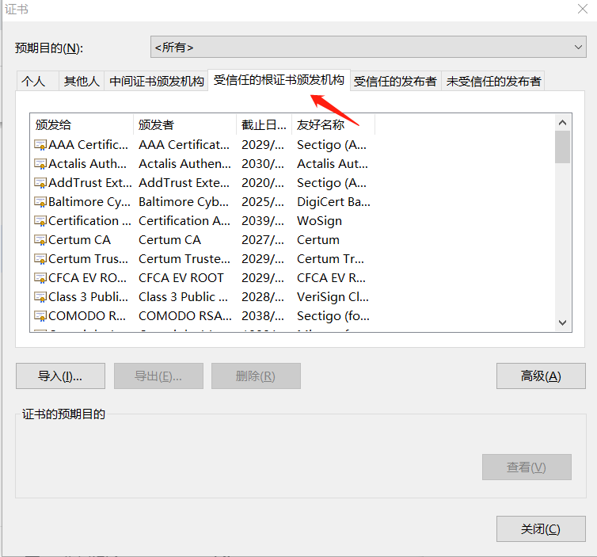

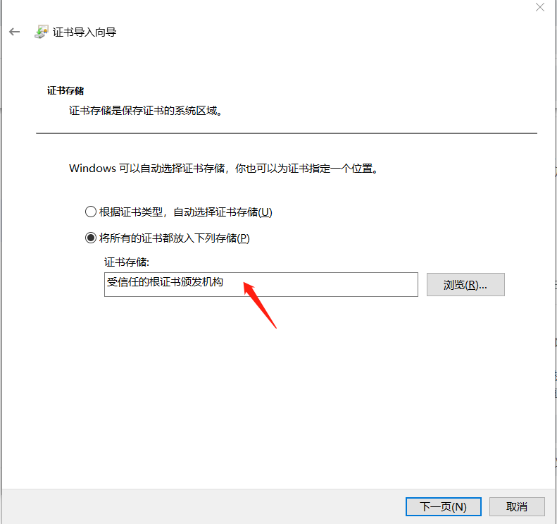


> 更新: 2025-07-09 12:24:48  
> 原文: <https://www.yuque.com/lixinsi/hntyk2/oipwqg5eb81hfyzp>