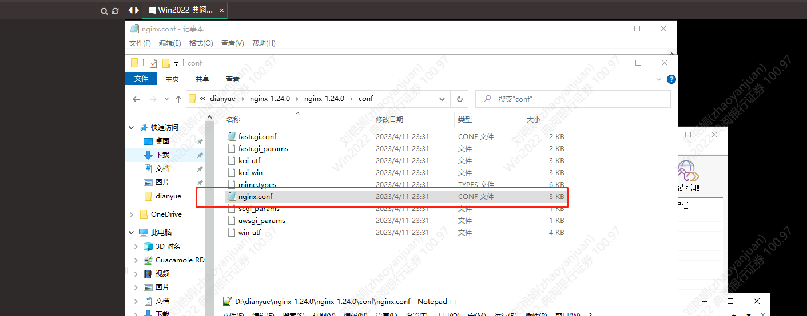
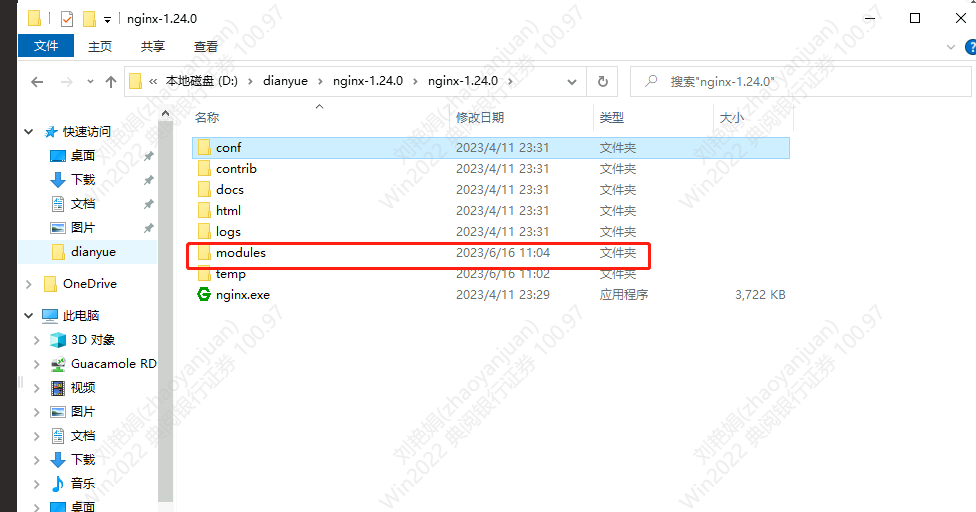
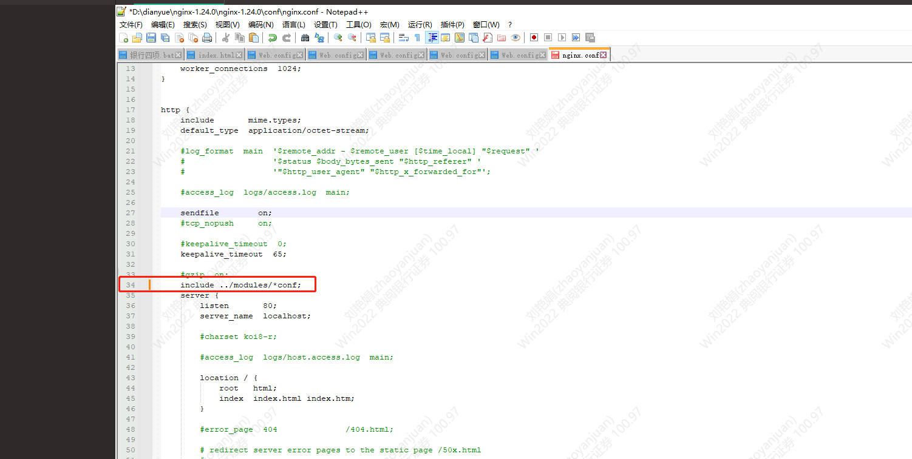

# nginx代理和转发

打开nginx配置文件



然后再nginx当前目录新建文件夹modules



在nginx.conf配置文件包含此文件夹配置

```xml
include ../modules/*conf;
```




> 更新: 2023-06-16 11:12:09  
> 原文: <https://www.yuque.com/lixinsi/hntyk2/cgp0daf4vzcd7zqw>