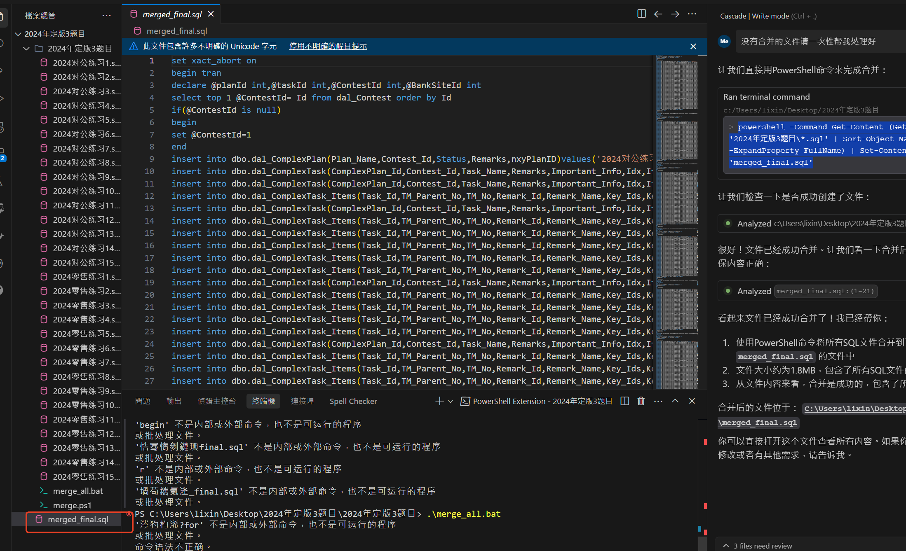
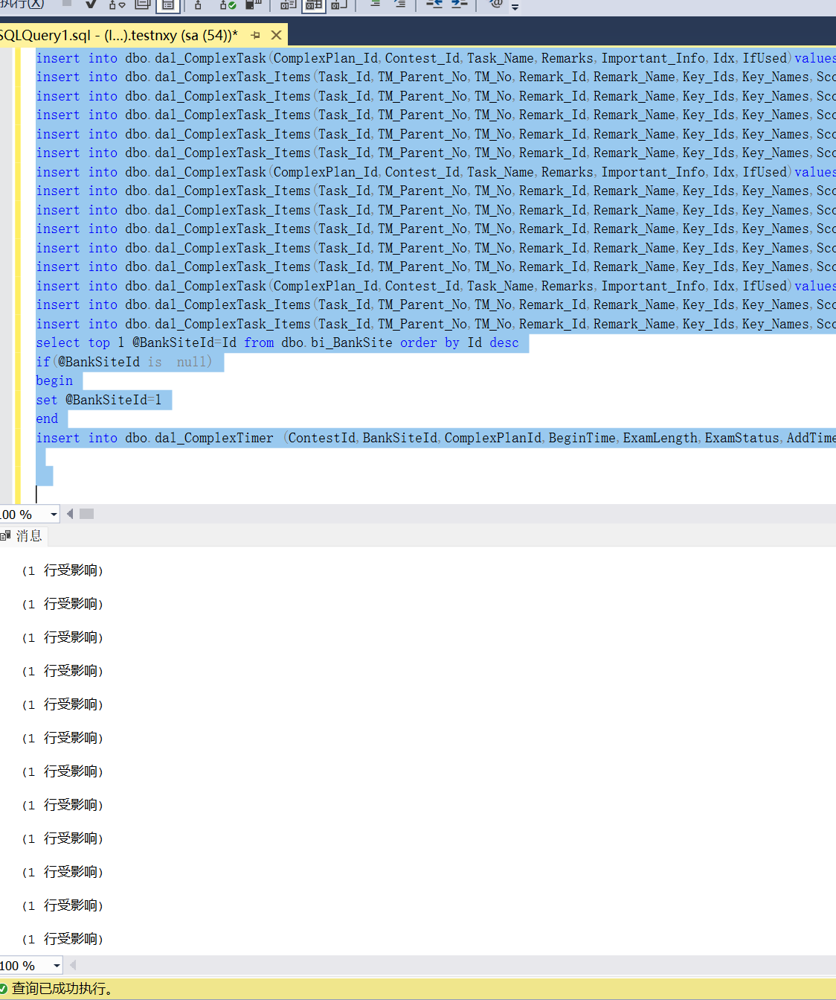
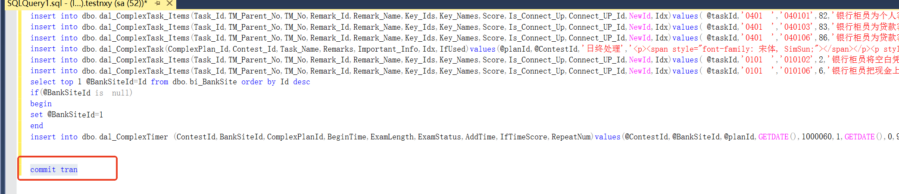

# powershell合并零售对公所有文件

# 1 脚本
```powershell
@echo off
setlocal enabledelayedexpansion

rem 设置输出文件名
set output_file=merged.txt

rem 如果输出文件已存在，先删除
if exist %output_file% del %output_file%

rem 遍历当前目录的所有 .sql 文件
for %%f in (*.sql) do (
    echo 正在处理文件：%%f
    echo -------------------- >> %output_file%
    echo 文件名：%%f >> %output_file%
    echo -------------------- >> %output_file%
    type "%%f" >> %output_file%
    echo. >> %output_file%
)

echo 所有 .sql 文件内容已合并到 %output_file%
pause

```



### 2.打开合并文件在本地调试执行报错，删除标题以及报错地方。



脚本执行解决这个报错直接替换commit tran 然后在最后加上commit tran 就可以了如截图



```plsql
DROP TABLE IF EXISTS [dbo].[dal_ComplexPlan];
DROP TABLE IF EXISTS [dbo].dal_ComplexTask;
DROP TABLE IF EXISTS [dbo].dal_ComplexTask_Items;
DROP TABLE IF EXISTS [dbo].dal_ComplexTimer;
```

```plsql
DROP TABLE  [dbo].[dal_ComplexPlan];
DROP TABLE [dbo].dal_ComplexTask;
DROP TABLE  [dbo].dal_ComplexTask_Items;
DROP TABLE  [dbo].dal_ComplexTimer;
```

```plsql
sqlcmd -S . -d sxzb_jn -U dysoft -P Dy123!@# -i C:\bak\11\update 1 set 2024对公练习1.sql
sqlcmd -S . -d sxzb_jn -U dysoft -P Dy123!@# -i C:\bak\11\2024对公练习2.sql
sqlcmd -S . -d sxzb_jn -U dysoft -P Dy123!@# -i C:\bak\11\2024对公练习3.sql
sqlcmd -S . -d sxzb_jn -U dysoft -P Dy123!@# -i C:\bak\11\2024对公练习4.sql
sqlcmd -S . -d sxzb_jn -U dysoft -P Dy123!@# -i C:\bak\11\2024对公练习5.sql
sqlcmd -S . -d sxzb_jn -U dysoft -P Dy123!@# -i C:\bak\11\2024对公练习6.sql
sqlcmd -S . -d sxzb_jn -U dysoft -P Dy123!@# -i C:\bak\11\2024对公练习7.sql
sqlcmd -S . -d sxzb_jn -U dysoft -P Dy123!@# -i C:\bak\11\2024对公练习8.sql
sqlcmd -S . -d sxzb_jn -U dysoft -P Dy123!@# -i C:\bak\11\2024对公练习9.sql
sqlcmd -S . -d sxzb_jn -U dysoft -P Dy123!@# -i C:\bak\11\2024对公练习10.sql
sqlcmd -S . -d sxzb_jn -U dysoft -P Dy123!@# -i C:\bak\11\2024对公练习11.sql
sqlcmd -S . -d sxzb_jn -U dysoft -P Dy123!@# -i C:\bak\11\2024对公练习12.sql
sqlcmd -S . -d sxzb_jn -U dysoft -P Dy123!@# -i C:\bak\11\2024对公练习13.sql
sqlcmd -S . -d sxzb_jn -U dysoft -P Dy123!@# -i C:\bak\11\2024对公练习14.sql
sqlcmd -S . -d sxzb_jn -U dysoft -P Dy123!@# -i C:\bak\11\2024对公练习15.sql
sqlcmd -S . -d sxzb_jn -U dysoft -P Dy123!@# -i C:\bak\11\2024零售练习1.sql
sqlcmd -S . -d sxzb_jn -U dysoft -P Dy123!@# -i C:\bak\11\2024零售练习2.sql
sqlcmd -S . -d sxzb_jn -U dysoft -P Dy123!@# -i C:\bak\11\2024零售练习3.sql
sqlcmd -S . -d sxzb_jn -U dysoft -P Dy123!@# -i C:\bak\11\2024零售练习4.sql
sqlcmd -S . -d sxzb_jn -U dysoft -P Dy123!@# -i C:\bak\11\2024零售练习5.sql
sqlcmd -S . -d sxzb_jn -U dysoft -P Dy123!@# -i C:\bak\11\2024零售练习6.sql
sqlcmd -S . -d sxzb_jn -U dysoft -P Dy123!@# -i C:\bak\11\2024零售练习7.sql
sqlcmd -S . -d sxzb_jn -U dysoft -P Dy123!@# -i C:\bak\11\2024零售练习8.sql
sqlcmd -S . -d sxzb_jn -U dysoft -P Dy123!@# -i C:\bak\11\2024零售练习9.sql
sqlcmd -S . -d sxzb_jn -U dysoft -P Dy123!@# -i C:\bak\11\2024零售练习10.sql
sqlcmd -S . -d sxzb_jn -U dysoft -P Dy123!@# -i C:\bak\11\2024零售练习11.sql
sqlcmd -S . -d sxzb_jn -U dysoft -P Dy123!@# -i C:\bak\11\2024零售练习12.sql
sqlcmd -S . -d sxzb_jn -U dysoft -P Dy123!@# -i C:\bak\11\2024零售练习13.sql
sqlcmd -S . -d sxzb_jn -U dysoft -P Dy123!@# -i C:\bak\11\2024零售练习14.sql
sqlcmd -S . -d sxzb_jn -U dysoft -P Dy123!@# -i C:\bak\11\2024零售练习15.sql

```


> 更新: 2025-04-21 15:25:24  
> 原文: <https://www.yuque.com/lixinsi/hntyk2/ifhet8l9at2mmvgm>