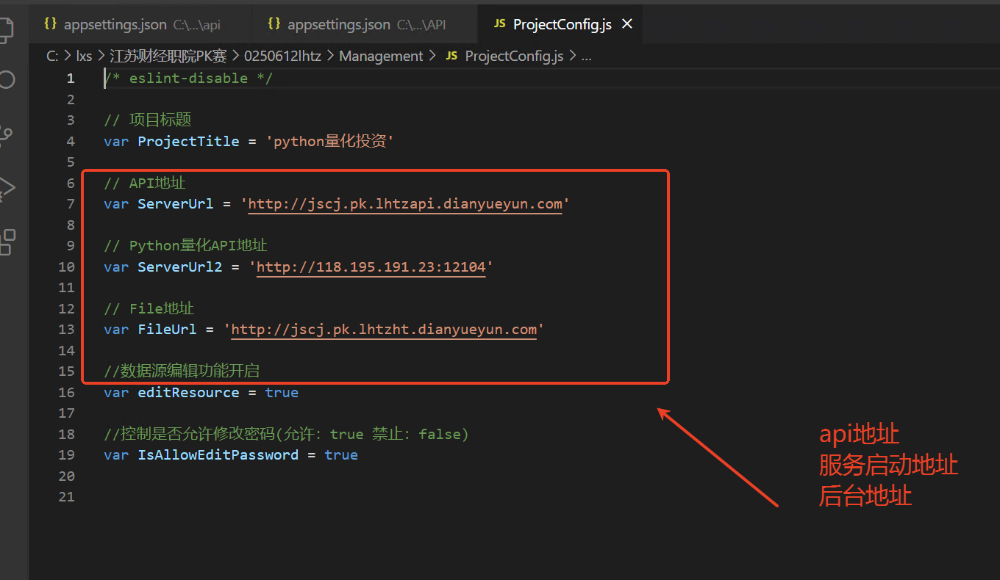
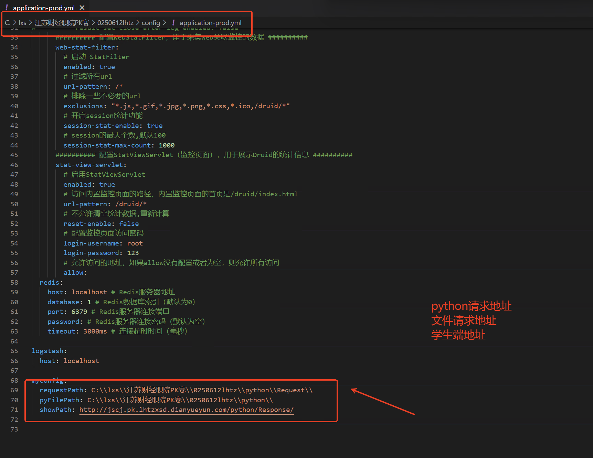
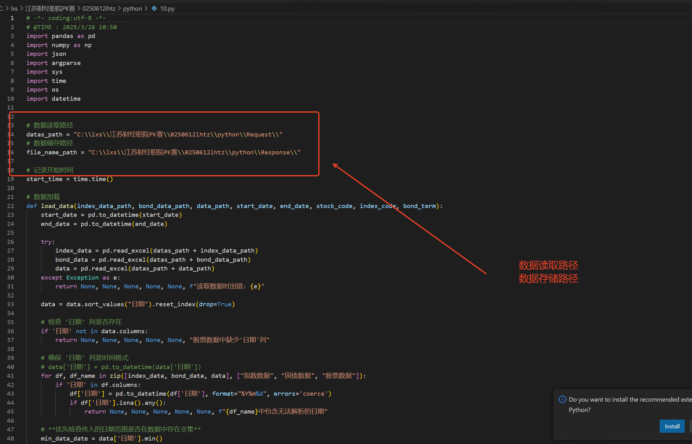

# python交易量化投资部署

### 1.学生端配置


### 2.java 配置


```json

myconfig:
  requestPath: C:\\lxs\\江苏财经职院PK赛\\0250612lhtz\\python\\Request\\
  pyFilePath: C:\\lxs\\江苏财经职院PK赛\\0250612lhtz\\python\\
  showPath: http://jscj.pk.lhtzxsd.dianyueyun.com/python/Response/  
```


### 10 .py 请求地址 服务文件配置


```json
# 数据读取路径
datas_path = "C:\\lxs\\江苏财经职院PK赛\\0250612lhtz\\python\\Request\\"
# 数据储存路径
file_name_path = "C:\\lxs\\江苏财经职院PK赛\\0250612lhtz\\python\\Response\\"
```


> 更新: 2025-06-18 08:00:44  
> 原文: <https://www.yuque.com/lixinsi/hntyk2/rp9gpwgagelggygw>