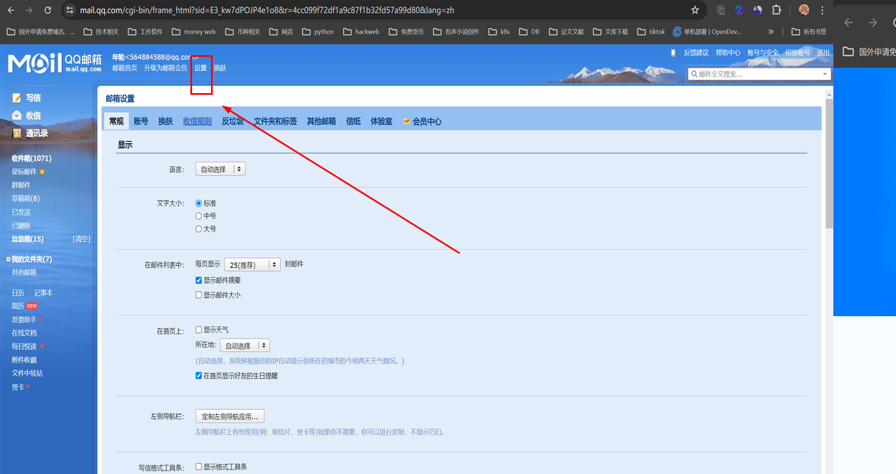
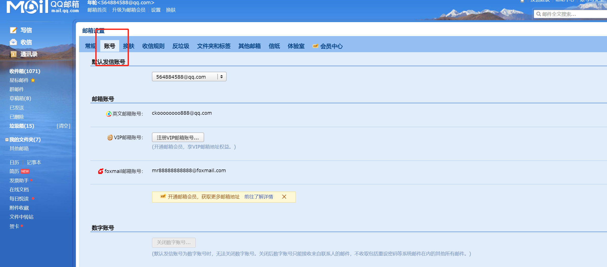
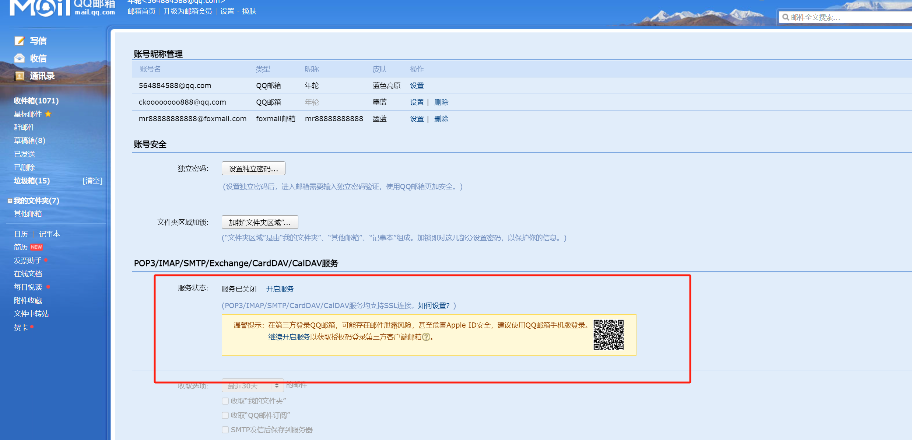
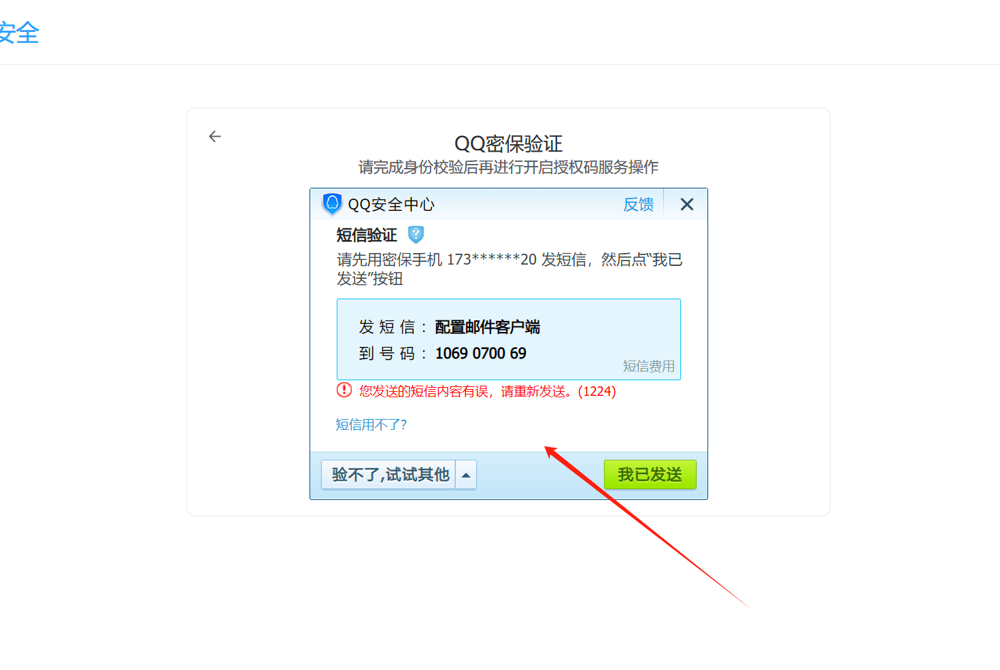

# qq邮箱配置smtp服务

 SendSMTPEMail("smtp.exmail.qq.com", "help@occupationedu.com", "Dysoft0909", "150329021@qq.com",

> 更新: 2024-06-14 16:33:12  
> 原文: <https://www.yuque.com/lixinsi/hntyk2/gzssohmiy29b9ig2>