# sql server批量备份

```sql
-- =============================================
-- Author:      <听风吹雨>
-- Blog:        <http://gaizai.cnblogs.com/>
-- Create date: <2011/12/03>
-- Description: <批量备份数据库>
-- =============================================
DECLARE
      @FileName VARCHAR(200),
      @CurrentTime VARCHAR(50),
      @DBName VARCHAR(100),
      @SQL VARCHAR(1000)

SET @CurrentTime = CONVERT(CHAR(8),GETDATE(),112) + CAST(DATEPART(hh, GETDATE()) AS VARCHAR) + CAST(DATEPART(mi, GETDATE()) AS VARCHAR)

DECLARE CurDBName CURSOR FOR 
    SELECT NAME FROM Master..SysDatabases where dbid>4

OPEN CurDBName
FETCH NEXT FROM CurDBName INTO @DBName
WHILE @@FETCH_STATUS = 0
BEGIN
    --Execute Backup
    SET @FileName = 'c:\dbbak\' + @DBName + '_' + @CurrentTime
    SET @SQL = 'BACKUP DATABASE ['+ @DBName +'] TO DISK = ''' + @FileName + '.bak' +
     ''' WITH NOINIT, NOUNLOAD, NAME = N''' + @DBName + '_backup'', NOSKIP, STATS = 10, NOFORMAT'
    EXEC(@SQL)

    --Get Next DataBase
    FETCH NEXT FROM CurDBName INTO @DBName
END

CLOSE CurDBName
DEALLOCATE CurDBName
```

```sql
DECLARE @name NVARCHAR(256) -- 数据库名字 
DECLARE @path NVARCHAR(512) -- 备份文件的路径  
DECLARE @fileName NVARCHAR(512) -- -- 备份文件名
DECLARE @fileDate NVARCHAR(40) -- 文件名

-- 指定数据库备份目录
SET @path = 'C:\test\'  

-- specify filename format
SELECT @fileDate = CONVERT(NVARCHAR(20),GETDATE(),112) 

DECLARE db_cursor CURSOR READ_ONLY FOR  
SELECT name 
FROM master.sys.databases 
WHERE name NOT IN ('master','model','msdb','tempdb')  -- exclude these databases
AND state = 0 -- database is online
AND is_in_standby = 0 -- database is not read only for log shipping

OPEN db_cursor   
FETCH NEXT FROM db_cursor INTO @name   

WHILE @@FETCH_STATUS = 0   
BEGIN   
SET @fileName = @path + @name + '_' + @fileDate + '.BAK'  
BACKUP DATABASE @name TO DISK = @fileName  

FETCH NEXT FROM db_cursor INTO @name   
END   

CLOSE db_cursor   
DEALLOCATE db_cursor
```

```sql
-- 数据库备份文件名格式 DBname_YYYYDDMM_HHMMSS.BAK
--如果您还想在文件名中包含时间，您可以在上面的脚本中替换这一行：
--指定文件名格式
SELECT @fileDate = CONVERT(NVARCHAR(20),GETDATE(),112)
```

```sql
-- specify filename format
SELECT @fileDate = CONVERT(NVARCHAR(20),GETDATE(),112) + '_' + REPLACE(CONVERT(NVARCHAR(20),GETDATE(),108),':','')
```

```sql
BACKUP DATABASE @name TO DISK = @fileName 
```

```sql
BACKUP DATABASE @name TO DISK = @fileName WITH STATS=10, COMPRESSION
```

# <font style="color:rgb(23, 23, 23);">在 SQL Server Express 中计划和自动备份 SQL Server 数据库</font>
+ 文章
+ 2022 年 1 月 25 日
+ 4分钟阅读
+ 4 位贡献者


<font style="color:rgb(23, 23, 23);">本文介绍如何使用 Transact-SQL 脚本和 Windows 任务计划程序按计划自动备份 SQL Server Express 数据库。</font>

_<font style="color:rgb(23, 23, 23);">原始产品版本：</font>_<font style="color:rgb(23, 23, 23);"> </font><font style="color:rgb(23, 23, 23);">  SQL Server</font><font style="color:rgb(23, 23, 23);">  
</font>_<font style="color:rgb(23, 23, 23);">原始 KB 号：</font>_<font style="color:rgb(23, 23, 23);"> </font><font style="color:rgb(23, 23, 23);">  2019698</font>

## <font style="color:rgb(23, 23, 23);">概括</font>
<font style="color:rgb(23, 23, 23);">SQL Server Express 版本不提供调度作业或维护计划的方法，因为这些</font>[版本](https://docs.microsoft.com/en-us/sql/sql-server/editions-and-components-of-sql-server-version-15)<font style="color:rgb(23, 23, 23);">中不包含 SQL Server 代理组件。</font><font style="color:rgb(23, 23, 23);">因此，当您使用这些版本时，您必须采取不同的方法来备份您的数据库。</font>

<font style="color:rgb(23, 23, 23);">目前 SQL Server Express 用户可以使用以下方法之一备份他们的数据库：</font>

<font style="color:rgb(23, 23, 23);">使用</font>[SQL Server Management Studio](https://docs.microsoft.com/en-us/sql/ssms/download-sql-server-management-studio-ssms)<font style="color:rgb(23, 23, 23);">或</font>[Azure Data Studio](https://docs.microsoft.com/en-us/sql/azure-data-studio/download-azure-data-studio)<font style="color:rgb(23, 23, 23);">。</font><font style="color:rgb(23, 23, 23);">有关如何使用这些工具备份数据库的更多信息，请查看以下链接：</font>

+ [创建完整数据库备份](https://docs.microsoft.com/en-us/sql/relational-databases/backup-restore/create-a-full-database-backup-sql-server)
+ [教程：使用 Azure Data Studio 备份和还原数据库](https://docs.microsoft.com/en-us/sql/azure-data-studio/tutorial-backup-restore-sql-server)
+ <font style="color:rgb(23, 23, 23);">使用使用 BACKUP DATABASE 命令系列的 Transact-SQL 脚本。</font><font style="color:rgb(23, 23, 23);">有关详细信息，请参阅</font>[备份 (Transact-SQL)](https://docs.microsoft.com/en-us/sql/t-sql/statements/backup-transact-sql)<font style="color:rgb(23, 23, 23);">。</font>

<font style="color:rgb(23, 23, 23);">本文介绍如何将 Transact-SQL 脚本与任务计划程序一起使用，以按计划自动备份 SQL Server Express 数据库。</font>

******笔记**

<font style="color:rgb(23, 23, 23);">这仅适用于 SQL Server Express 版本，不适用于 SQL Server Express LocalDB。</font>

## <font style="color:rgb(23, 23, 23);">更多信息</font>
<font style="color:rgb(23, 23, 23);">您必须按照以下四个步骤使用 Windows 任务计划程序备份 SQL Server 数据库：</font>

**<font style="color:rgb(23, 23, 23);">步骤 A</font>**<font style="color:rgb(23, 23, 23);">：创建存储过程来备份您的数据库。</font>

<font style="color:rgb(23, 23, 23);">连接到您的 SQL express 实例并使用位于以下位置的脚本在您的主数据库中创建 sp_BackupDatabases 存储过程：</font>

[SQL_Express_Backups](https://raw.githubusercontent.com/microsoft/mssql-support/master/sample-scripts/backup_restore/SQL_Express_Backups.sql)

**<font style="color:rgb(23, 23, 23);">步骤 B</font>**<font style="color:rgb(23, 23, 23);">：下载 SQLCMD 工具（如果适用）。</font>

<font style="color:rgb(23, 23, 23);">该 </font><font style="color:rgb(23, 23, 23);">sqlcmd</font><font style="color:rgb(23, 23, 23);"> 实用程序允许您输入 Transact-SQL 语句、系统过程和脚本文件。</font><font style="color:rgb(23, 23, 23);">在 SQL Server 2014 和更低版本中，该实用程序作为产品的一部分提供。</font><font style="color:rgb(23, 23, 23);">从 SQL Server 2016 开始，</font><font style="color:rgb(23, 23, 23);">sqlcmd</font><font style="color:rgb(23, 23, 23);"> 实用程序以单独下载的形式提供。</font><font style="color:rgb(23, 23, 23);">有关详细信息，请查看</font>[sqlcmd 实用程序](https://docs.microsoft.com/en-us/sql/tools/sqlcmd-utility)<font style="color:rgb(23, 23, 23);">。</font>

**<font style="color:rgb(23, 23, 23);">步骤 C</font>**<font style="color:rgb(23, 23, 23);">：使用文本编辑器创建批处理文件。</font>

<font style="color:rgb(23, 23, 23);">在文本编辑器中，创建一个名为</font>_<font style="color:rgb(23, 23, 23);">Sqlbackup.bat</font>_<font style="color:rgb(23, 23, 23);">的批处理文件，然后根据您的方案将以下示例之一中的文本复制到该文件中：</font>

+ <font style="color:rgb(23, 23, 23);">以下所有场景都</font><font style="color:rgb(23, 23, 23);">D:\SQLBackups</font><font style="color:rgb(23, 23, 23);">用作占位符。</font><font style="color:rgb(23, 23, 23);">该脚本需要调整到您环境中正确的驱动器和备份文件夹位置。</font>
+ <font style="color:rgb(23, 23, 23);">如果您使用 SQL 身份验证，请确保只有授权用户才能访问该文件夹，因为密码以明文形式存储。</font>

******笔记**

<font style="color:rgb(23, 23, 23);">SQLCMD</font><font style="color:rgb(23, 23, 23);">在安装 SQL Server 或将其作为独立工具安装后，可执行</font><font style="color:rgb(23, 23, 23);">文件的文件夹通常位于服务器的路径变量中。</font><font style="color:rgb(23, 23, 23);">但如果 Path 变量未列出此文件夹，您可以将其位置添加到 Path 变量或指定实用程序的完整路径。</font>

**<font style="color:rgb(23, 23, 23);">示例 1：</font>**<font style="color:rgb(23, 23, 23);">使用 Windows 身份验证对本地 SQLEXPRESS 命名实例中的所有数据库进行完整备份。</font>

```sql
// Sqlbackup.bat
 sqlcmd -S .\SQLEXPRESS -E -Q "EXEC sp_BackupDatabases @backupLocation='D:\SQLBackups\', @backupType='F'"
```

**<font style="color:rgb(23, 23, 23);">示例 2：</font>**<font style="color:rgb(23, 23, 23);">使用 SQLLogin 及其密码对本地 SQLEXPRESS 命名实例中的所有数据库进行差异备份。</font>

```sql
// Sqlbackup.bat
sqlcmd -U <YourSQLLogin> -P <StrongPassword> -S .\SQLEXPRESS -Q "EXEC sp_BackupDatabases  @backupLocation ='D:\SQLBackups', @BackupType='D'"
```

******笔记**

<font style="color:rgb(23, 23, 23);">SQLLogin 至少应具有 SQL Server 中的 Backup Operator 角色。</font>

**<font style="color:rgb(23, 23, 23);">示例 3：</font>**<font style="color:rgb(23, 23, 23);">使用 Windows 身份验证对 SQLEXPRESS 本地命名实例中的所有数据库进行日志备份</font>

```sql
// Sqlbackup.bat
='L'"
```

<font style="color:rgb(37, 37, 37);">2021 年 4 月 15 日，</font><font style="color:rgb(37, 37, 37);"> </font><font style="color:rgb(37, 37, 37);">作者</font>[Nisarg Upadhyay](https://www.sqlshack.com/author/nisarg/)

# <font style="color:rgb(2, 2, 128);">使用 Windows 任务计划程序自动执行 SQL 数据库备份</font>


<font style="color:rgb(37, 37, 37);">在本文中，我们将学习如何自动备份在 SQL Server Express 版本中创建的 SQL 数据库。</font><font style="color:rgb(37, 37, 37);">SQL Server Express 版是一个轻量级数据库，具有有限的功能和资源分配。</font><font style="color:rgb(37, 37, 37);">SQL Server Express 版本不支持 SQL Server 代理作业，因此自动化各种数据库管理任务很棘手。</font>

<font style="color:rgb(37, 37, 37);">我们可以使用 windows 任务调度程序来自动维护 SQL Server Express 版本的数据库。</font><font style="color:rgb(37, 37, 37);">Windows 任务计划程序是一种用于自动执行各种任务的工具。</font><font style="color:rgb(37, 37, 37);">您可以安排各种维护任务的执行。</font><font style="color:rgb(37, 37, 37);">您可以阅读</font>[本文](https://docs.microsoft.com/en-us/windows/win32/taskschd/task-scheduler-start-page)<font style="color:rgb(37, 37, 37);">以了解有关 Windows 任务计划程序的更多信息。</font>

<font style="color:rgb(37, 37, 37);">我们可以使用任务调度程序自动执行 Windows 批处理文件。</font><font style="color:rgb(37, 37, 37);">我在批处理文件中使用了 SQLCMD 命令来执行在数据库中创建的存储过程。</font><font style="color:rgb(37, 37, 37);">这些存储过程可用于执行维护任务。</font>

<font style="color:rgb(37, 37, 37);">在本文中，我将介绍如何备份数据库。</font><font style="color:rgb(37, 37, 37);">备份计划如下：</font>

1. <font style="color:rgb(37, 37, 37);">SQL 数据库的完整备份应在每周上午 01:00 生成。</font><font style="color:rgb(37, 37, 37);">备份的位置是</font>_**<font style="color:rgb(37, 37, 37);">C:\MS_SQL\FullBackup</font>**_
2. <font style="color:rgb(37, 37, 37);">差异 SQL 数据库备份应在每天凌晨 2:00 生成。</font><font style="color:rgb(37, 37, 37);">备份的位置是</font>_**<font style="color:rgb(37, 37, 37);">C:\MS_SQL\DiffBackup</font>**_

<font style="color:rgb(37, 37, 37);">我在主数据库中创建了两个存储过程来备份 SQL 数据库。</font><font style="color:rgb(37, 37, 37);">存储过程生成完整备份和差异备份。</font><font style="color:rgb(37, 37, 37);">以下存储过程用于生成数据库的完整备份。</font>

```sql
Create procedure sp_generate_full_backup
as
begin
DECLARE @Date VARCHAR(30)
DECLARE @FileName VARCHAr(max)
DECLARE @DBName VARCHAR(150)
DECLARE @BkpPath VARCHAR(max)
DECLARE @backupCommmand nvarchar(max)
declare @DBcount int
declare @i int = 0
create table #UserDatabases(Name varchar(500))
insert into #UserDatabases select name from sys.databases where database_id>4
set @DBcount=(select count(1) from #UserDatabases)
While (@DBcount>@i)
Begin
set @DBName = (select top 1 name from #UserDatabases)
set @Date = replace(Convert(VARCHAR(10),Getdate(),23),'-','_') + '_T_' + replace(Convert(VARCHAR(10),Getdate(),108),':','_')
set @FileName = 'Full_' + @DBName + '_' + 'Backup' + '_' +@Date +'.bak'
set @BkpPath = 'C:\MS_SQL\FullBackup\'
set @FileName = @BkpPath + @FileName
set @backupCommmand='Backup database [' +@DBName +'] to Disk= ''' +@FileName +''' WITH  NOFORMAT, NOINIT ,SKIP, NOREWIND, NOUNLOAD, STATS = 10'
--Print @backupCommmand
EXEC sys.sp_executesql @backupCommmand
delete from #UserDatabases where name=@DBName
Set @i=@i+1
End
drop table #UserDatabases
End
Go
```

<font style="color:rgb(37, 37, 37);">以下存储过程用于生成数据库的差异备份。</font>

```sql
Create procedure sp_generate_diff_backup
as
begin
DECLARE @Date VARCHAR(30)
DECLARE @FileName VARCHAr(max)
DECLARE @DBName VARCHAR(150)
DECLARE @BkpPath VARCHAR(max)
DECLARE @backupCommmand nvarchar(max)
declare @DBcount int
declare @i int = 0
 
create table #UserDatabases(Name varchar(500))
insert into #UserDatabases select name from sys.databases where database_id>4
set @DBcount=(select count(1) from #UserDatabases)
While (@DBcount>@i)
Begin
set @DBName = (select top 1 name from #UserDatabases)
set @Date = replace(Convert(VARCHAR(10),Getdate(),23),'-','_') + '_T_' + replace(Convert(VARCHAR(10),Getdate(),108),':','_')
set @FileName = 'Diff_' + @DBName + '_' + 'Backup' + '_' +@Date +'.bak'
set @BkpPath = 'C:\MS_SQL\DiffBackup\'
set @FileName = @BkpPath + @FileName
set @backupCommmand='Backup database [' +@DBName +'] to Disk= ''' +@FileName +''' WITH  NOFORMAT, NOINIT ,SKIP, NOREWIND, NOUNLOAD, DIFFERENTIAL STATS = 10'
--Print @backupCommmand
EXEC sys.sp_executesql @backupCommmand
delete from #UserDatabases where name=@DBName
Set @i=@i+1
End
drop table #UserDatabases
End
Go
```

<font style="color:rgb(37, 37, 37);">让我们配置计划以生成备份。</font>

## <font style="color:rgb(51, 122, 183);">创建任务以生成完整数据库备份</font>
<font style="color:rgb(37, 37, 37);">首先，打开windows任务计划程序。</font><font style="color:rgb(37, 37, 37);">在任务计划程序的左侧窗格中，您可以查看计划任务的列表。</font><font style="color:rgb(37, 37, 37);">要创建新任务，请右键单击任务计划程序并选择基本任务。</font><font style="color:rgb(37, 37, 37);">或者，您可以单击“操作”选项卡中的“创建基本任务”链接。</font>

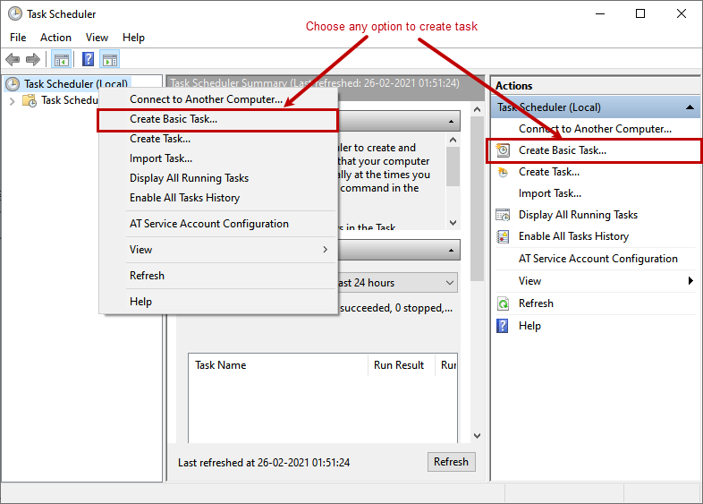

<font style="color:rgb(37, 37, 37);">第一个屏幕是创建基本任务。</font><font style="color:rgb(37, 37, 37);">在此屏幕上，指定所需的任务名称和描述。</font><font style="color:rgb(37, 37, 37);">在我们的例子中，第一个任务是生成完整备份，因此名称为 Generate Full Backup。</font><font style="color:rgb(37, 37, 37);">在描述文本框中，我已经指定了备份的时间。</font>

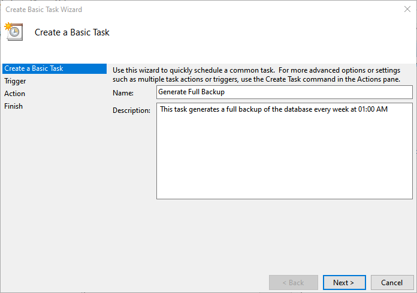

<font style="color:rgb(37, 37, 37);">下一个屏幕是任务触发器。</font><font style="color:rgb(37, 37, 37);">在此屏幕上，我们可以指定您想要开始任务的时间。</font><font style="color:rgb(37, 37, 37);">在我们的例子中，应该每月执行一次完整备份，因此选择每月。</font>

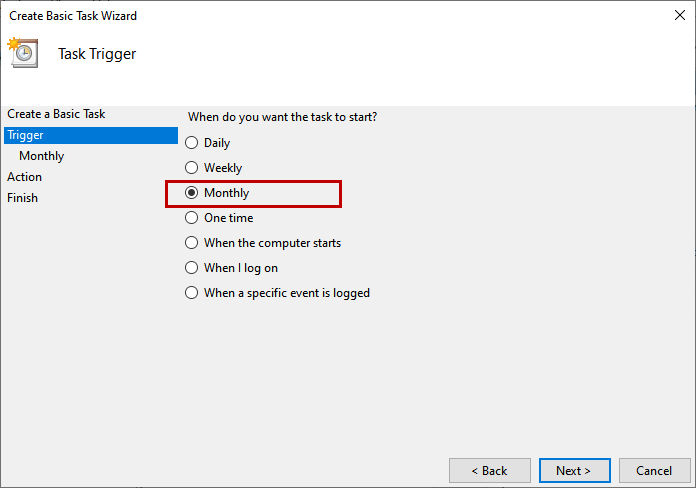

<font style="color:rgb(37, 37, 37);">在下一个屏幕上，我们可以指定作业执行的开始日期。</font><font style="color:rgb(37, 37, 37);">该作业应每月执行一次，因此单击“月份”下拉框并<选择所有月份>。</font>

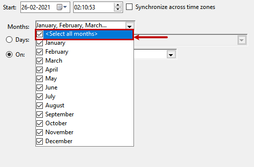

<font style="color:rgb(37, 37, 37);">该作业必须在每个月的第一个星期日执行。</font><font style="color:rgb(37, 37, 37);">单击</font>**<font style="color:rgb(37, 37, 37);">On</font>**<font style="color:rgb(37, 37, 37);">并从第一个下拉框中选择 First 选项，从第二个下拉框中选择 Sunday。</font>

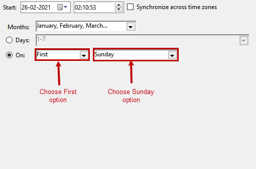

<font style="color:rgb(37, 37, 37);">在下一个屏幕上，我们应该指定由任务调度程序执行的任务名称。</font><font style="color:rgb(37, 37, 37);">我们正在运行一个批处理脚本，所以单击 Start a Program 选项。</font>

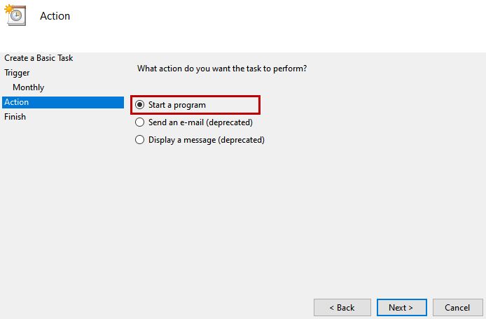

<font style="color:rgb(37, 37, 37);">在启动程序上，指定要执行的批处理文件。</font><font style="color:rgb(37, 37, 37);">为了生成完整备份，我创建了一个批处理文件。</font><font style="color:rgb(37, 37, 37);">在程序/脚本文本框中提供批处理文件的完整路径。</font><font style="color:rgb(37, 37, 37);">在我们的例子中，我们在</font>_**<font style="color:rgb(37, 37, 37);">C:\BackupScript</font>**_<font style="color:rgb(37, 37, 37);">位置创建了批处理文件。</font>

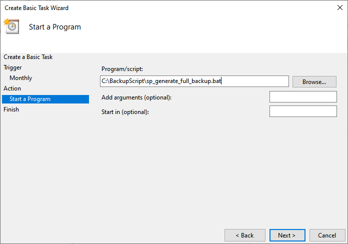

<font style="color:rgb(37, 37, 37);">在摘要屏幕上，您可以查看任务的详细信息。</font><font style="color:rgb(37, 37, 37);">单击完成。</font>

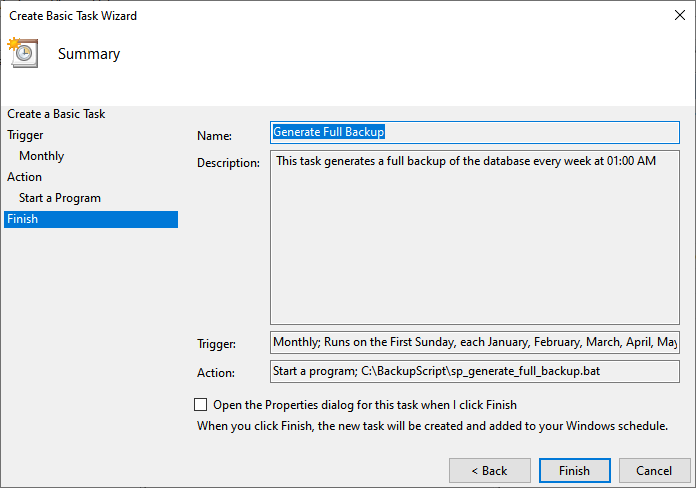

<font style="color:rgb(37, 37, 37);">任务已创建。</font><font style="color:rgb(37, 37, 37);">我们可以在Task scheduler library中查看任务的详细信息。</font><font style="color:rgb(37, 37, 37);">单击任务计划库。</font><font style="color:rgb(37, 37, 37);">您可以查看预定义任务和用户定义任务的列表。</font><font style="color:rgb(37, 37, 37);">您可以看到 Generate Full Backup 任务已创建。</font>

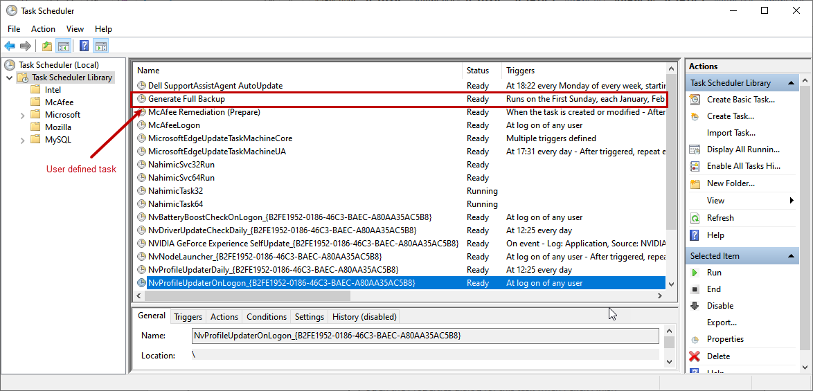

## <font style="color:rgb(51, 122, 183);">创建任务以生成差异备份</font>
<font style="color:rgb(37, 37, 37);">按照规定，作业应在每天凌晨 1:00 执行。</font><font style="color:rgb(37, 37, 37);">要配置计划，请在“任务触发器”屏幕上选择“每日”选项。</font>

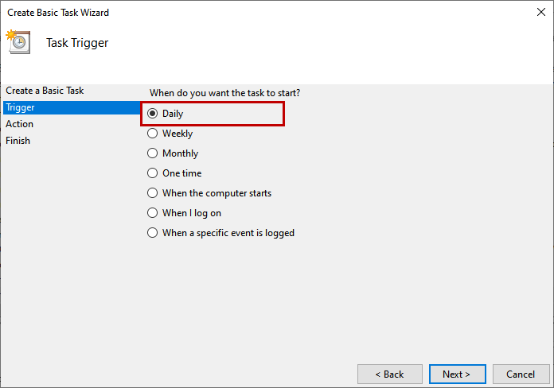

<font style="color:rgb(37, 37, 37);">在每日屏幕上，在时间文本框中指定 1:00:00。</font><font style="color:rgb(37, 37, 37);">该作业应每天执行一次，因此</font><font style="color:rgb(37, 37, 37);">在 Recur every 文本框中 指定</font>_**<font style="color:rgb(37, 37, 37);">1 。</font>**_

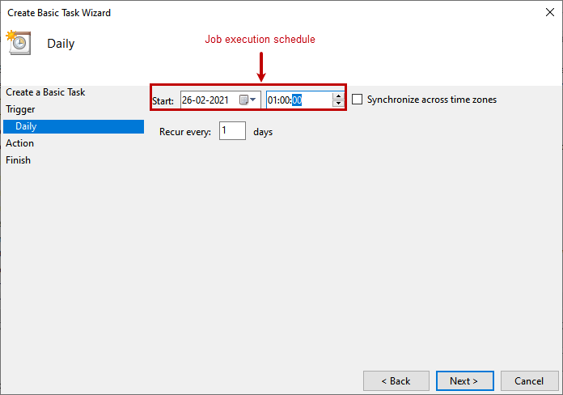

<font style="color:rgb(37, 37, 37);">要执行批处理文件以生成差异备份，请</font><font style="color:rgb(37, 37, 37);"> </font><font style="color:rgb(37, 37, 37);">在“操作”屏幕上 选择“</font>_**<font style="color:rgb(37, 37, 37);">启动程序”选项。</font>**_

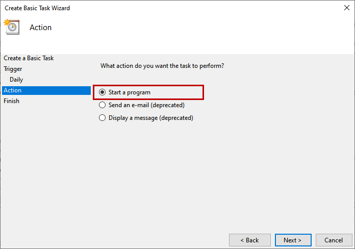

<font style="color:rgb(37, 37, 37);">在</font>_**<font style="color:rgb(37, 37, 37);">开始，程序</font>**_<font style="color:rgb(37, 37, 37);">屏幕上，输入用于生成差异备份的批处理文件的完整路径。</font>

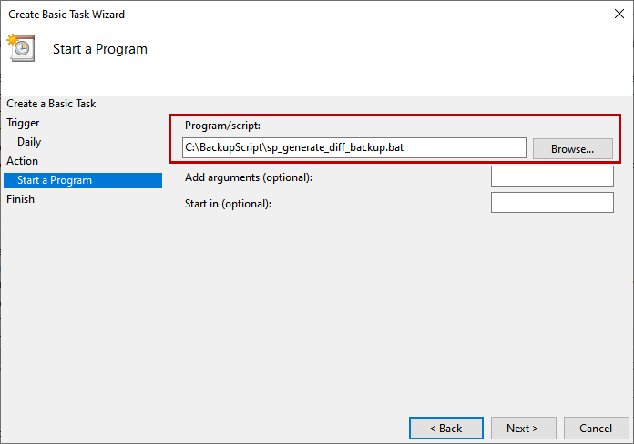

<font style="color:rgb(37, 37, 37);">在摘要屏幕上，您可以查看任务的详细信息，然后单击完成以创建任务。</font><font style="color:rgb(37, 37, 37);">您可以在任务调度程序库列表中查看任务。</font>

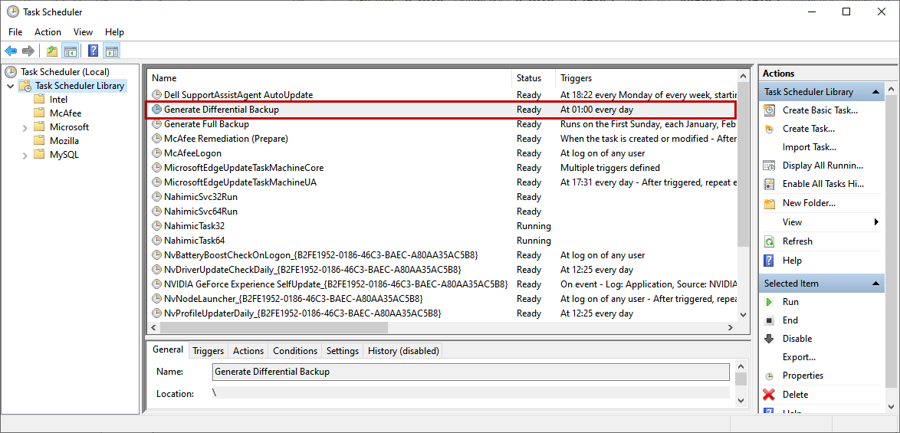

## <font style="color:rgb(51, 122, 183);">测试备份任务</font>
<font style="color:rgb(37, 37, 37);">现在，让我们测试所有已创建的任务。</font><font style="color:rgb(37, 37, 37);">首先，让我们运行完整备份作业。</font><font style="color:rgb(37, 37, 37);">右键单击生成完整备份任务，然后单击运行。</font>

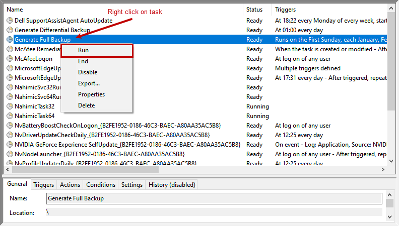

<font style="color:rgb(37, 37, 37);">在我们的例子中，数据库很小，所以不需要很长时间就可以完成。</font><font style="color:rgb(37, 37, 37);">我们可以从任务计划的历史中确认执行状态。</font>

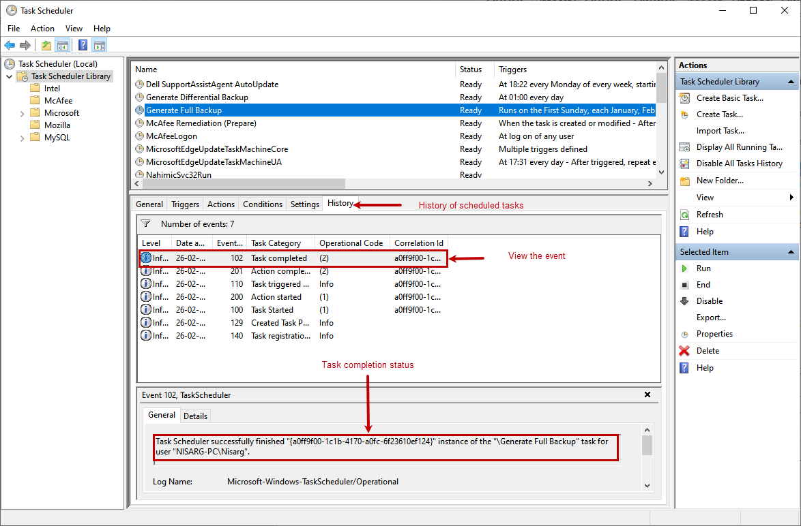

<font style="color:rgb(37, 37, 37);">如上图所示，Generate Full Backup 已成功完成。</font><font style="color:rgb(37, 37, 37);">打开备份目标。</font>

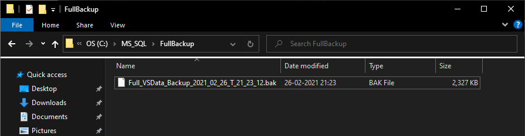

<font style="color:rgb(37, 37, 37);">如您所见，备份已创建。</font><font style="color:rgb(37, 37, 37);">现在，让我们测试生成差异备份任务。</font><font style="color:rgb(37, 37, 37);">过程是一样的。</font><font style="color:rgb(37, 37, 37);">任务完成后，您可以从历史选项卡查看执行任务。</font>

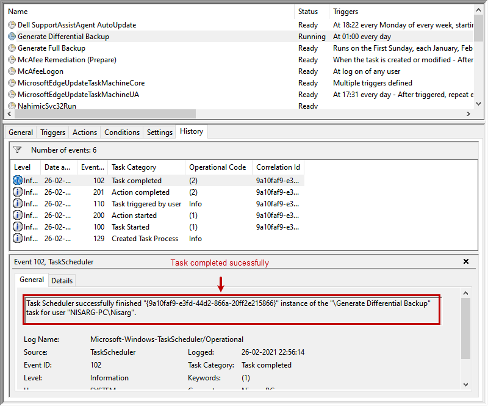

<font style="color:rgb(37, 37, 37);">如上图所示，任务执行成功。</font><font style="color:rgb(37, 37, 37);">打开备份目标。</font>

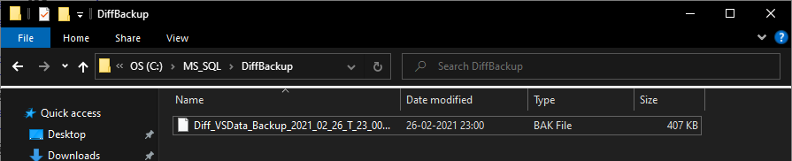

<font style="color:rgb(37, 37, 37);">备份已成功创建。</font>

<font style="color:rgb(37, 37, 37);"></font>

### <font style="color:rgb(37, 37, 37);">批量备份脚本还原以及sql语句</font>
```sql
--开启文件夹权限
GO
SP_CONFIGURE 'SHOW ADVANCED OPTIONS',1
RECONFIGURE
GO
SP_CONFIGURE 'XP_CMDSHELL',1
RECONFIGURE
GO
 
DECLARE
      @FileName VARCHAR(200),
      @CurrentTime VARCHAR(50),
      @DBName VARCHAR(100),
      @SQL VARCHAR(1000),
      @FilePath VARCHAR(100)
 
--SET @CurrentTime = CONVERT(CHAR(8),GETDATE(),112) + CAST(DATEPART(hh, GETDATE()) AS VARCHAR) + CAST(DATEPART(mi, GETDATE()) AS VARCHAR)
--年月日
SET @CurrentTime = CONVERT(CHAR(8),GETDATE(),112)
 
 
SET @FilePath = 'D:\Backup\SQLDataBaseBackupTest\' + @CurrentTime + '\'
--select CONVERT(CHAR(8),GETDATE(),112)
--文件夹不存在，则创建
declare @TEMP TABLE(A INT,B INT,C INT)--建立虚拟表，用来判断文件夹是否存在
INSERT @TEMP EXEC [MASTER]..XP_FILEEXIST @FilePath
IF NOT EXISTS(SELECT * FROM @TEMP WHERE B=1)
BEGIN
    --XP_CMDSHELL不允许使用变量拼接，所以使用exec方法
    declare @EX NVARCHAR(255)
    SET @EX = 'EXEC XP_CMDSHELL ''MKDIR ' + @FilePath + '''';
    EXEC(@EX)
END
 
 
--获取所有非系统数据库
DECLARE CurDBName CURSOR FOR
    SELECT NAME FROM Master..SysDatabases where dbid>4
 
--循环备份数据库
OPEN CurDBName
FETCH NEXT FROM CurDBName INTO @DBName
WHILE @@FETCH_STATUS = 0
BEGIN
    --Execute Backup
    SET @FileName = @FilePath + @DBName + '_text_' + @CurrentTime
    SET @SQL = 'BACKUP DATABASE ['+ @DBName +'] TO DISK = ''' + @FileName + '.bak' +
     ''' WITH NOINIT, NOUNLOAD, NAME = N''' + @DBName + '_backup'', NOSKIP, STATS = 10, NOFORMAT'
    EXEC(@SQL)
 
    --Get Next DataBase
    FETCH NEXT FROM CurDBName INTO @DBName
END
 
CLOSE CurDBName
DEALLOCATE CurDBName

```

### 


> 更新: 2024-12-12 18:18:01  
> 原文: <https://www.yuque.com/lixinsi/hntyk2/pte14q>