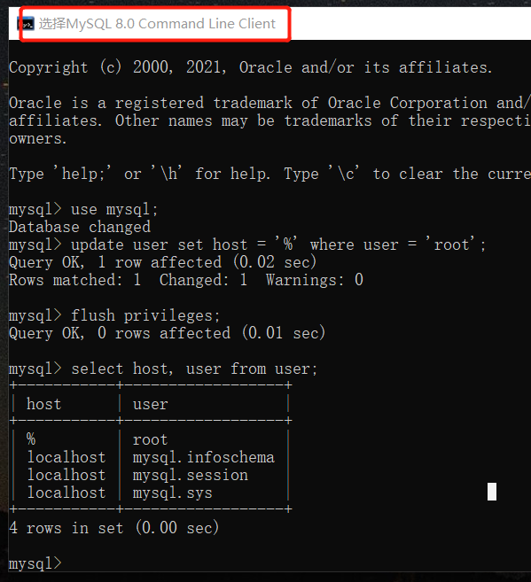
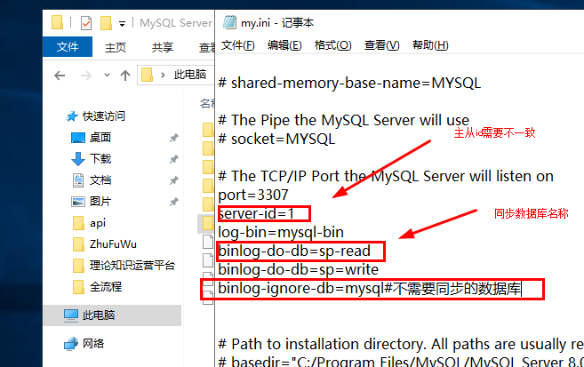
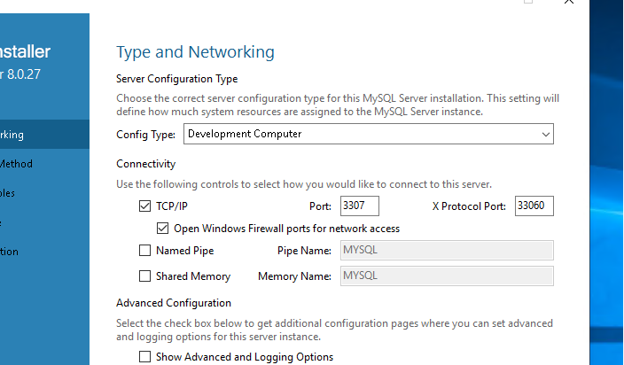

# windows下Mysql

下载MySQL：[https://dev.mysql.com/downloads/file/?id=510039](https://dev.mysql.com/downloads/file/?id=510039)

### mysql初始化
<font style="color:rgb(18, 18, 18);">切换到 mysql/bin目录下执行</font>

```sql
mysqld --initialize --user=mysql --console
```

m)ItV;QX&5dP

aup-0r3khvsX

查看用户

select user,host,plugin from mysql.user;

<font style="color:rgb(198, 120, 221);">CREATEUSER</font><font style="color:rgb(102, 153, 0);">'mike'</font><font style="color:rgb(171, 178, 191);background-color:rgb(40, 44, 52);">@'</font><font style="color:rgb(102, 153, 0);">%' IDENTIFIED BY '</font><font style="color:rgb(152, 195, 121);">000000</font><font style="color:rgb(102, 153, 0);">';</font>

<font style="color:rgb(102, 153, 0);"> GRANT ALL ON *.* TO '</font><font style="color:rgb(171, 178, 191);background-color:rgb(40, 44, 52);">mike</font><font style="color:rgb(102, 153, 0);">'@'%</font><font style="color:rgb(171, 178, 191);background-color:rgb(40, 44, 52);">' </font><font style="color:rgb(198, 120, 221);">WITHGRANTOPTION</font><font style="color:rgb(153, 153, 153);">;;</font>

<font style="color:rgb(51, 51, 51);">mysql -h localhost -P端口 -u root -p 123456 </font>

<font style="color:rgb(18, 18, 18);">mysqld --initialize --user=mysql --console</font>

<font style="color:rgb(18, 18, 18);">MyNewStrongPass!123</font>

[ysql windows 下配置可远程连接](https://www.cnblogs.com/runliuv/p/14672988.html)

<font style="color:rgb(0, 0, 0);">1.在防火墙入站规则里加入 3306  端口，3306 为你安装mysql 时的端口。</font>

<font style="color:rgb(0, 0, 0);">2.在mysql 命令行中输入：</font>

<font style="color:rgb(0, 0, 0);">#应用mysql数据库  
</font><font style="color:rgb(0, 0, 0);">use mysql;  
</font><font style="color:rgb(0, 0, 0);">#将root用户可访问改成所有  
</font><font style="color:rgb(0, 0, 0);">update user set host = '%' where user = 'root';  
</font><font style="color:rgb(0, 0, 0);">#刷新权限,使配置起作用  
</font><font style="color:rgb(0, 0, 0);">flush privileges;  
</font><font style="color:rgb(0, 0, 0);">#查看是否成功</font>SAsa123

<font style="color:rgb(0, 0, 0);"> Ven#uRMg?4ps  
</font><font style="color:rgb(0, 0, 0);">select host, user from user;</font>

<font style="color:rgb(0, 0, 0);"></font>



<font style="color:rgb(0, 0, 0);"></font>

<font style="color:rgb(0, 0, 0);">..</font>

<font style="color:rgb(0, 0, 0);">update 那句也可以替换为：</font>

<font style="color:rgb(0, 0, 0);">GRANT ALL PRIVILEGES ON *.* TO 'root'@'%' IDENTIFIED BY '密码' WITH GRANT OPTION;</font>

<font style="color:rgb(0, 0, 0);"></font>

<font style="color:rgb(0, 0, 0);">windows MySQL数据库配置</font>

<font style="color:rgb(0, 0, 0);">##</font><font style="color:rgb(56, 58, 66);background-color:rgb(250, 250, 250);">C:\ProgramData\MySQL\MySQL Server </font><font style="color:rgb(152, 104, 1);">8.0</font><font style="color:rgb(56, 58, 66);background-color:rgb(250, 250, 250);">\my.ini</font>



port=3307

server-id=1

log-bin=mysql-bin

binlog-do-db=sp-read

binlog-do-db=sp=write

binlog-ignore-db=mysql#不需要同步的数据库


设置好后重启MySQL服务



<font style="color:rgb(0, 0, 0);">mysql密码修改</font>

解决步骤


1.  打开MySQL数据目录  
数据目录：C:\ProgramData\MySQL\MySQL Server 8.0, 查看my.ini文件，如果c盘没有这个文件夹，就先打开C盘最上面有个查看——显示/隐藏选项卡上，勾选隐藏的项目你就能看见了。如下图所示。 
2.  执行初始化命令 mysqld --initialize --console  
查看运行错误如下图。 


由错误提示可知：配置时系统没有按照my.ini配置文件中配置的data路径创建数据文件，而是使用的mysql的安装路径。


3.  查看mysql安装路径下有没有Data文件夹，如果没有该文件夹，我们就得自己创建一个，因为是自己创建的，所以我们给他写入的权限。  
右击空白处创建文件夹，重命名Data后，右击文件夹属性——安全，点击 编辑，在 组或用户名框中选择Administrarors，勾选下方完全控制，Users也是如此。 
4.  再次执行初始化命令 mysqld --initialize --console 

Hs4Hpu)q7nZ2

注意：记住第二行【Note】最后是初始密码。


5. 启动服务  
按win + r快捷键输出 services.msc，看下你的MySQL服务，如果没有这个服务。  
让我们回到命令指示符（用管理员权限打开），输入cd +文件路径，再输入mysqld –install。


如果显示mysql服务启动成功，那么恭喜里了。不要关命令指示符。


6. 修改密码  
我们还需要输入mysql -u root -p，然后输入我让你记住的初始密码，输完后，在输入 ALTER USER ‘root’@’localhost’ IDENTIFIED WITH mysql_native_password BY ‘(自己设置的密码)’;回车就好了。


远程连接mysql

# 登录密码进入数据库


mysql -u root -p


use mysql;


# 修改现有用户的 host


update user set host='%' where user ='root';


# 修改密码


alter user 'root'@'%' identified by 'SAsa123';


# 或创建新用户（jake）远程访问权限：


CREATE USER 'root'@'%' IDENTIFIED BY 'sa123';


# 授予用户（jake）全部权限


GRANT ALL PRIVILEGES ON _._ TO 'r'@'%' WITH GRANT OPTION;


# 刷新权限


FLUSH PRIVILEGES;


select @@global.sql_mode

set @@global.sql_mode ='STRICT_TRANS_TABLES,NO_ZERO_IN_DATE,NO_ZERO_DATE,ERROR_FOR_DIVISION_BY_ZERO,NO_AUTO_CREATE_USER,NO_ENGINE_SUBSTITUTION';


select a.*,cast((case when(select ParameterName from tb_parameterconfiguration b where g.Syly=b.ID and b.ModuleName='品类成本系数' )  is not null then(select ParameterName from tb_parameterconfiguration b where g.Syly=b.ID and b.ModuleName='品类成本系数' ) else '通用' end) as char) as WebSiteStyle,(select count(*) from tb_GoodsManagement b where  b.IsDelete=2 and b.TaskID=2 and b.TeamID=2 and b.ShopID=a.id and b.GoodsState=1 and b.ShopType=2) as zssps,(select sum(BuyQuantity)  from tb_orders where TaskID=2 and TeamID=2 and ShopID= a.id) as ljxl, (select count(1) from tb_orders where TaskID=2 and TeamID=2 and ShopID=a.id and ShopType=2 ) as xzdd,  group_concat(distinct s.ServerZone) as Fwdqzd from tb_WebSiteManagement a , tb_WebsiteMaintenance d, tb_ServerManagement s,tb_Domain_Name_Price as g,tb_domainrelation as r where  a.IsDelete = 2 and a.TaskID =2 and a.TeamID = 2 and d.TaskID = 2 and d.TeamID = 2 and d.IsDelete = 2 and d.WebSiteID = a.ID and d.ServerID = s.ID and g.ID=r.DomainID and r.SiteID=a.id and s.State = 1 and s.ServerState = 1

group by a.ID order by a.ID

LIMIT 10 OFFSET 0;


关于mysql版本group by mode去掉。

set global sql_mode='STRICT_TRANS_TABLES,NO_ZERO_IN_DATE,NO_ZERO_DATE,ERROR_FOR_DIVISION_BY_ZERO,NO_ENGINE_SUBSTITUTION';

set session sql_mode='STRICT_TRANS_TABLES,NO_ZERO_IN_DATE,NO_ZERO_DATE,ERROR_FOR_DIVISION_BY_ZERO,NO_ENGINE_SUBSTITUTION';

saSA123

# 查看mysql指定库的容量大小
```sql
SELECT 
table_schema as '数据库',
sum(table_rows) as '记录数',
sum(truncate(data_length/1024/1024, 2)) as '数据容量(MB)',
sum(truncate(index_length/1024/1024, 2)) as '索引容量(MB)',
sum(truncate(DATA_FREE/1024/1024, 2)) as '碎片占用(MB)'
from information_schema.tables
group by table_schema
order by sum(data_length) desc, sum(index_length) desc;
```

# 查看mysql指定库的容量大小
```sql
SELECT 
table_schema as '数据库',
sum(table_rows) as '记录数',
sum(truncate(data_length/1024/1024, 2)) as '数据容量(MB)',
sum(truncate(index_length/1024/1024, 2)) as '索引容量(MB)',
sum(truncate(DATA_FREE/1024/1024, 2)) as '碎片占用(MB)'
from information_schema.tables
where table_schema='<数据库名>'
order by data_length desc, index_length desc;
```

# 查看MySQL指定库中所有表的容量大小
```sql
SELECT
  table_schema as '数据库',
  table_name as '表名',
  table_rows as '记录数',
  truncate(data_length/1024/1024, 2) as '数据容量(MB)',
  truncate(index_length/1024/1024, 2) as '索引容量(MB)',
  truncate(DATA_FREE/1024/1024, 2) as '碎片占用(MB)'
from 
  information_schema.tables
where 
  table_schema='<数据库名>'
order by 
  data_length desc, index_length desc;
```

# 查看MySQL指定库中指定表的容量大小
```sql
SELECT
  table_schema as '数据库',
  table_name as '表名',
  table_rows as '记录数',
  truncate(data_length/1024/1024, 2) as '数据容量(MB)',
  truncate(index_length/1024/1024, 2) as '索引容量(MB)',
  truncate(DATA_FREE/1024/1024, 2) as '碎片占用(MB)'
from 
  information_schema.tables
where 
  table_schema='<数据库名>' and table_name='<表名>'
order by 
  data_length desc, index_length desc;
```

# 查看mysql数据库中，容量排名前10的表
```sql
USE information_schema;
SELECT 
  TABLE_SCHEMA as '数据库',
  table_name as '表名',
  table_rows as '记录数',
  ENGINE as '存储引擎',
  truncate(data_length/1024/1024, 2) as '数据容量(MB)',
  truncate(index_length/1024/1024, 2) as '索引容量(MB)',
  truncate(DATA_FREE/1024/1024, 2) as '碎片占用(MB)'
from  tables 
order by table_rows desc limit 10;
```

# 查看MySQL指定库中，容量排名前10的表
```sql
USE information_schema;
SELECT 
  TABLE_SCHEMA as '数据库',
  table_name as '表名',
  table_rows as '记录数',
  ENGINE as '存储引擎',
  truncate(data_length/1024/1024, 2) as '数据容量(MB)',
  truncate(index_length/1024/1024, 2) as '索引容量(MB)',
  truncate(DATA_FREE/1024/1024, 2) as '碎片占用(MB)'
from  tables 
where 
  table_schema='<数据库名>' 
order by table_rows desc limit 10;
```

# 统计单个表记录条数
```sql
use '<数据库名>';
select count(*) from <表名>;
# 计算具有某个字段值的记录条数
select count(*) from <表名> where operation="GET";
```

# 删除具有某个字段值的记录
```sql
DELETE FROM audit_log_parsed where operation="GET" LIMIT 10000;
```


> 更新: 2025-09-05 11:44:30  
> 原文: <https://www.yuque.com/lixinsi/hntyk2/nah2ic>