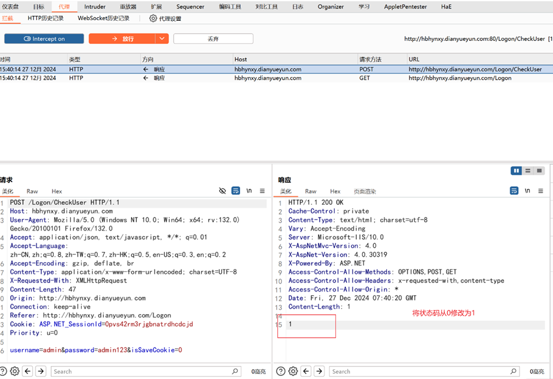
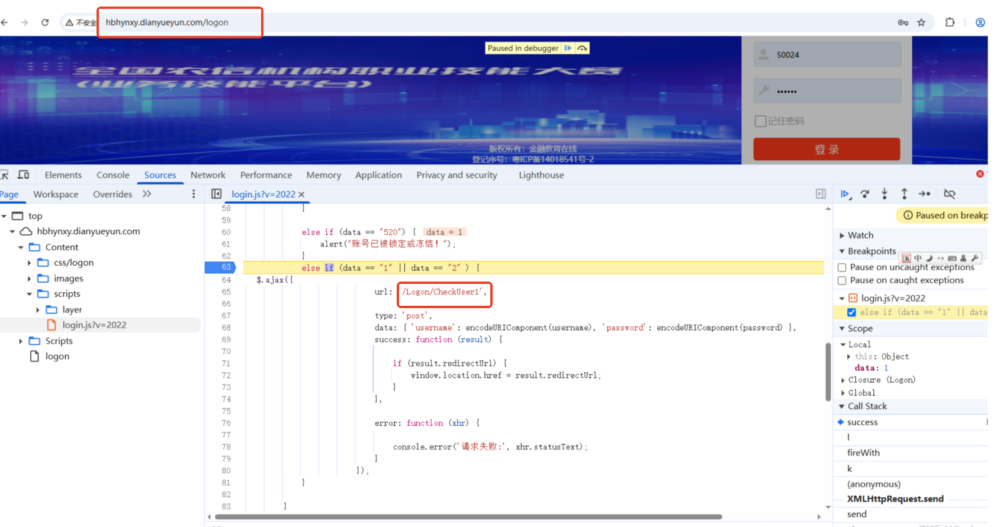
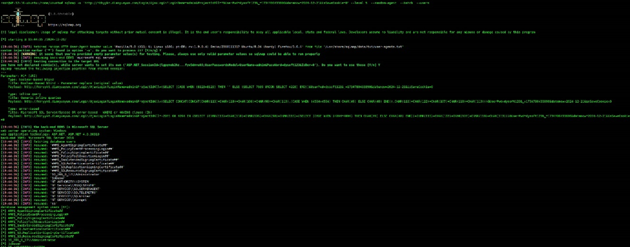
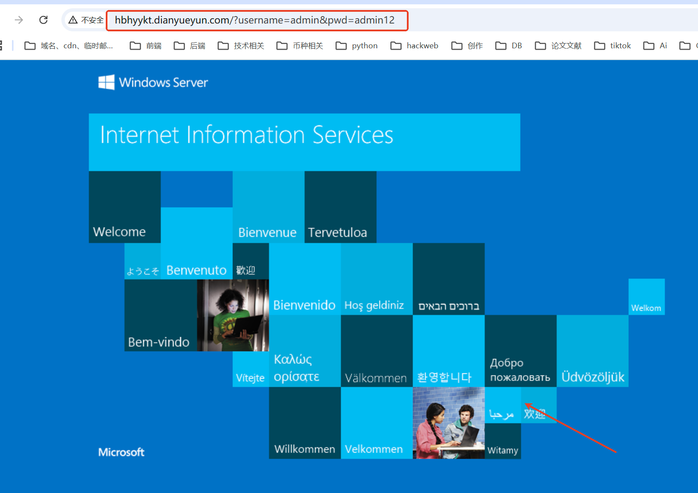
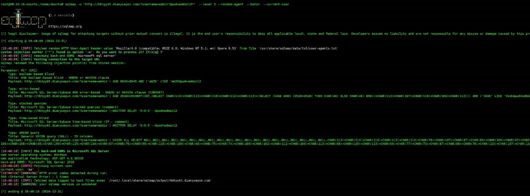
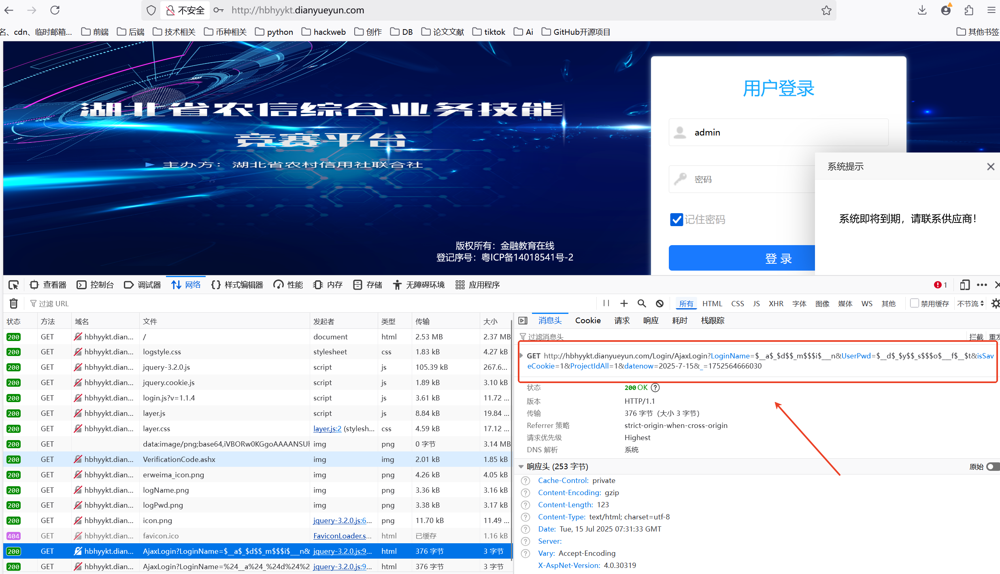
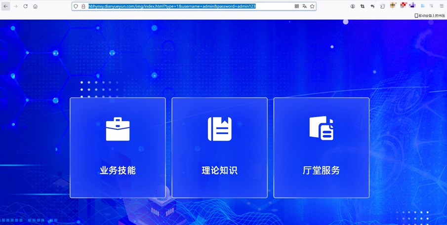
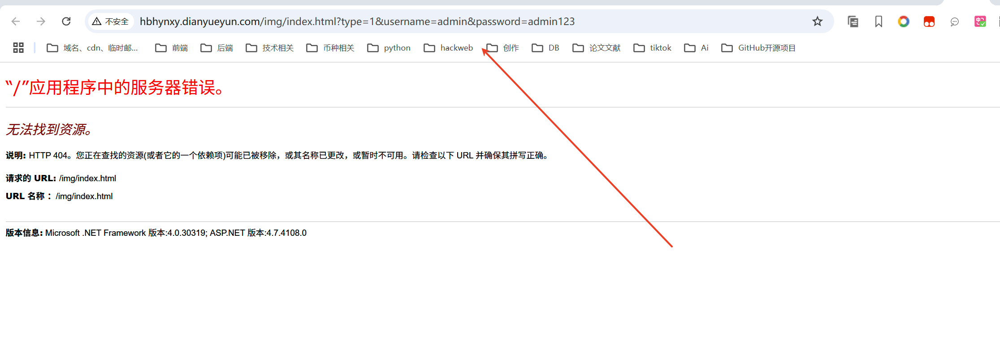
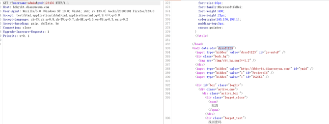
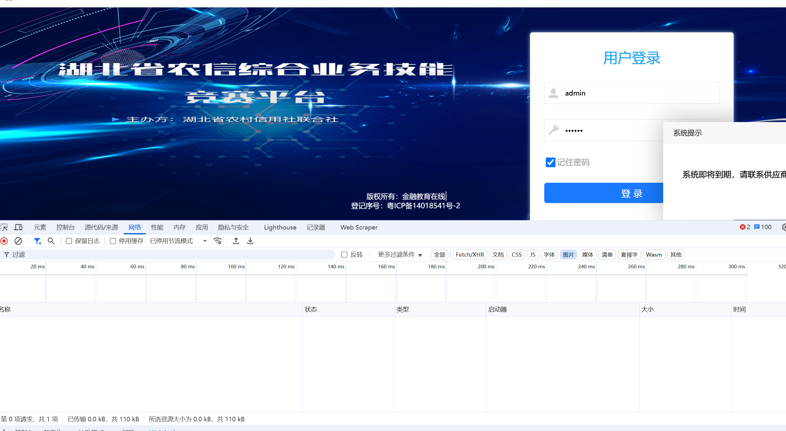

# 业务竞赛平台-漏洞通告01

**业务竞赛平台-漏洞通告**

**归属资产**

hbhynxy.dianyueyun.com

**测试时间**

2025年5月14日

**漏洞一类型**

登录绕过

**漏洞描述**

业务竞赛平台存在登录绕过漏洞，攻击者在不知道密码的情况下，将登录时响应状态码由0改为1，可成功进入系统。

**漏洞地址**

[http://hbhynxy.dianyueyun.com/Logon](http://hbhynxy.dianyueyun.com/Logon)

**测试危害**

高危

**测试过程**

图1 修改返回状态码

**修复建议**

 将身份验证放在服务端。

**此漏洞已经更新修复，新增方法 CheckerUser1 ，修复登录时响应状态码由0改为1，身份验证已经放到服务端，已处理，附截图如下**

**漏洞二类型**

Sql注入

**漏洞描述**

业务竞赛平台存在sql注入漏洞，攻击者通过未过滤的用户输入，注入恶意SQL代码干扰数据库查询，会造成如数据泄露、篡改或删除、身份认证绕过、远程控制服务器等严重危害。

**漏洞地址**

[http://hbhyykt.dianyueyun.com/?username=admin&pwd=admin12](http://hbhyykt.dianyueyun.com/?username=admin&pwd=admin12)

**测试危害**

高危

**测试过程**

图1 sql注入

**修复建议**

  严格验证和过滤用户输入，防止非法字符注入，或设置参数化查询。

**该漏洞地址地址站点已经停止，已处理，附截图**

**漏洞三类型**

Sql注入

**漏洞描述**

业务竞赛平台存在sql注入漏洞，攻击者通过未过滤的用户输入，注入恶意SQL代码干扰数据库查询，会造成如数据泄露、篡改或删除、身份认证绕过、远程控制服务器等严重危害。

**漏洞地址**

[http://hbhyykt.dianyueyun.com/Login/AjaxLogin?LoginName=admin&ProjectIdAll=&UserPwd=dysoft123&_=1734780433890&datenow=2024-12-23&isSaveCookie=0](http://hbhyykt.dianyueyun.com/Login/AjaxLogin?LoginName=admin&ProjectIdAll=&UserPwd=dysoft123&_=1734780433890&datenow=2024-12-23&isSaveCookie=0)

**测试危害**

高危

**测试过程**

图1 sql注入

**修复建议**

  严格验证和过滤用户输入，防止非法字符注入，或设置参数化查询。

### 此漏洞已经更新修复用户输入账号密码，严格验证和过滤用户输入，加密处理加密，已处理，附截图如下

**漏洞四类型**

未授权访问

**漏洞描述**

业务竞赛平台存在未授权访问漏洞，用户直接访问上述链接，可直接进入系统，无需输入正确的密码。

**漏洞地址**

[http://hbhynxy.dianyueyun.com/img/index.html?type=1&username=admin&password=admin123](http://hbhynxy.dianyueyun.com/img/index.html?type=1&username=admin&password=admin123)

**测试危害**

高危

**测试过程**

图1 访问链接直接进入系统

**修复建议**

  在所有敏感页面或操作接口添加身份验证逻辑，确保每次访问必须经过身份验证。

### 该漏洞解决方案：此漏洞为单独写的是 index.html 集成页面，已经取消 index.html 集成页。解决方法，实际上是三个软件系统，分别单独提供三个软件系统的网址给客户（业务技能，理论知识，厅堂服务）三个网址为。已处理附处理截图如下
（[http://hbhyykt.dianyueyun.com/](http://hbhyykt.dianyueyun.com/)（理论知识））

（[http://hbhynxy.dianyueyun.com/Logon](http://hbhynxy.dianyueyun.com/Logon)（业务技能））

（[http://hbhydtjl.dianyueyun.com/](http://hbhydtjl.dianyueyun.com/)（厅堂服务））

**漏洞五类型**

密码泄露

**漏洞描述**

用户访问上述链接时，无论输入什么密码，页面会将正确的密码回显到前端，存在密码泄露的漏洞。

**漏洞地址**

[http://hbhyykt.dianyueyun.com/?username=admin&pwd=123456](http://hbhyykt.dianyueyun.com/?username=admin&pwd=123456)

**测试危害**

中危

**测试过程**

图1 用户密码泄露

**修复建议**

  禁止密码返回前端。

### 已经解决前端密码禁止返回已处理，已处理附截图如下

> 更新: 2025-07-15 17:36:50  
> 原文: <https://www.yuque.com/lixinsi/hntyk2/xae50832hzibgrnb>