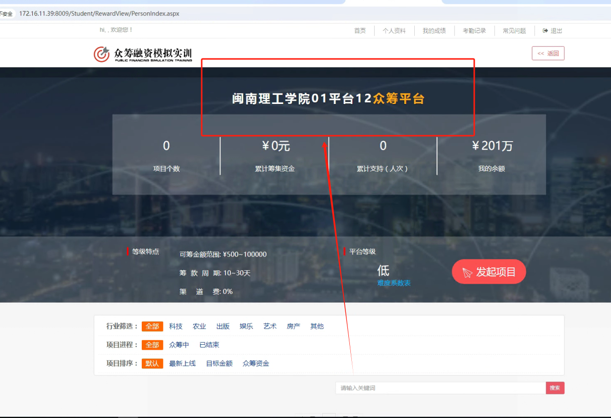
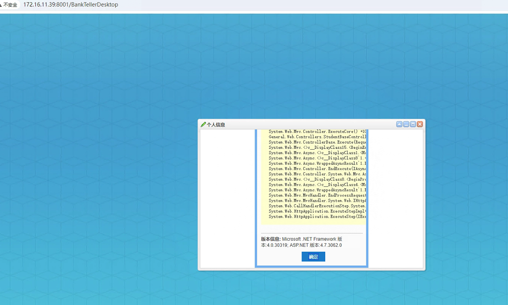
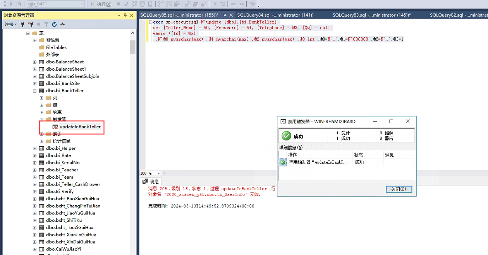
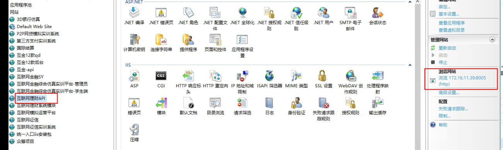
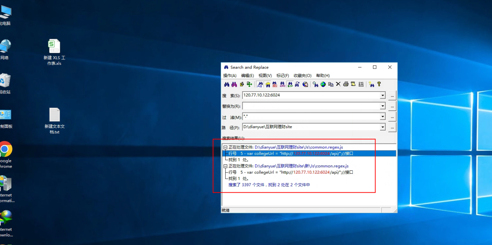
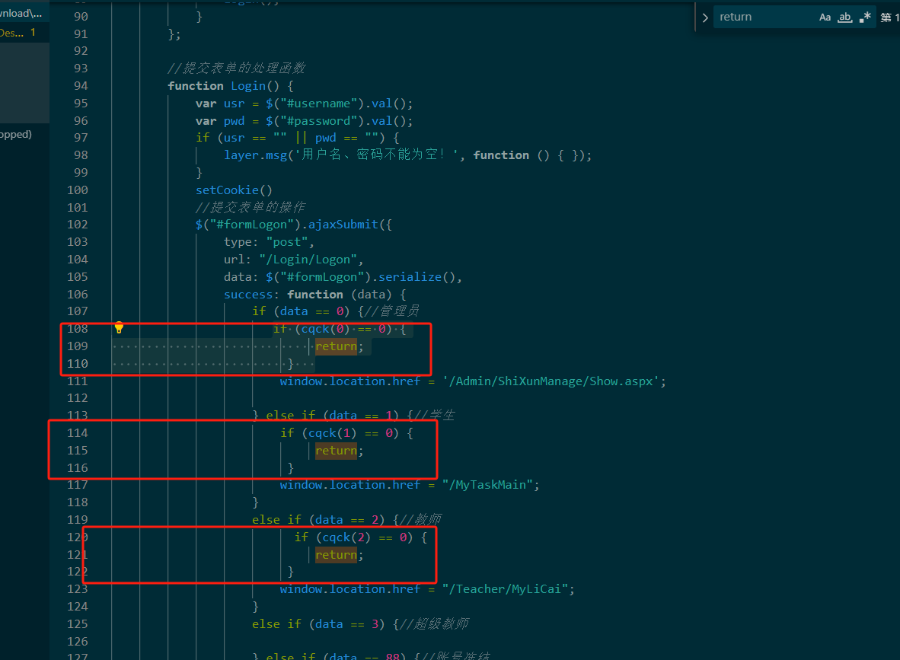
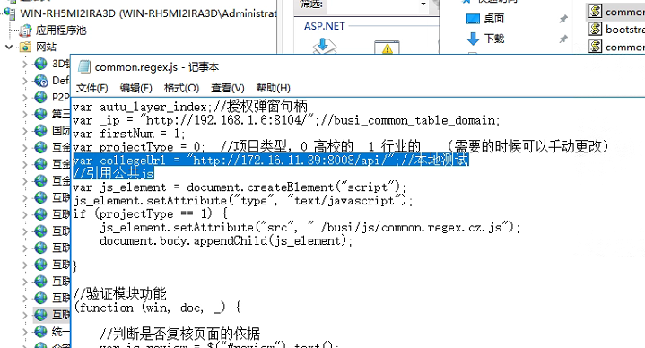
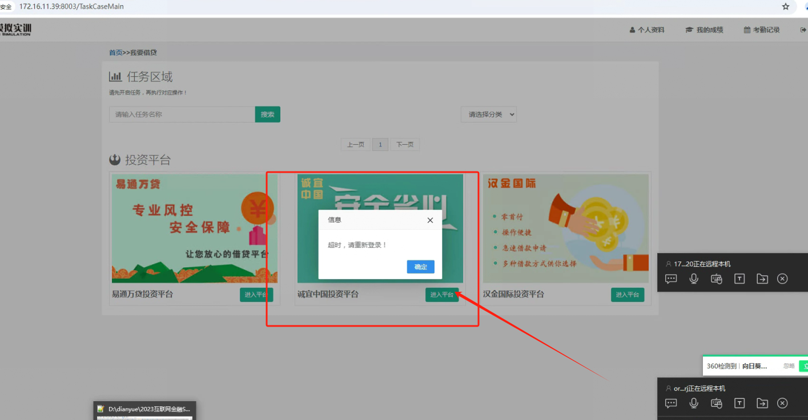
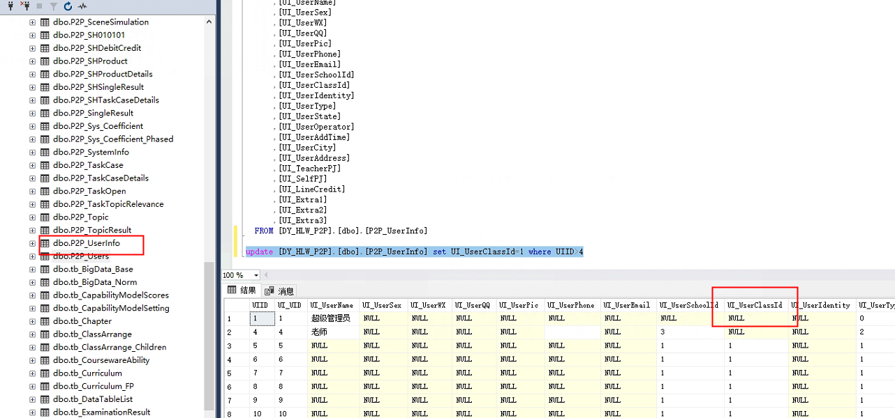

# 互联网五款

### 1.众筹


```sql
  update [DY_HLW_ZC].[dbo].[ZC_PlatMsg] set PM_PlatName=replace(PM_PlatName,'闽南理工学院01','湖南涉外经济学院01') where PM_PlatName like'%闽南理工学院01%'
```




### 2.国际结算
保存账号错误数据库表格有触发器，禁用即可






### 3：互联网教师账号理财去掉授权
```sql
delete  from P2P_SystemInfo where SIID>0
delete  from P2P_ClassInfo where CIID>0
delete from  P2P_UserInfo where UIID>2
delete from  P2P_Users where UID>2
```

任务详情无法显示问题

路径：D:\dianyue\互联网理财site\Js更改配置问题

D:\dianyue\互联网理财site\新\Js

此图要配置api





路径：D:\dianyue\soft\site\互联网理财系统模块\Views\Login

```html
@{
Layout = null;
}

<!DOCTYPE html>

<html>
  <head>
    <meta name="viewport" content="width=device-width" />
    <title>互联网理财模拟实训登录</title>
    <link href="~/Content/logstyle.css" rel="stylesheet" />
    <link href="~/Content/css/bootstrap.min.css" rel="stylesheet" />

    <script src="~/Scripts/jquery-1.10.2.min.js"></script>
    <script src="~/Scripts/layer/layer.js"></script>
    <script src="~/Scripts/jquery.base64.js"></script>
    <script src="~/Scripts/jquery.form.js"></script>
    <script src="~/Content/plugins/fullavatareditor/scripts/jQuery.Cookie.js"></script>
  </head>
  <body>
    <form id="formLogon">
      <div class="body_bg">
        
      </div>
      <div id="box" class="logDiv">
        <div class="logGet">
          @*小图标*@

          

          <!-- 头部提示信息 -->
          <div class="logD logDtip">
            <p class="p1">用户登录</p>
          </div>
          <!-- 输入框 -->
          <div class="lgD">
            <input class="input_left" id="username" name="username" type="text"
                                                         placeholder="请输入用户账户" />
          </div>
          <div class="lgD">
            <input class="input_left" id="password" name="password" type="password"
                                                        placeholder="输入用户密码" />
          </div>
          <div class="lgD jzpwd">
            <input class="getYZM" type="checkbox" id="remember" name="remember" />
            <div>
              <p>记住密码</p>
            </div>
          </div>
          <div class="logC">
            <button type="button" onclick="Login()">登 录</button>
          </div>
        </div>
      </div>
      <div class="logbottom">
        版权所有：2001——2017深圳典阅科技有限公司版权所有</br>
        公司地址：深圳南山区科技园科技一路桑达科技大厦四楼 
      </div>
      <input type="hidden" value="@ViewData["dq"]" id="dq" />
    </form>
    <script>
      window.onload = function () {
      function box() {
      //获取DIV为‘bo’的盒子
      var oBox = document.getElementById('box');
      //获取元素自身的宽度
      var L1 = oBox.offsetWidth;
      //获取元素自身的高度
      var H1 = oBox.offsetHeight;
      //获取实际页面的left值。（页面宽度减去元素自身宽度/2）
      var Left = (document.documentElement.clientWidth - L1) / 2;
      //获取实际页面的top值。（页面宽度减去元素自身高度/2）
      var top = (document.documentElement.clientHeight - H1) / 2;
      oBox.style.left = Left + 'px';
      oBox.style.top = top + 'px';
      }
      box();
      //当浏览器页面发生改变时，DIV随着页面的改变居中。
      window.onresize = function () {
      box();
      }
      }
      $(function () {
      getCookie();
  })

        document.onkeydown = function () {
            if (event.keyCode == 13) {
                Login();
            }
        };

        //提交表单的处理函数
        function Login() {
            var usr = $("#username").val();
            var pwd = $("#password").val();
            if (usr == "" || pwd == "") {
                layer.msg('用户名、密码不能为空！', function () { });
            }
            setCookie()
            //提交表单的操作
            $("#formLogon").ajaxSubmit({
                type: "post",
                url: "/Login/Logon",
                data: $("#formLogon").serialize(),
                success: function (data) {
                    if (data == 0) {//管理员
                      
                        window.location.href = '/Admin/ShiXunManage/Show.aspx';

                    } else if (data == 1) {//学生
                       
                        window.location.href = "/MyTaskMain";
                    }
                    else if (data == 2) {//教师
                         
                        window.location.href = "/Teacher/MyLiCai";
                    }
                    else if (data == 3) {//超级教师

                    } else if (data == 88) {//账号冻结
                        layer.msg('账号被禁用！', function () { });
                    } else if (data == 77) {
                        layer.msg('系统已过期，请联系供应商！', function () { });
                    } else {
                        layer.msg('用户名或密码填写错误！', function () { });
                    }
                }
            });
        }

          function cqck(U_UserType) {
            var usr = $("#username").val().trim();
            var pwd = $("#password").val().trim();
            var dy=0;
            //授权校验////////////////////////////
            $.ajax({
                Type: "post",
                url: 'http://120.77.10.122:6030/PZHandler.ashx?action=Getsq',
                data: { "LoginName": usr, "UserPwd": pwd,"U_UserType":U_UserType },
                dataType: "json", cache: false,
                async: false,
                contentType: "application/json; charset=utf-8",
                success: function (data) {
      
                    if (data.length > 0) {
                        var qx = data[0]["qx"] + "";

                        if (qx.length == 0) {//不存在或者过期
                            layer.msg("学校未授权或已到期");
                           
                        } else {
                            //理财
                            if (qx.indexOf('3') == "-1") {
                                layer.msg("学校未授权此软件");
                               
                            } else {
                                dy=1;
                              
                            }
                        }
                    } else {
                        layer.msg("授权错误，请联系开发商");
                       
                    }
                }
            });
            return dy;
        }

        //设置cookie
        function setCookie() {
            var loginCode = $("#username").val();//获取用户名信息
            var pwd = $("#password").val();//获取登陆密码信息
            var checked = $("[name='remember']:checked");//获取“是否记住密码”复选框
            if (checked && checked.length > 0) {//判断是否选中了“记住密码”复选框
                $.Cookie("username", loginCode); //调用jquery.cookie.js中的方法设置cookie中的用户名
                $.Cookie("password", $.base64.encode(pwd));//调用jquery.cookie.js中的方法设置cookie中的登陆密码，并使用base64（jquery.base64.js）进行加密
            } else {
                $.Cookie("password", null);
            }
        }

        //获取cookie
        function getCookie() {
            var loginCode = $.Cookie("username");//获取cookie中的用户名
            var pwd = $.Cookie("password");//获取cookie中的登陆密码
            if (pwd) {//密码存在的话把“记住用户名和密码”复选框勾选住
                $("[name='remember']").attr("checked", "true");
            }
            if (loginCode) {//用户名存在的话把用户名填充到用户名文本框
                $("#username").val(loginCode);
            }
            if (pwd) {//密码存在的话把密码填充到密码文本框
                $("#password").val($.base64.decode(pwd));
            }
        }

    </script>
    <script type="text/javascript">
        $(function () {
            var dq = $("#dq").val();
            if (dq == "1") {//即将过期
                layer.open({
                    title: '系统提示',
                    anim: 1,
                    shade: 0, //遮罩透明度
                    type: 1,
                    content: '<div id="AddOpenDiv"><div style="width:300px; height:150px; line-height:120px; text-align:center;">系统即将到期，请联系供应商！</div></div>',
                    offset: "rb",

                });
            }

        })
    </script>
</body>
</html>

```



去掉授权loginjs或者login.chtml


### 4.征信提交不了
路径：D:\dianyue\soft\site\互联网征信实训系统\Areas\Teacher\Form\Script

文件common.regex.js

```json
var collegeUrl = "http://172.16.11.39:8008/api/";//本地测试
//引用公共js
```



### <font style="color:rgb(103, 106, 108);background-color:rgb(245, 245, 245);">5.p2p登入超时</font>






```sql
update [DY_HLW_P2P].[dbo].[P2P_UserInfo] set UI_UserClassId=1 where UIID>4
```

### 6.第三方支付代理
```sql
USE [msdb]
GO

/****** Object:  Job [第三方支付6021]    Script Date: 03/21/2019 16:52:52 ******/
BEGIN TRANSACTION
DECLARE @ReturnCode INT
SELECT @ReturnCode = 0
/****** Object:  JobCategory [[Uncategorized (Local)]]]    Script Date: 03/21/2019 16:52:52 ******/
IF NOT EXISTS (SELECT name FROM msdb.dbo.syscategories WHERE name=N'[Uncategorized (Local)]' AND category_class=1)
BEGIN
EXEC @ReturnCode = msdb.dbo.sp_add_category @class=N'JOB', @type=N'LOCAL', @name=N'[Uncategorized (Local)]'
IF (@@ERROR <> 0 OR @ReturnCode <> 0) GOTO QuitWithRollback

END

DECLARE @jobId BINARY(16)
EXEC @ReturnCode =  msdb.dbo.sp_add_job @job_name=N'第三方支付6021', 
		@enabled=1, 
		@notify_level_eventlog=0, 
		@notify_level_email=0, 
		@notify_level_netsend=0, 
		@notify_level_page=0, 
		@delete_level=0, 
		@description=N'无描述。', 
		@category_name=N'[Uncategorized (Local)]', 
		@owner_login_name=N'sa', @job_id = @jobId OUTPUT
IF (@@ERROR <> 0 OR @ReturnCode <> 0) GOTO QuitWithRollback
/****** Object:  Step [第三方支付6021]    Script Date: 03/21/2019 16:52:52 ******/
EXEC @ReturnCode = msdb.dbo.sp_add_jobstep @job_id=@jobId, @step_name=N'第三方支付6021', 
		@step_id=1, 
		@cmdexec_success_code=0, 
		@on_success_action=1, 
		@on_success_step_id=0, 
		@on_fail_action=2, 
		@on_fail_step_id=0, 
		@retry_attempts=0, 
		@retry_interval=0, 
		@os_run_priority=0, @subsystem=N'TSQL', 
		@command=N'use [6021_DSFZF_20180330]

exec proc_AutomaticReceipt
exec proc_synchronization', 
		@database_name=N'master', 
		@flags=0
IF (@@ERROR <> 0 OR @ReturnCode <> 0) GOTO QuitWithRollback
EXEC @ReturnCode = msdb.dbo.sp_update_job @job_id = @jobId, @start_step_id = 1
IF (@@ERROR <> 0 OR @ReturnCode <> 0) GOTO QuitWithRollback
EXEC @ReturnCode = msdb.dbo.sp_add_jobschedule @job_id=@jobId, @name=N'30s', 
		@enabled=1, 
		@freq_type=4, 
		@freq_interval=1, 
		@freq_subday_type=2, 
		@freq_subday_interval=30, 
		@freq_relative_interval=0, 
		@freq_recurrence_factor=0, 
		@active_start_date=20180711, 
		@active_end_date=99991231, 
		@active_start_time=0, 
		@active_end_time=235959, 
		@schedule_uid=N'a01e6bcd-64f5-4a31-830a-2400f336615b'
IF (@@ERROR <> 0 OR @ReturnCode <> 0) GOTO QuitWithRollback
EXEC @ReturnCode = msdb.dbo.sp_add_jobserver @job_id = @jobId, @server_name = N'(local)'
IF (@@ERROR <> 0 OR @ReturnCode <> 0) GOTO QuitWithRollback
COMMIT TRANSACTION
GOTO EndSave
QuitWithRollback:
    IF (@@TRANCOUNT > 0) ROLLBACK TRANSACTION
EndSave:

GO


```


> 更新: 2026-02-28 15:42:31  
> 原文: <https://www.yuque.com/lixinsi/hntyk2/uxwmvc5gkf73oldz>