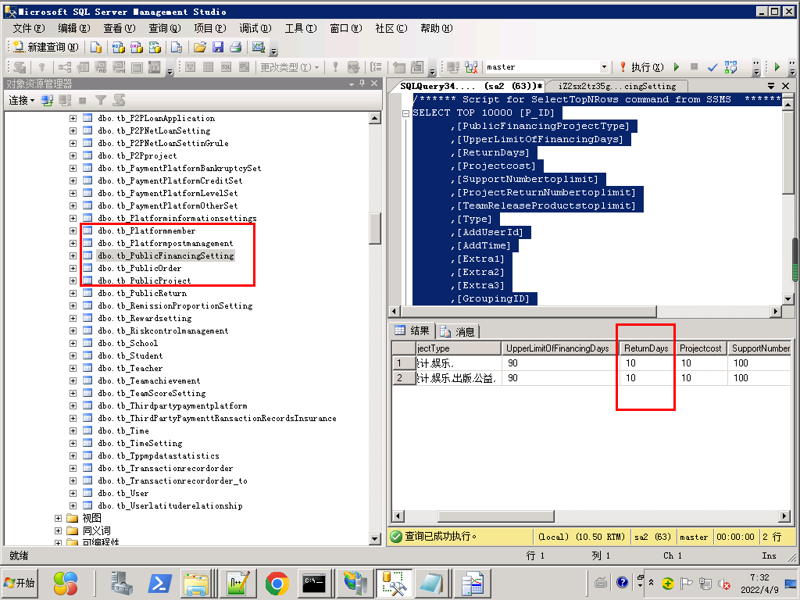
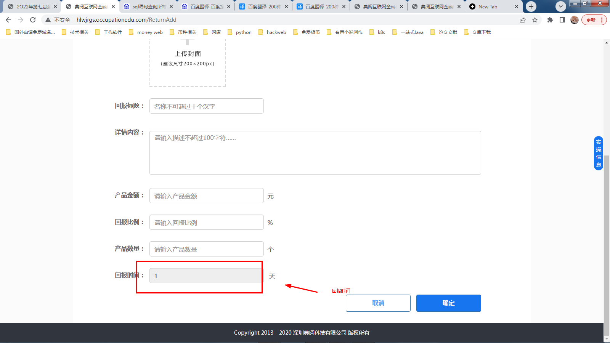

# 互联网金融

  truncate table [20220408hlwjr].[dbo].[tb_College]

  truncate table [20220408hlwjr].[dbo].[tb_Class]

 truncate table [20220408hlwjr].[dbo].[tb_Follow]

 truncate table [20220408hlwjr].[dbo].[tb_Student]

 truncate table [20220408hlwjr].[dbo].[tb_Teacher]

truncate table [20220408hlwjr].[dbo].[tb_Major]

truncate table [20220408hlwjr].[dbo].[tb_School]

truncate table [20220408hlwjr].[dbo].[tb_Groupmanagement]

truncate table [20220408hlwjr].[dbo].[tb_Groupingrelation]

INSERT INTO 表名称 VALUES (值1, 值2,....)  

  update [2021-hlwhrbs].[dbo].[tb_PublicFinancingSetting] set ReturnDays='10'

替换js html += '<td>' + data[i]["TransactionTypeName"].replace("P2P网贷","网络借贷") + '</td>';

找到字段里面的代替

> 更新: 2023-04-23 14:38:36  
> 原文: <https://www.yuque.com/lixinsi/hntyk2/nx7wey>