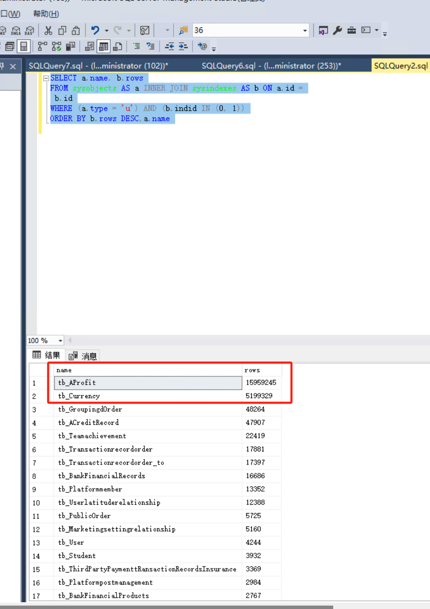
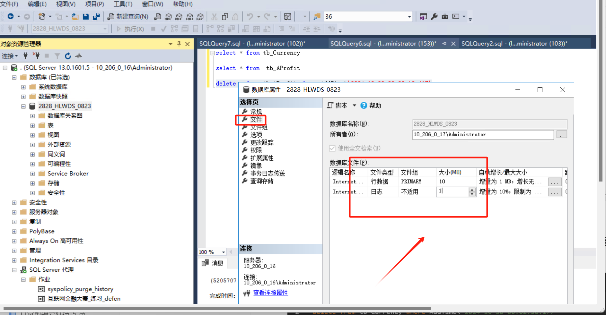
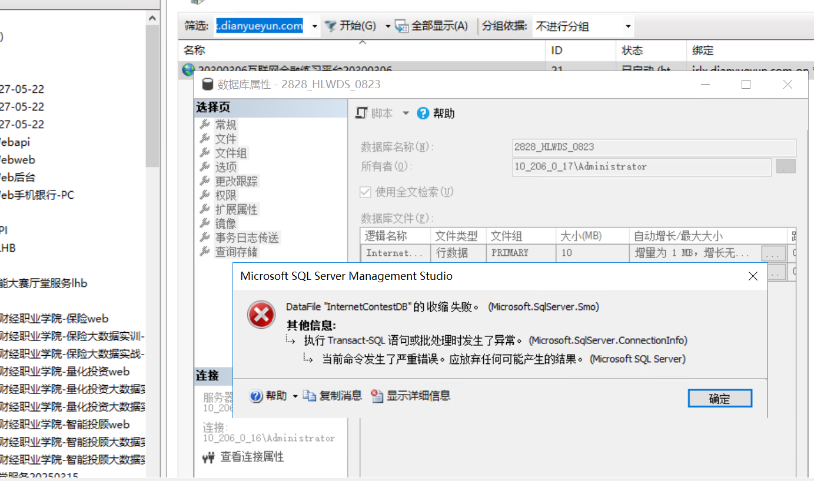
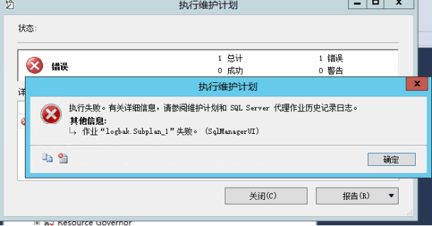
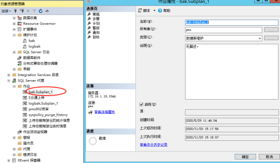
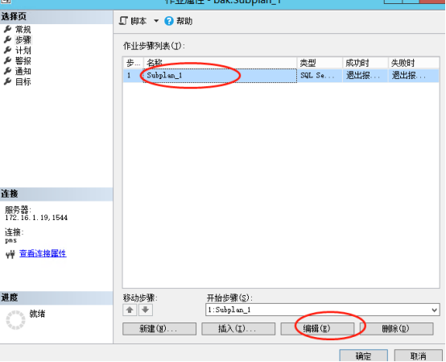
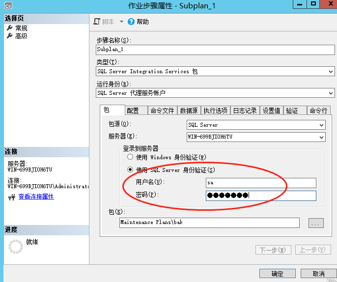

# 互联网金融代理任务数据太大量报错

### 1.统计查询数据库表格的数据量
```sql
SELECT a.name, b.rows
FROM sysobjects AS a INNER JOIN sysindexes AS b ON a.id =
 b.id
WHERE (a.type = 'u') AND (b.indid IN (0, 1))
ORDER BY b.rows DESC,a.name

```




### 2.删除数据提前两周的数据可以删除如 今天是 11 月 14 日提前两周就是 10 月 30 日
```sql
select * from tb_Currency
delete from tb_Currency where AddTime<'2024-10-30 00:02:50.177'
delete   from tb_AProfit where AddTime>'2024-10-30 00:00:12.417'
```


### 3.删除之后记得把该数据库的文件以及日志缩小，如果缩小报错直接重启数据库在缩小





# [<font style="color:rgb(0, 0, 0);background-color:rgb(254, 254, 242);">sql server 2016 维护计划执行，提示执行失败。有关详细信息，请参阅维护计划和sql server 代理作业历史记录日志。</font>](https://www.cnblogs.com/qiansm/p/14011820.html)
<font style="color:rgb(0, 0, 0);background-color:rgb(254, 254, 242);">sql server 2016修改了维护计划，测试备份的时候报错如下：</font>



<font style="color:rgb(0, 0, 0);background-color:rgb(254, 254, 242);"></font>

<font style="color:rgb(0, 0, 0);background-color:rgb(254, 254, 242);">网上有人说</font>

<font style="color:rgb(0, 0, 0);background-color:rgb(254, 254, 242);">SQL Server代理--作业--选中数据库对应作业</font>

<font style="color:rgb(0, 0, 0);background-color:rgb(254, 254, 242);">双击打开-常规-所有者-选择登录名，不管是否与当前名字一样，都重新选择一次，确定，就可以了。但是这种方法测试不成功</font>

<font style="color:rgb(0, 0, 0);background-color:rgb(254, 254, 242);">我的解决方法：</font>

<font style="color:rgb(0, 0, 0);background-color:rgb(254, 254, 242);">SQL Server代理--作业--选中数据库对应作业</font>

<font style="color:rgb(0, 0, 0);background-color:rgb(254, 254, 242);">双击打开--步骤--编辑</font>



<font style="color:rgb(0, 0, 0);background-color:rgb(254, 254, 242);"></font>



<font style="color:rgb(0, 0, 0);background-color:rgb(254, 254, 242);"></font>

<font style="color:rgb(0, 0, 0);background-color:rgb(254, 254, 242);">修改了任务计划后，登录到服务器这个地方有可能默认是</font><font style="color:rgb(0, 0, 0);background-color:rgb(254, 254, 242);"> </font><font style="color:rgb(0, 0, 0);background-color:rgb(254, 254, 242);">使用</font><font style="color:rgb(0, 0, 0);background-color:rgb(254, 254, 242);">windows</font><font style="color:rgb(0, 0, 0);background-color:rgb(254, 254, 242);">身份验证</font>

<font style="color:rgb(0, 0, 0);background-color:rgb(254, 254, 242);">导致任务计划不成功。</font>



<font style="color:rgb(0, 0, 0);background-color:rgb(254, 254, 242);"></font>

<font style="color:rgb(0, 0, 0);background-color:rgb(254, 254, 242);">再次，执行 任务计划成功。希望能够帮到你。</font>


> 更新: 2024-11-14 14:28:28  
> 原文: <https://www.yuque.com/lixinsi/hntyk2/sl5zz7tfm5czsko5>