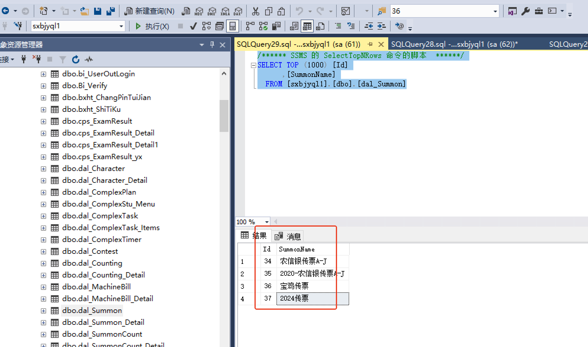
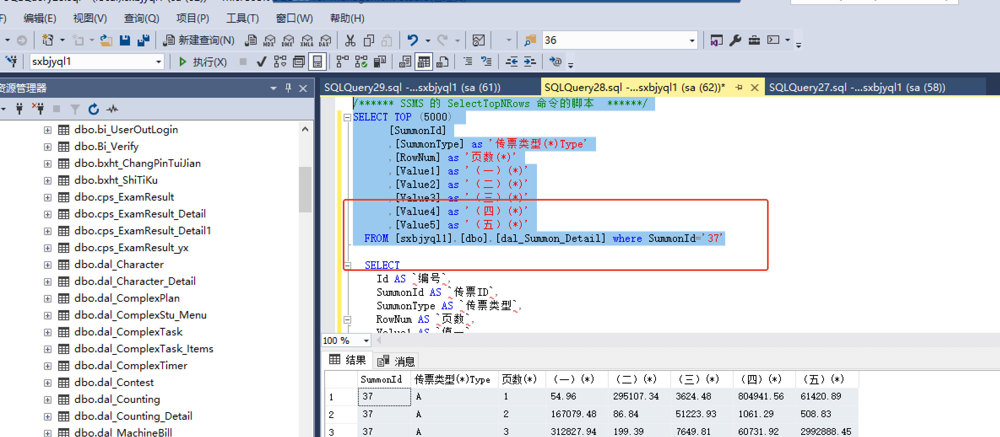

# 传票批量开题脚本以及传票导出

```plsql
declare @number int
set @number=1
declare @summonCountID int
declare @startLine int

while(@number<61)
begin
INSERT INTO [2023nxyshanxijihe].[dbo].[dal_SummonCount]([ContestId],[BankSiteId],[SummonId]
                                                        ,[SummonCountName],[BeginTime],[SummonCountLength],[TotalMark],[SummonCountStatus]
                                                        ,[AddTime],[IfTimeScore],[RepeatNum])
           values(10,67,38,'20240307传票'+CAST(@number as varchar(10)),'2024-03-02 00:00:00',10,100,1,GETDATE(),1,9999);
set @summonCountID=@@IDENTITY;
set @startLine=CEILING(RAND()*81);
INSERT INTO [2023nxyshanxijihe].[dbo].[dal_SummonCount_Detail]([SummonCountId],[SummonType]
                                                               ,[BeginValue],[EndValue],[SumValue1],[SumValue2],[SumValue3],[SumValue4],[SumValue5])
     VALUES(@summonCountID,CAST(char(65+CEILING(RAND()*9)) as varchar(10)),@startLine,@startLine+19,0,0,0,0,0);
set @startLine=CEILING(RAND()*81);
INSERT INTO [2023nxyshanxijihe].[dbo].[dal_SummonCount_Detail]([SummonCountId],[SummonType]
                                                               ,[BeginValue],[EndValue],[SumValue1],[SumValue2],[SumValue3],[SumValue4],[SumValue5])
     VALUES(@summonCountID,CAST(char(65+CEILING(RAND()*9)) as varchar(10)),@startLine,@startLine+19,0,0,0,0,0);
set @startLine=CEILING(RAND()*81);
INSERT INTO [2023nxyshanxijihe].[dbo].[dal_SummonCount_Detail]([SummonCountId],[SummonType]
                                                               ,[BeginValue],[EndValue],[SumValue1],[SumValue2],[SumValue3],[SumValue4],[SumValue5])
     VALUES(@summonCountID,CAST(char(65+CEILING(RAND()*9)) as varchar(10)),@startLine,@startLine+19,0,0,0,0,0);
set @startLine=CEILING(RAND()*81);
INSERT INTO [2023nxyshanxijihe].[dbo].[dal_SummonCount_Detail]([SummonCountId],[SummonType]
                                                               ,[BeginValue],[EndValue],[SumValue1],[SumValue2],[SumValue3],[SumValue4],[SumValue5])
     VALUES(@summonCountID,CAST(char(65+CEILING(RAND()*9)) as varchar(10)),@startLine,@startLine+19,0,0,0,0,0);
set @number=@number+1;  
end

update dal_SummonCount_Detail set SumValue1=(select SUM(value1) from dal_Summon_Detail where SummonType=t1.SummonType and RowNum>=t2.BeginValue and RowNum<=t2.EndValue),
SumValue2=(select SUM(value2) from dal_Summon_Detail where SummonType=t1.SummonType and RowNum>=t2.BeginValue and RowNum<=t2.EndValue),
SumValue3=(select SUM(value3) from dal_Summon_Detail where SummonType=t1.SummonType and RowNum>=t2.BeginValue and RowNum<=t2.EndValue),
SumValue4=(select SUM(value4) from dal_Summon_Detail where SummonType=t1.SummonType and RowNum>=t2.BeginValue and RowNum<=t2.EndValue),
SumValue5=(select SUM(value5) from dal_Summon_Detail where SummonType=t1.SummonType and RowNum>=t2.BeginValue and RowNum<=t2.EndValue)
from dal_Summon_Detail as t1 inner join dal_SummonCount_Detail as t2
on t1.SummonType=t2.SummonType
where t1.SummonId=38

```

### 1.更新传票后需要刷新答案
```plsql
update dal_SummonCount_Detail set SumValue1=(select SUM(value1) from dal_Summon_Detail where SummonType=t1.SummonType and SummonId=36 and RowNum>=t2.BeginValue and RowNum<=t2.EndValue),
SumValue2=(select SUM(value2) from dal_Summon_Detail where SummonType=t1.SummonType and SummonId=36 and RowNum>=t2.BeginValue and RowNum<=t2.EndValue),
SumValue3=(select SUM(value3) from dal_Summon_Detail where SummonType=t1.SummonType and SummonId=36 and RowNum>=t2.BeginValue and RowNum<=t2.EndValue),
SumValue4=(select SUM(value4) from dal_Summon_Detail where SummonType=t1.SummonType and SummonId=36 and RowNum>=t2.BeginValue and RowNum<=t2.EndValue),
SumValue5=(select SUM(value5) from dal_Summon_Detail where SummonType=t1.SummonType and SummonId=36 and RowNum>=t2.BeginValue and RowNum<=t2.EndValue)
from dal_Summon_Detail as t1 inner join dal_SummonCount_Detail as t2
on t1.SummonType=t2.SummonType
where t1.SummonId=36
--更新答案求值
```


### 2.传票导出脚本
```plain
/****** SSMS 的 SelectTopNRows 命令的脚本  ******/
SELECT TOP (1000) [Id]
      ,[SummonName]
  FROM [sxbjyql1].[dbo].[dal_Summon]
```




```plain


/****** SSMS 的 SelectTopNRows 命令的脚本  ******/
SELECT TOP (5000) 
      [SummonId]
      ,[SummonType] as '传票类型(*)Type'
      ,[RowNum] as '页数(*)'
      ,[Value1] as '（一）(*)'
      ,[Value2] as '（二）(*)'
      ,[Value3] as '（三）(*)'
      ,[Value4] as '（四）(*)'
      ,[Value5] as '（五）(*)'
  FROM [sxbjyql1].[dbo].[dal_Summon_Detail] where SummonId='37'
```




> 更新: 2024-11-25 11:35:02  
> 原文: <https://www.yuque.com/lixinsi/hntyk2/lyc8v5m5b6hh94u3>