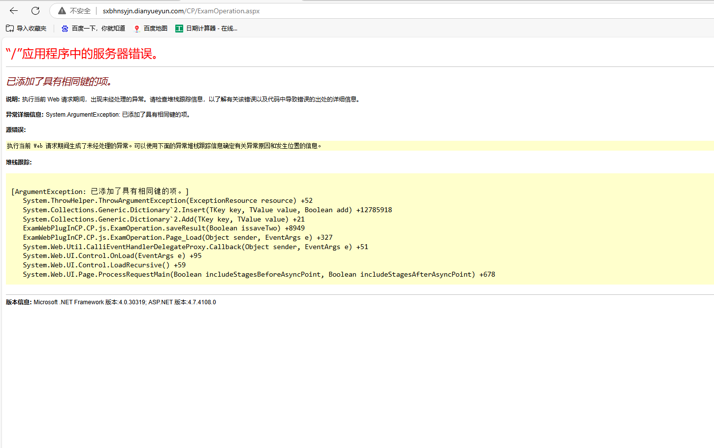
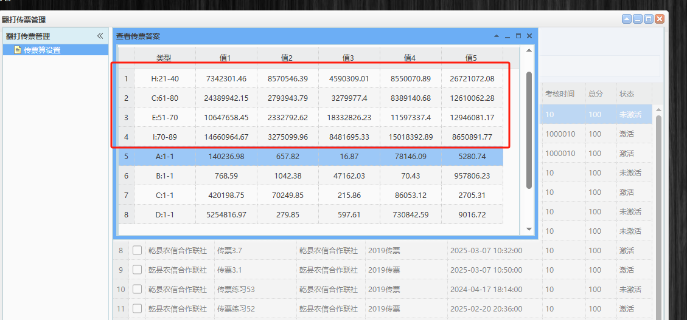
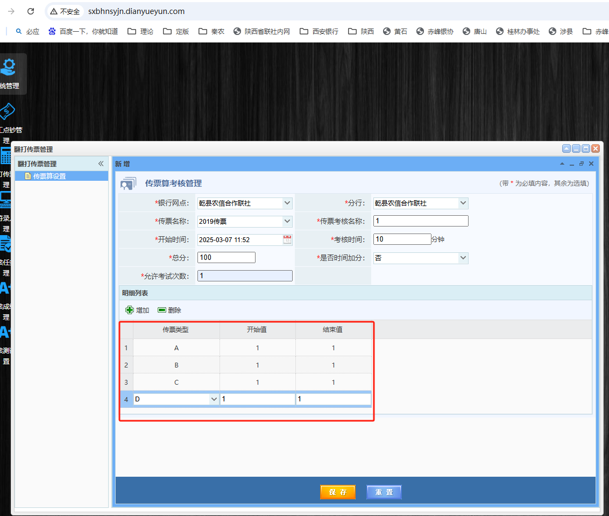
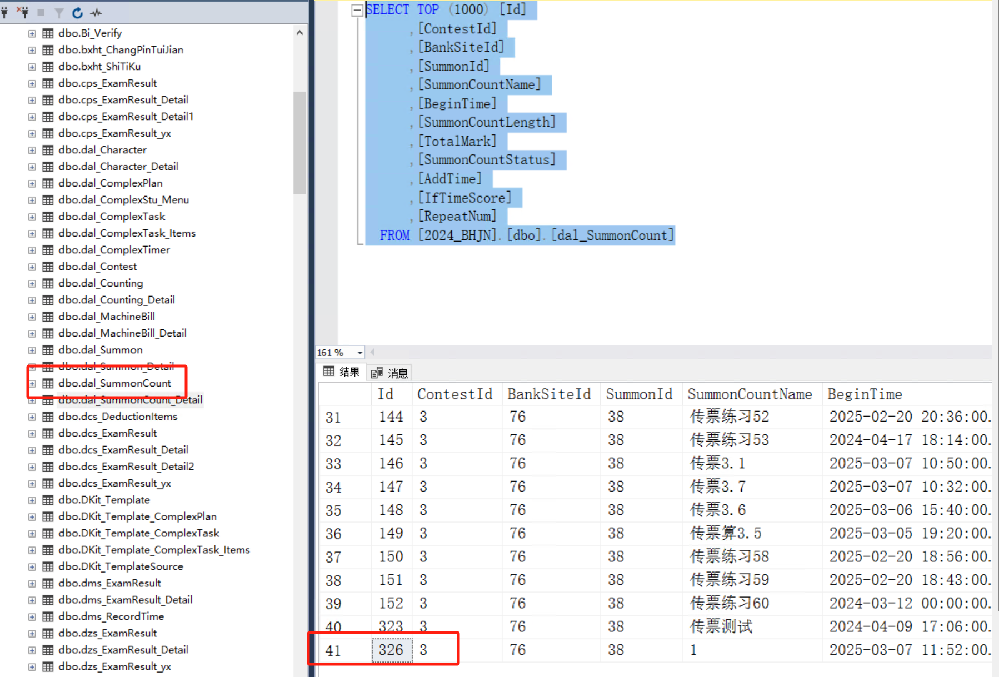
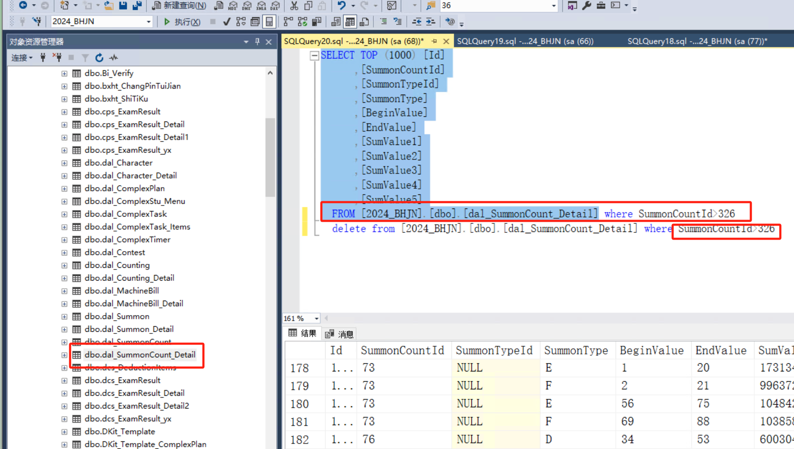
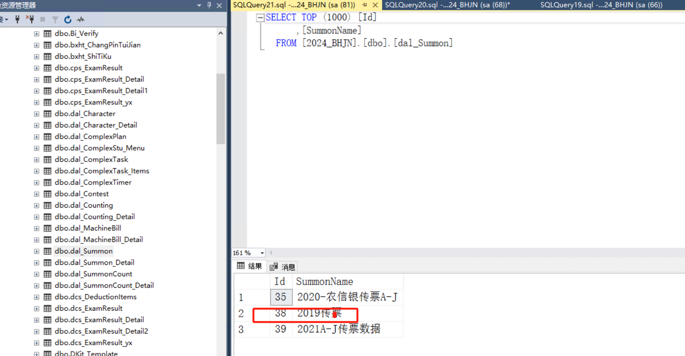

# 传票问题



### 传票重复[dal_SummonCount_Detail] 清除所有答案重新导入正常


### 设置的是ABCD四版传票，保存后，出现了其他不是我设置的传票




#### 查询
```python
SELECT TOP (1000) [Id]
      ,[ContestId]
      ,[BankSiteId]
      ,[SummonId]
      ,[SummonCountName]
      ,[BeginTime]
      ,[SummonCountLength]
      ,[TotalMark]
      ,[SummonCountStatus]
      ,[AddTime]
      ,[IfTimeScore]
      ,[RepeatNum]
  FROM [2024_BHJN].[dbo].[dal_SummonCount]
```




### 删除大于 326 的所有数据
```python
SELECT TOP (1000) [Id]
      ,[SummonCountId]
      ,[SummonTypeId]
      ,[SummonType]
      ,[BeginValue]
      ,[EndValue]
      ,[SumValue1]
      ,[SumValue2]
      ,[SumValue3]
      ,[SumValue4]
      ,[SumValue5]
  FROM [2024_BHJN].[dbo].[dal_SummonCount_Detail] where SummonCountId>326
  delete from [2024_BHJN].[dbo].[dal_SummonCount_Detail] where SummonCountId>326
```



### 删除完了后需要更新答案，查找对应传票更改 id 执行脚本


```python
  update dal_SummonCount_Detail set SumValue1=(select SUM(value1) from dal_Summon_Detail where SummonType=t1.SummonType and SummonId=38 and RowNum>=t2.BeginValue and RowNum<=t2.EndValue),
SumValue2=(select SUM(value2) from dal_Summon_Detail where SummonType=t1.SummonType and SummonId=38 and RowNum>=t2.BeginValue and RowNum<=t2.EndValue),
SumValue3=(select SUM(value3) from dal_Summon_Detail where SummonType=t1.SummonType and SummonId=38 and RowNum>=t2.BeginValue and RowNum<=t2.EndValue),
SumValue4=(select SUM(value4) from dal_Summon_Detail where SummonType=t1.SummonType and SummonId=38 and RowNum>=t2.BeginValue and RowNum<=t2.EndValue),
SumValue5=(select SUM(value5) from dal_Summon_Detail where SummonType=t1.SummonType and SummonId=38 and RowNum>=t2.BeginValue and RowNum<=t2.EndValue)
from dal_Summon_Detail as t1 inner join dal_SummonCount_Detail as t2
on t1.SummonType=t2.SummonType
where t1.SummonId=38
--更新答案求值
```

```plain


--定义变量
declare	@SummonType varchar(200)        --类型 A BC  
declare	@BeginValue int       --开始值
declare	@EndValue int    --结束值
declare	@s1 float        --值
declare	@s2 float      --值
declare	@s3 float      --值
declare	@s4 float      --值
declare	@s5 float      --值
declare	@SummonId int    --任务id
declare	@neizId int     --内置Id----------------------传票算的类型 2018什么
declare	@mian1_taotal int  --临时表1总条数
declare	@mian2_taotal int  --临时表2总条数


--创建主临时表  
create table #tb_yx_Main1(
		id int identity (1,1) primary key,
		SumId int,   --任务Id
		SumName varchar(50),  --任务名称
		neizId int
)
--创建主临时2表
     
     create table #tb_yx_Main2(
		id int identity (1,1) primary key,
		SumType varchar(50),   --类型
		SumSate int,  --开始
		SumEnd  int  --结束
     )
     

truncate table #tb_yx_Main1
insert into #tb_yx_Main1 select Id,SummonCountName,SummonId from  dal_SummonCount 
--得出临时表1
Set @mian1_taotal=(select COUNT(*) from #tb_yx_Main1)

while(@mian1_taotal>0)
begin
     set @SummonId=(select SumId from #tb_yx_Main1 where id=@mian1_taotal)	  --任务ID
   
    set @neizId=(select neizId from #tb_yx_Main1 where id=@mian1_taotal)	
     --根据任务Id  查下 获取之前的 类型和 起始值  插入临时表 循环
     truncate table #tb_yx_Main2
     --插入临时表2
     insert into #tb_yx_Main2 select SummonType,BeginValue,EndValue from  dal_SummonCount_Detail where SummonCountId=@SummonId
     Set @mian2_taotal=(select COUNT(*) from #tb_yx_Main2) --临时表2的数据
     --删除之前的明细
     delete from dal_SummonCount_Detail where SummonCountId=@SummonId
     
     while(@mian2_taotal>0)
     begin
         set @SummonType=(select SumType from #tb_yx_Main2 where id=@mian2_taotal)
         set @BeginValue=(select SumSate from #tb_yx_Main2 where id=@mian2_taotal)
         set @EndValue=(select SumEnd from #tb_yx_Main2 where id=@mian2_taotal)
 
         --查下单行单列内置的
         set @s1=(select isnull(SUM(value1),0) FROM dal_Summon_Detail where SummonId=@neizId and SummonType=@SummonType and RowNum>=@BeginValue and RowNum<=@EndValue)
         set @s2=(select isnull(SUM(value2),0) FROM dal_Summon_Detail where SummonId=@neizId and SummonType=@SummonType and RowNum>=@BeginValue and RowNum<=@EndValue)
         set @s3=(select isnull(SUM(value3),0) FROM dal_Summon_Detail where SummonId=@neizId and SummonType=@SummonType and RowNum>=@BeginValue and RowNum<=@EndValue)
         set @s4=(select isnull(SUM(value4),0) FROM dal_Summon_Detail where SummonId=@neizId and SummonType=@SummonType and RowNum>=@BeginValue and RowNum<=@EndValue)
         set @s5=(select isnull(SUM(value5),0) FROM dal_Summon_Detail where SummonId=@neizId and SummonType=@SummonType and RowNum>=@BeginValue and RowNum<=@EndValue)
         --
        
        ---插入新的明细
        insert into dal_SummonCount_Detail(SummonCountId,SummonType,BeginValue,EndValue,SumValue1,SumValue2,SumValue3,SumValue4,SumValue5)
        values (@SummonId,@SummonType,@BeginValue,@EndValue,@s1,@s2,@s3,@s4,@s5)
       set @mian2_taotal = @mian2_taotal-1  --临时表
     end
     
   set @mian1_taotal = @mian1_taotal-1  --临时表 
end

DROP TABLE #tb_yx_Main1 
DROP TABLE #tb_yx_Main2


```


> 更新: 2026-03-23 14:39:23  
> 原文: <https://www.yuque.com/lixinsi/hntyk2/evzsi7pv142eup99>