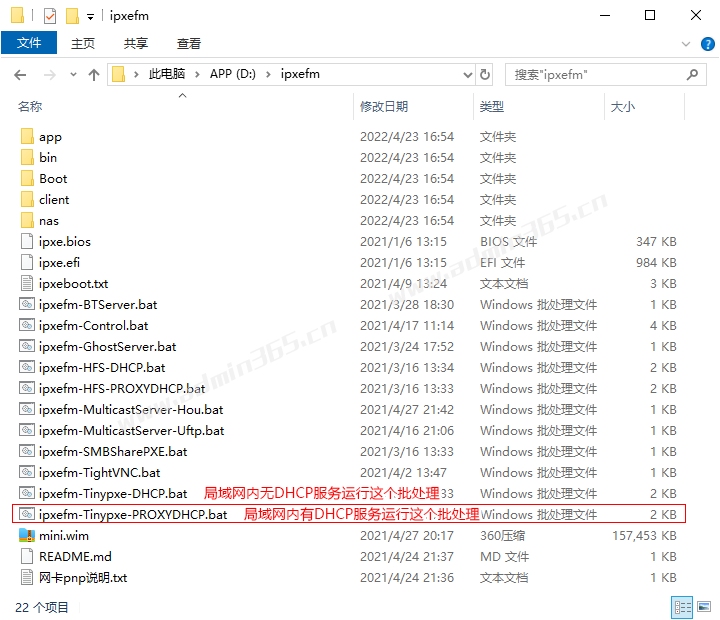
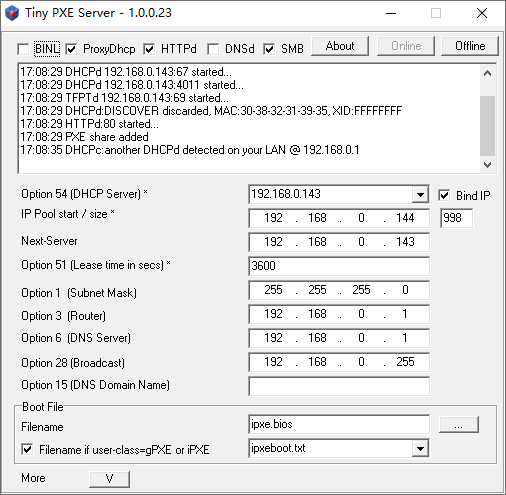
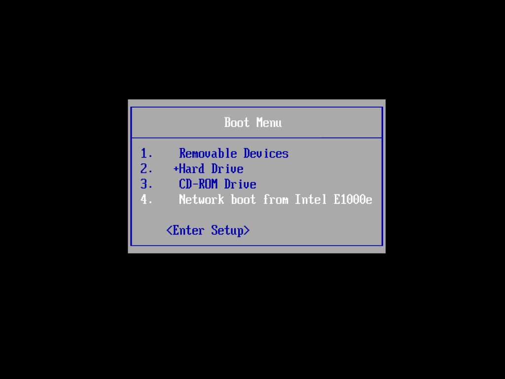

# 使用IPXE文件管理器（ipxefm）实现PXE网络批量安装操作系统

|  |
| --- |
| IPXE文件管理器（ipxefm）是一款基于ipxe创作的网启方案，自动判断 BIOS 和 UEFI 环境，可以很方便地定制菜单和管理网启文件，支持gho/wim/iso/img等备份格式文件网络克隆系统。      Tiny PXE Server是一款专业的pxe服务器软件，支持 DHCP/TFTP/HTTP/BINL/DNS 等多个协议，支持 grub4dos/pxelinux/ipxe 等多个引导器，支持从PXE/gPXE/IPXE启动，并且能够安装在Windows和Linux系统中使用。      ipxe.bios 和 ipxe.efi 文件为 Tiny PXE Server 调用的专用启动文件。      ipxeboot.txt 文件为 Tiny PXE Server 调用的启动菜单文件。      **ipxefm网络克隆使用教程：**   1.在网克服务端ipxefm目录内运行对应网络环境下的批处理(bat)文件，例如：局域网内路由器已开启DHCP服务就运行“ipxefm-Tinypxe-PROXYDHCP.bat”这个批处理。            2.双击运行“ipxefm-Tinypxe-PROXYDHCP.bat“批处理文件后，自动启动 Tiny PXE Server 工具，里面的各项参数已自动配置好，如下图：            3.客户端开启PXE引导，此动画演示客户端PXE启动后，加载包内mini.wim文件，启动后映射共享目录(PXE)为B盘的过程。           **更新日志：**   [发布] IPXE文件管理器!启动WIM、ISO、IMG、RAMOS、ISCSI的网启模板BIOS&UEFI 20220317     [http://bbs.wuyou.net/forum.php?mod=viewthread&tid=423001](http://bbs.wuyou.net/forum.php?mod=viewthread&tid=423001)       **下载地址：**   下载链接（含mini.wim文件）：[https://share.weiyun.com/CMkHDiOe](https://share.weiyun.com/CMkHDiOe)  密码：yr8yr6   脚本长期更新地址（不含mini.wim文件）：[https://github.com/zwj4031/ipxefm](https://github.com/zwj4031/ipxefm)       **ipxefm应用相关视频教程：**   ipxefm应用-演示网启pe后映射共享还原系统   [https://www.bilibili.com/video/BV1Pt4y167Ua](https://www.bilibili.com/video/BV1Pt4y167Ua)       ipxefm应用-从网络启动各种PE(wim、iso、img)   [https://www.bilibili.com/video/BV1nK4y1X73V/](https://www.bilibili.com/video/BV1nK4y1X73V/)       ipxefm应用-批量装机、全自动分区、p2p分发，用你最熟悉的BT种子快速给500台机安装系统   [https://www.bilibili.com/video/BV1Sf4y1x7ea?share_source=copy_web](https://www.bilibili.com/video/BV1Sf4y1x7ea?share_source=copy_web)       ipxefm应用-用黑客工具Netcat一键群控PE实现批量装机   [https://www.bilibili.com/video/BV1E84y1F7vY?share_source=copy_web](https://www.bilibili.com/video/BV1E84y1F7vY?share_source=copy_web)       (回放)ipxefm应用-pxe无人值守，修改网启默认菜单项   [https://www.bilibili.com/video/BV1RB4y1T7mx?share_source=copy_web](https://www.bilibili.com/video/BV1RB4y1T7mx?share_source=copy_web)       **常见问题处理：**   1.PXE客户端pe无法获得ip地址(pe桌面上方不显示ip地址)   如果PXE客户端pe无法获得ip地址(pe桌面上方不显示ip地址)，原因是安装驱动网卡失败，需要自己加入相应网卡驱动功能，可以自行准备驱动包，驱动包为app/inject/default目录下的drivers.7z，可以下载你网卡驱动改名为drivers.7z替换原文件测试或者用7z拖你的网卡驱动目录进drivers.7z包里。      2.无法访问PXE服务端的共享文件   如果无法访问PXE服务端的“PXE”共享文件夹，是服务器端的文件共享设置不当，依次检查有没有启用"guest"访客账户，有没有开启匿名访问等问题。 |

> 更新: 2023-06-05 11:31:13  
> 原文: <https://www.yuque.com/lixinsi/hntyk2/upqyf042ri7s4opl>