# 使用mkcert工具生成受信任的SSL证书，解决局域网本地https访问问题

[使用 mkcert 解决 局域网IIS 网页 SSL 证书问题 - googlegis - 博客园](https://www.cnblogs.com/googlegis/p/14976720.html)

[【精选】使用mkcert工具生成受信任的SSL证书，解决局域网本地https访问问题_mkcert局域网证书-CSDN博客](https://blog.csdn.net/qq_45392321/article/details/119676301)

使用mkcert工具生成受信任的SSL证书，解决局域网本地https访问问题

文章目录

使用mkcert工具生成受信任的SSL证书，解决局域网本地https访问问题

1、mkcert简介

```plain
mkcert 是一个简单的工具，用于制作本地信任的开发证书。它不需要配置。

简化我们在本地搭建 https 环境的复杂性，无需操作繁杂的 openssl 实现自签证书了，这个小程序就可以帮助我们自签证书，在本机使用还会自动信任 CA，非常方便。

使用来自真实证书颁发机构 (CA) 的证书进行开发可能很危险或不可能（对于example.test、localhost或 之类的主机127.0.0.1），但自签名证书会导致信任错误。管理您自己的 CA 是最好的解决方案，但通常涉及神秘的命令、专业知识和手动步骤。

mkcert 在系统根存储中自动创建并安装本地 CA，并生成本地信任的证书。mkcert 不会自动配置服务器以使用证书，但这取决于您。
```

2、mkcert下载

<font style="color:rgba(0, 0, 0, 0.75);">本实验使用Windows 10 操作系统进行演示说明。mkcert也支持其他平台的安装与使用，自行下载对应的版本安装即可。</font>  
 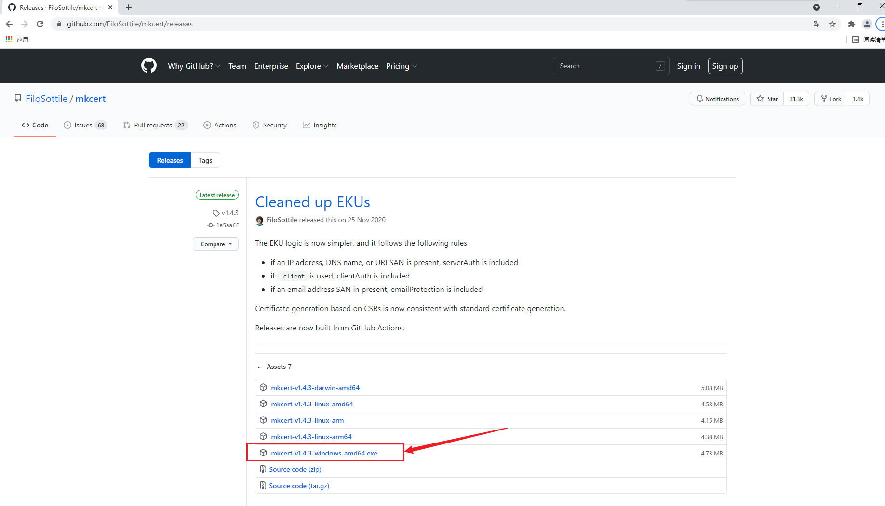

3、mkcert安装配置

（1）输入CMD，调出命令提示符

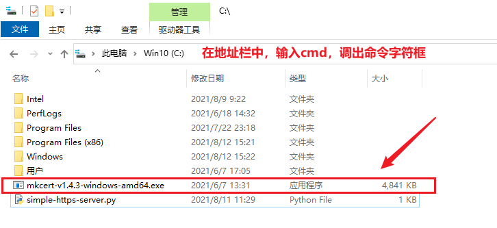

（2）初次安装mkcert

输入mkcert-v1.4.3-windows-amd64.exe -install 命令 ，安装mkcert。将CA证书加入本地可信CA，使用此命令，就能帮助我们将mkcert使用的根证书加入了本地可信CA中，以后由该CA签发的证书在本地都是可信的。卸载命令 mkcert-v1.4.3-windows-amd64.exe -install

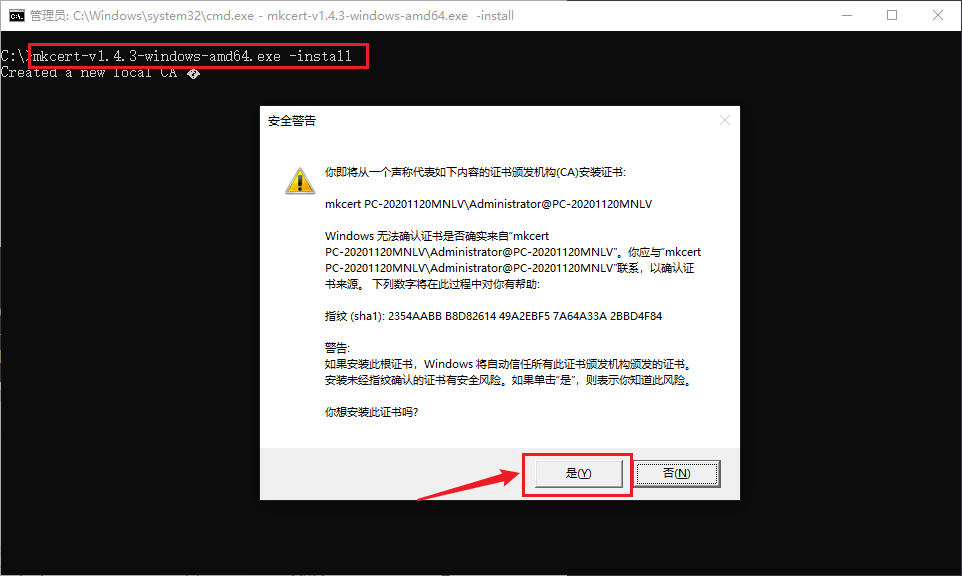

**<font style="color:rgb(77, 77, 77);">安装成功成功。提示创建一个新的本地CA，本地CA现在已安装在系统信任存储中。</font>**

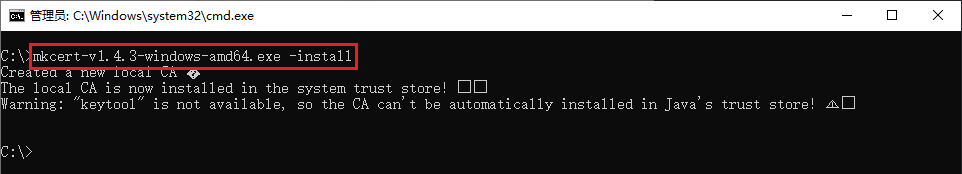

（3）测试mkcert是否安装成功

```powershell
C:\>mkcert-v1.4.3-windows-amd64.exe --help
Usage of mkcert:

        $ mkcert -install
        Install the local CA in the system trust store.

        $ mkcert example.org
        Generate "example.org.pem" and "example.org-key.pem".

        $ mkcert example.com myapp.dev localhost 127.0.0.1 ::1
        Generate "example.com+4.pem" and "example.com+4-key.pem".

        $ mkcert "*.example.it"
        Generate "_wildcard.example.it.pem" and "_wildcard.example.it-key.pem".

        $ mkcert -uninstall
        Uninstall the local CA (but do not delete it).

Advanced options:

        -cert-file FILE, -key-file FILE, -p12-file FILE
            Customize the output paths.

        -client
            Generate a certificate for client authentication.

        -ecdsa
            Generate a certificate with an ECDSA key.

        -pkcs12
            Generate a ".p12" PKCS #12 file, also know as a ".pfx" file,
            containing certificate and key for legacy applications.

        -csr CSR
            Generate a certificate based on the supplied CSR. Conflicts with
            all other flags and arguments except -install and -cert-file.

        -CAROOT
            Print the CA certificate and key storage location.

        $CAROOT (environment variable)
            Set the CA certificate and key storage location. (This allows
            maintaining multiple local CAs in parallel.)

        $TRUST_STORES (environment variable)
            A comma-separated list of trust stores to install the local
            root CA into. Options are: "system", "java" and "nss" (includes
            Firefox). Autodetected by default.


C:\>

```

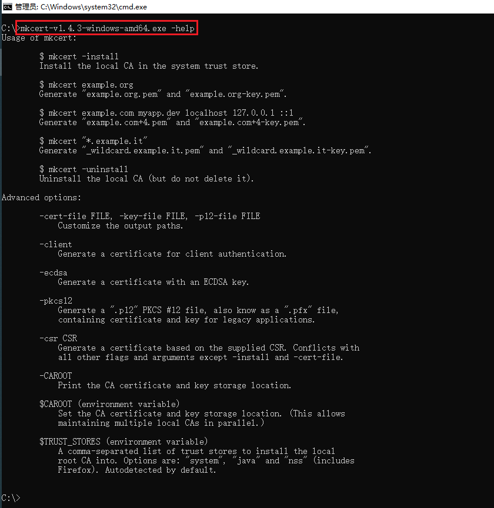

（4）查看CA证书存放位置

```powershell
输入mkcert-v1.4.3-windows-amd64.exe -CAROOT命令。
```

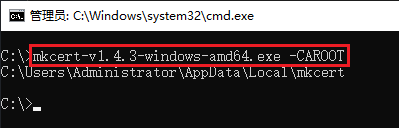

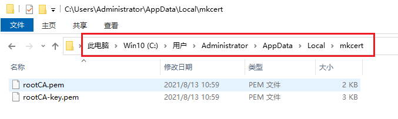

**<font style="color:rgb(77, 77, 77);">按“Windows键+R”调出运行框，输入</font>****<font style="color:rgb(0, 0, 0);background-color:rgb(248, 248, 64);">certmgr.msc</font>****<font style="color:rgb(77, 77, 77);">命令。打开证书控制台。</font>**

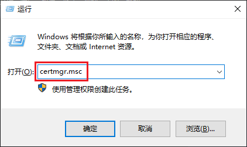

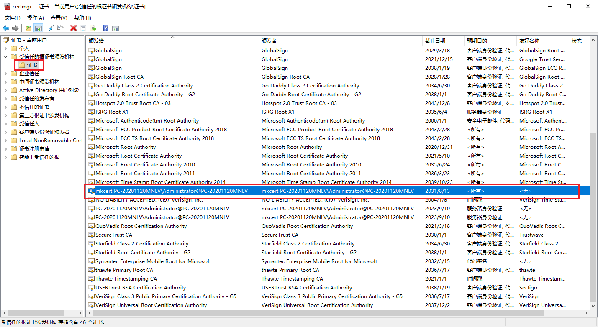

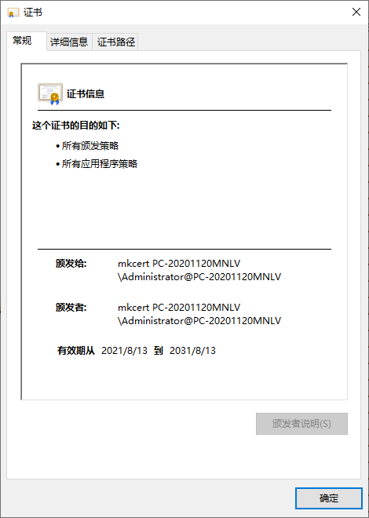

（5）生成自签证书,可供局域网内使用其他主机访问。

直接跟多个要签发的域名或 ip 就行了，比如签发一个仅本机访问的证书(可以通过127.0.0.1和localhost，以及 ipv6 地址::1访问)


需要在局域网内测试 https 应用，这种环境可能不对外，因此也无法使用像Let's encrypt这种免费证书的方案给局域网签发一个可信的证书，而且Let's encrypt本身也不支持认证 Ip。


证书可信的三个要素:


### <font style="color:#DF2A3F;">由可信的 CA 机构签发</font>
### <font style="color:#DF2A3F;">访问的地址跟证书认证地址相符</font>
### <font style="color:#DF2A3F;">证书在有效期内</font>
如果期望自签证书在局域网内使用，以上三个条件都需要满足。很明显自签证书一定可以满足证书在有效期内，那么需要保证后两条。我们签发的证书必须匹配浏览器的地址栏，比如局域网的 ip 或者域名，此外还需要信任 CA。操作如下。

### 签发证书，加入局域网IP地址。
```powershell
C:\>mkcert-v1.4.3-windows-amd64.exe localhost 127.0.0.1 ::1 192.168.5.77
Note: the local CA is not installed in the Java trust store.
Run "mkcert -install" for certificates to be trusted automatically ⚠️

Created a new certificate valid for the following names 📜
 - "localhost"
 - "127.0.0.1"
 - "::1"
 - "192.168.2.25"

The certificate is at "./localhost+3.pem" and the key at "./localhost+3-key.pem" ✅

It will expire on 13 November 2023 🗓

```

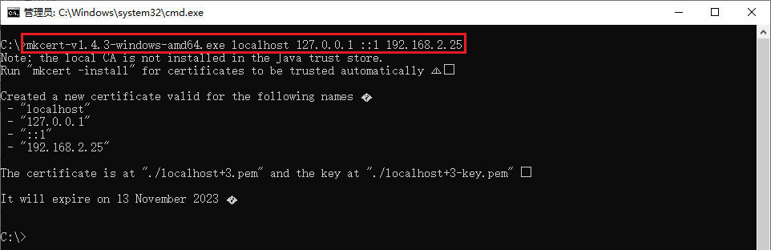

<font style="color:rgb(77, 77, 77);">在mkcert软件同目录下，生成了自签证书。如图所示。</font>

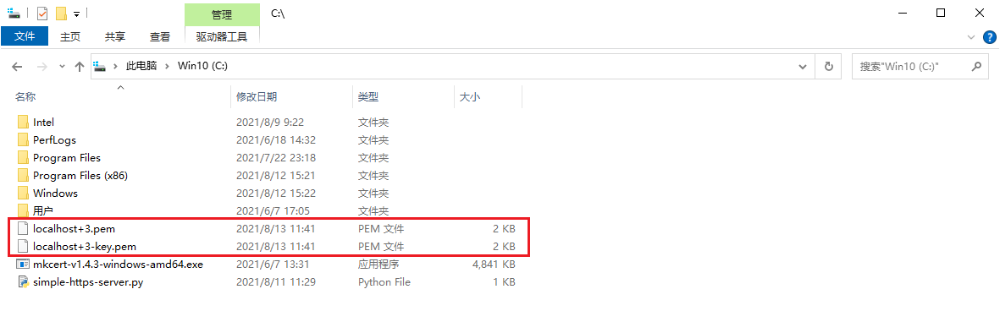

4、mkcert测试验证

默认生成的证书格式为PEM(Privacy Enhanced Mail)格式，任何支持PEM格式证书的程序都可以使用。比如常见的Apache或Nginx等，这里我们用 python 自带的SimpleHttpServer演示一下这个证书的效果(代码参考来自:[https://gist.github.com/dergachev/7028596)](https://gist.github.com/dergachev/7028596))


Windows系统操作访问演示

Linux系统操作访问演示

5、mkcert高级设置

6、文章参考链接

参考链接：[本地https快速解决方案——mkcert]([https://blog.dteam.top/posts/2019-04/](https://blog.dteam.top/posts/2019-04/)本地https快速解决方案mkcert.html)

官方文档：[https://github.com/FiloSottile/mkcert#mkcert](https://github.com/FiloSottile/mkcert#mkcert)

下载链接：[https://github.com/FiloSottile/mkcert/releases](https://github.com/FiloSottile/mkcert/releases)

1、mkcert简介

mkcert 是一个简单的工具，用于制作本地信任的开发证书。它不需要配置。


简化我们在本地搭建 https 环境的复杂性，无需操作繁杂的 openssl 实现自签证书了，这个小程序就可以帮助我们自签证书，在本机使用还会自动信任 CA，非常方便。


使用来自真实证书颁发机构 (CA) 的证书进行开发可能很危险或不可能（对于example.test、localhost或 之类的主机127.0.0.1），但自签名证书会导致信任错误。管理您自己的 CA 是最好的解决方案，但通常涉及神秘的命令、专业知识和手动步骤。


mkcert 在系统根存储中自动创建并安装本地 CA，并生成本地信任的证书。mkcert 不会自动配置服务器以使用证书，但这取决于您。


2、mkcert下载

本实验使用Windows 10 操作系统进行演示说明。mkcert也支持其他噶平台的安装与使用，自行下载对应的版本安装即可。


3、mkcert安装配置

（1）输入CMD，调出命令提示符


（2）初次安装mkcert

输入mkcert-v1.4.3-windows-amd64.exe -install 命令 ，安装mkcert。将CA证书加入本地可信CA，使用此命令，就能帮助我们将mkcert使用的根证书加入了本地可信CA中，以后由该CA签发的证书在本地都是可信的。卸载命令 mkcert-v1.4.3-windows-amd64.exe -install安装成功成功。提示创建一个新的本地CA，本地CA现在已安装在系统信任存储中。


（3）测试mkcert是否安装成功

C:\>mkcert-v1.4.3-windows-amd64.exe --help

Usage of mkcert:


        $ mkcert -install

        Install the local CA in the system trust store.


        $ mkcert example.org

        Generate "example.org.pem" and "example.org-key.pem".


        $ mkcert example.com myapp.dev localhost 127.0.0.1 ::1

        Generate "example.com+4.pem" and "example.com+4-key.pem".


        $ mkcert "*.example.it"

        Generate "_wildcard.example.it.pem" and "_wildcard.example.it-key.pem".


        $ mkcert -uninstall

        Uninstall the local CA (but do not delete it).


Advanced options:


        -cert-file FILE, -key-file FILE, -p12-file FILE

            Customize the output paths.


        -client

            Generate a certificate for client authentication.


        -ecdsa

            Generate a certificate with an ECDSA key.


        -pkcs12

            Generate a ".p12" PKCS #12 file, also know as a ".pfx" file,

            containing certificate and key for legacy applications.


        -csr CSR

            Generate a certificate based on the supplied CSR. Conflicts with

            all other flags and arguments except -install and -cert-file.


        -CAROOT

            Print the CA certificate and key storage location.


        $CAROOT (environment variable)

            Set the CA certificate and key storage location. (This allows

            maintaining multiple local CAs in parallel.)


        $TRUST_STORES (environment variable)

            A comma-separated list of trust stores to install the local

            root CA into. Options are: "system", "java" and "nss" (includes

            Firefox). Autodetected by default.


C:\>


1

2

3

4

5

6

7

8

9

10

11

12

13

14

15

16

17

18

19

20

21

22

23

24

25

26

27

28

29

30

31

32

33

34

35

36

37

38

39

40

41

42

43

44

45

46

47

48

49

50

51


### 查看CA证书存放位置
输入mkcert-v1.4.3-windows-amd64.exe -CAROOT命令。


按“Windows键+R”调出运行框，输入certmgr.msc命令。打开证书控制台。


（5）生成自签证书,可供局域网内使用其他主机访问。

直接跟多个要签发的域名或 ip 就行了，比如签发一个仅本机访问的证书(可以通过127.0.0.1和localhost，以及 ipv6 地址::1访问)


需要在局域网内测试 https 应用，这种环境可能不对外，因此也无法使用像Let's encrypt这种免费证书的方案给局域网签发一个可信的证书，而且Let's encrypt本身也不支持认证 Ip。


证书可信的三个要素:


由可信的 CA 机构签发

访问的地址跟证书认证地址相符

证书在有效期内

如果期望自签证书在局域网内使用，以上三个条件都需要满足。很明显自签证书一定可以满足证书在有效期内，那么需要保证后两条。我们签发的证书必须匹配浏览器的地址栏，比如局域网的 ip 或者域名，此外还需要信任 CA。操作如下。

签发证书，加入局域网IP地址。


C:\>mkcert-v1.4.3-windows-amd64.exe localhost 127.0.0.1 ::1 192.168.2.25

Note: the local CA is not installed in the Java trust store.

Run "mkcert -install" for certificates to be trusted automatically ⚠️


Created a new certificate valid for the following names 📜

 - "localhost"

 - "127.0.0.1"

 - "::1"

 - "192.168.2.25"


The certificate is at "./localhost+3.pem" and the key at "./localhost+3-key.pem" ✅


在mkcert软件同目录下，生成了自签证书。如图所示。


通过输出，我们可以看到成功生成了localhost+3.pem证书文件和localhost+3-key.pem私钥文件，只要在 web server 上使用这两个文件就可以了。


4、mkcert测试验证

默认生成的证书格式为PEM(Privacy Enhanced Mail)格式，任何支持PEM格式证书的程序都可以使用。比如常见的Apache或Nginx等，这里我们用 python 自带的SimpleHttpServer演示一下这个证书的效果(代码参考来自:[https://gist.github.com/dergachev/7028596)](https://gist.github.com/dergachev/7028596))


前提条件：运行此pyhton脚本需要在本地环境中提前安装好python环境

下载链接：[https://www.python.org/downloads/windows/](https://www.python.org/downloads/windows/)

python环境安装参考链接：[https://blog.csdn.net/u012106306/article/details/100040680](https://blog.csdn.net/u012106306/article/details/100040680)


python2 版本


#!/usr/bin/env python2


import BaseHTTPServer, SimpleHTTPServer

import ssl


httpd = BaseHTTPServer.HTTPServer(('0.0.0.0', 443), SimpleHTTPServer.SimpleHTTPRequestHandler)

httpd.socket = ssl.wrap_socket(httpd.socket, certfile='./localhost+2.pem', keyfile='./localhost+2-key.pem', server_side=True, ssl_version=ssl.PROTOCOL_TLSv1_2)

httpd.serve_forever()

1

2

3

4

5

6

7

8

python3 版本


#!/usr/bin/env python3


import http.server

import ssl


httpd = http.server.HTTPServer(('0.0.0.0', 443), http.server.SimpleHTTPRequestHandler)

httpd.socket = ssl.wrap_socket(httpd.socket, certfile='./localhost+2.pem', keyfile='./localhost+2-key.pem', server_side=True, ssl_version=ssl.PROTOCOL_TLSv1_2)

httpd.serve_forever()

1

2

3

4

5

6

7

8

双击运行simple-https-server.py脚本。


打开浏览器，输入[https://192.168.2.5:8000](https://192.168.2.5:8000)，显示连接是安全的。


验证发现使用[https://192.168.31.170](https://192.168.31.170)本机访问也是可信的。然后需要将 CA 证书发放给局域网内其他的用户。


### 可以看到 CA 路径下有两个文件rootCA-key.pem和rootCA.pem两个文件，用户需要信任rootCA.pem这个文件。将rootCA.pem拷贝一个副本，并命名为rootCA.crt(因为 windows 并不识别pem扩展名，并且 Ubuntu 也不会将pem扩展名作为 CA 证书文件对待)，将rootCA.crt文件分发给其他用户，手工导入。


C:\>mkcert-v1.4.3-windows-amd64.exe -CAROOT

C:\Users\Administrator\AppData\Local\mkcert

1

2


Windows系统操作访问演示


点击“安装证书”。


单击下一步。


### windows 导入证书的方法是双击这个文件，在证书导入向导中将证书导入`<font style="color:#DF2A3F;">受信任的根证书颁发机构</font>。


点击“完成”。


点击“是”。


再次点击此证书。已被添加为信任。


使用浏览器验证。输入[https://192.168.2.25:8000](https://192.168.2.25:8000)，发现可信任。


————————————————

版权声明：本文为CSDN博主「云矩阵」的原创文章，遵循CC 4.0 BY-SA版权协议，转载请附上原文出处链接及本声明。

原文链接：[https://blog.csdn.net/qq_45392321/article/details/119676301](https://blog.csdn.net/qq_45392321/article/details/119676301)


> 更新: 2024-06-19 21:46:54  
> 原文: <https://www.yuque.com/lixinsi/hntyk2/fasd385kn1lct5kd>