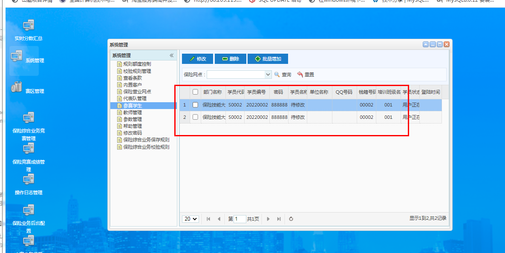
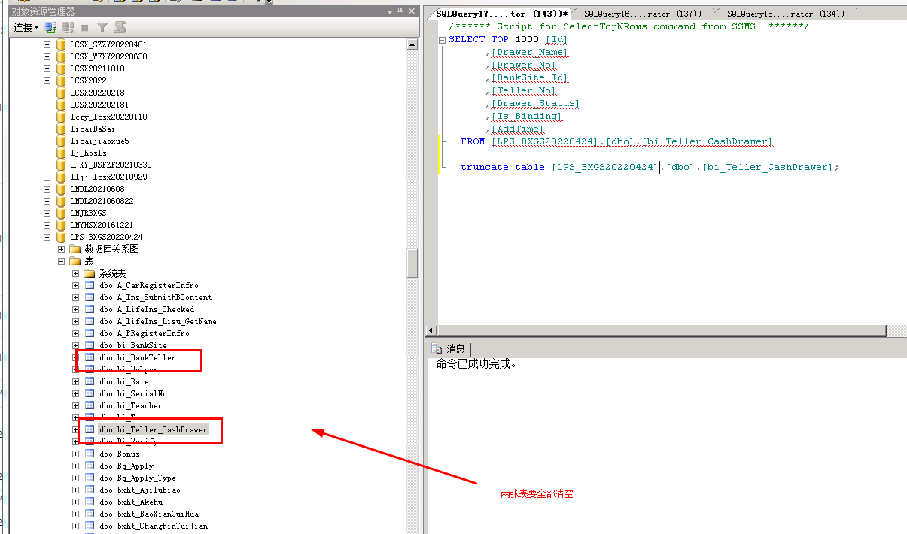
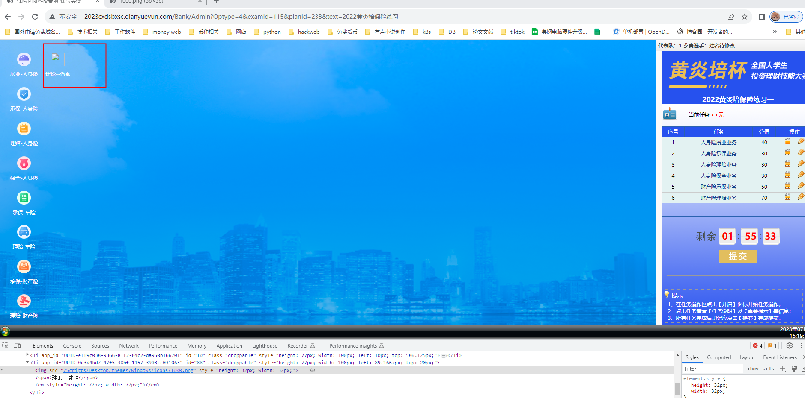
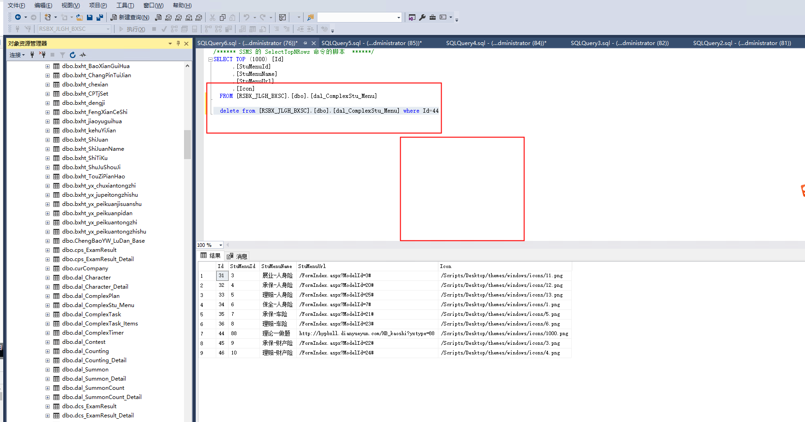

# 保险国赛平台

账号重复





清理脚本

/*


## 删除保险理论


```python
清理脚本
/*
内置保险单
yw_355503---保全表
yw_355507---理赔人身险
yw_355508---车险商业险
yw_355509---财产综合险
yw_355510---车险交强险
yw_355511---财产一切险
yw_355512---财产基本险
*/
declare @tablename nvarchar(100)
DECLARE test_Cursor CURSOR LOCAL FOR
select name from dbo.sysobjects where xtype='u' and (not name LIKE 'dtproperties') 
and name like'yw_%' and name not in('yw_355503','yw_355507','yw_355508','yw_355509','yw_355510','yw_355511','yw_355512') order by name
open test_Cursor
FETCH NEXT FROM test_Cursor into @tablename
WHILE  (@@fetch_status=0)

begin
exec('truncate table '+ @tablename)
fetch next from test_Cursor into @tablename
end
close test_Cursor
deallocate test_Cursor
go

/*****删除综合考试成绩：*******/
truncate table zhyw_ExamCurrentTask    
truncate table zhyw_ExamLog
truncate table zhyw_ExamResult
truncate table zhyw_ExamResultForm
truncate table zhyw_ExamResultTask
truncate table zhyw_ExamResultTaskDetail
truncate table zhyw_ExamResult_FACK
truncate table A_CarRegisterInfro
truncate table A_Ins_SubmitHBContent
truncate table A_LifeIns_Checked
truncate table A_lifeIns_Lisu_GetName
truncate table Bonus
truncate table Bq_Apply
truncate table Surrender
truncate table System_Extend_Abfindungswert
truncate table System_Extend_AcceptInsurance
truncate table Sytem_Extend_ClaimNotice--车险理赔单证收集
truncate table zhyw_Adjustment
delete  from  rsbx_Akehu where kehuName not in  ('万芳','江元')
delete  from  rsbx_kehuleixing where AkehuNo not in ('rsbx2014122515219532') 
truncate table rsbx_baifangshunxu
truncate table rsbx_jibenxinxi
truncate table rsbx_wanchengQK
truncate table LoanRepayment 
 
/*****删除账号钱箱班级：*****/
truncate table bi_BankTeller
truncate table bi_Team
truncate table bi_Teller_CashDrawer


/*--重置表顺序----*/
 update  [dbo].[bi_SerialNo] set [Serial_Value]='0000'

/**--删除内置保单操作数据--**/

delete from yw_355503  where UserId<>0 and PlanId<>0 and ExamId<>0
```

数据库里面的




> 更新: 2025-04-22 14:05:56  
> 原文: <https://www.yuque.com/lixinsi/hntyk2/uk6lul>