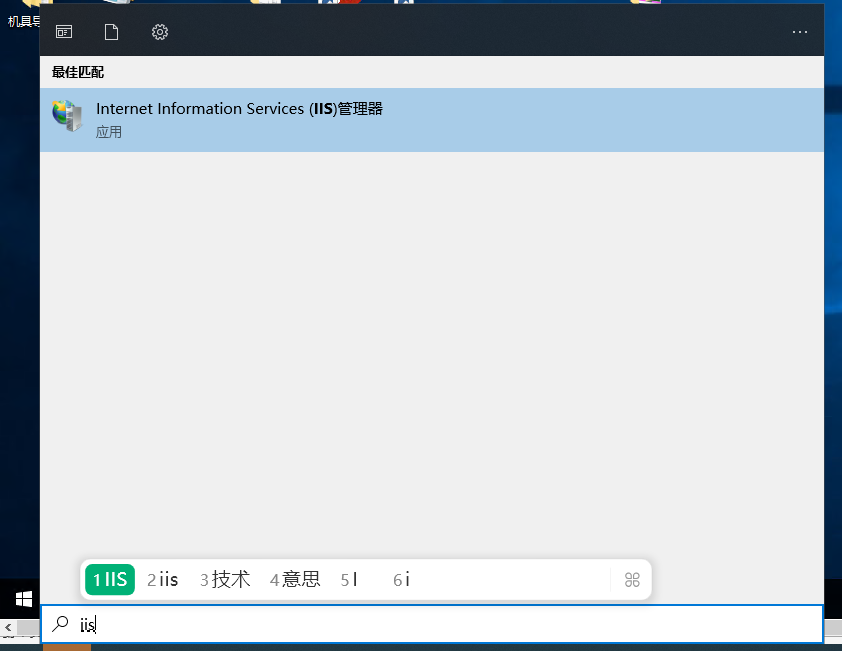
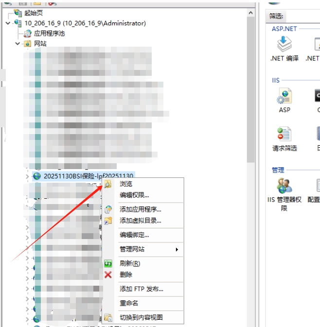
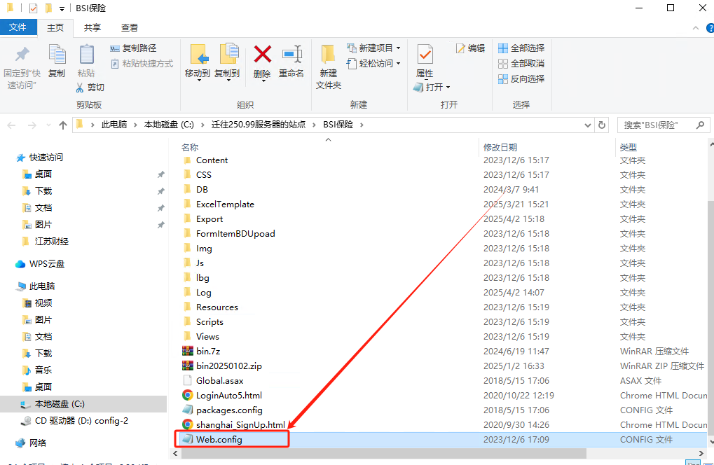
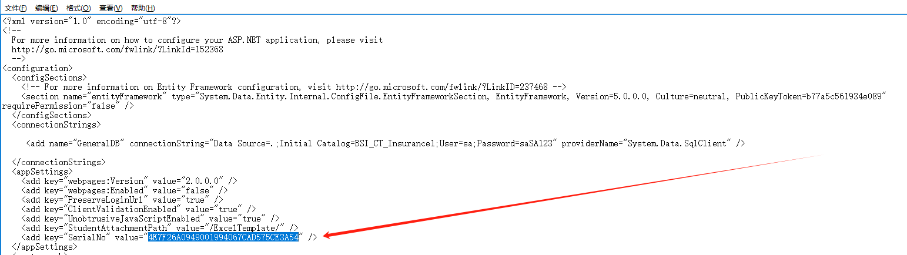
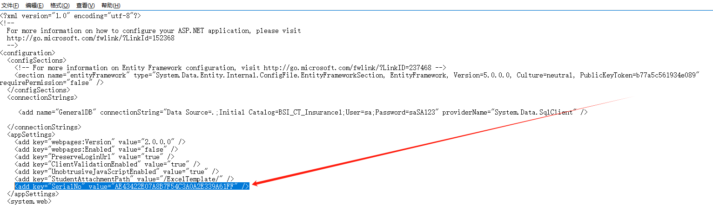

# 保险大赛延期文档

开始菜单搜索IIS，找到IIS管理器，双击打开。

点击网站，找到BSI保险的网址，右键，点击浏览。

找到Web.config文件，右键用记事本打开。

找到"SerialNo" value=

例如下图

<add key="SerialNo" value="4E7F26A0949001994067CAD575CE3A54" />

将双引号中的字符更换为9A04EBC1B7639DD34209191BDAAE770C

如图下所示，保存关闭即可。

> 更新: 2025-10-15 16:05:00  
> 原文: <https://www.yuque.com/lixinsi/hntyk2/vamu7v5rfvyoc2m9>