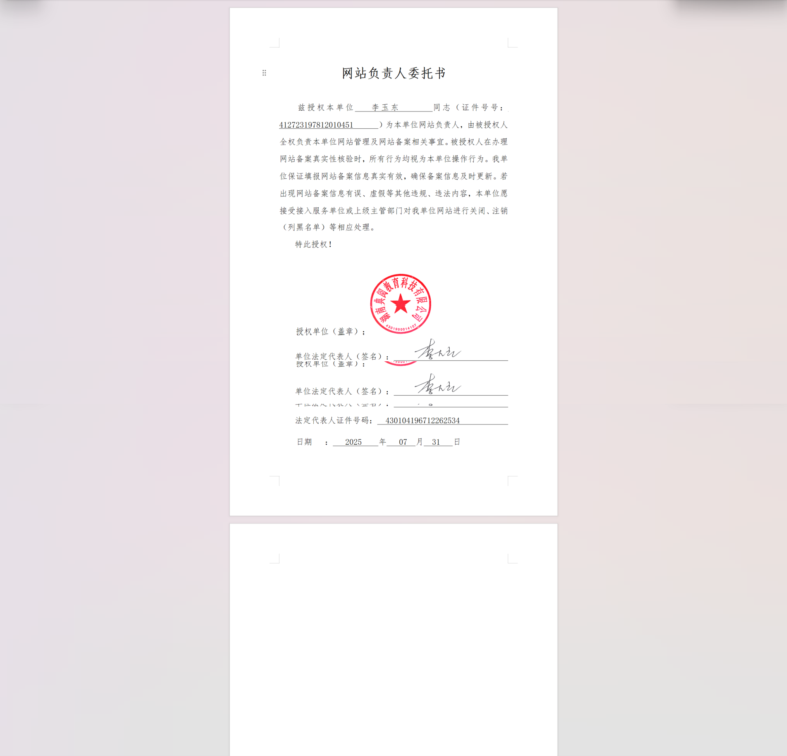

# 信息安全承诺书

**网络信息安全承诺书**

** **

本单位郑重承诺遵守本承诺书的有关条款，如有违反本承诺书有关条款的行为，本单位承担由此带来的一切民事、行政和刑事责任。

一、本单位承诺遵守《中华人民共和国计算机信息系统安全保护条例》和《计算机信息网络国际联网安全保护管理办法》及有关法律、法规和行政规章制度、文件规定。

二、本单位保证不利用网络危害国家安全、泄露国家秘密，不侵犯国家的、社会的、集体的利益和第三方的合法权益，不从事违法犯罪活动。

三、本单位承诺严格按照国家相关法律法规做好本单位网站的信息安全管理工作，按政府有关部门要求设立信息安全责任人和信息安全审查员，信息安全责任人和信息安全审查员应在通过公安机关的安全技术培训后，持证上岗。

四、本单位承诺健全各项网络安全管理制度和落实各项安全保护技术措施。

五、本单位承诺接受公安机关的监督和检查,如实主动提供有关安全保护的信息、资料及数据文件，积极协助查处通过国际联网的计算机信息网络违法犯罪行为。

六、本单位承诺所提供的网站备案信息真实有效，如若网站备案信息发生变更，须立即到当地核验点办理变更手续。若经电信公司备案人员核实信息有误，将按照《非经营性互联网备案信息服务管理办法》（原信息产业部33号令）要求，按虚假备案信息进行停止接入处理。

七、本单位承诺不通过互联网制作、复制、查阅和传播下列信息：

1．反对宪法所确定的基本原则的。

2．危害国家安全，泄露国家秘密，颠覆国家政权，破坏国家统一的。

3．损害国家荣誉和利益的。

4．煽动民族仇恨、民族歧视，破坏民族团结的。

5．破坏国家宗教政策，宣扬邪教和封建迷信的。

6．散布谣言，扰乱社会秩序，破坏社会稳定的。

7．散布淫秽、色情、赌博、暴力、凶杀、恐怖或者教唆犯罪的。

8．侮辱或者诽谤他人，侵害他人合法权益的。

9．含有法律法规禁止的其他内容的。

八、本单位承诺不从事任何危害计算机信息网络安全的活动，包括但不限于：

1．未经允许，进入计算机信息网络或者使用计算机信息网络资源的。

2．未经允许，对计算机信息网络功能进行删除、修改或者增加的。

3．未经允许，对计算机信息网络中存储或者传输的数据和应用程序进行删除、修改或者增加的。

4．故意制作、传播计算机病毒等破坏性程序的。

5．其他危害计算机信息网络安全的。

九、本单位承诺，当计算机信息系统发生重大安全事故时，立即采取应急措施，保留有关原始记录，并在 24 小时内向政府监管部门报告，并书面知会贵单位。

十、未申请开办网站的一律默认关闭对外提供互联网接入服务的常用端口（包含但不仅限于80、8080、443和8443等端口）。

十一、承诺若违反本承诺书有关条款和国家相关法律法规的，本单位直接承担相应法律责任，造成财产损失的，由本单位直接赔偿。同时，贵单位有权暂停提供托管服务直至解除双方间《云主机业务服务合同》。

十二、本承诺书自签署之日起生效并遵行。

 

 

 

                      单 位 盖 章： 

                                    日       期： 

 

 

 

> 更新: 2025-07-31 11:20:20  
> 原文: <https://www.yuque.com/lixinsi/hntyk2/yipw30z3e9thgfie>