# 公司关于投屏设备指导指南

### 1. 典阅智教 AI-融创中心（前台展厅）和大会议室
#### 大屏电视机采用无线设备进行投屏
#### 设备发射端如下截图
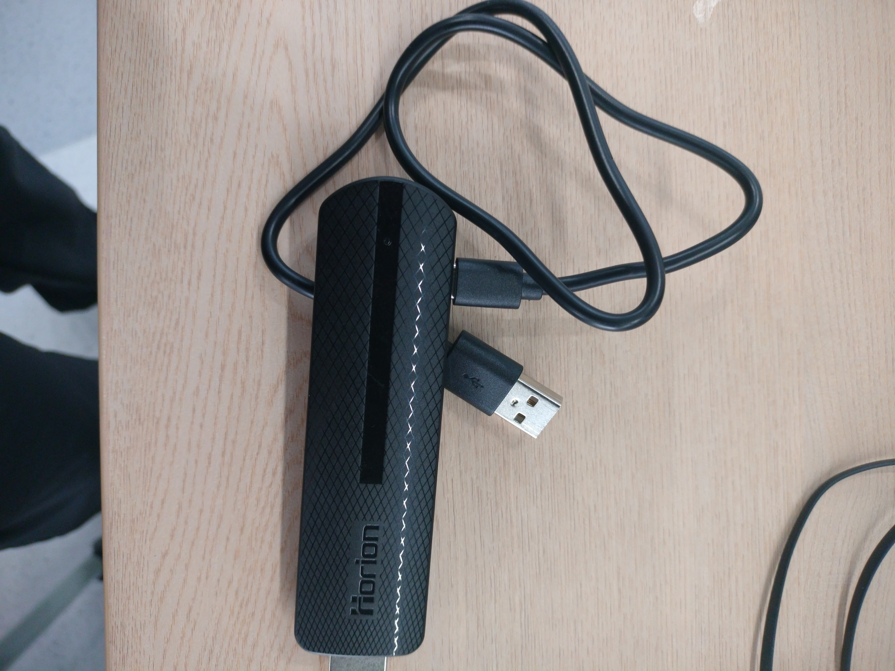

#### 设备接收端（注意此端用于电脑）
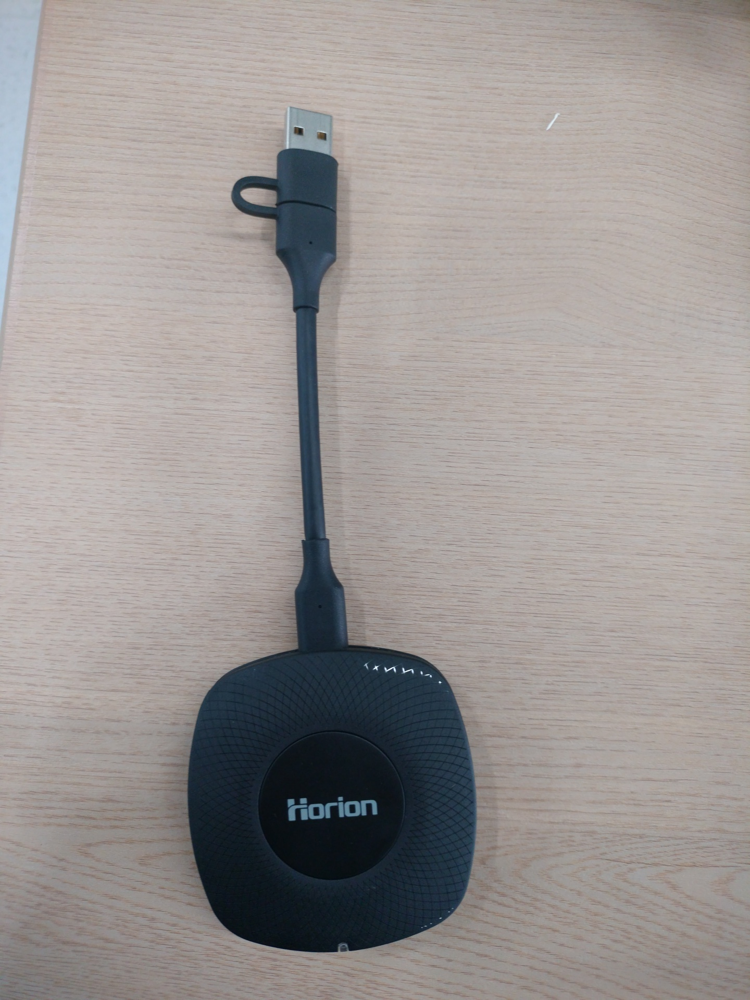

#### 具体使用步骤将设备接收端直接插入电脑后（如图所示）弹出软件，若没有弹出软件，直接去我的电脑找到图三双击打开软件，然后按一下接收器的按钮，显示连接成功，可以正常投屏。
图一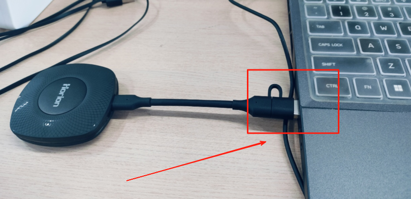

图二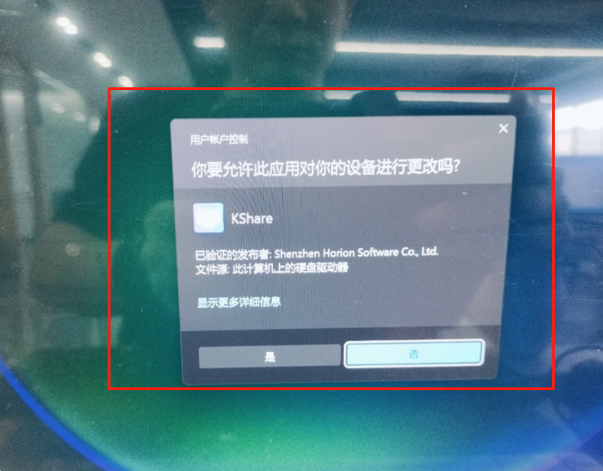

图三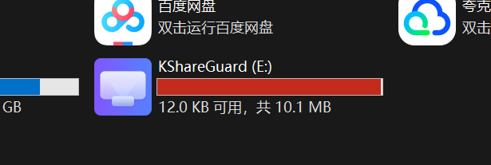

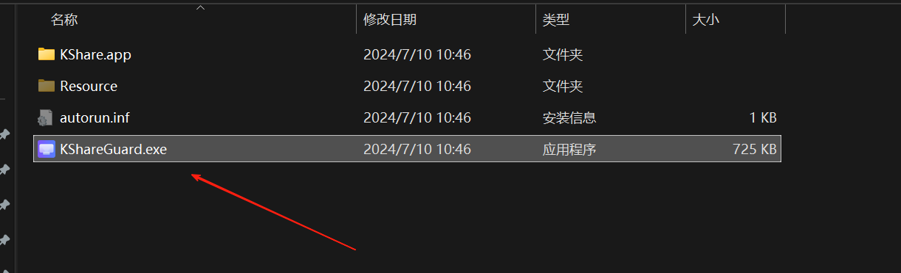

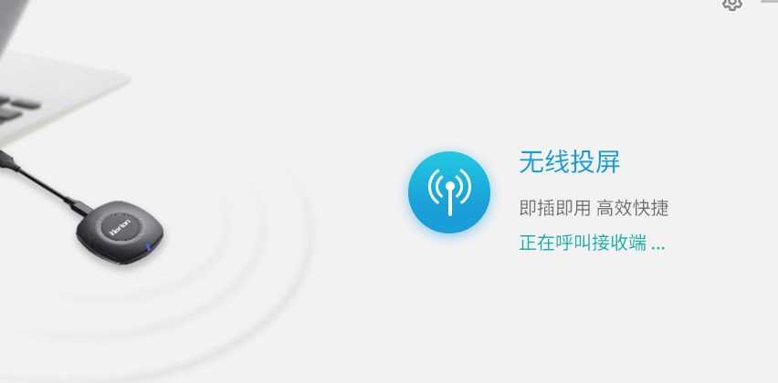

### 机具大屏投屏指南
#### 访问前台共享文件夹账号share，密码Dysoft2025
###  2.培训室(无线投屏篇)
#### 方式一. windows 电脑，安卓手机，苹果手机 在此网址下载对应的安装程序
浏览器访问下载投屏软件网址：[https://cast.hellogo.tech/#/v3](https://cast.hellogo.tech/#/v3)

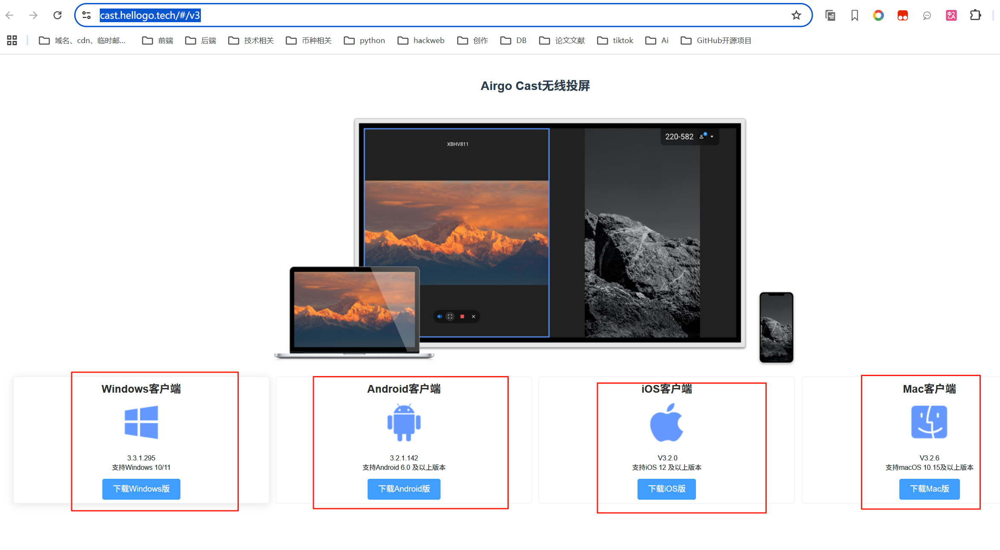

下面以 Windows 系统示范

下载程序后安装程序

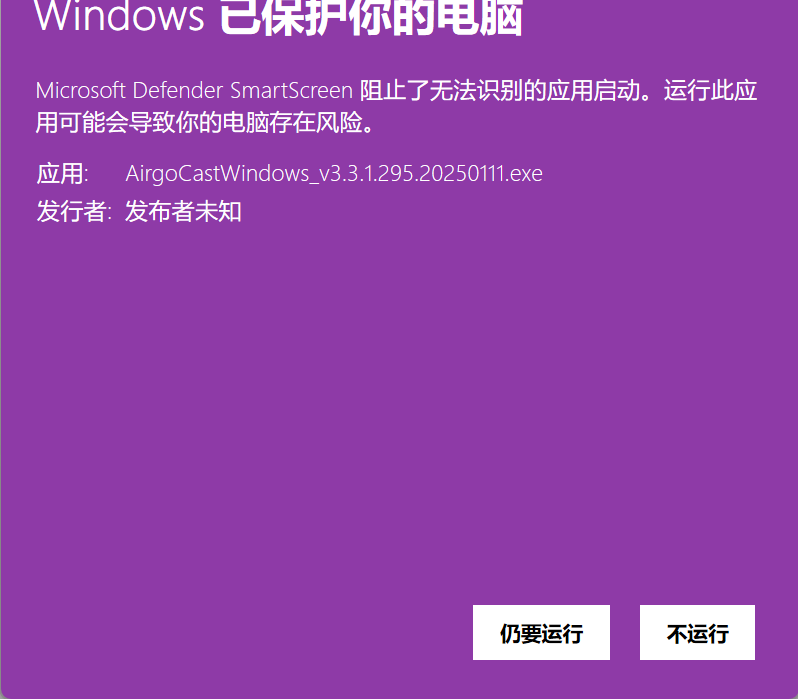

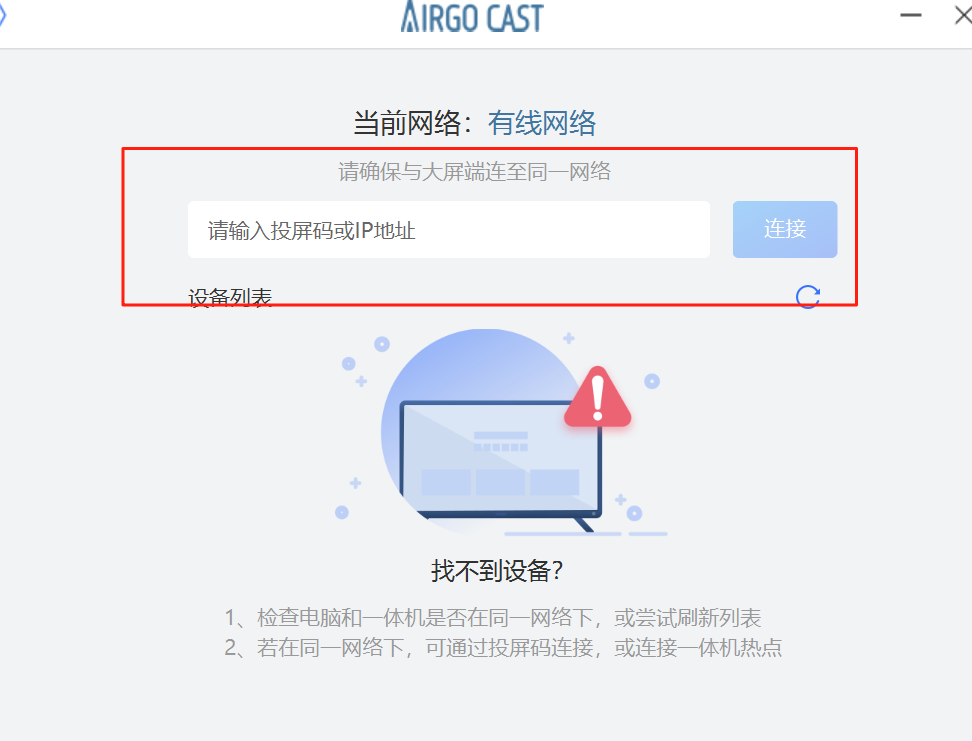

输入对应的投屏码连接电视机即可如下图

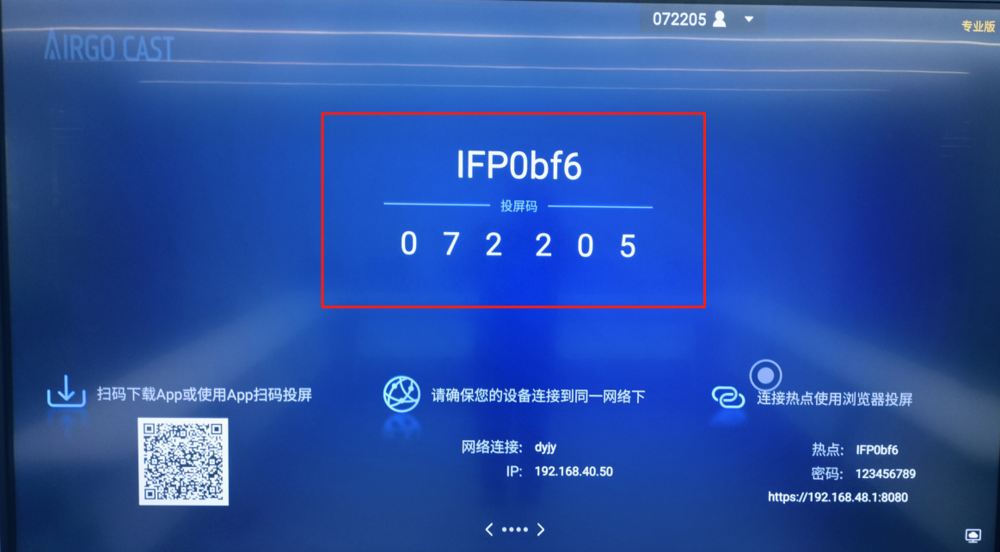

#### 方式二. 如截图
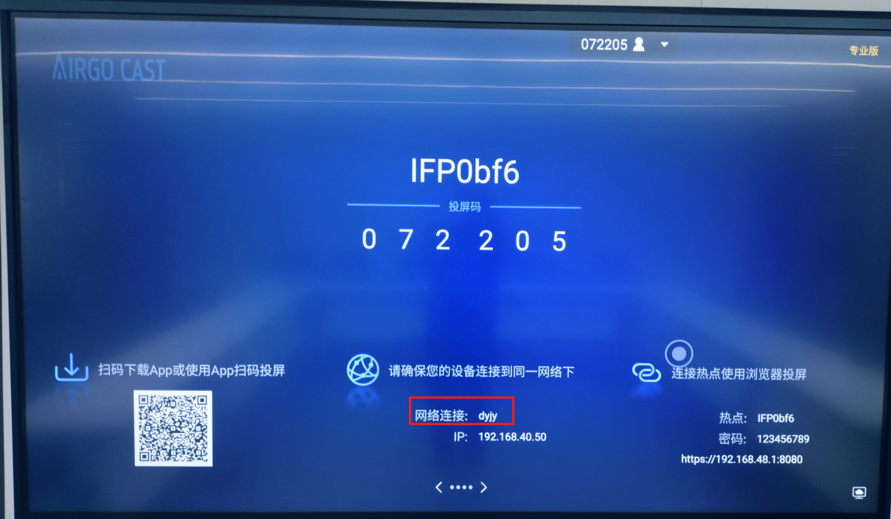

电脑选择无线信号如图所示

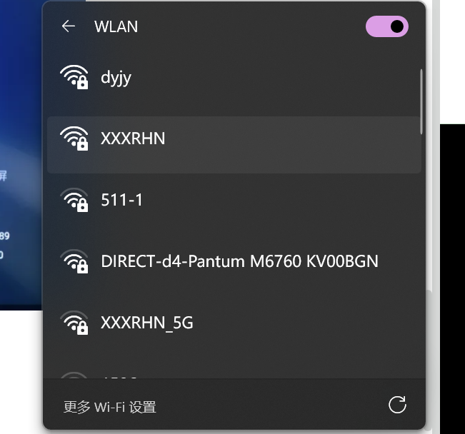

#### 方式三. 如截图
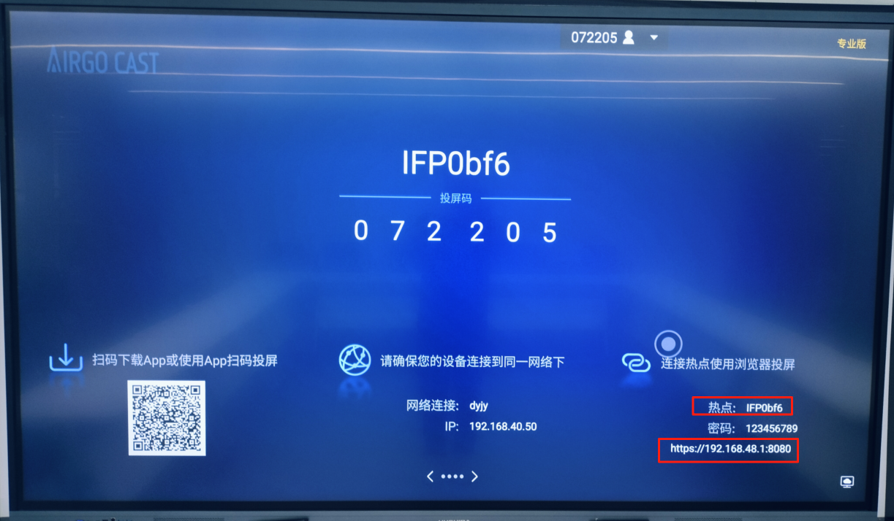

电脑选择智能电视的信号热点如截图

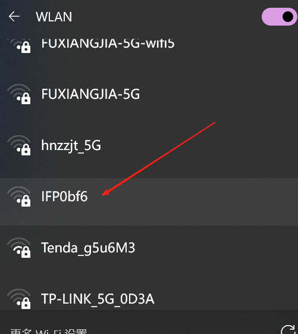

然后输入下面网址

[http://192.168.48.1:8080](http://192.168.48.1:8080)

点击投屏上方显示全屏

注意：投屏成功后请勿关闭投屏电脑页面，以免投屏中断

以上是无线投屏操作指南以及注意事项，有线投屏，如有疑问请咨询运维。

### 3.会议话筒使用指南
如截图是无线话筒，用完后请用 typec 充电。

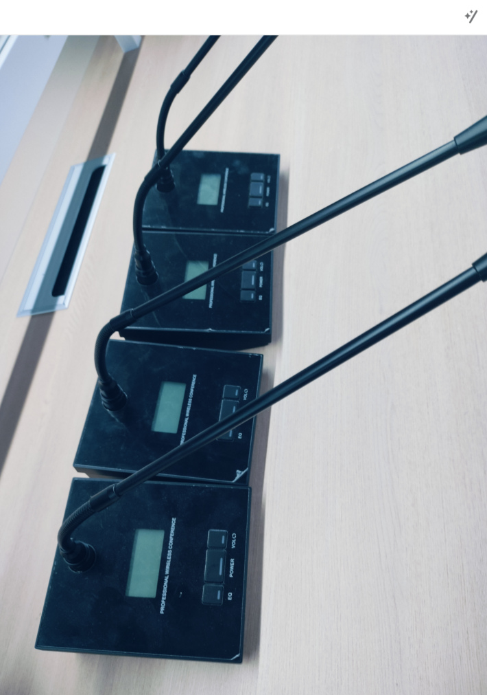

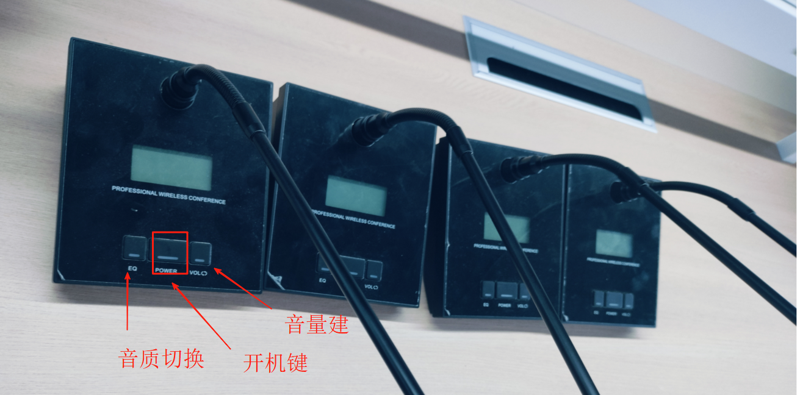

如截图会议话筒无线发射器，用完交给运维保管，以免丢失。

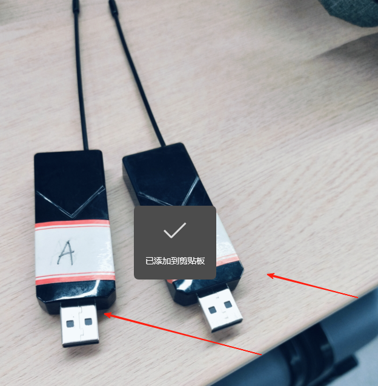

> 更新: 2025-07-16 09:08:41  
> 原文: <https://www.yuque.com/lixinsi/hntyk2/obh057gz83vhz57q>