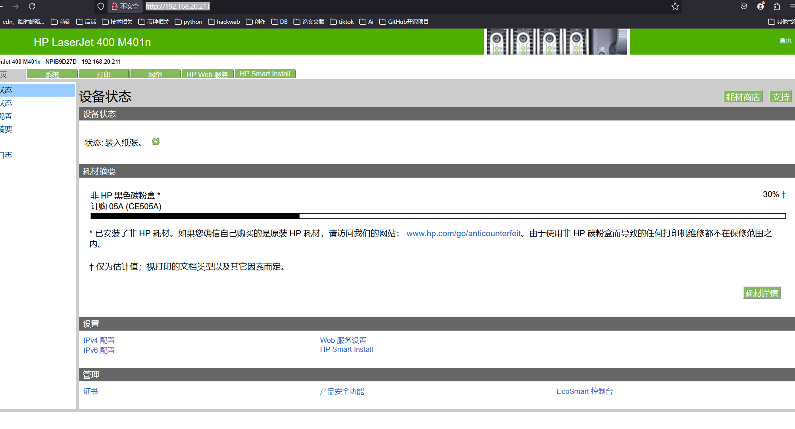
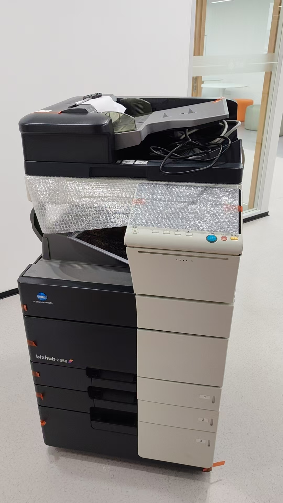
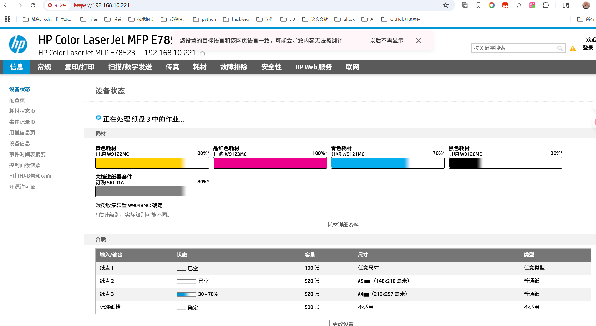
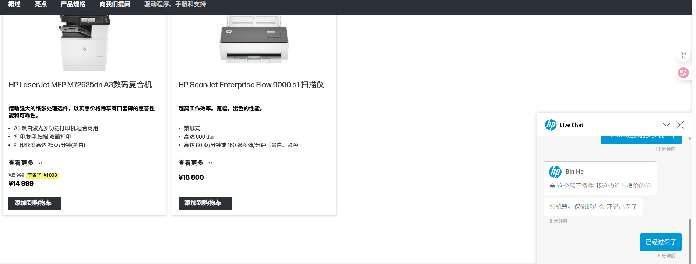
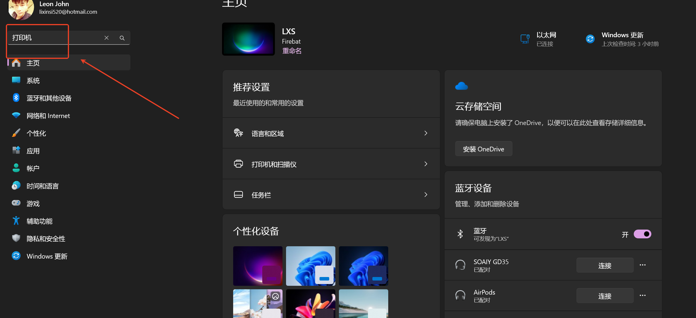
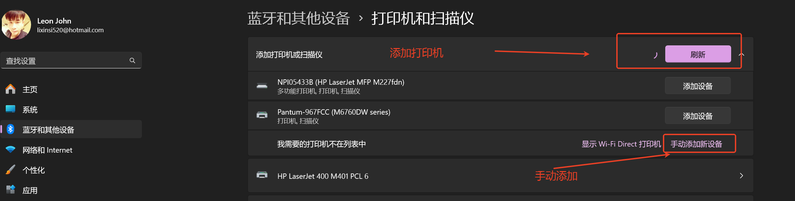
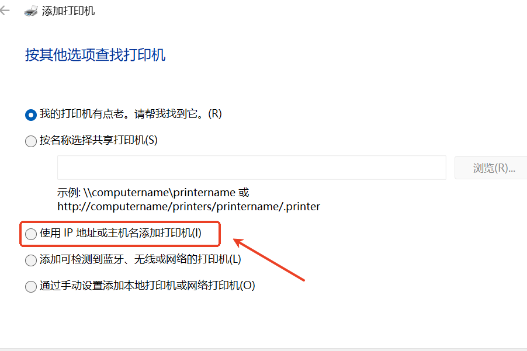
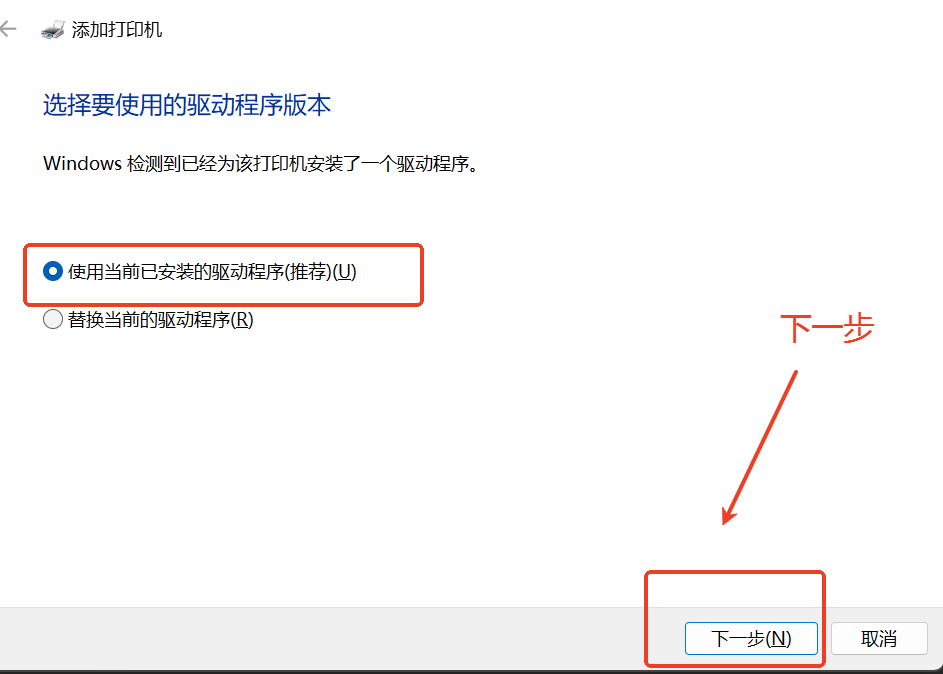

# 公司打印机安装手册以及WiFi

### [链接](about:blank)WIFI 密码：dyjy2025
### 惠普 401（前台打印机）IP 地址：192.168.20.211
耗材查看地址如截图：[http://192.168.20.211/](http://192.168.20.211/)

### bizhu c558（销售助理）IP 地址：192.168.10.222

### 惠普彩色打印机（销售助理）IP 地址：192.168.10.222
### 更换位置后的 IP 地址：192.168.10.12

打印机官方提供维修站地址以及电话

湖南省长沙市芙蓉区五一路599号供销大厦2601室；0731－84121108

### 惠普 227dn（服务运营服务部）IP 地址：192.168.20.51

### 安装打印机手册（Windows 以及 mac 参照下面安装打印机结合上面 ip 地址）

1.在电脑上点击开始菜单：控制面板\硬件和声音\设备和打印机；

  
2.点击添加打印机；

  
3.选择使用TCP/IP或主机名添加打印机，在点击下一步（自动搜索可能搜索不到，所以手动输入）；

  
4.在弹出的对话框中填入打印机的IP地址，点击下一步；

输入 ip 地址

  
5.安装打印机驱动程序。如已安装的话可直接选择，未安装的话可选择windows自动更新或者手动选择，点击下一步（此时连接上会自动安装对应的驱动，安装不可能需要检查更新）此时可能会弹出让你共享该打印机，共享需要设置打印机名称，不共享点击下一步即可；

  
6.安装完毕，可点击打印测试页看打印机是否工作正常。能正常打印则表示连接成功。

打印测试页会显示打印机型号、打印机名称、本机电脑名称、安装的驱动等信息。

### 192.168.5.144
share

Dysoft2025

1Panel

[http://192.168.20.250:63389/dyjy](http://192.168.20.250:63389/dyjy)

dysoftDyjy@2025A

[http://192.168.20.250:60001/](http://192.168.20.250:60001/)

管理员：admin

    密码：Dysoft@2025

测试账号：test

    密码：test

员工：dy001-dy009密码与账号一致

这个只能有10个账号可以登录，可以开通游客访问登录，如果要做到每

个人都要一个账号的话，那要付费升级了。你先看看哈

ruijie@123456

### 网关端口映射
[https://172.16.100.1/portmap/newPortMap?page=3&size=10](https://172.16.100.1/portmap/newPortMap?page=3&size=10)

网关：admin 密码：ruijie@123456

### 沙盘加密解密
[http://192.168.30.60:8007/Home/Des](http://192.168.30.60:8007/Home/Des)

[http://cloud.dianyuesoft.com:8007/](http://cloud.dianyuesoft.com:8007/)

[http://192.168.5.17:8007/Home/Des](http://192.168.5.17:8007/Home/Des)

打印机密码：1234567812345678

[http://cloud.dianyuesoft.com:5533/home.html](http://cloud.dianyuesoft.com:5533/home.html)

网盘账号：admin 密码：dy2026

> 更新: 2026-05-25 21:40:30  
> 原文: <https://www.yuque.com/lixinsi/hntyk2/pkec3v3s6hy4rqmq>