# 典阅大数据智能风控建模终端系统 V2.0 操作手册

 

 

 

 

 

 

典阅大数据智能风控建模终端系统 V2.0

 

操作手册

 

 

 

 

 

 

 

 

**2024****年****03****月**

****

**目录**

** **

[一. 编写目的................................................................................................................ 1](#_Toc26937)

[二. 运行环境................................................................................................................ 1](#_Toc31580)

[三. 操作组件介绍........................................................................................................ 1](#_Toc13410)

[3.1 输入/输出....................................................................................................... 1](#_Toc29489)

[3.2 预处理............................................................................................................ 2](#_Toc4246)

[3.3 统计分析........................................................................................................ 3](#_Toc9374)

[3.4分类................................................................................................................. 4](#_Toc30414)

[3.5回归................................................................................................................. 4](#_Toc7318)

[3.6聚类................................................................................................................. 5](#_Toc16551)

[3.7时序................................................................................................................. 6](#_Toc5353)

[3.8应用................................................................................................................. 7](#_Toc5297)

[四. 案例操作介绍........................................................................................................ 7](#_Toc9701)

 

# 一. 编写目的
Ø  撰写操作手册的目的是为了使用户能够更好地了解本系统，在使用本系统时，能够快速掌握使用方法。本手册对系统功能进行了功能详解，对业务操作进行了具体说明。

Ø  本手册供系统管理人员及操作人员日常使用参考。

 

# 二. 运行环境
Ø  操作系统：window7及以上版本。

Ø  浏览器：谷歌

 

# 三. 操作组件介绍
在左侧操作区可以看到系统包含3大操作系统：商务数据分析、电商直播系统、案例系统。每个系统对应不同的操作任务。

 

## 3.1 输入/输出
输入输入组件，为模型的起始组件，根据任务的要求选择对应的源数据。

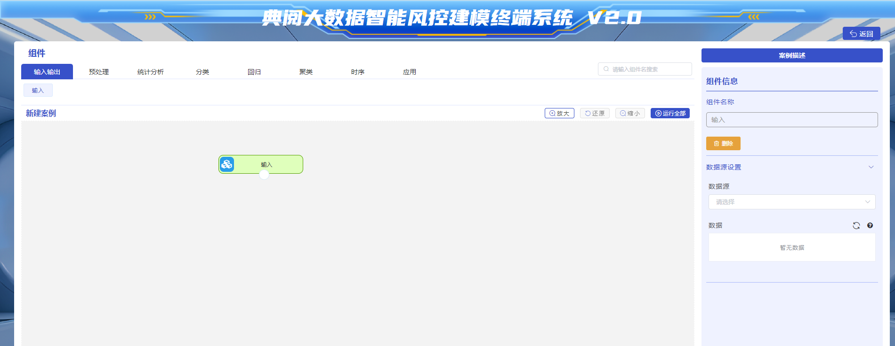

 

## 3.2 预处理
现实世界中的大规模数据往往是杂乱的，主要表现为：1.不完整性：数据属性值遗漏或不确定；2.不一致性：由于原始数据的来源不同，数据定义缺乏统一标准，导致系统间数据内涵不一致，例如:同--属性的命名、单位、字长却不相同。3.有噪声：数据中存在异常(偏离期望值)；4.冗余性：数据记录或属性的重复。

该类数据无法直接进行数据挖掘，或挖掘结果差强人意。为了提高数据挖掘的质量产生了数据预处理技术。数据预处理有多种方法：数据清理，数据集成，数据变换，数据归约等。这些数据处理技术在数据挖掘之前使用，大大提高了数据挖掘模式的质量，降低实际挖掘所需要的时间。

数据的预处理是指对所收集数据进行分类或分组前所做的审核、筛选、排序等必要的处理。预处理模块可对数据进行初步的处理，以便用于后续的数据分析。

预处理组件包含：分组聚合、记录去重、记录去重、缺失值处理、数据标准化、数据集划分、数学函数、新增序列、异常值处理、排序、编码、记录去重、 记录去重。

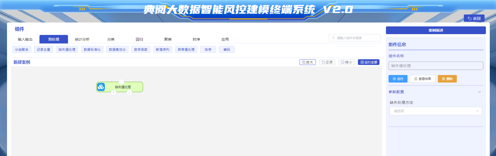

 

## 3.3 统计分析
统计分析是指运用统计方法及与分析对象有关的知识，从定量与定性的结合上进行的研究活动。它是继统计设计、统计调查、统计整理之后的一项十分重要的工作，是在前几个阶段工作的基础上通过分析从而达到对研究对象更为深刻的认识。它又是在一定的选题下，集分析方案的设计、资料的搜集和整理而展开的研究活动。系统、完善的资料是统计分析的必要条件。统计分析包含：相关性分析、卡方分析、纯随机性检验、单样本T检验、双样本T检验、全表统计、因子分析、正态性检验、主成分分析、频数分析、平稳性检验、方差分析、apriori关联规则。

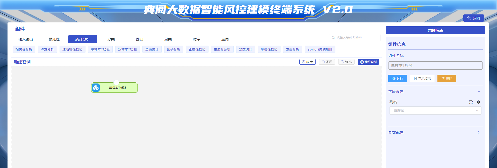

 

## 3.4分类
分类方法是一种重要的数据分析和知识组织工具，它可以帮助我们从不同的角度和维度理解事物，从而进行有效的管理和决策。常见的分类方法包括：CART分类树、支持向量分类、逻辑回归分类、最近邻分类、朴素贝叶斯分类、RFM模型。

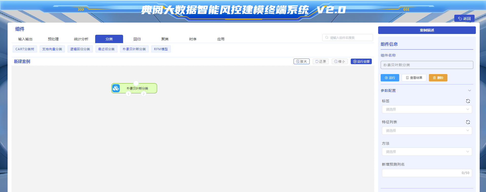

 

## 3.5回归
回归分析是一种数学模型。当因变量和自变量为线性关系时，它是一种特殊的线性模型。

回归分析的主要内容有以下：

①从一组数据出发，确定某些变量之间的定量关系式；即建立数学模型并估计未知参数。通常用[最小二乘法](https://baike.baidu.com/item/%E6%9C%80%E5%B0%8F%E4%BA%8C%E4%B9%98%E6%B3%95/0?fromModule=lemma_inlink)。

②检验这些关系式的可信任程度。

③在多个自变量影响一个因变量的关系中，判断自变量的影响是否显著，并将影响显著的选入模型中，剔除不显著的变量。通常用[逐步回归](https://baike.baidu.com/item/%E9%80%90%E6%AD%A5%E5%9B%9E%E5%BD%92/0?fromModule=lemma_inlink)、向前回归和向后回归等方法。

④利用所求的关系式对某一过程进行预测或控制。

回归分析的应用非常广泛，[统计软件包](https://baike.baidu.com/item/%E7%BB%9F%E8%AE%A1%E8%BD%AF%E4%BB%B6%E5%8C%85/12731349?fromModule=lemma_inlink)的使用可以让各种算法更加方便。

回归主要的种类有：线性回归、CART回归树、支持向量回归。

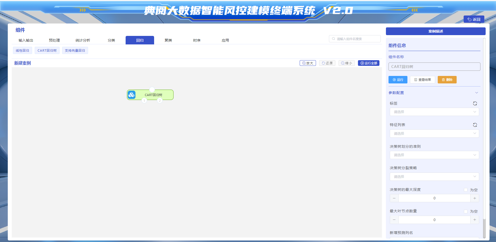

 

## 3.6聚类
聚类分析指将物理或抽象对象的集合分组为由类似的对象组成的多个类的分析过程。它是一种重要的人类行为。

聚类分析的目标就是在相似的基础上收集数据来分类。聚类源于很多领域，包括数学，计算机科学，统计学，生物学和经济学。在不同的应用领域，很多聚类技术都得到了发展，这些技术方法被用作描述数据，衡量不同数据源间的相似性，以及把数据源分类到不同的簇中。

聚类是将数据分类到不同的类或者簇这样的一个过程，所以同一个簇中的对象有很大的相似性，而不同簇间的对象有很大的相异性。

从统计学的观点看，聚类分析是通过数据建模简化数据的一种方法。传统的统计聚类分析方法包括means聚类、DBSCAN聚类、凝聚层次聚类。

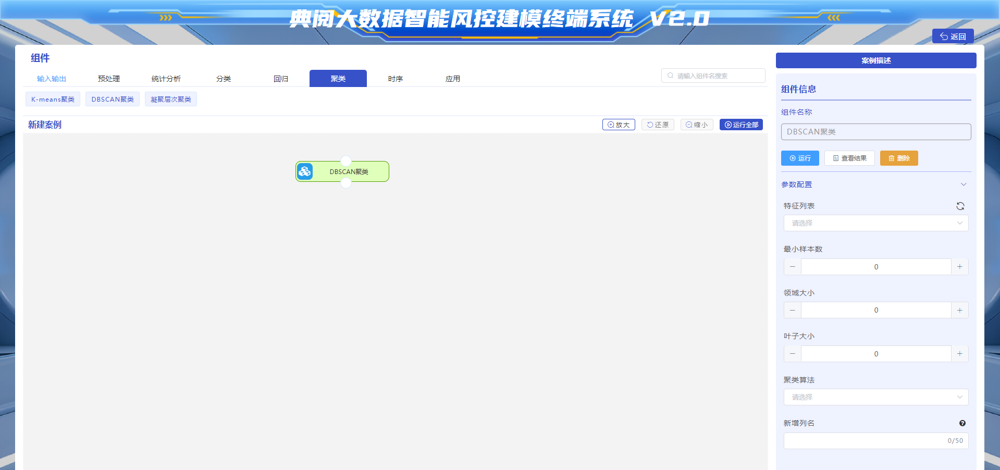

 

## 3.7时序
时序是指时间的顺序和关系。在计算机科学中，时序是一个重要的概念，涉及到各种计算机系统中的时间相关问题，比如时钟频率、CPU时钟周期、时序分析、时序设计等。时序的基本概念包括时钟信号、时钟周期、时钟频率、时序分析、时序设计等。时钟信号是指一个周期性的信号，用于控制计算机系统中各个模块的操作。时钟周期是时钟信号的一个完整周期，通常以纳秒(ns)或皮秒(ps)为单位。时钟频率是指每秒钟产生的时钟周期数，通常以赫兹(Hz)为单位。时序分析是指对计算机系统中各个模块的时序进行分析，以确保系统能够按照设计要求正确地操作。时序设计是指在设计计算机系统时，将时序要求作为设计的重要考虑因素，以确保系统能够按照设计要求正确地操作。时序的理解和掌握对于计算机系统的设计和开发非常重要。时序分析方法包含：差分、Arima时序预测、GM(1，1)时序预测。

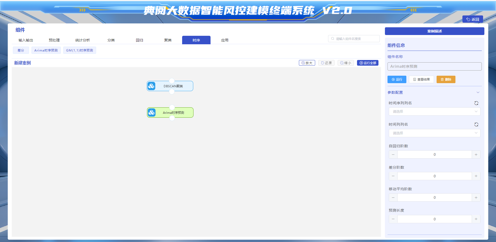

 

## 3.8应用
已建立好的模型可以应用在所需要的场景中，建立好模型后，直接输入源数据后，点击运行，模型将自动输出结果值。

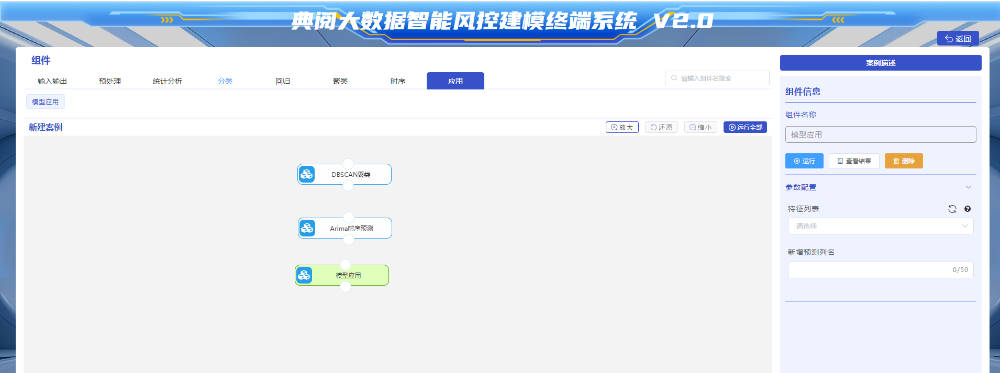

 

# 四. 案例操作介绍
 

          选择已配置好的案例：“商品购物篮”

 

**  ****案例描述：**

该数据来自茅台股票在2017到2022年的收盘价数据，根据现有数据建立ARIMA模型，对未来10天的股票数据进行预测。数据中共两个字段，一个是日期列，一个是收盘价。

**思路**

1.检验数据的平稳性，如果数据不够平稳，利用差分使数据达到平稳。

2.在平稳后的数据中，找到P、Q值，根据差分次数得到差分阶数。

3.建立ARIMA模型。

Tips：ARIMA只是基础的分析工具，本质上只能捕捉线性关系，也就是数据必须趋于平稳，而股票数据因众多因素是非稳定的，所以利用ARIMA模型对股票的未来走势预测精准度不高。

 

**操作：**

1.选择输入组件，在输入组件中，选择股票收盘价预测的源数据。

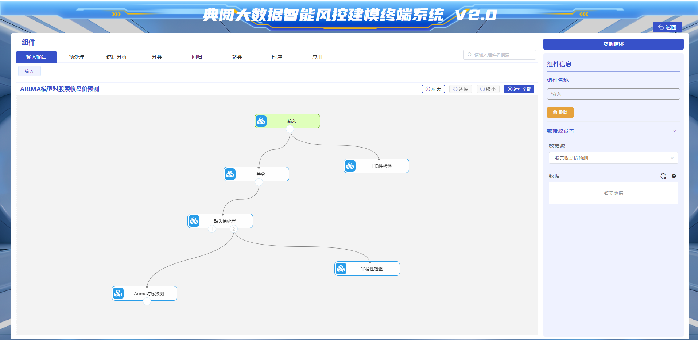

 

          2.对数据进行差分时序处理

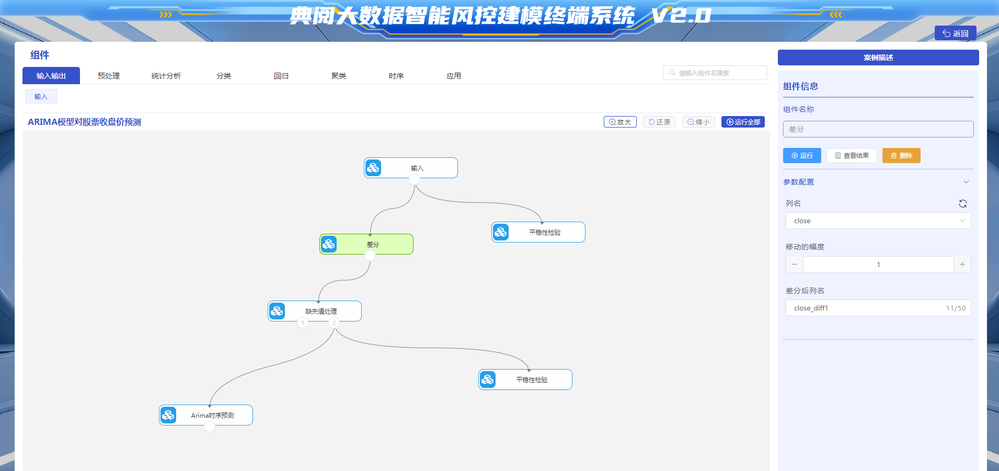

 

          运行后，点击该节点的查看结果，可以看到进行差分处理后的结果表。

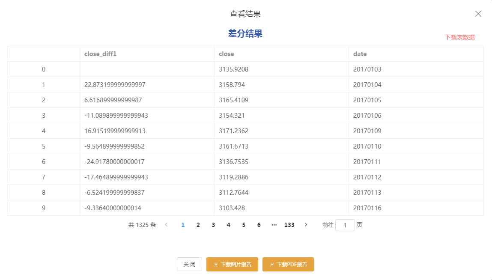

 

          3.对数据进行平稳性检验

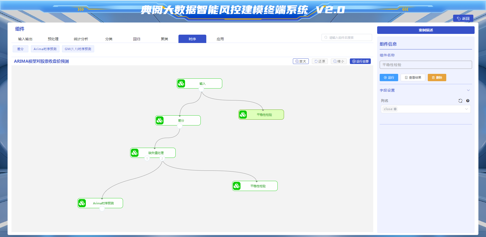

 

          运行后，点击该节点的查看结果，可以看到平稳性检验后的结果表。

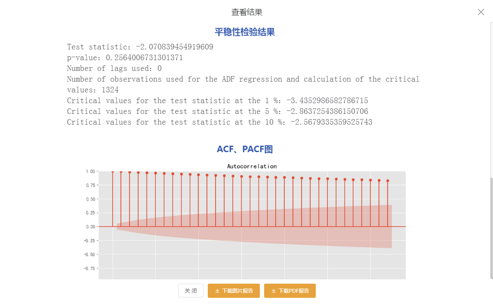

 

          4.对数据进行缺失值处理

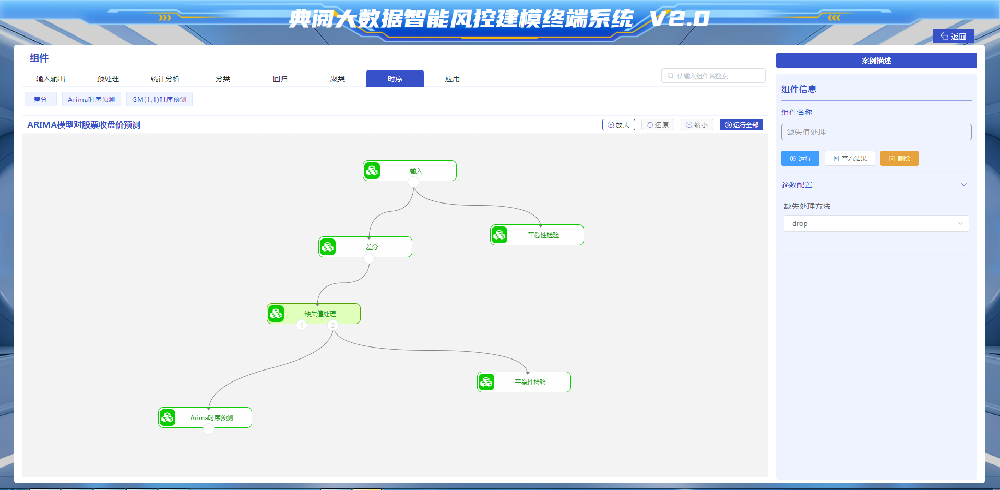

         

          运行后，点击该节点的查看结果，经过缺失值处理后的数据表。

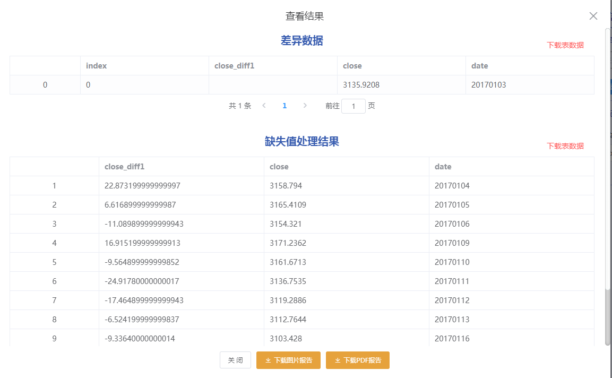

 

          5.对进行差分检验及缺失值处理后的数据进行平稳性检验

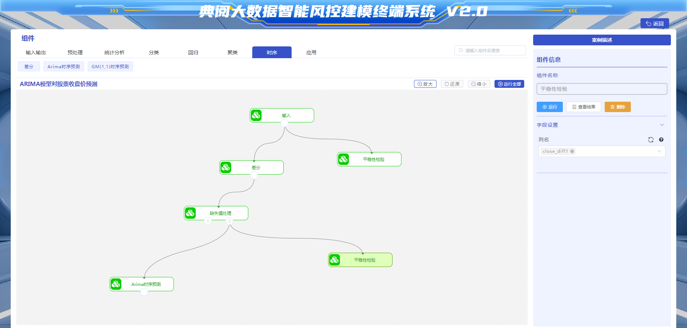

 

          运行后，点击该节点的查看结果，经过平稳性检验后的数据表。

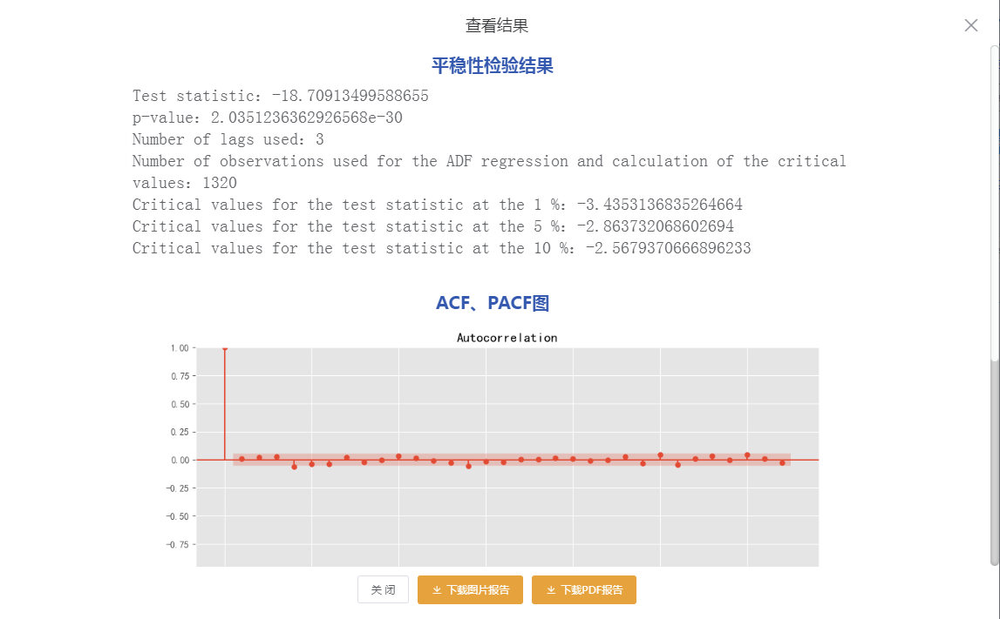

 

          6.对进行差分检验及缺失值处理后的数据进行Arima时序预测

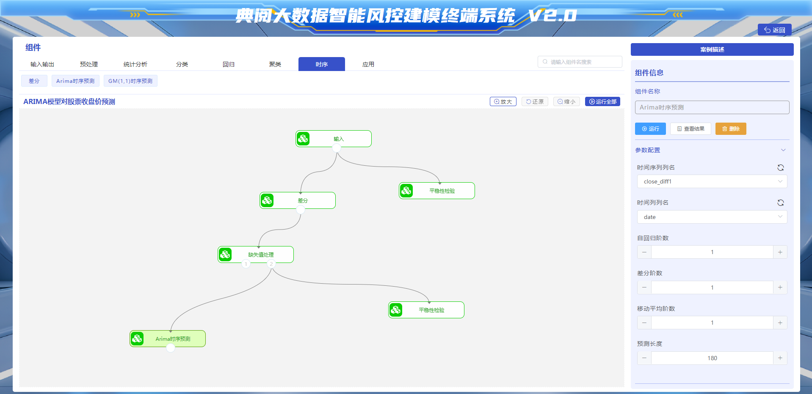

         

          运行后，点击该节点的查看结果，经过进行Arima时序预测后的数据表。

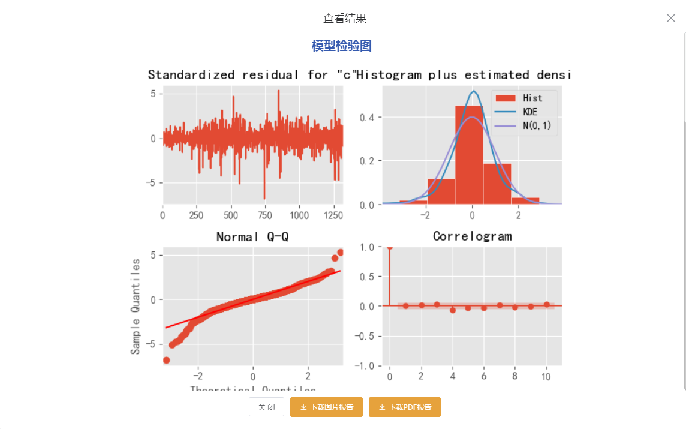

 

 

 

> 更新: 2025-12-24 10:35:35  
> 原文: <https://www.yuque.com/lixinsi/hntyk2/eu5yilzr1to4eezd>