# 典阅跨境电商综合实训仿真软件v4.0

# **一.准备环境**
**1)**** ****服务器**

Windows Server 2016

**2)**** ****数据库**

Server sql 2016

**3)**** ****软件环境**

asp.net core

iis7

**4)**** ****推荐客户端**

Google浏览器

**5)**** ****软件部署端口说明**

典阅跨境电商综合实训仿真软件v4.0(port:8090) => .net服务端

典阅Amazon实训教学/竞赛系统V6.0（port:8001) => .net服务端 后台

# **二、**** ****基础软件安装**
## **2.1****、****Google****浏览器安装**
安装包名称为：chrome-64.exe，双击安装即可。

## **2.2、**** ****ASP.NET CORE****安装**
（注：优先安装IIS然后在安装ASP.NET CORE）

安装包名称: dotnet-hosting-3.1.22-win.exe，dotnet-sdk-3.1.417-win-x64，双击安装，如系统已安装此插件，会提示已安装，即可以不用再另行安装。

# **三****、****安装说明**
## **3.1 ****、****IIS****  **
系统要求：

· 支持的操作系统： Windows Server 2016 8G以上

· .NET Framework 4.6 系统安装说明安装 IIS:“计算机”右键，选择“管理”――〉在“添加角色向导”] 对话框中选择“Web 服务器(IIS)

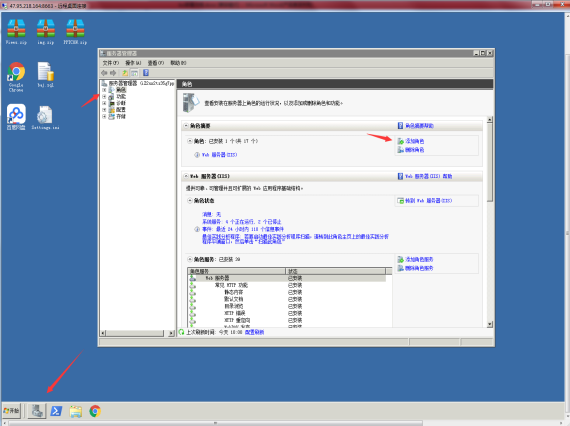

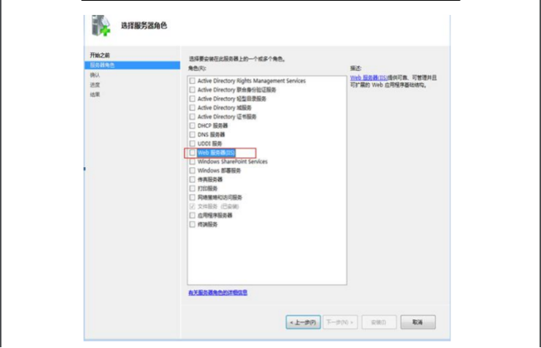

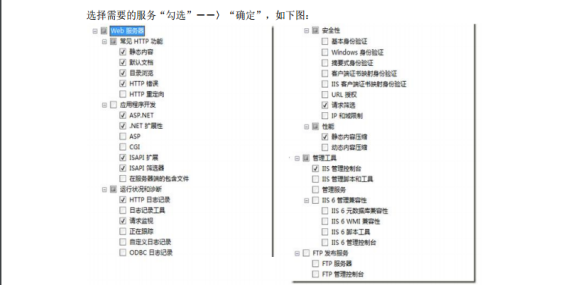

对于可能搭建在windows 7等个人操作系统上的临时测试环境，可在程序和功能下面，点击打开和关闭windows功能。按照：[https://jingyan.baidu.com/article/219f4bf723bcb2de442d38ed.html](https://jingyan.baidu.com/article/219f4bf723bcb2de442d38ed.html)去开启IIS服务

## **3.2****、数据库****安装说明**
	Windows server 2016 操作系统上安装 SQL Server 2016数据库，安装图解和配置过程如下图(可直接双击相关的SETUP.EXE)

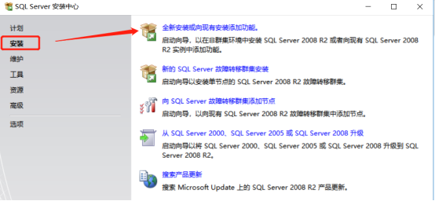

点击全新安装或向现有安装添加功能之后，会进行安装程序支持规则检查，检查完毕进入产品密钥输入界面，请选择输入产品密钥，密钥为：R88PF-GMCFT-KM2KR-4R7GB-43K4B

然后点击下一步，选择我接受许可条款，继续点击下一步进入安装界面，点击安装

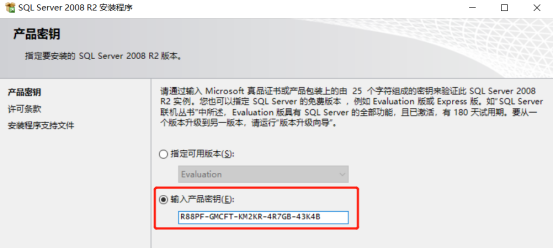

进入安装界面，会提示有部分告警，如.NET告警，提示没有网络会造成延迟，提示防火墙告警，请忽略此告警，继续安装。继续点击下一步，进入SQL Server功能安装界面

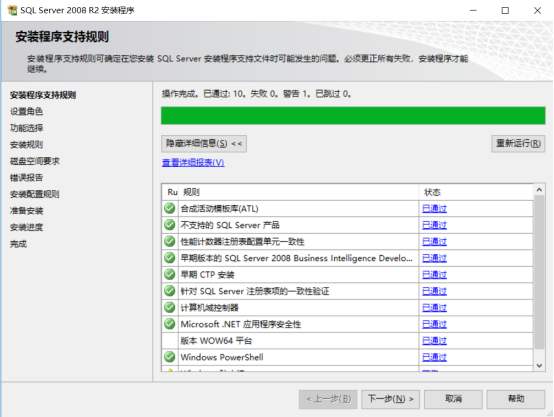

SQL Server功能安装界面，点击下一步：

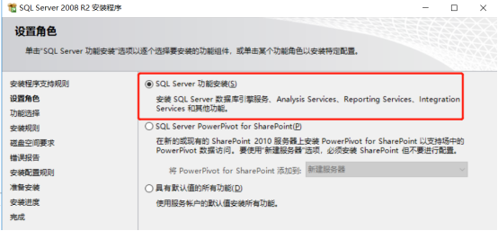

进入安装界面选择页面，选择数据库引擎服务下的全部和管理工具两个选项，进入下一步：

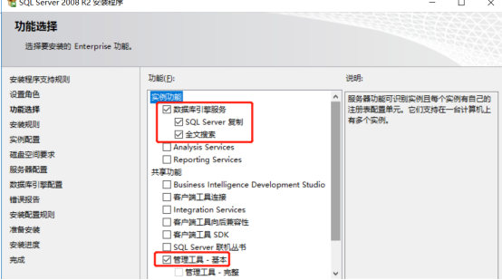

填写数据库实例名，请选择默认实例就行，进行下一步操作，进入服务器配置页面：

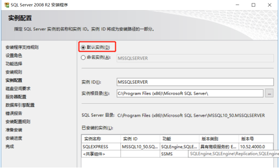

服务器配置页面，账户名选择为本地系统账户（下拉选项中选中*\SYSTEM即可）

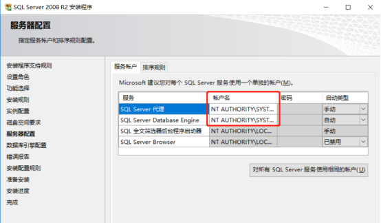

继续点击下一步，进入数据库引擎配置页面，身份证验证方式选择混合模式，密码输入后请一定要记得密码（此密码无法查询找回），可添加当前用户为数据库管理员，也可另行添加

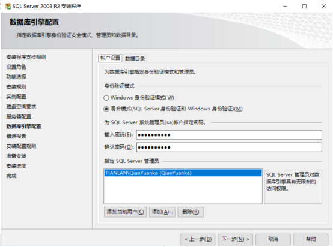

然后继续点击下一步，直到进入安装界面，开始安装:

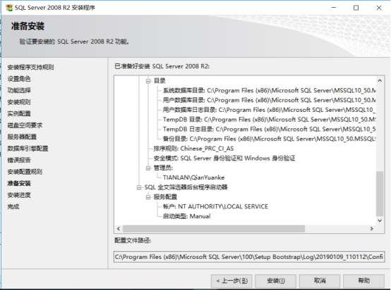  
安装完成，点击关闭即可。

# 四、项目部署
## **4.1****、****W****eb****项目部署**
2个IIS项目

添加两个文件夹的说明：

## **4.2****、项目文件准备**
1.在D盘新建dianyue文件夹。右击属性添加Everyone权限

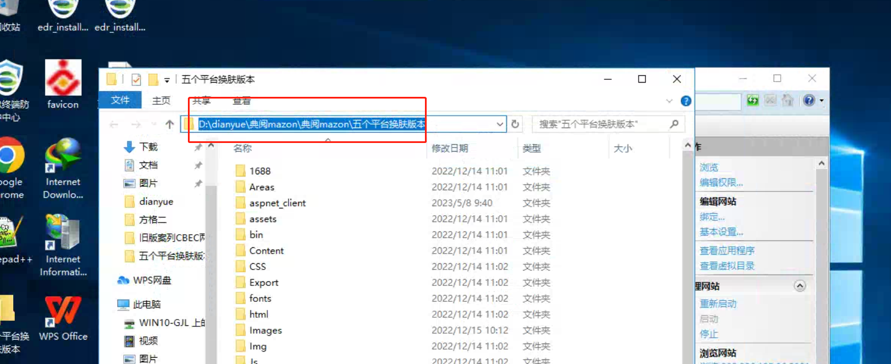

2.在dianyue文件夹建文件夹（db放数据库，典阅mazon程序）

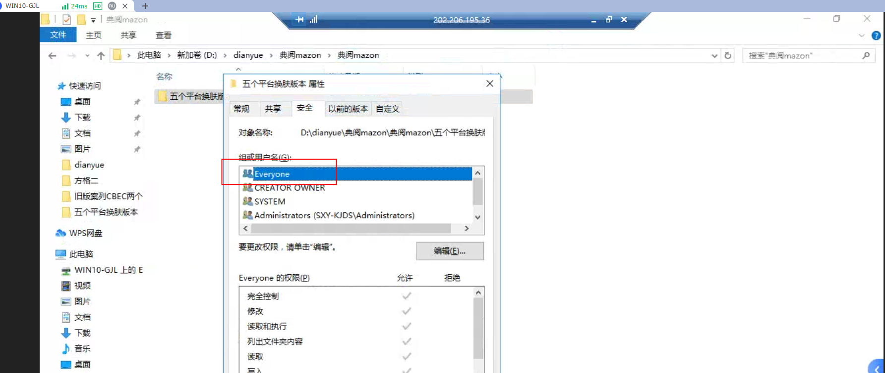

将安装包中的系统安装包下的目录拷贝到典阅mazon目录下

## **4.3、**** ****IIS****项目部署细节**
1）.IIS应用程序池没有如下图的

1 注册.net framework 4.6

在命令行下运行cmd，执行结果如下：

cd c:\Windows\Microsoft.NET\Framework64\v4.0.30319

aspnet_regiis.exe -i

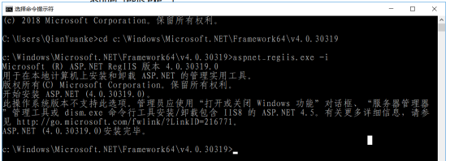

2.IIS项目添加需要部署的软件

1).打开IIS管理器

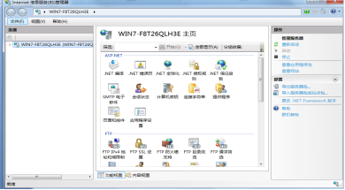

2).网站右击添加，输入你的网站名称，找到你要部署路径分别是：

(D:\dianyue\案列\旧版案列CBEC两个模块) port 8090

(D:\dianyue\典阅mazon\典阅mazon\五个平台换肤版本)  port:8001

  

## **4.4****、数据库部署**
启动SQL Server Management Studio,连接到本地数据库

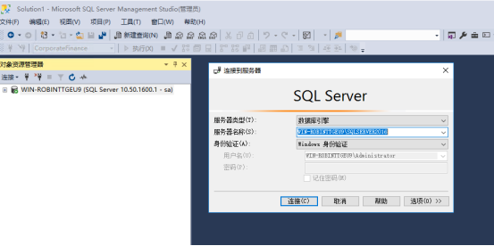

右键点击数据库，选择还原数据库：  
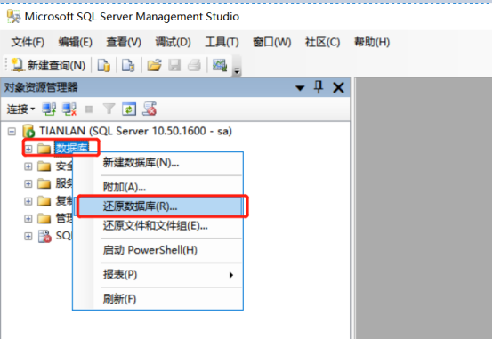

从原设备中选择目标文件，选择之后再选择目标数据库

选中目标数据库：

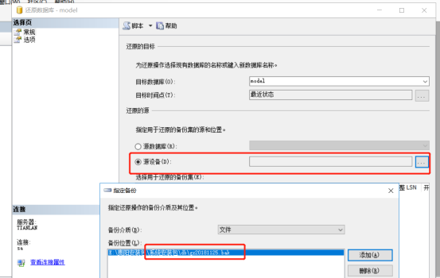

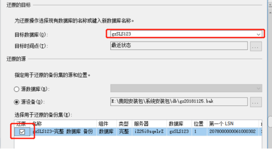

点击确定进行还原

  

## **4.5****、数据库配置修改：**
DataSource(数据库连接地址),InitialCatalog(数据库名),User(数据库用户),Password(数据库密码)

1.D:\dianyue\案列\旧版案列CBEC两个模块根目录，更改数据库连接信息，只需更改IP地址，密码即可（如其他信息有变动，也可同步修改）

2. D:\dianyue\典阅mazon\典阅mazon\五个平台换肤版本\根目录，更改数据库连接信息，只需更改IP地址，密码即可（如其他信息有变动，也可同步修改）

## **4.****6****、管理员页面检查**
打开Google浏览器，输入部署的IP地址及端口，例如典阅Amazon实训教学/竞赛系统V6.0网址能看到登录界面如下：  

输入账号及其密码，点击登录，进入管理员界面：

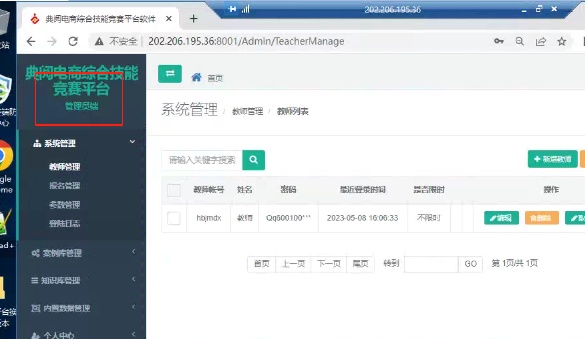

点击左边导航栏菜单，确认各个页面是否能正常打开，正常点击；

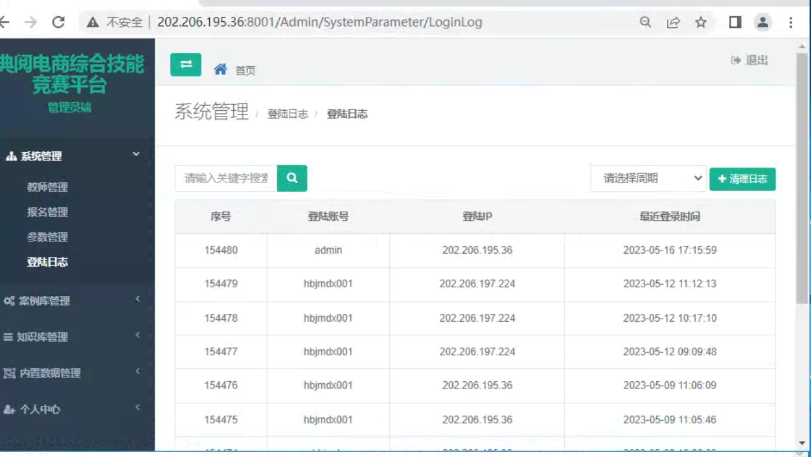

## **4.****7****、****学生端实训中心和考试中心****页面检查**
打开登录页面，输入账号及其密码

进入在线亚马逊实训，点击选择案例练习

选择一个实列，点击进入

点击开始答题和继续答题的解锁按钮，选择对应课程模块进行练习

实训中心作答界面

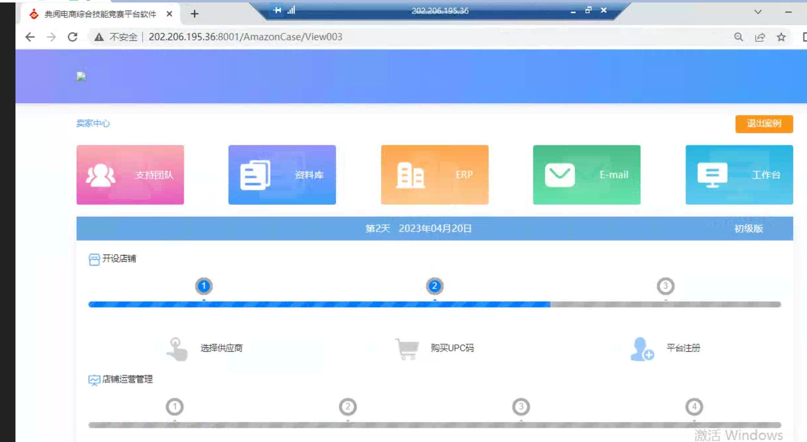

# **五、****数据库备份**
## **5.1、数据库定期备份**
利用SQL Server 2016数据库可以实现数据库的定期自动备份。方法是用SQLSERVER2016自带的维护计划创建一个计划对数据库进行备份。

单机版建议备份在目录**:D:\dianyue\db**下，多机部署情况可备份在备份服务器的共享文件夹下面

首先需要启动SQL Server Agent服务，这个服务如果不启动是无法运行新建作业的，点击“开始”–“所有程序”–“Microsoft SQL Server 2016”–“启动SQL Server Management Studio”登录数据库，点击管理–维护计划–右击维护计划向导如图所示：

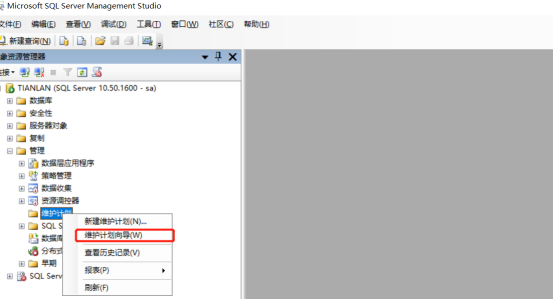

点击“维护计划向导”后跳出对话框，如图所示：

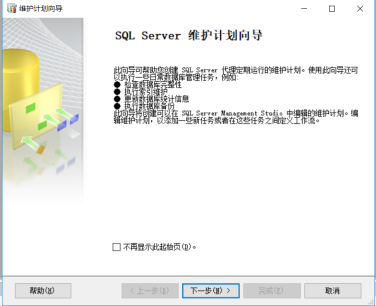

点击“下一步”如图所示：

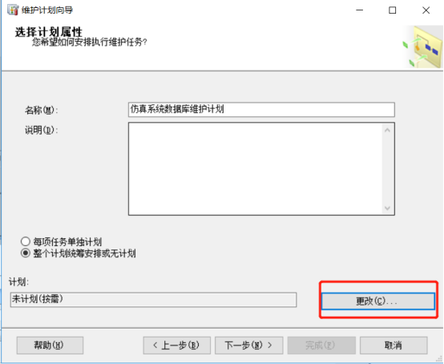

填写好名称及相关说明作个记号，点击“更改”来设定维护计划，如图所示：

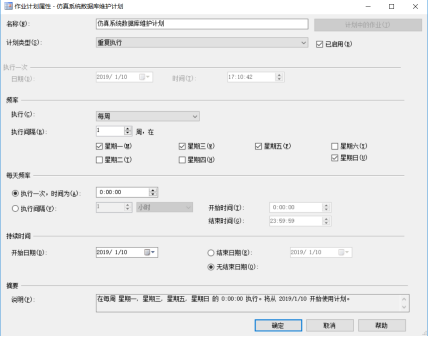

可以为选择执的时间段，每天、每周、每月可以根据你相应的需求来制定备份的时间，这里作演示就选择在每周星期三，星期日的0：00进行，点击“确定”再点“下一步”如图所示：

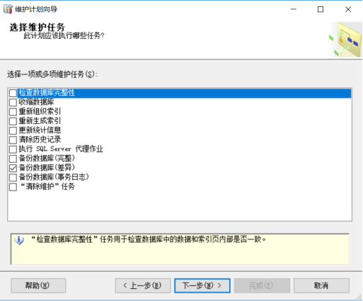

选择你需要备份的任务，我这里就先择“备份数据库（完整）”，很明了点击“下一步”如图所示：

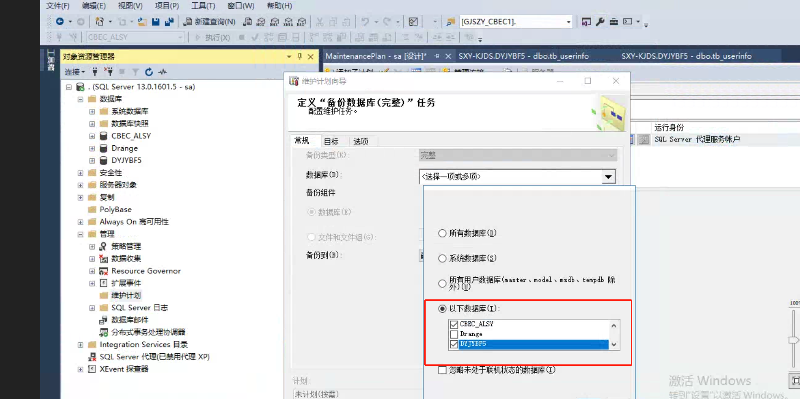

出现刚刚所选择的三项你可以选择他们所执行的顺序，选好后点击“下一步”如图所示：

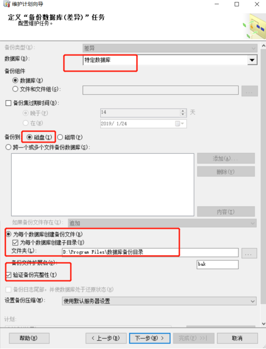

选择需要备份的数据库，在数据库那一列选择相关数据库点击（确定）如图所示（由于这张图片较大您可以点击图片查看原图）：

选择备份的数据库存放的目录，设置备份压缩：有默认服务器设置，压缩备份等选项，因为我的数据库较大所以就选择压缩，根据您的实际情况进行操作：点击”下一步”，下面的操作是对于这前我们所选择的“维护任务”操作和“上一步”一样这里就不截图说明，最后点击“下一步”如图所示：

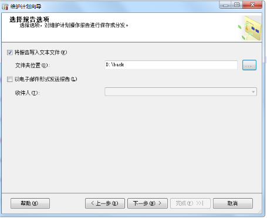

选择SQLSERVER2016自动备份维护计划的报告文件所存放位置点击“下一步”如图所示:

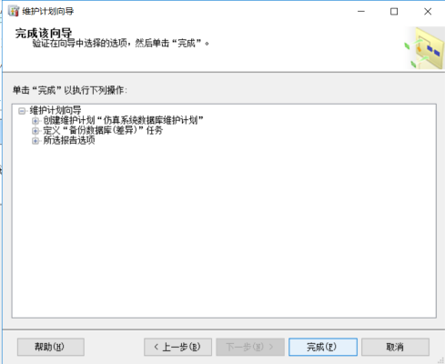

点击“完成”这样就完成了SQLSERVER2016自动备份。

注意：在利用SQLSERVER2016的维护计划对数据库进行定期的备份时要启动“SQLSERVER代理”服务。

# **六、全流程服务开启**

双击如图的bat脚本，启动后请勿关闭。

## 
# **七、****Windwos****防火墙策略**
**7.1**

1) Windows防火墙->高级设置->入站规则->新建入站规则向导->端口

2) tcp->特定本地端口-（需要对外开放的端口8001，8090）

  

# **八、维护服务器**
**8.1**

服务进程管理

数据库服务卡死重启数据库服务如下图

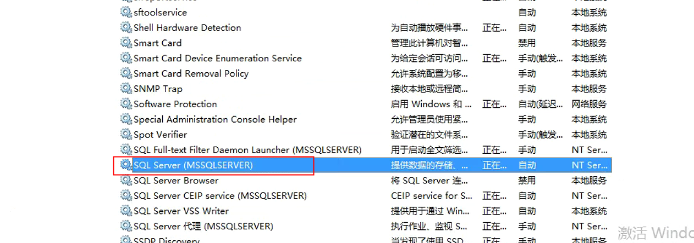

asp.net服务卡死重启asp.net服务

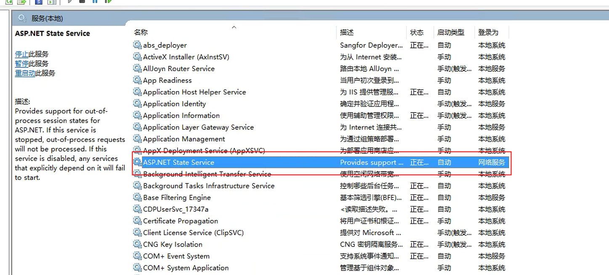

系统平台进程，如下图所示

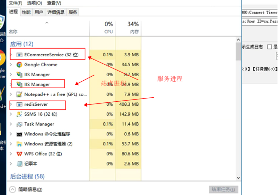

如果服务器出现卡死建议重新强制关机重新启动服务器。

在服务器里面已经设置好了bat脚本重启后登入用户自动启动服务如下图：

下图是设置了服务器开启后自动执行脚本文件启动服务：

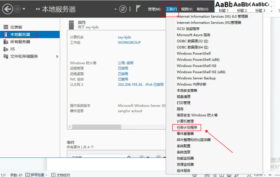

下图是显示计划正在运行

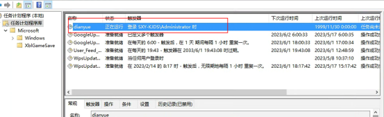

下图是启动脚本后等待5秒后启动执行脚本。

此图启动主服务

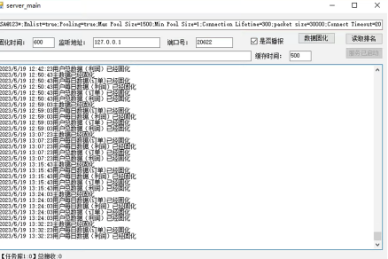

此图是启动计算服务

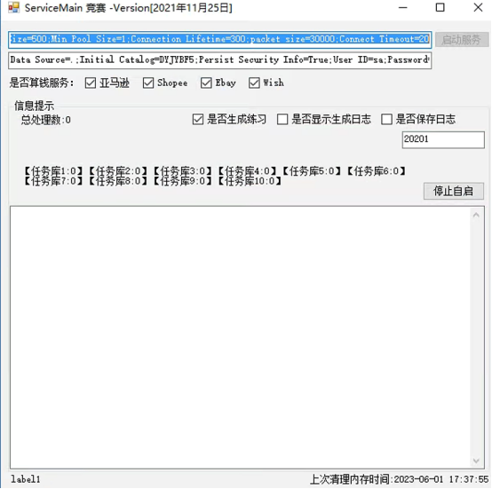

**8.2**

程序涉及到的端口：8090 8001

数据库端口：1433

redis端口：6379

如下图所示：

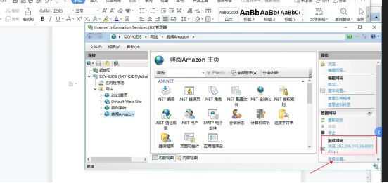

如果访问不了，需要检查一下防火墙是否放开了对应绑定的端口

检查如下图所示

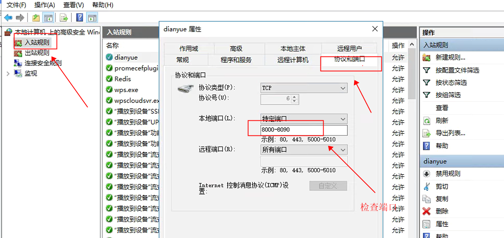

> 更新: 2023-06-01 18:16:41  
> 原文: <https://www.yuque.com/lixinsi/hntyk2/yd3vk9c28pgxw4av>