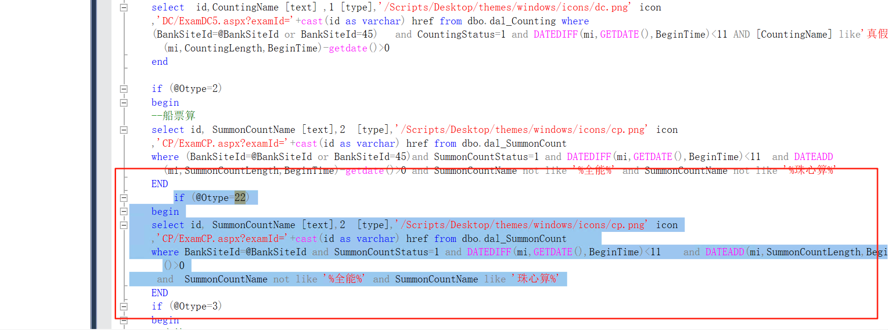
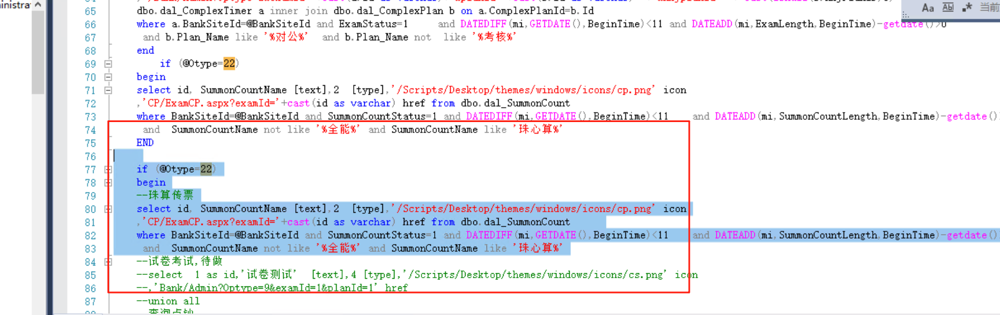

# 农信银存储更新时间过程以及添加珠心算

```bash
--对公零售业务
	update dal_ComplexTimer set  BeginTime=  CAST(year(getdate()) AS VARCHAR(10))+'-01-01' where 
	CAST( CAST(year(getdate()) AS VARCHAR(10))+'-01-01' AS DATE) >BeginTime  and ExamLength>1000000 
--字符
	update dal_Character set  BeginTime=  CAST(year(getdate()) AS VARCHAR(10))+'-01-01' where 
	CAST( CAST(year(getdate()) AS VARCHAR(10))+'-01-01' AS DATE) >BeginTime  and CharacterLength>1000000 
--船票算
	update dal_SummonCount set  BeginTime=  CAST(year(getdate()) AS VARCHAR(10))+'-01-01' where 
	CAST( CAST(year(getdate()) AS VARCHAR(10))+'-01-01' AS DATE) >BeginTime  and SummonCountLength>1000000 
--查询点钞
update dal_Counting set  BeginTime=  CAST(year(getdate()) AS VARCHAR(10))+'-01-01' where 
	CAST( CAST(year(getdate()) AS VARCHAR(10))+'-01-01' AS DATE) >BeginTime  and CountingLength>1000000 
```

### 更新时间存储过程
```bash
USE [jn820250715]
GO

SET ANSI_NULLS ON
GO
SET QUOTED_IDENTIFIER ON
GO

ALTER PROCEDURE [dbo].[GetRace] 
(
   @BankSiteId int,
   @Otype int
)
AS
BEGIN
    SET NOCOUNT ON;

    -- 数据初始化更新
    UPDATE dal_ComplexTimer SET BeginTime = CAST(YEAR(GETDATE()) AS VARCHAR(10)) + '-01-01' 
    WHERE CAST(CAST(YEAR(GETDATE()) AS VARCHAR(10)) + '-01-01' AS DATE) > BeginTime AND ExamLength > 1000000;

    UPDATE dal_Character SET BeginTime = CAST(YEAR(GETDATE()) AS VARCHAR(10)) + '-01-01' 
    WHERE CAST(CAST(YEAR(GETDATE()) AS VARCHAR(10)) + '-01-01' AS DATE) > BeginTime AND CharacterLength > 1000000;

    UPDATE dal_SummonCount SET BeginTime = CAST(YEAR(GETDATE()) AS VARCHAR(10)) + '-01-01' 
    WHERE CAST(CAST(YEAR(GETDATE()) AS VARCHAR(10)) + '-01-01' AS DATE) > BeginTime AND SummonCountLength > 1000000;

    UPDATE dal_Counting SET BeginTime = CAST(YEAR(GETDATE()) AS VARCHAR(10)) + '-01-01' 
    WHERE CAST(CAST(YEAR(GETDATE()) AS VARCHAR(10)) + '-01-01' AS DATE) > BeginTime AND CountingLength > 1000000;

    IF (@Otype = 1)
    BEGIN
        SELECT id, CountingName AS [text], 1 AS [type], '/Scripts/Desktop/themes/windows/icons/dc.png' AS icon,
        'DC/ExamDC4.aspx?examId=' + CAST(id AS VARCHAR) AS href 
        FROM dbo.dal_Counting 
        WHERE BankSiteId = @BankSiteId AND CountingStatus = 1 
          AND DATEDIFF(mi, GETDATE(), BeginTime) < 11 
          AND DATEADD(mi, CountingLength, BeginTime) - GETDATE() > 0
          AND CountingName NOT LIKE '%全能%';
    END
    
    IF (@Otype = 0)
    BEGIN
        SELECT id, SummonCountName AS [text], 2 AS [type], '/Scripts/Desktop/themes/windows/icons/cp.png' AS icon,
        'CP/ExamCP.aspx?examId=' + CAST(id AS VARCHAR) AS href 
        FROM dbo.dal_SummonCount 	
        WHERE BankSiteId = @BankSiteId AND SummonCountStatus = 1 
          AND DATEDIFF(mi, GETDATE(), BeginTime) < 11	
          AND DATEADD(mi, SummonCountLength, BeginTime) - GETDATE() > 0 
          AND SummonCountName NOT LIKE '%全能%' AND SummonCountName NOT LIKE '%珠心算%';
    END 
    
    IF (@Otype = 2)
    BEGIN
        SELECT id, SummonCountName AS [text], 2 AS [type], '/Scripts/Desktop/themes/windows/icons/cp.png' AS icon,
        'CP/ExamCP1.aspx?examId=' + CAST(id AS VARCHAR) AS href 
        FROM dbo.dal_SummonCount 	
        WHERE BankSiteId = @BankSiteId AND SummonCountStatus = 1 
          AND DATEDIFF(mi, GETDATE(), BeginTime) < 11	
          AND DATEADD(mi, SummonCountLength, BeginTime) - GETDATE() > 0
          AND SummonCountName NOT LIKE '%全能%' AND SummonCountName LIKE '珠心算%';
    END 
    
    IF (@Otype = 3)
    BEGIN
        SELECT id, CharacterName AS [text], 3 AS [type], '/Scripts/Desktop/themes/windows/icons/zf.png' AS icon,
        'DZ/ExamDZ.aspx?examId=' + CAST(id AS VARCHAR) AS href 
        FROM dbo.dal_Character
        WHERE BankSiteId = @BankSiteId AND CharacterStatus = 1 
          AND DATEDIFF(mi, GETDATE(), BeginTime) < 11 
          AND DATEADD(mi, CharacterLength, BeginTime) - GETDATE() > 0
          AND CharacterName NOT LIKE '%全能%';
    END

    IF (@Otype = 4)
    BEGIN
        SELECT a.id, b.Plan_Name AS [text], 4 AS [type], '/Scripts/Desktop/themes/windows/icons/ls.png' AS icon,
        '/Bank/Admin?Optype=1&examId=' + CAST(a.id AS VARCHAR) + '&planId=' + CAST(b.id AS VARCHAR) + '&nxyplanid=' + CAST(ISNULL(b.nxyPlanID, 0) AS VARCHAR) AS href 
        FROM dbo.dal_ComplexTimer a 
        INNER JOIN dbo.dal_ComplexPlan b ON a.ComplexPlanId = b.Id
        WHERE a.BankSiteId = @BankSiteId AND ExamStatus = 1 	
          AND DATEDIFF(mi, GETDATE(), BeginTime) < 11 
          AND DATEADD(mi, ExamLength, BeginTime) - GETDATE() > 0	
          AND b.Plan_Name LIKE '%零售%';
    END

    IF (@Otype = 5)
    BEGIN
        SELECT a.id, b.Plan_Name AS [text], 4 AS [type], '/Scripts/Desktop/themes/windows/icons/dg.png' AS icon,
        '/Bank/Admin?Optype=2&examId=' + CAST(a.id AS VARCHAR) + '&planId=' + CAST(b.id AS VARCHAR) + '&nxyplanid=' + CAST(ISNULL(b.nxyPlanID, 0) AS VARCHAR) AS href 
        FROM dbo.dal_ComplexTimer a 
        INNER JOIN dbo.dal_ComplexPlan b ON a.ComplexPlanId = b.Id
        WHERE a.BankSiteId = @BankSiteId AND ExamStatus = 1 	
          AND DATEDIFF(mi, GETDATE(), BeginTime) < 11 
          AND DATEADD(mi, ExamLength, BeginTime) - GETDATE() > 0	
          AND b.Plan_Name LIKE '%对公%';
    END
    
    IF (@Otype = 6)
    BEGIN
        SELECT 1 AS id, '试卷测试' AS [text], 4 AS [type], '/Scripts/Desktop/themes/windows/icons/cs.png' AS icon,
        'Bank/Admin?Optype=9&examId=1&planId=1' AS href
        UNION ALL 
        SELECT id, CountingName AS [text], 1 AS [type], '/Scripts/Desktop/themes/windows/icons/dc.png' AS icon,
        'DC/ExamDC.aspx?examId=' + CAST(id AS VARCHAR) AS href 
        FROM dbo.dal_Counting 
        WHERE BankSiteId = @BankSiteId AND CountingStatus = 1 
          AND DATEDIFF(mi, GETDATE(), BeginTime) < 11 
          AND DATEADD(mi, CountingLength, BeginTime) - GETDATE() > 0
        UNION ALL
        SELECT id, SummonCountName AS [text], 2 AS [type], '/Scripts/Desktop/themes/windows/icons/cp.png' AS icon,
        'CP/ExamCP.aspx?examId=' + CAST(id AS VARCHAR) AS href 
        FROM dbo.dal_SummonCount 	
        WHERE BankSiteId = @BankSiteId AND SummonCountStatus = 1 
          AND DATEDIFF(mi, GETDATE(), BeginTime) < 11	
          AND DATEADD(mi, SummonCountLength, BeginTime) - GETDATE() > 0
        UNION ALL
        SELECT id, CharacterName AS [text], 3 AS [type], '/Scripts/Desktop/themes/windows/icons/zf.png' AS icon,
        'DZ/ExamDZ.aspx?examId=' + CAST(id AS VARCHAR) AS href 
        FROM dbo.dal_Character
        WHERE BankSiteId = @BankSiteId AND CharacterStatus = 1 
          AND DATEDIFF(mi, GETDATE(), BeginTime) < 11 
          AND DATEADD(mi, CharacterLength, BeginTime) - GETDATE() > 0
        UNION ALL 
        SELECT a.id, b.Plan_Name AS [text], 4 AS [type], '/Scripts/Desktop/themes/windows/icons/ls.png' AS icon,
        '/Bank/Admin?Optype=1&examId=' + CAST(a.id AS VARCHAR) + '&planId=' + CAST(b.id AS VARCHAR) AS href 
        FROM dbo.dal_ComplexTimer a 
        INNER JOIN dbo.dal_ComplexPlan b ON a.ComplexPlanId = b.Id
        WHERE a.BankSiteId = @BankSiteId AND ExamStatus = 1 	
          AND DATEDIFF(mi, GETDATE(), BeginTime) < 11 
          AND DATEADD(mi, ExamLength, BeginTime) - GETDATE() > 0	
          AND b.Plan_Name LIKE '%零售%' AND b.Plan_Name NOT LIKE '%练习%'
        UNION ALL
        SELECT a.id, b.Plan_Name AS [text], 4 AS [type], '/Scripts/Desktop/themes/windows/icons/dg.png' AS icon,
        '/Bank/Admin?Optype=2&examId=' + CAST(a.id AS VARCHAR) + '&planId=' + CAST(b.id AS VARCHAR) AS href 
        FROM dbo.dal_ComplexTimer a 
        INNER JOIN dbo.dal_ComplexPlan b ON a.ComplexPlanId = b.Id
        WHERE a.BankSiteId = @BankSiteId AND ExamStatus = 1 	
          AND DATEDIFF(mi, GETDATE(), BeginTime) < 11 
          AND DATEADD(mi, ExamLength, BeginTime) - GETDATE() > 0	
          AND b.Plan_Name LIKE '%对公%' AND b.Plan_Name NOT LIKE '%练习%';
    END

    -- 【重点修复】@Otype=7 部分：UNION ALL 前面的 SELECT 不能有分号
    IF (@Otype = 7)
    BEGIN
        SELECT id, CountingName AS [text], 1 AS [type], '/Scripts/Desktop/themes/windows/icons/dc.png' AS icon,
        'DC/ExamDC4.aspx?examId=' + CAST(id AS VARCHAR) AS href 
        FROM dbo.dal_Counting 
        WHERE BankSiteId = @BankSiteId AND CountingStatus = 1 
          AND DATEDIFF(mi, GETDATE(), BeginTime) < 11 
          AND DATEADD(mi, CountingLength, BeginTime) - GETDATE() > 0 
          AND CountingName LIKE '%全能%'
        
        UNION ALL
        
        SELECT id, BanknoteName AS [text], 1 AS [type], '/Scripts/Desktop/themes/windows/icons/dc.png' AS icon,
        'DC/ExamJQDC.aspx?examId=' + CAST(id AS VARCHAR) AS href 
        FROM dbo.dal_MachineBill 
        WHERE GeneralId = @BankSiteId AND State = 0 
          AND DATEDIFF(mi, GETDATE(), StartTime) < 11 
          AND DATEADD(mi, AppraisalTime, StartTime) - GETDATE() > 0 
          AND BanknoteName LIKE '%全能%'
        
        UNION ALL
        
        SELECT id, SummonCountName AS [text], 2 AS [type], '/Scripts/Desktop/themes/windows/icons/cp.png' AS icon,
        'CP/ExamCP.aspx?examId=' + CAST(id AS VARCHAR) AS href 
        FROM dbo.dal_SummonCount 	
        WHERE BankSiteId = @BankSiteId AND SummonCountStatus = 1 
          AND DATEDIFF(mi, GETDATE(), BeginTime) < 11	
          AND DATEADD(mi, SummonCountLength, BeginTime) - GETDATE() > 0  
          AND SummonCountName LIKE '%全能%' AND SummonCountName NOT LIKE '%珠算%'
        
        UNION ALL
        
        SELECT id, SummonCountName AS [text], 2 AS [type], '/Scripts/Desktop/themes/windows/icons/cp.png' AS icon,
        'CP/ExamCP.aspx?examId=' + CAST(id AS VARCHAR) AS href 
        FROM dbo.dal_SummonCount 	
        WHERE BankSiteId = @BankSiteId AND SummonCountStatus = 1 
          AND DATEDIFF(mi, GETDATE(), BeginTime) < 11	
          AND DATEADD(mi, SummonCountLength, BeginTime) - GETDATE() > 0  
          AND SummonCountName LIKE '%全能%' AND SummonCountName LIKE '%珠算%'
        
        UNION ALL
        
        SELECT id, CharacterName AS [text], 3 AS [type], '/Scripts/Desktop/themes/windows/icons/zf.png' AS icon,
        'DZ/ExamDZ.aspx?examId=' + CAST(id AS VARCHAR) AS href 
        FROM dbo.dal_Character
        WHERE BankSiteId = @BankSiteId AND CharacterStatus = 1 
          AND DATEDIFF(mi, GETDATE(), BeginTime) < 11
          AND DATEADD(mi, CharacterLength, BeginTime) - GETDATE() > 0  
          AND CharacterName LIKE '%全能%'
        
        UNION ALL 
        
        SELECT a.id, b.Plan_Name AS [text], 4 AS [type], '/Scripts/Desktop/themes/windows/icons/ls.png' AS icon,
        '/Bank/Admin?Optype=1&examId=' + CAST(a.id AS VARCHAR) + '&planId=' + CAST(b.id AS VARCHAR) AS href 
        FROM dbo.dal_ComplexTimer a 
        INNER JOIN dbo.dal_ComplexPlan b ON a.ComplexPlanId = b.Id
        WHERE a.BankSiteId = @BankSiteId AND ExamStatus = 1 	
          AND DATEDIFF(mi, GETDATE(), BeginTime) < 11 
          AND DATEADD(mi, ExamLength, BeginTime) - GETDATE() > 0	
          AND b.Plan_Name LIKE '%零售%' AND b.Plan_Name NOT LIKE '%练习%' AND b.Plan_Name LIKE '%全能%'
        
        UNION ALL
        
        SELECT a.id, b.Plan_Name AS [text], 4 AS [type], '/Scripts/Desktop/themes/windows/icons/dg.png' AS icon,
        '/Bank/Admin?Optype=2&examId=' + CAST(a.id AS VARCHAR) + '&planId=' + CAST(b.id AS VARCHAR) AS href 
        FROM dbo.dal_ComplexTimer a 
        INNER JOIN dbo.dal_ComplexPlan b ON a.ComplexPlanId = b.Id
        WHERE a.BankSiteId = @BankSiteId AND ExamStatus = 1 	
          AND DATEDIFF(mi, GETDATE(), BeginTime) < 11 
          AND DATEADD(mi, ExamLength, BeginTime) - GETDATE() > 0	
          AND b.Plan_Name LIKE '%对公%' AND b.Plan_Name NOT LIKE '%练习%' AND b.Plan_Name LIKE '%全能%'
          
        UNION ALL
        
        SELECT id, AppraisalName AS [text], 1 AS [type], '/Scripts/Desktop/themes/windows/icons/dc.png' AS icon,
        'ZB/ExcelZB.aspx?examId=' + CAST(id AS VARCHAR) AS href 
        FROM dbo.Excel_Tabulation 
        WHERE GeneralLineID = @BankSiteId AND CountingStatus = 1 
          AND DATEDIFF(mi, GETDATE(), StartTime) < 11 
          AND DATEADD(mi, ExaminationTime, StartTime) - GETDATE() > 0 
          AND AppraisalName LIKE '%全能%';  -- 只有最后一个 SELECT 有分号
    END

    IF (@Otype = 8)
    BEGIN
        SELECT id, BanknoteName AS [text], 1 AS [type], '/Scripts/Desktop/themes/windows/icons/dc.png' AS icon,
        'DC/ExamJQDC.aspx?examId=' + CAST(id AS VARCHAR) AS href 
        FROM dbo.dal_MachineBill 
        WHERE GeneralId = @BankSiteId AND State = 0 
          AND DATEDIFF(mi, GETDATE(), StartTime) < 11 
          AND BanknoteName NOT LIKE '%全能%';
    END

    IF (@Otype = 9)
    BEGIN
        SELECT id, AppraisalName AS [text], 1 AS [type], '/Scripts/Desktop/themes/windows/icons/dc.png' AS icon,
        'ZB/ExcelZB.aspx?examId=' + CAST(id AS VARCHAR) AS href 
        FROM dbo.Excel_Tabulation 
        WHERE GeneralLineID = @BankSiteId AND CountingStatus = 1 
          AND DATEDIFF(mi, GETDATE(), StartTime) < 11 
          AND DATEADD(mi, ExaminationTime, StartTime) - GETDATE() > 0 
          AND AppraisalName NOT LIKE '%全能%';
    END 
END
GO
```

```plain
USE [jn820250715]
GO
/****** Object:  StoredProcedure [dbo].[GetRace]    Script Date: 2025/8/13 8:22:11 ******/
SET ANSI_NULLS ON
GO
SET QUOTED_IDENTIFIER ON
GO

 
-- =============================================
-- Author:		<Yang Ying>
-- Create date: <2013,12,21>
-- Description:	<得到学生竞赛列表>
-- =============================================
ALTER PROCEDURE [dbo].[GetRace] 
(
   --@BankTeller varchar(50),
   @BankSiteId int,
   @Otype int--1:点钞，2：传票 3：字符，4：零售业务，5：对公业务6：考试比赛
)
AS
BEGIN
	--SET NOCOUNT ON;
	if (@Otype=1)
	begin
	--查询点钞
	select  id,CountingName [text] ,1 [type],'/Scripts/Desktop/themes/windows/icons/dc.png' icon
	,'DC/ExamDC4.aspx?examId='+cast(id as varchar) href from dbo.dal_Counting where 
	BankSiteId=@BankSiteId 	and CountingStatus=1 and DATEDIFF(mi,GETDATE(),BeginTime)<11 and DATEADD(mi,CountingLength,BeginTime)-getdate()>0
	 and CountingName not like '%全能%' 
	end
	
	if (@Otype=0)
	begin
	--机算传票
	select id, SummonCountName [text],2  [type],'/Scripts/Desktop/themes/windows/icons/cp.png' icon
	,'CP/ExamCP.aspx?examId='+cast(id as varchar) href from dbo.dal_SummonCount 	
	where BankSiteId=@BankSiteId and SummonCountStatus=1 and DATEDIFF(mi,GETDATE(),BeginTime)<11	and DATEADD(mi,SummonCountLength,BeginTime)-getdate()>0 
	 and SummonCountName not like '%全能%' and SummonCountName not like '%珠心算%' 
	END 
	
	if (@Otype=2)
	begin
	--珠算传票
	select id, SummonCountName [text],2  [type],'/Scripts/Desktop/themes/windows/icons/cp.png' icon
	,'CP/ExamCP1.aspx?examId='+cast(id as varchar) href from dbo.dal_SummonCount 	
	where BankSiteId=@BankSiteId and SummonCountStatus=1 and DATEDIFF(mi,GETDATE(),BeginTime)<11	and DATEADD(mi,SummonCountLength,BeginTime)-getdate()>0
	 and  SummonCountName not like '%全能%' and SummonCountName like '珠心算%' 
	END 
	
	if (@Otype=3)
	begin
	--字符
	select id,CharacterName [text],3 [type],'/Scripts/Desktop/themes/windows/icons/zf.png' icon
	,'DZ/ExamDZ.aspx?examId='+cast(id as varchar) href from dbo.dal_Character
	where BankSiteId=@BankSiteId and CharacterStatus=1 and DATEDIFF(mi,GETDATE(),BeginTime)<11 and DATEADD(mi,CharacterLength,BeginTime)-getdate()>0
	 and CharacterName not like '%全能%' 
	end
	if (@Otype=4)
	begin
	--零售业务
	select a.id,b.Plan_Name [text],4 [type],'/Scripts/Desktop/themes/windows/icons/ls.png' icon
	,'/Bank/Admin?Optype=1&examId='+cast(a.id as varchar)+'&planId='+cast(b.id as varchar) +'&nxyplanid=' + cast(isnull(b.nxyPlanID,0) as varchar) href from 
	dbo.dal_ComplexTimer a inner join dbo.dal_ComplexPlan b on a.ComplexPlanId=b.Id
	where a.BankSiteId=@BankSiteId and ExamStatus=1 	and DATEDIFF(mi,GETDATE(),BeginTime)<11 and DATEADD(mi,ExamLength,BeginTime)-getdate()>0	
	and b.Plan_Name like '%零售%' --and b.Plan_Name not  like '%考核%' 
	 --and Plan_Name not like '%全能%' 
	end
	if (@Otype=5)
	begin
	--对公业务
	select a.id,b.Plan_Name [text],4 [type],'/Scripts/Desktop/themes/windows/icons/dg.png' icon
	,'/Bank/Admin?Optype=2&examId='+cast(a.id as varchar)+'&planId='+cast(b.id as varchar) +'&nxyplanid=' + cast(isnull(b.nxyPlanID,0) as varchar) href from 
	dbo.dal_ComplexTimer a inner join dbo.dal_ComplexPlan b on a.ComplexPlanId=b.Id
	where a.BankSiteId=@BankSiteId and ExamStatus=1 	and DATEDIFF(mi,GETDATE(),BeginTime)<11 and DATEADD(mi,ExamLength,BeginTime)-getdate()>0	
	 and b.Plan_Name like '%对公%'  --and b.Plan_Name not  like '%考核%'
	 --and Plan_Name not like '%全能%' 
	end
	
	if (@Otype=6)
	begin
	--试卷考试,待做
	select  1 as id,'试卷测试'  [text],4 [type],'/Scripts/Desktop/themes/windows/icons/cs.png' icon
	,'Bank/Admin?Optype=9&examId=1&planId=1' href
	union all 
	--查询点钞
	select  id,CountingName [text] ,1 [type],'/Scripts/Desktop/themes/windows/icons/dc.png' icon
	,'DC/ExamDC.aspx?examId='+cast(id as varchar) href from dbo.dal_Counting where 
	BankSiteId=@BankSiteId 	and CountingStatus=1 and DATEDIFF(mi,GETDATE(),BeginTime)<11 and DATEADD(mi,CountingLength,BeginTime)-getdate()>0
	--船票算
	union all
	select id, SummonCountName [text],2 [type] ,'/Scripts/Desktop/themes/windows/icons/cp.png' icon
	,'CP/ExamCP.aspx?examId='+cast(id as varchar) href from dbo.dal_SummonCount 	
	where BankSiteId=@BankSiteId and SummonCountStatus=1 and DATEDIFF(mi,GETDATE(),BeginTime)<11	and DATEADD(mi,SummonCountLength,BeginTime)-getdate()>0
	union all
	--字符
	select id,CharacterName [text],3 [type],'/Scripts/Desktop/themes/windows/icons/zf.png' icon
	,'DZ/ExamDZ.aspx?examId='+cast(id as varchar) href from dbo.dal_Character
	where BankSiteId=@BankSiteId and CharacterStatus=1 and DATEDIFF(mi,GETDATE(),BeginTime)<11 and DATEADD(mi,CharacterLength,BeginTime)-getdate()>0
	union all 
	--零售业务
	select a.id,b.Plan_Name [text],4 [type],'/Scripts/Desktop/themes/windows/icons/ls.png' icon
	,'/Bank/Admin?Optype=1&examId='+cast(a.id as varchar)+'&planId='+cast(b.id as varchar) href from  
	dbo.dal_ComplexTimer a inner join dbo.dal_ComplexPlan b on a.ComplexPlanId=b.Id
	where a.BankSiteId=@BankSiteId and ExamStatus=1 	and DATEDIFF(mi,GETDATE(),BeginTime)<11 and DATEADD(mi,ExamLength,BeginTime)-getdate()>0	
	and b.Plan_Name like '%零售%' and b.Plan_Name  not like '%练习%'
	union all
	--对公业务
	select a.id,b.Plan_Name [text],4 [type],'/Scripts/Desktop/themes/windows/icons/dg.png' icon
	,'/Bank/Admin?Optype=2&examId='+cast(a.id as varchar)+'&planId='+cast(b.id as varchar) href from 
	dbo.dal_ComplexTimer a inner join dbo.dal_ComplexPlan b on a.ComplexPlanId=b.Id
	where a.BankSiteId=@BankSiteId and ExamStatus=1 	and DATEDIFF(mi,GETDATE(),BeginTime)<11 and DATEADD(mi,ExamLength,BeginTime)-getdate()>0	
	 and b.Plan_Name like '%对公%' and b.Plan_Name  not like '%练习%'
	end

	if (@Otype=7)
	begin
	----试卷考试,待做
	--select  1 as id,'试卷测试'  [text],4 [type],'/Scripts/Desktop/themes/windows/icons/cs.png' icon
	--,'Bank/Admin?Optype=9&examId=1&planId=1' href
	--union all 
	--查询点钞
	select  id,CountingName [text] ,1 [type],'/Scripts/Desktop/themes/windows/icons/dc.png' icon
	,'DC/ExamDC4.aspx?examId='+cast(id as varchar) href from dbo.dal_Counting where 
	BankSiteId=@BankSiteId 	and CountingStatus=1 and DATEDIFF(mi,GETDATE(),BeginTime)<11 
	and DATEADD(mi,CountingLength,BeginTime)-getdate()>0 and CountingName like '%全能%' 
	
	--机器点钞
	union all
	select  id,BanknoteName [text] ,1 [type],'/Scripts/Desktop/themes/windows/icons/dc.png' icon
	,'DC/ExamJQDC.aspx?examId='+cast(id as varchar) href from dbo.dal_MachineBill where 
	GeneralId=@BankSiteId 	and State=0 and DATEDIFF(mi,GETDATE(),StartTime)<11 
	and DATEADD(mi,AppraisalTime,StartTime)-getdate()>0 and BanknoteName like '%全能%' 
	
	--机算
	union all
	select id, SummonCountName [text],2 [type] ,'/Scripts/Desktop/themes/windows/icons/cp.png' icon
	,'CP/ExamCP.aspx?examId='+cast(id as varchar) href from dbo.dal_SummonCount 	
	where BankSiteId=@BankSiteId and SummonCountStatus=1 and DATEDIFF(mi,GETDATE(),BeginTime)<11	
	and DATEADD(mi,SummonCountLength,BeginTime)-getdate()>0  and SummonCountName like '%全能%'  and SummonCountName not like '%珠算%' 
	--珠算
	union all
	select id, SummonCountName [text],2 [type] ,'/Scripts/Desktop/themes/windows/icons/cp.png' icon
	,'CP/ExamCP.aspx?examId='+cast(id as varchar) href from dbo.dal_SummonCount 	
	where BankSiteId=@BankSiteId and SummonCountStatus=1 and DATEDIFF(mi,GETDATE(),BeginTime)<11	
	and DATEADD(mi,SummonCountLength,BeginTime)-getdate()>0  and SummonCountName like '%全能%'  and SummonCountName like '%珠算%' 
	union all
	--字符
	select id,CharacterName [text],3 [type],'/Scripts/Desktop/themes/windows/icons/zf.png' icon
	,'DZ/ExamDZ.aspx?examId='+cast(id as varchar) href from dbo.dal_Character
	where BankSiteId=@BankSiteId and CharacterStatus=1 and DATEDIFF(mi,GETDATE(),BeginTime)<11
	 and DATEADD(mi,CharacterLength,BeginTime)-getdate()>0  and CharacterName like '%全能%' 
	union all 
	--零售业务
	select a.id,b.Plan_Name [text],4 [type],'/Scripts/Desktop/themes/windows/icons/ls.png' icon
	,'/Bank/Admin?Optype=1&examId='+cast(a.id as varchar)+'&planId='+cast(b.id as varchar) href from  
	dbo.dal_ComplexTimer a inner join dbo.dal_ComplexPlan b on a.ComplexPlanId=b.Id
	where a.BankSiteId=@BankSiteId and ExamStatus=1 	and DATEDIFF(mi,GETDATE(),BeginTime)<11 and DATEADD(mi,ExamLength,BeginTime)-getdate()>0	
	and b.Plan_Name like '%零售%' and b.Plan_Name  not like '%练习%'   and b.Plan_Name like '%全能%' 
	union all
	--对公业务
	select a.id,b.Plan_Name [text],4 [type],'/Scripts/Desktop/themes/windows/icons/dg.png' icon
	,'/Bank/Admin?Optype=2&examId='+cast(a.id as varchar)+'&planId='+cast(b.id as varchar) href from 
	dbo.dal_ComplexTimer a inner join dbo.dal_ComplexPlan b on a.ComplexPlanId=b.Id
	where a.BankSiteId=@BankSiteId and ExamStatus=1 	and DATEDIFF(mi,GETDATE(),BeginTime)<11 and DATEADD(mi,ExamLength,BeginTime)-getdate()>0	
	 and b.Plan_Name like '%对公%' and b.Plan_Name  not like '%练习%'  and b.Plan_Name like '%全能%'
	  union all
	--Excel制表
	select  id,AppraisalName [text] ,1 [type],'/Scripts/Desktop/themes/windows/icons/dc.png' icon
	,'ZB/ExcelZB.aspx?examId='+cast(id as varchar) href from dbo.Excel_Tabulation where 
	GeneralLineID=@BankSiteId 	and CountingStatus=1 and DATEDIFF(mi,GETDATE(),StartTime)<11 
	and DATEADD(mi,ExaminationTime,StartTime)-getdate()>0 and AppraisalName like '%全能%' --and DATEADD(mi,ExaminationTime,StartTime)-getdate()>0
	end

	if (@Otype=8)
	begin
	--机器点钞
	select  id,BanknoteName [text] ,1 [type],'/Scripts/Desktop/themes/windows/icons/dc.png' icon
	,'DC/ExamJQDC.aspx?examId='+cast(id as varchar) href from dbo.dal_MachineBill where 
	GeneralId=@BankSiteId 	and State=0 and DATEDIFF(mi,GETDATE(),StartTime)<11 
	and BanknoteName not like '%全能%' --and DATEADD(mi,AppraisalTime,StartTime)-getdate()>0
	end
	if (@Otype=9)
	begin
	--Excel制表
	select  id,AppraisalName [text] ,1 [type],'/Scripts/Desktop/themes/windows/icons/dc.png' icon
	,'ZB/ExcelZB.aspx?examId='+cast(id as varchar) href from dbo.Excel_Tabulation where 
	GeneralLineID=@BankSiteId 	and CountingStatus=1 and DATEDIFF(mi,GETDATE(),StartTime)<11 
	and DATEADD(mi,ExaminationTime,StartTime)-getdate()>0 and AppraisalName not like '%全能%' --and DATEADD(mi,ExaminationTime,StartTime)-getdate()>0
	end 
END


```

```plain
if (@Otype=22)
	begin
	select id, SummonCountName [text],2  [type],'/Scripts/Desktop/themes/windows/icons/cp.png' icon
	,'CP/ExamCP.aspx?examId='+cast(id as varchar) href from dbo.dal_SummonCount 	
	where BankSiteId=@BankSiteId and SummonCountStatus=1 and DATEDIFF(mi,GETDATE(),BeginTime)<11	and DATEADD(mi,SummonCountLength,BeginTime)-getdate()>0
	 and  SummonCountName not like '%全能%' and SummonCountName like '珠心算%' 
```




### 1.获取图片，图片存放位置
```plain
C:\lxs\识假点钞定版\20250509识假+点钞技能定版\行业定版平台-技能-3\Content\css\logon\images
```

### 2.更改 Mlogon 如截图
```plain
       <span "></span>&nbsp;&nbsp;
 <span ">0
	 and  SummonCountName not like '%全能%' and SummonCountName like '珠心算%' 
```



#### 4.遇到倒计时有问题，从定版拷贝 bin 以及 CP 目录（先备份在拷贝）
#### 5.更新定版 站点后 用户提交报错，sql and 问题
先要查team表获取teamid在更新到user里面


> 更新: 2026-03-26 11:57:18  
> 原文: <https://www.yuque.com/lixinsi/hntyk2/lx97fu2pwbru3ief>