# 农信银安装步骤

  
	

1. 安装node插件

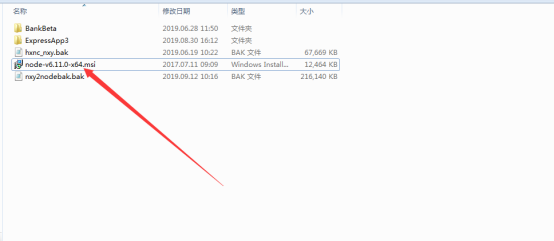

2.安装完毕，修改node配置  
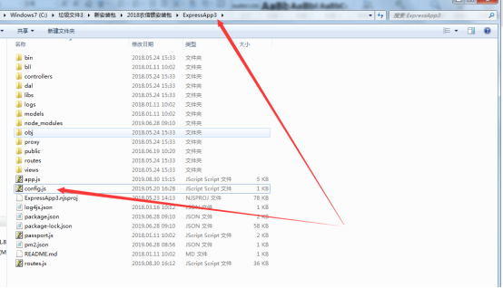

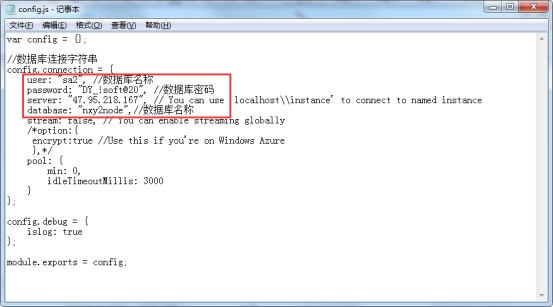

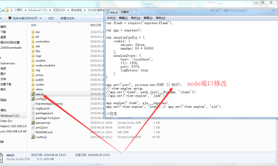

3.在ExpressApp3的地址栏输入cmd，按回车，会弹出命令窗口，输入：node app.js 回车


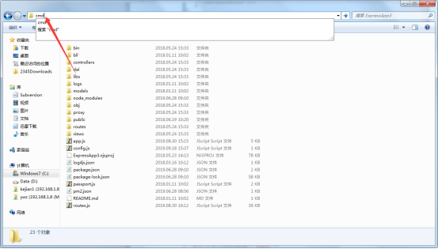

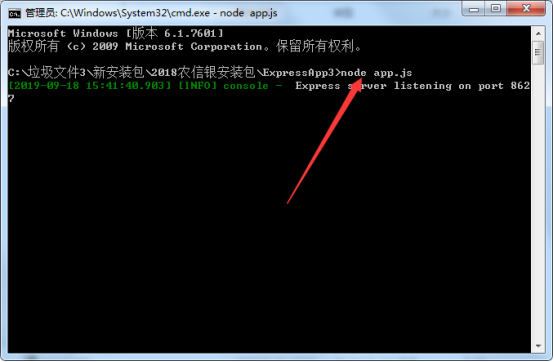

4.修改web.config ，红色框框地址改为程序访问地址例如：<u><font style="color:rgb(0,0,255);">http://192.168.1.214:8001</font></u><u><font style="color:rgb(0,0,255);">，该程序有两个数据库</font></u>


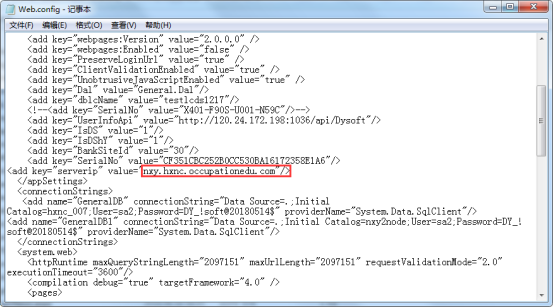  


5.修改项目对应的数据库hxnc_nxy的表格zhyw_TM	


语句

```sql
update [1025_NXY_GZGY].[dbo].[zhyw_TM] set [Url]=replace(Url,'123.56.205.31','120.77.10.122') where [Url] like '%123.56.205.31%';
```

<font style="color:rgb(128,128,128);">  
  
  
</font>3、找项目下面对的路径，找到Tick.cshtml，把<font style="color:rgb(255,0,0);">123.56.205.31修改成农信银发布地址</font>  
  
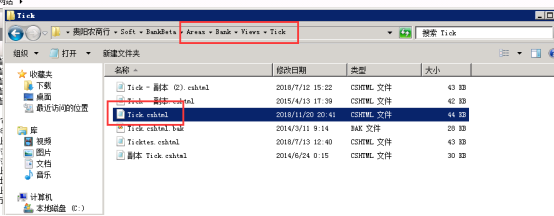

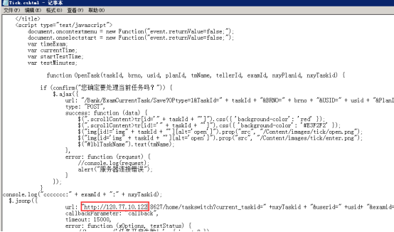

### 管理员端需要删除的图标  
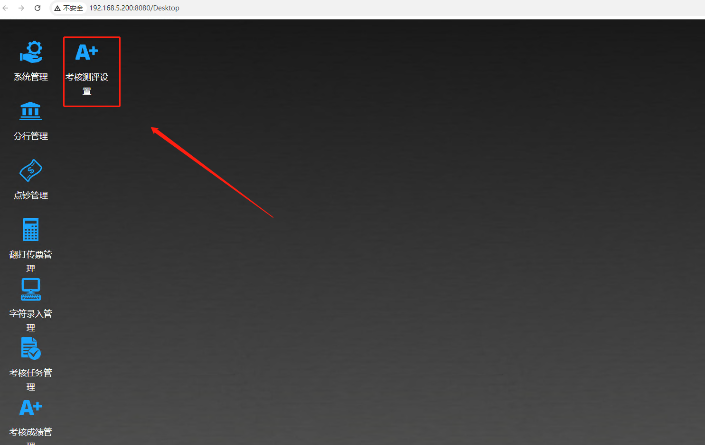
在表格

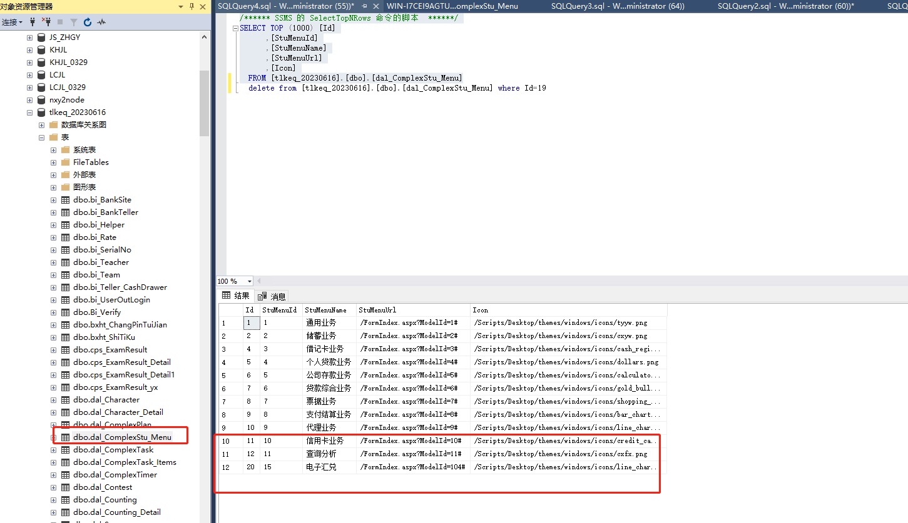

已经删除的表单

### 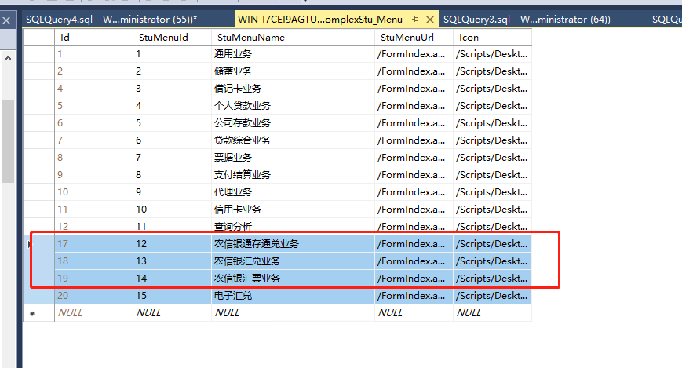  
账号密码
```json
username='S001' + username.substr(1, 4);
window.location.replace("http://jxwx2023ykt.dianyueyun.com/?username="+username+"&pwd="+pwd+"")
```

### 获取不到projectid
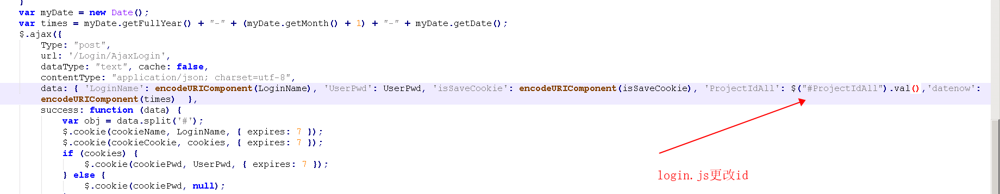

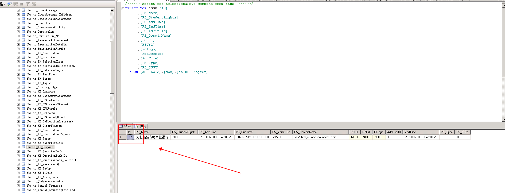

## 自动登入
```json
username='S072'+username.substr(1, 6)
;


//console.log(":" +username);
//return;
window.open(`http://2023hblcykt.occupationedu.com/LoginAuto_ALL.html?username=${username}&httpServer=${httpServer}&password=${password}&ProjectIdAll=72`,"_blank")
return;
```

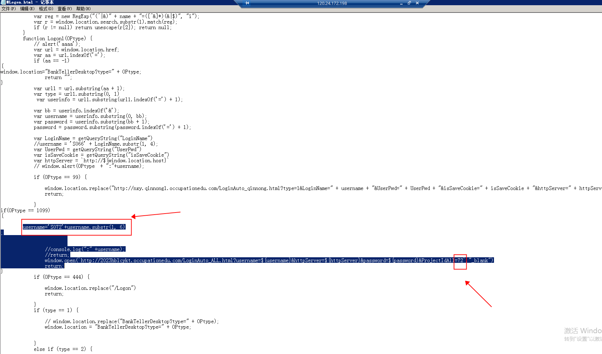

### 比赛时候必须清除的操作日志
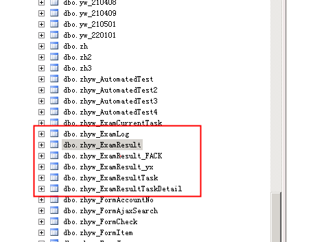


> 更新: 2023-06-29 14:53:32  
> 原文: <https://www.yuque.com/lixinsi/hntyk2/neo9yi4bhdl6priy>