# 农村银联社

码设置：

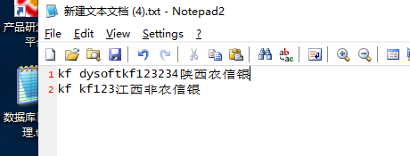

--清除日志

--先清记录----在清除任务---分数不能删                  ----日志单独清  关联字段GroupId=88

```sql
/****** Script for SelectTopNRows command from SSMS  ******/
--记录
SELECT COUNT(1)
  FROM [yh_sxsls_0521].[dbo].[zhyw_ExamResultTaskDetail]
  where [ExamResultTaskId] in  (SELECT [Id]
    
  FROM [yh_sxsls_0521].[dbo].[zhyw_ExamResultTask]
  where ExamResultId in (SELECT [Id]
    
  FROM [yh_sxsls_0521].[dbo].[zhyw_ExamResult] where GroupId=88))
--任务  
  SELECT COUNT(1)
  FROM [yh_sxsls_0521].[dbo].[zhyw_ExamResultTask]
  where ExamResultId in (SELECT [Id]
    
  FROM [yh_sxsls_0521].[dbo].[zhyw_ExamResult] where GroupId=88)
  
  --日志
  SELECT COUNT(1)
  FROM [yh_sxsls_0521].[dbo].[zhyw_ExamLog] where [GroupId]=88
```


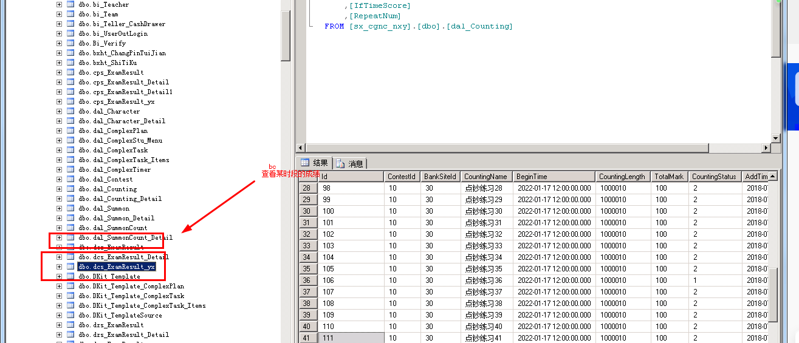

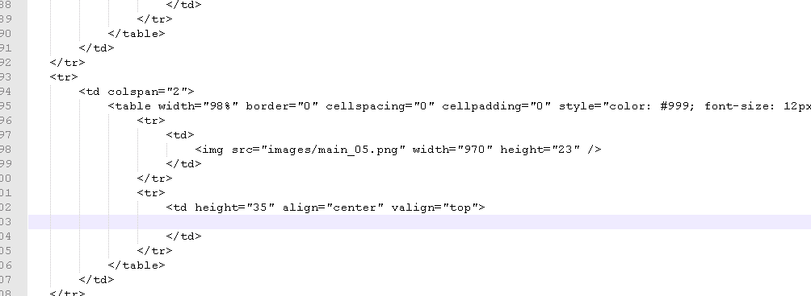

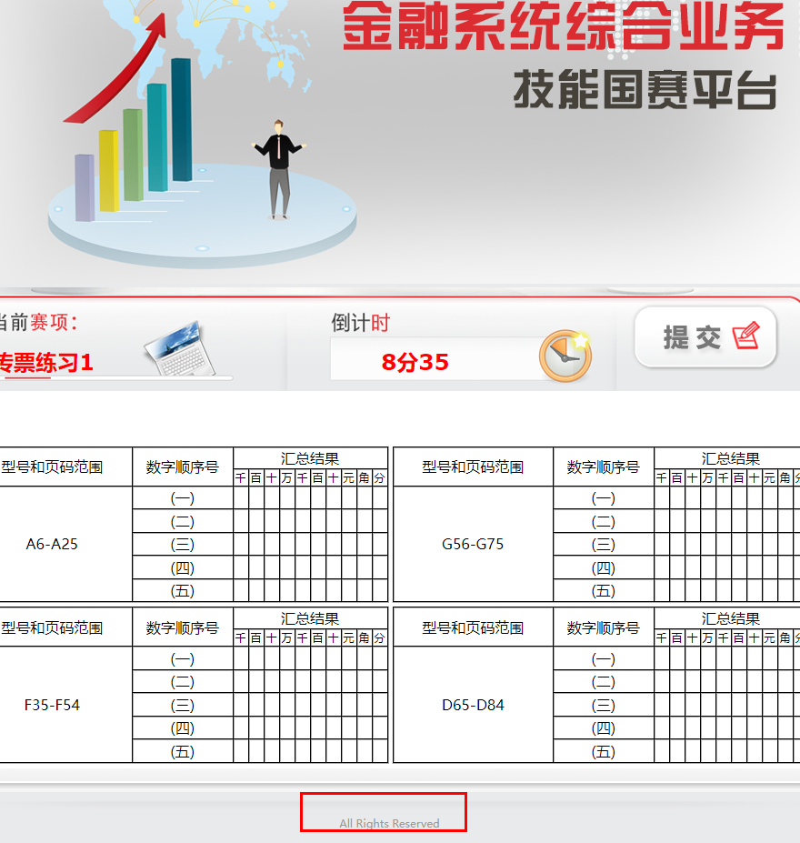

传票代替

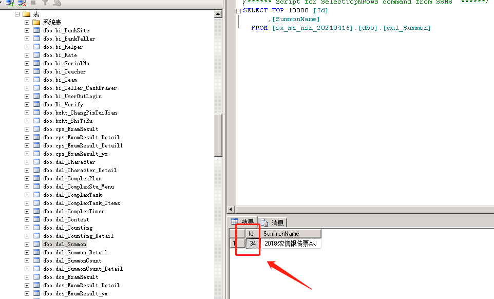

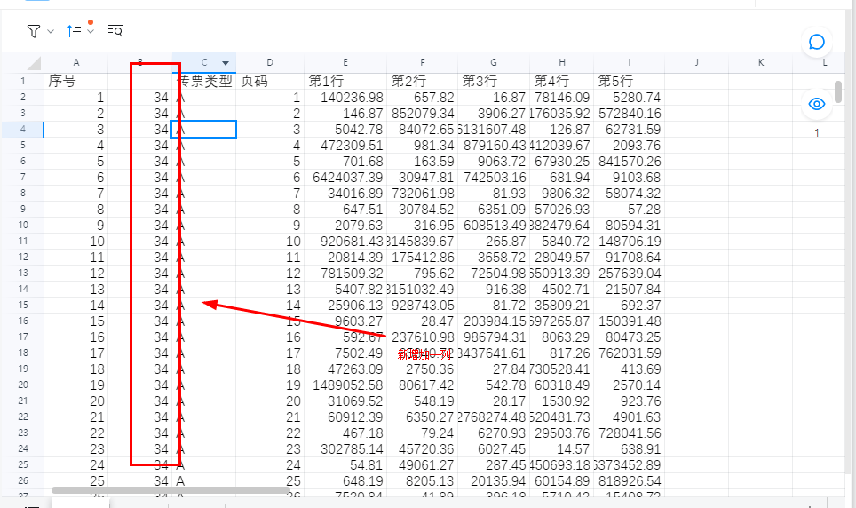

查询id34传票更新3400

然后插入传票数据

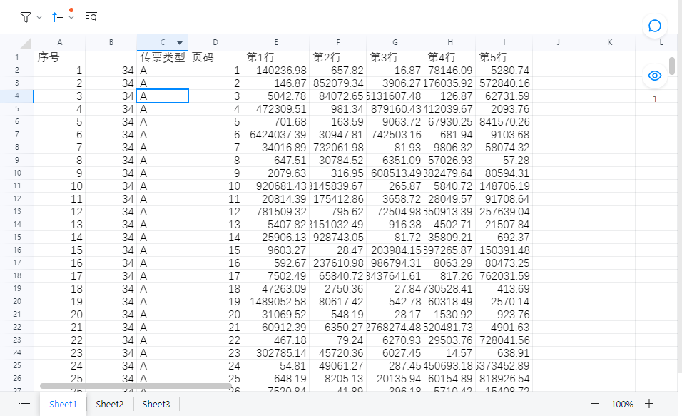

执行脚本

```sql


--定义变量
declare	@SummonType varchar(200)        --类型 A BC  
declare	@BeginValue int       --开始值
declare	@EndValue int    --结束值
declare	@s1 float        --值
declare	@s2 float      --值
declare	@s3 float      --值
declare	@s4 float      --值
declare	@s5 float      --值
declare	@SummonId int    --任务id
declare	@neizId int     --内置Id----------------------传票算的类型 2018什么
declare	@mian1_taotal int  --临时表1总条数
declare	@mian2_taotal int  --临时表2总条数


--创建主临时表  
create table #tb_yx_Main1(
		id int identity (1,1) primary key,
		SumId int,   --任务Id
		SumName varchar(50),  --任务名称
		neizId int
)
--创建主临时2表
     
     create table #tb_yx_Main2(
		id int identity (1,1) primary key,
		SumType varchar(50),   --类型
		SumSate int,  --开始
		SumEnd  int  --结束
     )
     

truncate table #tb_yx_Main1
insert into #tb_yx_Main1 select Id,SummonCountName,SummonId from  dal_SummonCount 
--得出临时表1
Set @mian1_taotal=(select COUNT(*) from #tb_yx_Main1)

while(@mian1_taotal>0)
begin
     set @SummonId=(select SumId from #tb_yx_Main1 where id=@mian1_taotal)	  --任务ID
   
    set @neizId=(select neizId from #tb_yx_Main1 where id=@mian1_taotal)	
     --根据任务Id  查下 获取之前的 类型和 起始值  插入临时表 循环
     truncate table #tb_yx_Main2
     --插入临时表2
     insert into #tb_yx_Main2 select SummonType,BeginValue,EndValue from  dal_SummonCount_Detail where SummonCountId=@SummonId
     Set @mian2_taotal=(select COUNT(*) from #tb_yx_Main2) --临时表2的数据
     --删除之前的明细
     delete from dal_SummonCount_Detail where SummonCountId=@SummonId
     
     while(@mian2_taotal>0)
     begin
         set @SummonType=(select SumType from #tb_yx_Main2 where id=@mian2_taotal)
         set @BeginValue=(select SumSate from #tb_yx_Main2 where id=@mian2_taotal)
         set @EndValue=(select SumEnd from #tb_yx_Main2 where id=@mian2_taotal)
 
         --查下单行单列内置的
         set @s1=(select isnull(SUM(value1),0) FROM dal_Summon_Detail where SummonId=@neizId and SummonType=@SummonType and RowNum>=@BeginValue and RowNum<=@EndValue)
         set @s2=(select isnull(SUM(value2),0) FROM dal_Summon_Detail where SummonId=@neizId and SummonType=@SummonType and RowNum>=@BeginValue and RowNum<=@EndValue)
         set @s3=(select isnull(SUM(value3),0) FROM dal_Summon_Detail where SummonId=@neizId and SummonType=@SummonType and RowNum>=@BeginValue and RowNum<=@EndValue)
         set @s4=(select isnull(SUM(value4),0) FROM dal_Summon_Detail where SummonId=@neizId and SummonType=@SummonType and RowNum>=@BeginValue and RowNum<=@EndValue)
         set @s5=(select isnull(SUM(value5),0) FROM dal_Summon_Detail where SummonId=@neizId and SummonType=@SummonType and RowNum>=@BeginValue and RowNum<=@EndValue)
         --
        
        ---插入新的明细
        insert into dal_SummonCount_Detail(SummonCountId,SummonType,BeginValue,EndValue,SumValue1,SumValue2,SumValue3,SumValue4,SumValue5)
        values (@SummonId,@SummonType,@BeginValue,@EndValue,@s1,@s2,@s3,@s4,@s5)
       set @mian2_taotal = @mian2_taotal-1  --临时表
     end
     
   set @mian1_taotal = @mian1_taotal-1  --临时表 
end

DROP TABLE #tb_yx_Main1 
DROP TABLE #tb_yx_Main2


```

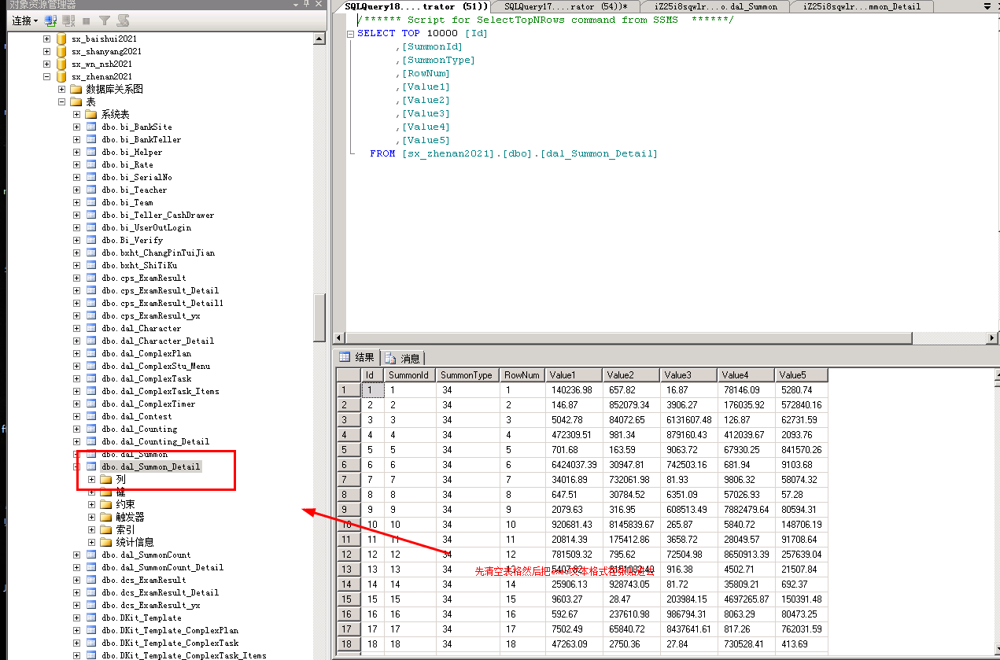

传票的dal_summon不能动，然后在拿到传票数据不能有空格，传票数据标准格式

批量导入

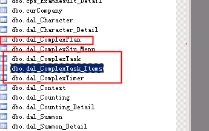

四个表覆盖


显示隐藏标签

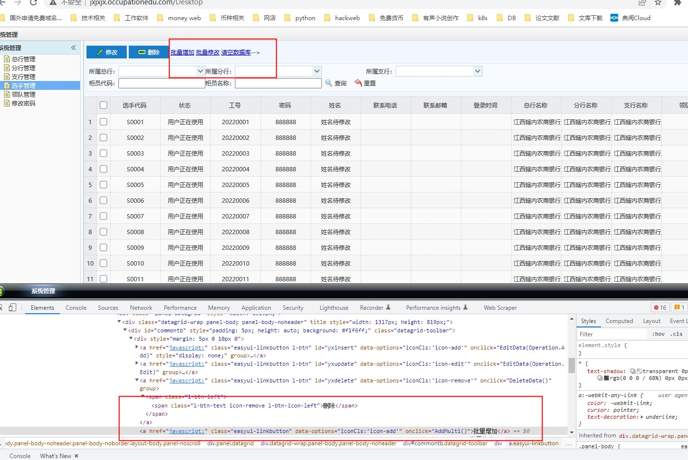

存折挂失问题

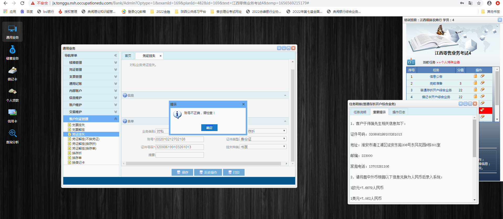

在数据库里面执行

  update [dbo].[zhyw_FormItem] set [FieldRelated]=NULL where FormId='010903' and  [ControlName]='AccountNo'


window.location="[http://118.195.249.41:8081/Logon";](http://118.195.249.41:8081/Logon";)

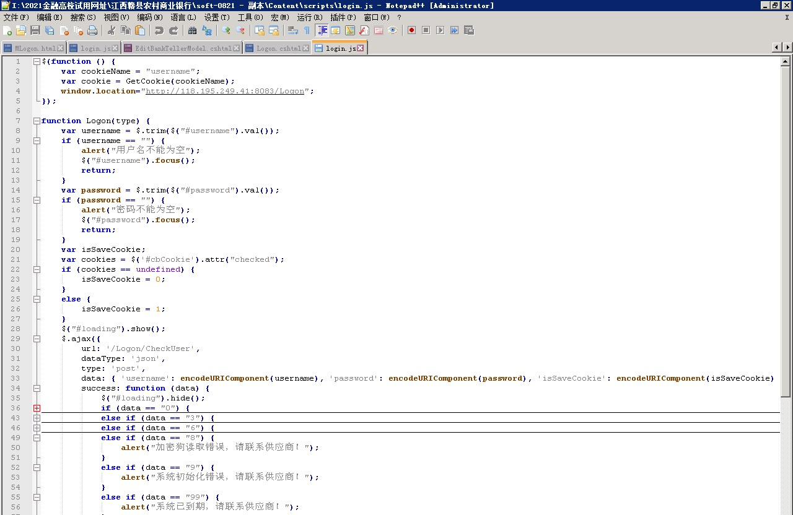


路径：I:\2021金融高校试用网址\江西赣县农村商业银行\soft-0821 - 副本\Content\scripts

的login.js里面修改

+ <font style="color:rgb(23, 26, 29);background-color:rgb(241, 242, 243);">S0810（点钞，字符）  
</font><font style="color:rgb(23, 26, 29);background-color:rgb(241, 242, 243);">S0811(传票）  
</font><font style="color:rgb(23, 26, 29);background-color:rgb(241, 242, 243);">S0812（零售）  
</font><font style="color:rgb(23, 26, 29);background-color:rgb(241, 242, 243);">S0813（对公）  
</font><font style="color:rgb(23, 26, 29);background-color:rgb(241, 242, 243);">限制账号行业功能</font>

<font style="color:rgb(23, 26, 29);">1：点钞，2：传票 3：字符，4：零售 5：对公</font>

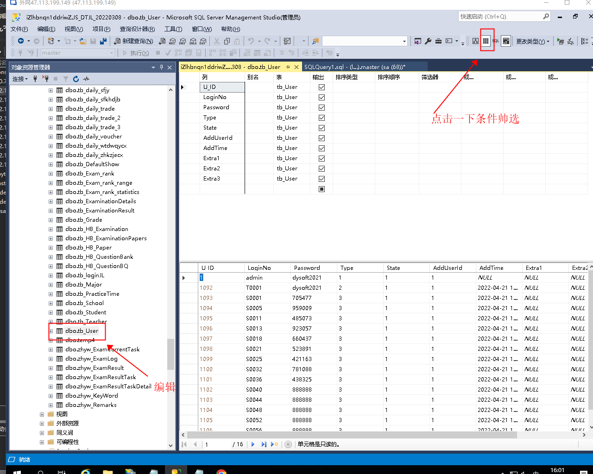

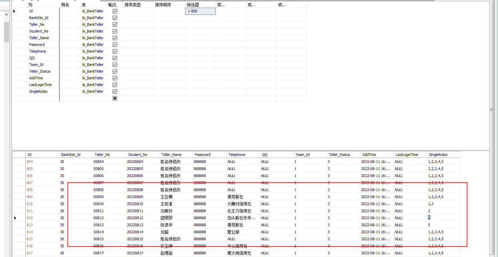

```sql

```


> 更新: 2025-07-14 15:29:11  
> 原文: <https://www.yuque.com/lixinsi/hntyk2/afp8ki>