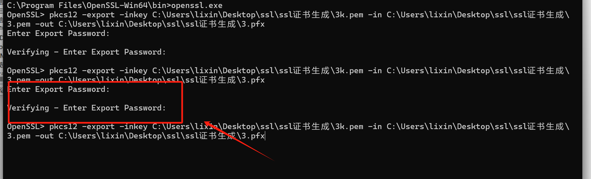

# 准备部署https文件

#### mkcert-v1.4.4-windows-amd64
```bash
mkcert-v1.4.4-windows-amd64.exe -install

mkcert-v1.4.4-windows-amd64.exe 192.168.3.109 localhost 127.0.0.1 ::1

```

#### mkcert-v1.4.4-windows-amd64查看路径
```bash
mkcert-v1.4.4-windows-amd64.exe -CAROOT
```

#### Win64OpenSSL-1_1_1w.exe
```bash
pkcs12 -export -inkey C:\Users\lixin\Desktop\ssl\ssl证书生成\3k.pem -in C:\Users\lixin\Desktop\ssl\ssl证书生成\3.pem -out C:\Users\lixin\Desktop\ssl\ssl证书生成\3.pfx
```



[https://www.cnblogs.com/xjserver/p/16216273.html](https://www.cnblogs.com/xjserver/p/16216273.html)


> 更新: 2024-06-19 22:31:32  
> 原文: <https://www.yuque.com/lixinsi/hntyk2/omlzn0rxsb3xf9qu>